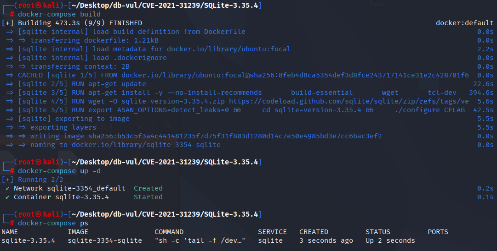
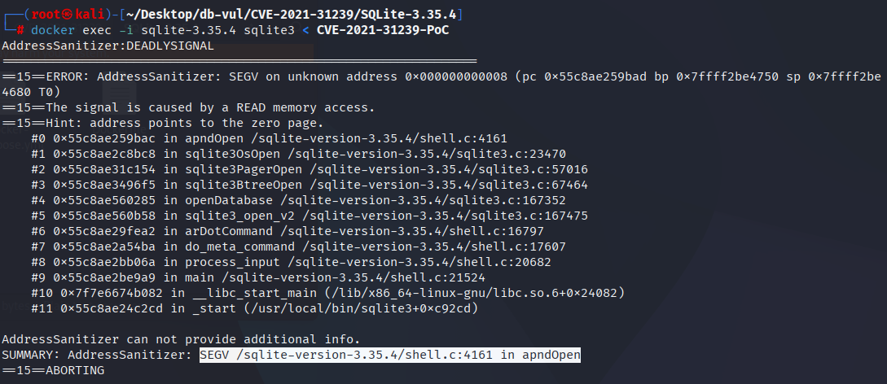

# CVE-2021-31239 CWE-125 SQLite 段错误

## 漏洞背景

- **SQLite：** 一个轻量级的、嵌入式的关系型数据库管理系统，它不需要单独的服务器进程，也不需要复杂的配置。SQLite 直接在文件系统上存储数据，具有零配置、易于使用和适合小型应用的特点。它支持标准的 SQL 语句，提供良好的数据安全性，并且因其轻量级特性被广泛应用于桌面和移动应用开发中。
- **appendvfs 扩展：**  SQLite 的一个虚拟文件系统（VFS）扩展，允许将 SQLite 数据库附加到其他文件的末尾，并在运行时通过特定的 VFS 访问该数据库。例如可执行文件或其他数据文件，从而实现数据库与应用程序的捆绑部署。
- **CWE-125（Out-of-bounds Read 越界读取）**

## 漏洞原理

SQLite 的 `appendvfs` 扩展未能正确处理文件打开失败的情况，导致在文件打开失败后仍然尝试访问未初始化或空指针。具体来说，当底层文件打开失败时，代码没有正确清理或检查指针，仍然访问 `pBaseFile->pMethods`，从而引发空指针解引用（NULL pointer dereference），导致程序崩溃（Segmentation Fault）。

## 漏洞定位

在 ext/misc/appendvfs.c 文件，第 507 行`apndOpen`函数

第 535 行，先调用底层 VFS 的 `xOpen()` 打开真实文件，如果 `xOpen()` 成功，再去取 `xFileSize()`。****只要 `rc!=SQLITE_OK`（无论是 `xOpen` 失败还是 `xFileSize` 失败），就无条件执行
 `pBaseFile->pMethods->xClose(pBaseFile);`。

假如失败发生在第 1 步（`xOpen` 直接失败），`pBaseFile->pMethods` 可能是 NULL/未初始化，于是对 `pMethods` 的访问就变成了 NULL 解引用。于是在 ASAN 栈里看到的在 `apndOpen` 里读地址 0x8。

```c
/*
** Open an apnd file handle.
*/
static int apndOpen(
  sqlite3_vfs *pApndVfs,
  const char *zName,
  sqlite3_file *pFile,
  int flags,
  int *pOutFlags
){
  ApndFile *pApndFile = (ApndFile*)pFile;
  sqlite3_file *pBaseFile = ORIGFILE(pFile);
  sqlite3_vfs *pBaseVfs = ORIGVFS(pApndVfs);
  int rc;
  sqlite3_int64 sz = 0;
  if( (flags & SQLITE_OPEN_MAIN_DB)==0 ){
    return pBaseVfs->xOpen(pBaseVfs, zName, pFile, flags, pOutFlags);
  }
  memset(pApndFile, 0, sizeof(ApndFile));
  pFile->pMethods = &apnd_io_methods;
  pApndFile->iMark = -1;    /* Append mark not yet written */

  rc = pBaseVfs->xOpen(pBaseVfs, zName, pBaseFile, flags, pOutFlags);
  if( rc==SQLITE_OK ){
    rc = pBaseFile->pMethods->xFileSize(pBaseFile, &sz);
  }
// ***** 535 行 *****
  if( rc ){
    pBaseFile->pMethods->xClose(pBaseFile);
    pFile->pMethods = 0;
    return rc;
  }
  if( apndIsOrdinaryDatabaseFile(sz, pBaseFile) ){
    memmove(pApndFile, pBaseFile, pBaseVfs->szOsFile);
    return SQLITE_OK;
  }
  pApndFile->iPgOne = apndReadMark(sz, pFile);
  if( pApndFile->iPgOne>=0 ){
    pApndFile->iMark = sz - APND_MARK_SIZE; /* Append mark found */
    return SQLITE_OK;
  }
  if( (flags & SQLITE_OPEN_CREATE)==0 ){
    pBaseFile->pMethods->xClose(pBaseFile);
    rc = SQLITE_CANTOPEN;
    pFile->pMethods = 0;
  }else{
    pApndFile->iPgOne = APND_START_ROUNDUP(sz);
  }
  return rc;
}
```

## 漏洞修复

只有当 `xOpen()` 成功、且 `xFileSize()` 失败时，才调用 `xClose()` 清理（因为这时 `pBaseFile->pMethods` 一定是有效的）

```diff
Index: ext/misc/appendvfs.c
==================================================================
--- ext/misc/appendvfs.c
+++ ext/misc/appendvfs.c
@@ -528,13 +528,15 @@
   pApndFile->iMark = -1;    /* Append mark not yet written */
 
   rc = pBaseVfs->xOpen(pBaseVfs, zName, pBaseFile, flags, pOutFlags);
   if( rc==SQLITE_OK ){
     rc = pBaseFile->pMethods->xFileSize(pBaseFile, &sz);
+    if( rc ){
+      pBaseFile->pMethods->xClose(pBaseFile);
+    }
   }
   if( rc ){
-    pBaseFile->pMethods->xClose(pBaseFile);
     pFile->pMethods = 0;
     return rc;
   }
```

## 影响版本

SQLite :

- 3.35.4

## 环境搭建

启动 Docker 环境，SQLite 版本为 3.35.4，其中在编译时开启了 ASAN 内存检测

```txt
NIST:NVD    Base Score:7.5 HIGH    Vector:CVSS:3.1/AV:N/AC:L/PR:N/UI:N/S:U/C:N/I:N/A:H

ADP:CISA-ADP    Base Score:7.5 HIGH    Vector:CVSS:3.1/AV:N/AC:L/PR:N/UI:N/S:U/C:N/I:N/A:H
```

```txt
cpe:2.3:a:sqlite:sqlite:3.35.4:*:*:*:*:*:*:*
```



## 漏洞复现

进入容器命令行，执行 PoC 文件，可以看到 ASan 报告显示出现了段错误（SEGV），导致了崩溃。

```bash
docker exec -i sqlite-3.35.4 sqlite3 < CVE-2021-31239-PoC
```



## PoC分析

```sql
.ar -aa
```

`.ar`：这是 SQLite 命令行工具中的一个元命令，用于加载一个附加的虚拟文件系统（VFS）。`-aa`：这是传递给 appendvfs 扩展的参数，表示将所有操作附加到指定的文件。

当执行 `.ar -aa` 时，appendvfs 扩展会尝试打开一个目标文件，并将后续的数据库操作附加到该文件上。如果指定的文件不存在或无法打开，appendvfs 扩展会返回错误。然而，在 SQLite 的早期版本中，错误处理存在缺陷：即使文件打开失败，代码仍然尝试访问未初始化的指针，导致空指针解引用，从而触发崩溃。

## 参考链接

[NVD - CVE-2021-31239](https://nvd.nist.gov/vuln/detail/CVE-2021-31239#match-16664890)

[SQLite User Forum: segfault in sqlite3 (3.35.4)](https://www.sqlite.org/forum/forumpost/d9fce1a89b)

[Vulnerabilities/SQLite/CVE-2021-31239 at main · Tsiming/Vulnerabilities](https://github.com/Tsiming/Vulnerabilities/blob/main/SQLite/CVE-2021-31239)
