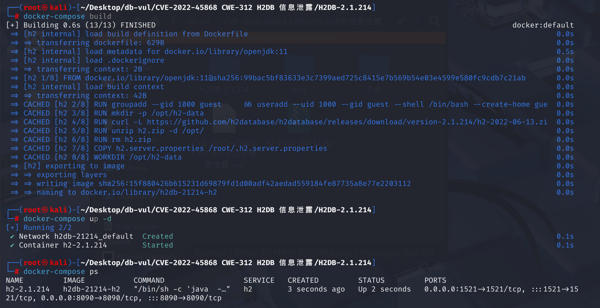
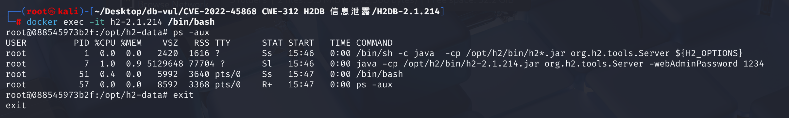

# CVE-2022-45868 CWE-312 H2DB 信息泄露

## 漏洞背景

## 漏洞原理

H2 数据库引擎 2.1.214 及 2.1.214 中基于 Web 的管理控制台可以通过 CLI 使用参数 -webAdminPassword 启动，该参数允许用户以明文形式为 Web 管理控制台指定密码。因此，本地用户（或通过某种方式获得本地访问权限的攻击者）将能够通过列出进程及其参数来发现密码。注意：供应商声明“这不是 H2 控制台的漏洞......绝不能在命令行上传递密码，每个合格的 DBA 或系统管理员都应该知道这一点。

## 漏洞定位

1、在 **h2/src/main/org/h2/server/web/WebServer.java** 文件的第 **346** 行，Web 的管理控制台可以通过 CLI 使用参数 -webAdminPassword 设置 Web 管理控制台的管理员密码

```java
else if (Tool.isOption(a, "-webAdminPassword")) {
	setAdminPassword(args[++i]);
}
```

2、跟踪 `setAdminPassword`函数，在文件的第 **924** 行，该方法首先检查密码是否为 `null` 或为空字符串，如果是，则将 `adminPassword` 设置为 `null` 并返回。接下来，如果密码长度为 128 个字符，尝试将其转换为字节数组并返回。否则，方法生成一个 32 字节的随机盐值，并使用 SHA-256 算法对密码和盐值进行哈希处理，生成一个 64 字节的结果，将盐值和哈希值组合在一起，最终将结果赋值给 `adminPassword`。

```java
void setAdminPassword(String password) {
     if (password == null || password.isEmpty()) {
         adminPassword = null;
         return;
     }
     if (password.length() == 128) {
         try {
             adminPassword = StringUtils.convertHexToBytes(password);
             return;
         } catch (Exception ex) {}
     }
     byte[] salt = MathUtils.secureRandomBytes(32);
     byte[] hash = SHA256.getHashWithSalt(password.getBytes(StandardCharsets.UTF_8), salt);
     byte[] total = Arrays.copyOf(salt, 64);
     System.arraycopy(hash, 0, total, 32, 32);
     adminPassword = total;
 }
```


这个方法并没有强制要求密码的长度，用户输入的明文密码将被接收处理，而在修复的代码中，强制要求了传入的密码长度为128，否则直接抛出异常。这确保了只有使用 `encodeAdminPassword` 方法生成的合法密码哈希值才能被接受，增强了系统的安全性和一致性。

## 影响版本

\>= 1.4.198, < 2.2.220

## 环境搭建

1、在docker-compose.yml文件中通过环境变量设置webAdminPassword参数的值为1234


2、启动H2DB v2.1.214的docker环境



## 漏洞复现

1、进入容器命令行

```bash
docker exec -it h2-2.1.214 /bin/bash
```

2、在命令行输入以下命令，可以看到有一个进程的所有者为root用户，且该进程命令行中直接暴露了 Web 管理控制台的密码 `1234`。

```bash
ps -aux
```



## POC分析

以 `guest` 用户身份进入运行中的 `h2-2.1.214` 容器，执行 `ps -aux` 命令，列出容器中所有正在运行的进程及其详细信息

```bash
docker exec --user guest h2-2.1.214 ps -aux
```

## 参考链接

[Sonatype CVE Feed - sonatype-2022-6243](https://sites.google.com/sonatype.com/vulnerabilities/sonatype-2022-6243)

[H2 数据库中的密码暴露 ·CVE-2022-45868 漏洞 ·GitHub Advisory Database --- Password exposure in H2 Database · CVE-2022-45868 · GitHub Advisory Database](https://github.com/advisories/GHSA-22wj-vf5f-wrvj)

[禁止使用纯文本的 webAdminPassword 值，强制使用哈希值（由 katzyn 发起）· 提交请求 #3833 · h2database/h2database --- Disallow plain webAdminPassword values to force usage of hashes by katzyn · Pull Request #3833 · h2database/h2database](https://github.com/h2database/h2database/pull/3833)

[Merge pull request #3833 from katzyn/password · h2database/h2database@581ed18](https://github.com/h2database/h2database/commit/581ed18ff9d6b3761d851620ed88a3994a351a0d#diff-f47def0628b95350112ca74edd9ba338b2b58a3563363961114c987953a67941)
