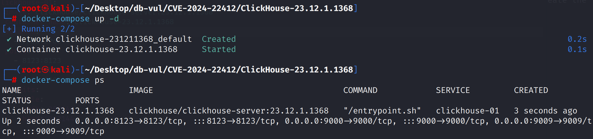
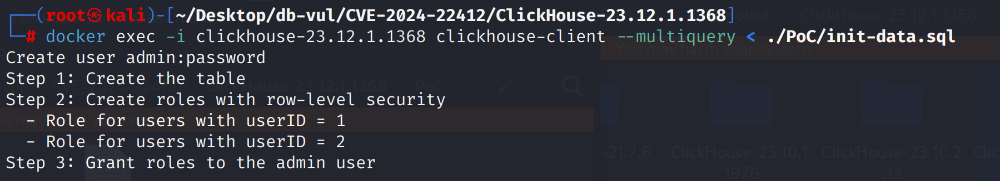
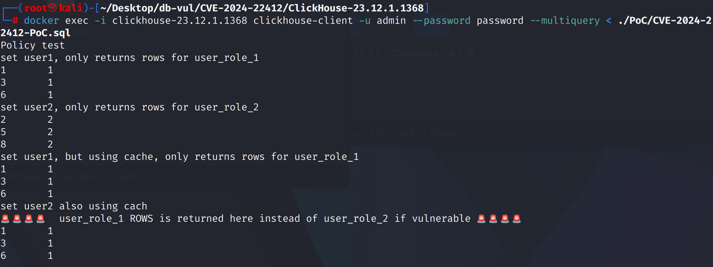

#  CVE-2024-22412 CWE-863 ClickHouse 访问控制绕过

## 漏洞背景

- **ClickHouse ：**一个开源的列式数据库管理系统，专为在线分析处理（OLAP）场景设计，能够高效地处理大规模的数据查询和分析任务。它提供了高性能的数据压缩和并行计算能力，支持大规模数据集的快速查询和实时分析。ClickHouse 的架构支持分布式计算，使其能够扩展到多个节点，并在大数据环境中提供高可用性和容错性。由于其快速的查询性能和可伸缩性，ClickHouse 在处理大数据分析、日志分析、数据仓库等应用场景中表现出色。

## 漏洞原理

 ClickHouse 查询缓存机制未能正确尊重基于角色的访问控制。当查询缓存仅基于用户名生成缓存键时，不同角色的用户可能会共享相同的缓存条目，从而绕过访问控制，访问本不应查看的数据。攻击者可通过猜测查询，利用这一漏洞查看敏感信息。

## 漏洞定位

分析 ClickHouse-23.12.1.1368  源码：

在 ClickHouse/src/Interpreters/Cache/QueryCache.cpp 文件

第 501 行，QueryCache::createWriter 函数中缓存键只包含用户名（`user_name`），这个做法导致了不同角色的用户共享相同的缓存条目，从而绕过了角色访问控制。

```cpp
// QueryCache.cpp 文件，第 501 行
QueryCache::Writer QueryCache::createWriter(const Key & key, std::chrono::milliseconds min_query_runtime, bool squash_partial_results, size_t max_block_size, size_t max_query_cache_size_in_bytes_quota, size_t max_query_cache_entries_quota)
{
    //********* 只包含用户名 key.user_name **********
    cache.setQuotaForUser(key.user_name, max_query_cache_size_in_bytes_quota, max_query_cache_entries_quota);

    std::lock_guard lock(mutex);
    return Writer(cache, key, max_entry_size_in_bytes, max_entry_size_in_rows, min_query_runtime, squash_partial_results, max_block_size);
}
```

## 漏洞修复

修改了查询缓存的生成键，包含了当前用户的身份信息和角色。缓存的键现在包含了 `user_id` 和 `current_user_roles`，这意味着查询缓存不再仅依赖用户名，还要考虑用户的角色和 ID。同时还增加验证用户 ID 是否匹配以及当前用户角色是否匹配

```diff
diff --git a/src/Interpreters/Cache/QueryCache.cpp b/src/Interpreters/Cache/QueryCache.cpp
index 1e8fdeb1b5db..c187c5c1fa6e 100644
--- a/src/Interpreters/Cache/QueryCache.cpp
+++ b/src/Interpreters/Cache/QueryCache.cpp
@@ -129,13 +129,12 @@ String queryStringFromAST(ASTPtr ast)
 QueryCache::Key::Key(
     ASTPtr ast_,
     Block header_,
-    const String & user_name_, std::optional<UUID> user_id_, const std::vector<UUID> & current_user_roles_,
+    std::optional<UUID> user_id_, const std::vector<UUID> & current_user_roles_,
     bool is_shared_,
     std::chrono::time_point<std::chrono::system_clock> expires_at_,
     bool is_compressed_)
     : ast(removeQueryCacheSettings(ast_))
     , header(header_)
-    , user_name(user_name_)
     , user_id(user_id_)
     , current_user_roles(current_user_roles_)
     , is_shared(is_shared_)
@@ -145,8 +144,8 @@ QueryCache::Key::Key(
 {
 }
 
-QueryCache::Key::Key(ASTPtr ast_, const String & user_name_, std::optional<UUID> user_id_, const std::vector<UUID> & current_user_roles_)
-    : QueryCache::Key(ast_, {}, user_name_, user_id_, current_user_roles_, false, std::chrono::system_clock::from_time_t(1), false) /// dummy values for everything != AST or user name
+QueryCache::Key::Key(ASTPtr ast_, std::optional<UUID> user_id_, const std::vector<UUID> & current_user_roles_)
+    : QueryCache::Key(ast_, {}, user_id_, current_user_roles_, false, std::chrono::system_clock::from_time_t(1), false) /// dummy values for everything != AST or user name
 {
 }
 
@@ -404,10 +403,9 @@ QueryCache::Reader::Reader(Cache & cache_, const Key & key, const std::lock_guar
     const auto & entry_key = entry->key;
     const auto & entry_mapped = entry->mapped;
 
-    const bool is_same_user_name = (entry_key.user_name == key.user_name);
     const bool is_same_user_id = ((!entry_key.user_id.has_value() && !key.user_id.has_value()) || (entry_key.user_id.has_value() && key.user_id.has_value() && *entry_key.user_id == *key.user_id));
     const bool is_same_current_user_roles = (entry_key.current_user_roles == key.current_user_roles);
-    if (!entry_key.is_shared && (!is_same_user_name || !is_same_user_id || !is_same_current_user_roles))
+    if (!entry_key.is_shared && (!is_same_user_id || !is_same_current_user_roles))
     {
         LOG_TRACE(logger, "Inaccessible query result found for query {}", doubleQuoteString(key.query_string));
         return;
@@ -509,7 +507,7 @@ QueryCache::Writer QueryCache::createWriter(const Key & key, std::chrono::millis
     /// Update the per-user cache quotas with the values stored in the query context. This happens per query which writes into the query
     /// cache. Obviously, this is overkill but I could find the good place to hook into which is called when the settings profiles in
     /// users.xml change.
-    cache.setQuotaForUser(key.user_name, max_query_cache_size_in_bytes_quota, max_query_cache_entries_quota);
+    cache.setQuotaForUser(key.user_id, max_query_cache_size_in_bytes_quota, max_query_cache_entries_quota);
 
     std::lock_guard lock(mutex);
     return Writer(cache, key, max_entry_size_in_bytes, max_entry_size_in_rows, min_query_runtime, squash_partial_results, max_block_size);
```

## 影响范围

ClickHouse

- 23.3 excluding to 23.3.18.15
- 23.8 excluding to 23.8.18.20
- 23.9 excluding to 23.9.6.20
- 23.10 excluding to 23.10.5.20

## **环境搭建**

启动 Docker 环境，ClickHouse 版本为 23.12.1.1368 

```txt
CNA:GitHub,Inc.  Base Score:2.4 LOW Vector:CVSS:3.1/AV:N/AC:H/PR:N/UI:N/S:U/C:L/I:L/A:H
```

```txt
cpe:2.3:a:clickhouse:clickhouse:23.12.1.1368:*:*:*:*:*:*:*
```



## 漏洞复现

1. 进入容器命令行连接 ClickHouse，并执行初始化数据脚本

   ```bash
   docker exec -i clickhouse-23.12.1.1368 clickhouse-client --multiquery < ./PoC/init-data.sql
   ```

   

2. 使用初始化脚本中创建的用户信息连接 ClickHouse 并执行 PoC 代码，可以看到当使用缓存进行查询时，user2 成功查询到属于 user1 的数据，实现了访问控制绕过

   ```bash
   docker exec -i clickhouse-23.12.1.1368 clickhouse-client -u admin --password password --multiquery < ./PoC/CVE-2024-22412-PoC.sql
   ```

   

## PoC分析

## 参考链接

[NVD - CVE-2024-22412](https://nvd.nist.gov/vuln/detail/CVE-2024-22412)

[CVE-2024-22412 - Behind the bug, a classic caching problem in the ClickHouse query cache](https://blog.runreveal.com/cve-2024-22412-behind-the-bug-a-classic-caching-problem-in-the-clickhouse-query-cache/)

[Flush cached result when user switch role · Issue #58054 · ClickHouse/ClickHouse](https://github.com/ClickHouse/ClickHouse/issues/58054)

[Improve isolation of query cache entries under re-created users or role switches by rschu1ze · Pull Request #58611 · ClickHouse/ClickHouse](https://github.com/ClickHouse/ClickHouse/pull/58611/files#diff-3577554d4a0893fd7235a7e517b06bea30340386294a9d49df6a3246209de854)
