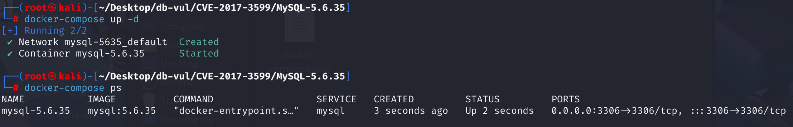
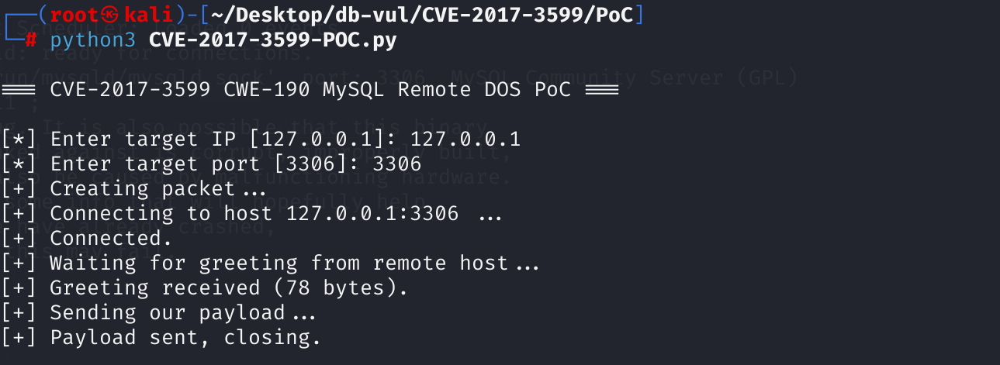
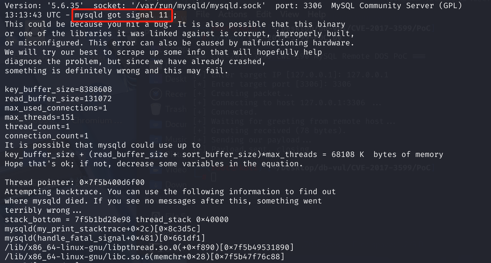

# CVE-2017-3599 CWE-190 MySQL Remote DOS

## 漏洞背景

- **可插拔认证机制**：MySQL 服务器支持多种认证插件，允许用户根据需要选择不同的认证方式。可插拔认证机制使得 MySQL 能够灵活地适应不同的安全需求和环境。
- **认证过程**：在客户端与 MySQL 服务器建立连接后，服务器会发送一个初始的握手包给客户端，客户端根据服务器的指示构造并发送认证请求数据包。服务器接收到认证请求后，会根据认证插件的要求进行验证。

## 漏洞原理

漏洞存在于 MySQL 服务器的可插拔认证子组件中，是一个整数溢出漏洞。

- **认证数据处理**：在处理客户端发送的认证请求数据包时，MySQL 服务器会解析其中的认证数据。认证数据通常包括密码或密码散列值等信息。
- **整数溢出**：在解析认证数据的过程中，存在一个整数溢出的问题。具体来说，当认证数据的长度被错误地解析或计算时，可能会导致整数溢出。例如，如果认证数据的长度字段被设置为一个非常大的值，而实际的认证数据长度却很小，那么在后续的处理过程中，可能会出现内存访问越界的情况。
- **内存访问越界**：由于整数溢出导致的内存访问越界，服务器可能会尝试访问无效的内存地址。这会导致服务器崩溃，从而实现远程拒绝服务攻击（DOS）。

触发条件：

- **认证数据长度字段**：认证数据的长度字段必须被设置为一个非常大的值，以触发整数溢出。
- **认证数据内容**：认证数据的内容必须满足特定的条件，例如以 `\xff` 或 `\xfe` 开头，并且长度小于 8 个字符。这是因为这些特定的值在处理过程中会导致特定的内存访问错误。

## 漏洞定位

这里以 mysql 5.7.17 为例

1. 客户端连接到 MySQL 服务器后，服务器发送问候消息，客户端开始身份验证过程。客户端发送的身份验证数据包包含客户端功能、用户名、密码等信息，这些信息由服务器接收并由 **sql/auth/sql_authentication.cc** 第 **1338** 行的`parse_client_handshake_packet()` 函数解析。其中第 **1555** 行，使用了`get_length_encoded_string`函数从数据包中检索密码

   ```c
   /* the packet format is described in send_client_reply_packet() */
   static size_t parse_client_handshake_packet(MPVIO_EXT *mpvio,
                                               uchar **buff, size_t pkt_len)
   {
       // ... ...
         passwd= get_length_encoded_string(&end, &bytes_remaining_in_packet,
                                       &passwd_len);
       // ... ...
   }
   ```

2. 在第 **1527** 行定义了`get_length_encoded_string`函数，依次调用`get_56_lenc_string()`函数（适用于 MySQL 5.6 及更早版本）和`get_41_lenc_string()`函数（适用于 MySQL 4.1 及更高版本）。这两函数都用于解析长度编码字符串，但它们适用于不同的 MySQL 协议版本和场景

   ```c
     /*
       When the ability to change default plugin require that the initial password
      field can be of arbitrary size. However, the 41 client-server protocol limits
      the length of the auth-data-field sent from client to server to 255 bytes
      (CLIENT_SECURE_CONNECTION). The solution is to change the type of the field
      to a true length encoded string and indicate the protocol change with a new
      client capability flag: CLIENT_PLUGIN_AUTH_LENENC_CLIENT_DATA.
     */
     get_proto_string_func_t get_length_encoded_string;
   
     if (protocol->has_client_capability(CLIENT_PLUGIN_AUTH_LENENC_CLIENT_DATA))
       get_length_encoded_string= get_56_lenc_string;
     else
       get_length_encoded_string= get_41_lenc_string;
   ```

3. 由于漏洞存在于MySQL 5.6及更高版本，分析第 **1239** 行的`get_56_lenc_string()`函数，其中`max_bytes_available`参数表示缓冲区中剩余可读取的字节数，初始值为传入的剩余字节数，函数会根据解析的字符串长度更新这个值。解析长度编码后，减去字符串长度和长度编码所占的字节数，最终值表示解析完成后缓冲区中剩余的字节数。而在第 **1265** 行，使用 `net_field_length_ll()` 函数来解析长度

   ```c
   static
   char *get_56_lenc_string(char **buffer,
                            size_t *max_bytes_available,
                            size_t *string_length)
   {
     static char empty_string[1]= { '\0' };
     char *begin= *buffer;
   
     if (*max_bytes_available == 0)
       return NULL;
   
     /*
       If the length encoded string has the length 0
       the total size of the string is only one byte long (the size byte)
     */
     if (*begin == 0)
     {
       *string_length= 0;
       --*max_bytes_available;
       ++*buffer;
       /*
         Return a pointer to the \0 character so the return value will be
         an empty string.
       */
       return empty_string;
     }
   
     *string_length= (size_t)net_field_length_ll((uchar **)buffer);
   
     DBUG_EXECUTE_IF("sha256_password_scramble_too_long",
                     *string_length= SIZE_T_MAX;
     );
   
     size_t len_len= (size_t)(*buffer - begin);
     
     if (*string_length > *max_bytes_available - len_len)
       return NULL;
   
     *max_bytes_available -= *string_length;
     *max_bytes_available -= len_len;
     *buffer += *string_length;
     return (char *)(begin + len_len);
   }
   ```

4. 在 **sql-common/pack.c** 文件，第 **49** 行 `net_field_length_ll()` 函数，该函数被来解析长度，支持多种长度编码方式（如 1 字节、2 字节、3 字节或 8 字节长度）。数据包中的密码字段由两个值定义：密码长度（1 字节），后跟实际密码字段内容。此长度就是通过调用`net_field_length_ll()`函数计算得出。

   如果发送到 MySQL 服务器的缓冲区指向长度为\xFF，则数据包指针会增加 9 个字节，而代码最多读取接下来的 8 个字节来解析长度。如果攻击者发送一个密码长度为 \xFE 或 \xFF 的认证数据包，且在该值之后少于 9 个字节（\xFE和\xFF本身占用 1 个字节），`net_field_length_ll() `函数就会将指针定位到变量边界之外。而 `get_56_lenc_string `函数将继续执行，计算数据包中剩余的字节数。

   在执行 max_bytes_available -= len_len 时将引发整数溢出，其中`max_bytes_available`的值将变成一个非常大的无符号整数

   ```c
   /* The same as above but returns longlong */
   my_ulonglong net_field_length_ll(uchar **packet)
   {
     uchar *pos= *packet;
     if (*pos < 251) // 如果第一个字节小于 251，则直接将其作为长度
     {
       (*packet)++;
       return (my_ulonglong) *pos;
     }
     if (*pos == 251) // 如果第一个字节是 251，则返回 NULL_LENGTH
     {
       (*packet)++;
       return (my_ulonglong) NULL_LENGTH;
     }
     if (*pos == 252) // 如果第一个字节是 252，则读取接下来的 2 个字节作为长度
     {
       (*packet)+=3;
       return (my_ulonglong) uint2korr(pos+1);
     }
     if (*pos == 253) // 如果第一个字节是 253，则读取接下来的 3 个字节作为长度
     {
       (*packet)+=4;
       return (my_ulonglong) uint3korr(pos+1);
     }
       // 如果第一个字节是 254，则读取接下来的 8 个字节作为长度
     (*packet)+=9;					/* Must be 254 when here */
     return (my_ulonglong) uint8korr(pos+1);
   }
   ```

## 影响版本

5.6.35 及更早版本、 5.7.17 及更早版本

## 环境搭建

启动 Docker 环境，MySQL 版本为 5.6.35



## 漏洞复现

1、运行 poc 代码

```bash
python3 CVE-2017-3599-POC.py
```



2、在容器运行命令行执行命令可以看到当前无 MySQL 容器运行

```bash
docker-compose ps
```

3、查看容器日志，可以看到MySQL 服务器崩溃时报告了信号 11（段错误），这通常意味着 MySQL 进程试图访问其内存空间中未分配或不允许访问的部分。

```bash
docker logs mysql-5.6.35
```



## POC分析

1. 与目标数据库建立 TCP 连接

2. 接收服务器握手包（Greeting）

3. 构造一个格式异常的认证包，这些字段是按照 MySQL 登录认证协议格式构造的。关键点在于 packet_auth = b'\xff'，这是伪造认证数据的一部分，长度和格式不符合预期，可能触发服务端解析错误。

   ```python
   packet = packet_cap + packet_max + packet_cset + p_reserved + packet_usr + packet_auth
   packet_len = pack('<I', len(packet))[:3]  # 按 MySQL 协议构造3字节的长度字段
   request = packet_len + packet_num + packet
   ```

4. 发送该异常包

5. 若目标存在 CVE-2017-3599 漏洞，MySQL 进程将崩溃或停止响应

## 参考链接

[CVE-2017-3599漏洞复现 |M011y 的博客 --- CVE-2017-3599漏洞复现 | M011y's Blog](https://yumlii33.github.io/2024/01/14/CVE-2017-3599漏洞复现/)

[SECFORCE - 不妥协的安全 --- SECFORCE - Security without compromise](https://www.secforce.com/blog/pre-auth-mysql-remote-dos-integer-overflow/)
