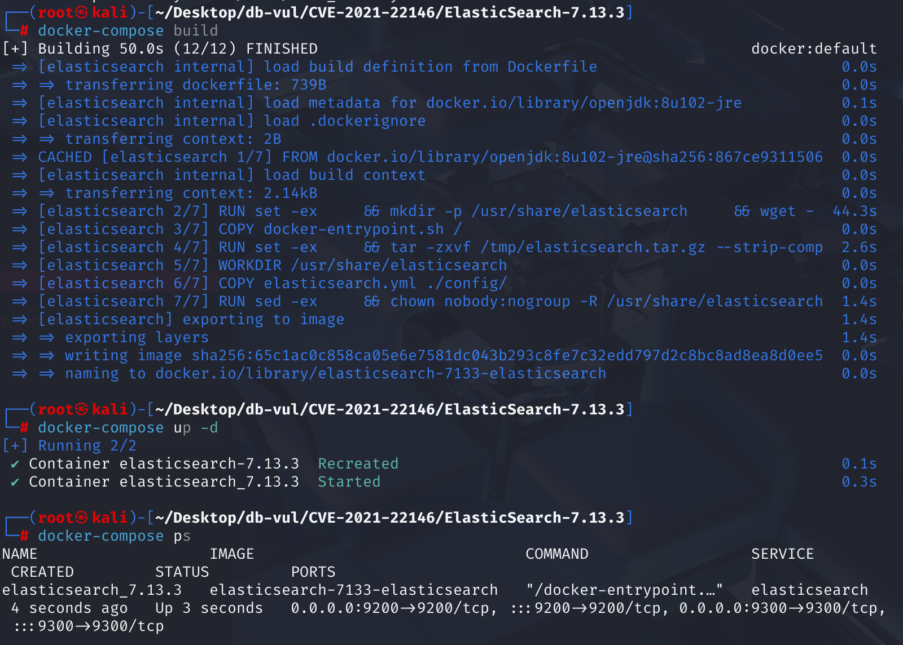
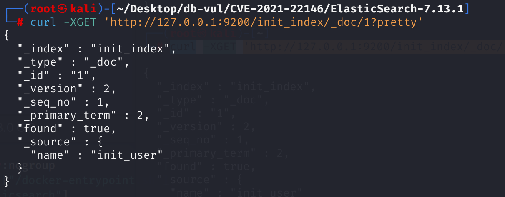
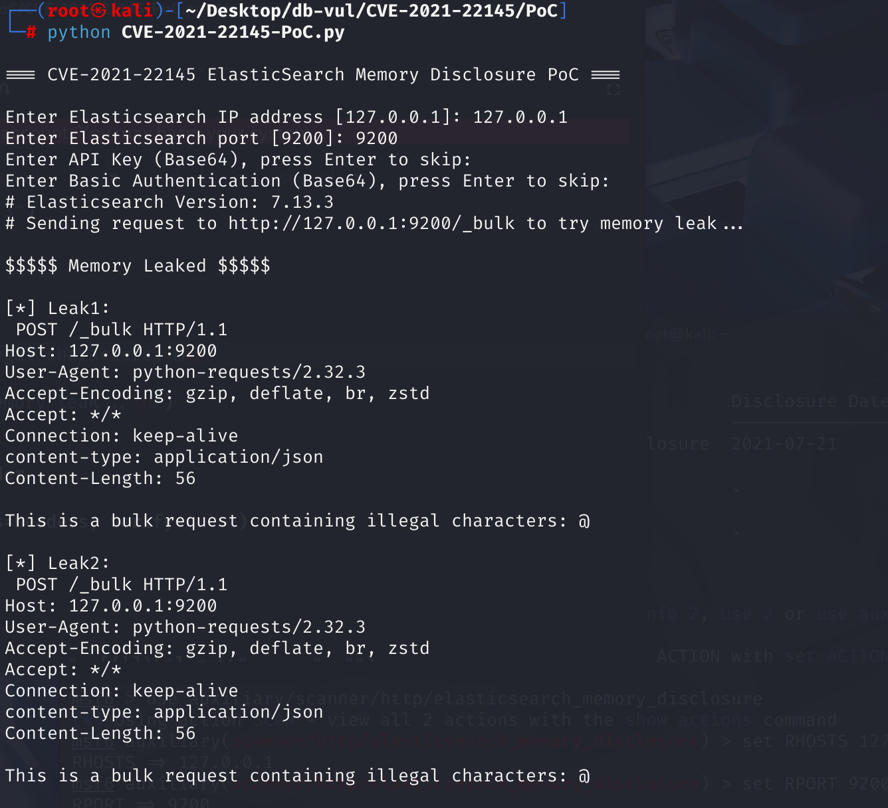

# CVE-2021-22145 CWE-209 ElasticSearch 内存泄露

## 漏洞背景

- **ElasticSearch ：**一个开源的分布式 RESTful 搜索和分析引擎、可扩展的数据存储和向量数据库，能够解决不断涌现出的各种用例。能够存储大量数据，支持实时搜索、多租户、分布式索引和存储。采用文档导向型存储，数据以 JSON 文档形式存在，字段灵活。其在全文检索方面表现出色，能快速处理复杂搜索请求，常用于日志分析、网站搜索等场景，还可通过添加节点方便扩展集群规模，不过在事务处理完整性和数据更新一致性等方面相对传统数据库稍弱。
- 

## 漏洞原理

在 ElasticSearch 7.10.0 到 7.13.3 错误报告中发现了一个内存泄漏漏洞。能够向 Elasticsearch 提交任意查询的用户可能会提交格式错误的查询，这将导致返回包含以前使用的数据缓冲区部分的错误消息。此缓冲区可能包含敏感信息，例如 Elasticsearch 文档或身份验证详细信息。

Elasticsearch 在处理 _bulk 接口请求时，会尝试逐行解析请求体的数据，期望是 action_and_meta_data\n(optional source)\n 这种格式的多行 JSON。但如果请求体为无效或不可解析的数据（例如 @\n），Elasticsearch 会抛出异常。在构造错误响应的过程中，部分底层实现（比如 JsonXContentParser.nextToken）会直接将解析失败时的原始缓冲内容也附带在 Exception 的字符串表示中。

## 漏洞定位

ElasticSearch 7.13.3 使用了 Jackson-core 2.10.4，问题出在 Jackson 库处理 JSON 解析错误的方式上。

1、在 Jackson-core 2.10.4 

在 src\main\java\com\fasterxml\jackson\core\JsonLocation.java 文件，第 169 行，`_appendSourceDesc`方法用于当 Jackson 库解析 JSON 出错时，截取一小段导致错误的原数据，并把它附加到最终的异常信息。在第 **201** 和 **205** 行，使用`_append`方法从一个字符数组（`ch`）中截取一段内容片段，将它追加到正在构建的错误信息字符串（`sb`）中，并更新剩余字符的计数。

其中的 `String` 类的构造函数中被硬编码的第二个参数：0，这个参数是偏移量（offset），它告诉构造函数应该从数组的哪个索引位置开始读取数据。本应该从**当前解析到的位置**（即发生错误的位置）开始截取数据。但是，这里的代码完全忽略了那个正确的位置，而是**从缓冲区的最开始（偏移量为 `0`）进行读取**。这是**漏洞点**所在。

```java
 protected StringBuilder _appendSourceDesc(StringBuilder sb)
    {
        final Object srcRef = _sourceRef;

        if (srcRef == null) {
            sb.append("UNKNOWN");
            return sb;
        }
        // First, figure out what name to use as source type
        Class<?> srcType = (srcRef instanceof Class<?>) ?
                ((Class<?>) srcRef) : srcRef.getClass();
        String tn = srcType.getName();
        // standard JDK types without package
        if (tn.startsWith("java.")) {
            tn = srcType.getSimpleName();
        } else if (srcRef instanceof byte[]) { // then some other special cases
            tn = "byte[]";
        } else if (srcRef instanceof char[]) {
            tn = "char[]";
        }
        sb.append('(').append(tn).append(')');
        // and then, include (part of) contents for selected types:
        int len;
        String charStr = " chars";

        if (srcRef instanceof CharSequence) {
            CharSequence cs = (CharSequence) srcRef;
            len = cs.length();
            len -= _append(sb, cs.subSequence(0, Math.min(len, MAX_CONTENT_SNIPPET)).toString());
        } else if (srcRef instanceof char[]) {
            char[] ch = (char[]) srcRef;
            len = ch.length;
// ***** 201 行 ********** 截取导致错误的原数据，并把它附加到最终的异常信息 ******** 漏洞点 *******
            len -= _append(sb, new String(ch, 0, Math.min(len, MAX_CONTENT_SNIPPET)));
        } else if (srcRef instanceof byte[]) {
            byte[] b = (byte[]) srcRef;
            int maxLen = Math.min(b.length, MAX_CONTENT_SNIPPET);
// ***** 205 行 ********** 截取导致错误的原数据，并把它附加到最终的异常信息 ******** 漏洞点 *******
            _append(sb, new String(b, 0, maxLen, Charset.forName("UTF-8")));
            len = b.length - maxLen;
            charStr = " bytes";
        } else {
            len = 0;
        }
        if (len > 0) {
            sb.append("[truncated ").append(len).append(charStr).append(']');
        }
        return sb;
    }
```

在 src\main\java\com\fasterxml\jackson\core\JsonFactory.java 文件，第 1025 行 `createParser` 方法正确地接收了所有必要的参数，包括 `offset`（起始偏移量）。它的任务就是根据这些参数，去创建一个能够处理字节数组片段的 `JsonParser` 实例。

```java
@Override
public JsonParser createParser(byte[] data, int offset, int len) throws IOException, JsonParseException {
    IOContext ctxt = _createContext(data, true);
    // [JACKSON-512]: allow wrapping with InputDecorator
    if (_inputDecorator != null) {
        InputStream in = _inputDecorator.decorate(ctxt, data, offset, len);
        if (in != null) {
            return _createParser(in, ctxt);
        }
    }
    return _createParser(data, offset, len, ctxt);
}
```

`createParser` 负责开启一个任务，而 `_appendSourceDesc` 负责处理这个任务在未来某个时刻可能发生的特定失败事件。当使用 `JsonFactory.createParser(byte[] data, int offset, int len)` 时，如果在解析过程中发生错误，异常信息应包含指定逻辑有效载荷的片段。但是，方法 `_appendSourceDesc` 忽略了 `offset` ，并且始终从索引 `0` 开始读取。

2、在 ElasticSearch 7.13.3

在 libs\x-content\src\main\java\org\elasticsearch\common\xcontent\json\JsonXContent.java 文件， `JsonXContent` 类将所有 XContent 接口定义的操作（如创建解析器、生成器），全部给底层的 Jackson 库来完成。其中第 89 行调用了 Jackson 中存在漏洞的方法，当 Elasticsearch 的网络层（基于Netty）收到一个数据块时，它可能只是一个大缓冲区（byte[] data）的一部分。上层代码会调用这个 createParser 方法，并明确地传入 offset 和 length，告诉它只解析这个缓冲区中的一个片段。JsonXContent 将这些参数原封不动地传递给了 jsonFactory.createParser(data, offset, length)。

```java
    @Override
public XContentParser createParser(NamedXContentRegistry xContentRegistry,
        DeprecationHandler deprecationHandler, byte[] data, int offset, int length) throws IOException {
    return new JsonXContentParser(xContentRegistry, deprecationHandler, jsonFactory.createParser(data, offset, length));
}
```

**总结：**

当遇到一个畸形的 JSON 时，Jackson 会生成一个包含部分源数据的错误消息以辅助调试。然而，该库会错误地从一个内部缓冲区的起始位置读取数据，而非从当前处理数据的正确偏移处读取。

当一个格式错误的查询被发送至受影响的Elasticsearch节点时，会发生以下事件序列：

1. Elasticsearch接收到恶意请求，并使用一个从缓冲池中获取的缓冲区来处理它。
2. 该缓冲区可能恰好包含了上一个或更早请求处理过的敏感数据，例如用户文档的片段或Base64编码的认证信息。
3. 当请求传递给Jackson库进行解析时，由于其格式错误，解析失败并抛出异常。
4. 在生成异常消息时，Jackson库的缺陷被触发，它从缓冲区的起始位置开始读取一段数据，并将其包含在返回给用户的错误消息中。
5. 攻击者因此获得了本不应看到的、残留在缓冲区中的敏感数据。

## 漏洞修复

引入了一个全新的内部类 `com.fasterxml.jackson.core.io.ContentReference`将**原始数据源**（如 `byte[]` 或 `char[]`）与其**逻辑边界**（`offset` 和 `length`）**捆绑在一起**，作为一个独立的、信息完整的对象进行传递。

## 影响范围

- ElasticSearch 版本 7.10.0 到 7.13.3 

- 2.0.0 <= jackson-core <2.13.0

- 任何能够发送请求的用户（无论是否授权）都可能触发该漏洞。
- 泄漏内容不定，依赖内存中残留的数据内容，可能暴露敏感信息。

## 环境搭建

1. 启动 Docker 环境，ElasticSearch 版本为 7.13.3

   

2. 由于7.x 以后默认只支持 _doc 作为类型，甚至可以省略类型。Docker 环境中已创建一个索引为 init_index、类型为 _doc、文档 ID 为 1 的文档，并设置字段 name 为 init_user。使用以下命令查看文档的信息，若报错则等待一段时候后再发送请求，直到成功返回结果。

   ```bash
   curl -XGET 'http://127.0.0.1:9200/init_index/_doc/1?pretty'
   ```

   

## 漏洞复现

## PoC分析

运行 PoC 文件，输入 ElasticSearch 运行的 IP 和端口，用于 Docker 环境为设置 API key 和认证，直接回车跳过。运行后会发送含有“格式非法”的 bulk 请求，可以看到提取的返回的错误信息中包含了请求头和请求体。

```bash
python CVE-2021-22145-PoC.py
```

这个 PoC 解析 Elasticsearch 错误响应 error.reason 中携带的内存数据。通过 PoC 发了一个只包含信息： This is a bulk request containing illegal characters: @\n 的请求体，@\n 会被 Elasticsearch 认为“格式非法”的 bulk 请求，所以它返回错误信息。但错误信息里还把刚才发的请求头和请求体内容（即 This is a bulk request containing illegal characters: @\n ）给回显了出来。这说明**目标服务器确实将内存缓冲区中之前使用过的数据包含到了错误信息中**，说明内存泄漏漏洞成功触发了。但是当前泄露的内存内容比较有限，只是请求本身的数据，并没有更多敏感信息。



## 参考链接

[NVD - CVE-2021-22145](https://nvd.nist.gov/vuln/detail/CVE-2021-22145)

[Generation of Error Message Containing Sensitive Information in Elasticsearch · CVE-2021-22145 · GitHub Advisory Database](https://github.com/advisories/GHSA-q394-h7f5-7f44)

[ElasticSearch 7.13.3 - Memory disclosure - Multiple webapps Exploit](https://www.exploit-db.com/exploits/50149)

[通过 JsonLocation 中的源代码片段泄露内存 · 建议书 · FasterXML/jackson-core --- Memory Disclosure via Source Snippet in JsonLocation · Advisory · FasterXML/jackson-core](https://github.com/FasterXML/jackson-core/security/advisories/GHSA-wf8f-6423-gfxg)

[Start work on solving #652, #658 · FasterXML/jackson-core@b89098e](https://github.com/FasterXML/jackson-core/commit/b89098e400be712102f6bee5393e8af259bf7737#diff-25952435e08ee17b1c05e47d14e602231876f290f25482816cf95483b1855d04)
