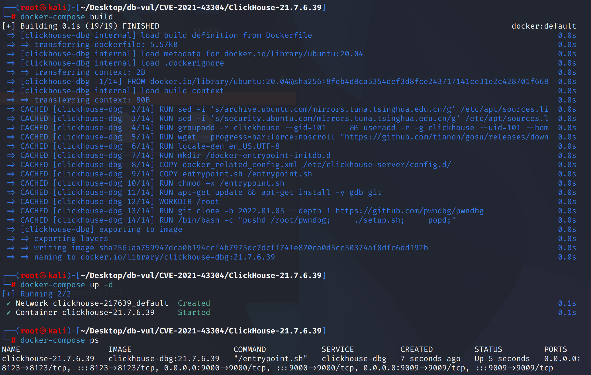
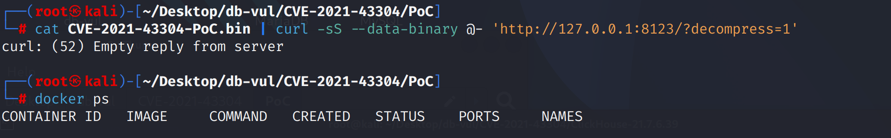
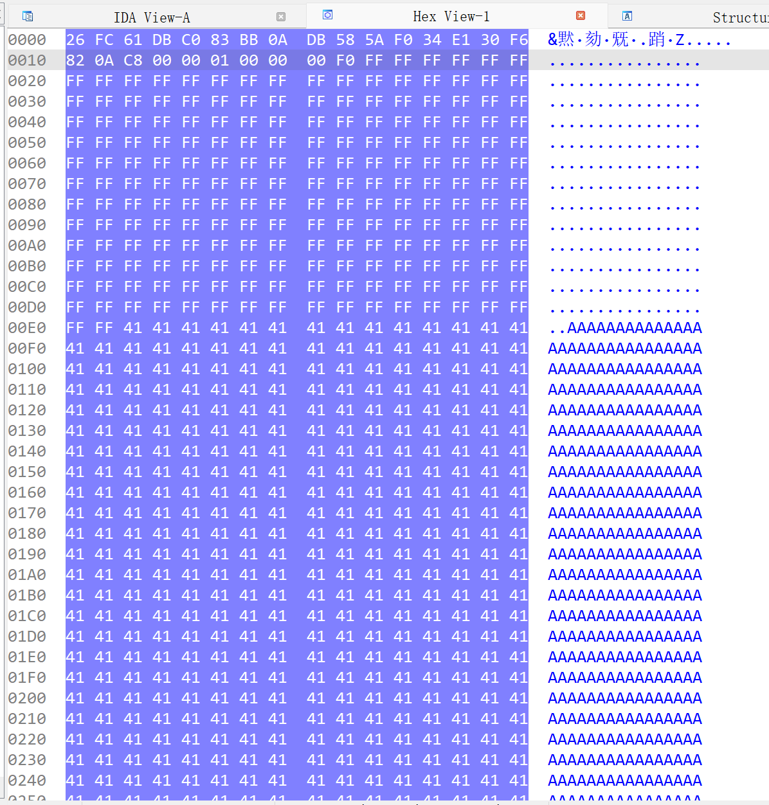

# CVE-2021-43304 CWE-787&122 ClickHouse 堆缓冲区溢出

## 漏洞背景

- **ClickHouse ：**一个开源的列式数据库管理系统，专为在线分析处理（OLAP）场景设计，能够高效地处理大规模的数据查询和分析任务。它提供了高性能的数据压缩和并行计算能力，支持大规模数据集的快速查询和实时分析。ClickHouse 的架构支持分布式计算，使其能够扩展到多个节点，并在大数据环境中提供高可用性和容错性。由于其快速的查询性能和可伸缩性，ClickHouse 在处理大数据分析、日志分析、数据仓库等应用场景中表现出色。
- **LZ4 ：**一种高效的压缩算法，旨在提供快速的压缩和解压缩速度，通常用于需要高性能的应用场景。LZ4 解压缩过程是基于 LZ77 算法，通过查找重复的字节序列来还原原始数据。它采用滑动窗口技术，通过查找之前出现过的字节模式来替代重复数据，从而实现压缩。LZ4 的解压缩操作非常快速，因为它不需要复杂的计算，而是通过简单的字节复制和模式匹配来恢复数据，这使得它特别适用于实时数据处理和大数据分析应用。

## 漏洞原理

在 `LZ4::decompressImpl` 解压缩循环中，复制作的数量没有得到适当验证，特别是在处理压缩数据时没有验证 `wildCopy<copy_amount>` 操作的范围。若输入数据被恶意构造，攻击者可以控制 `copy_amount`，从而将数据写入堆的任意位置。

## 漏洞定位

分析 ClickHouse 21.7.6.39 源码：

在 ClickHouse/src/Compression/LZ4_decompress_faster.cpp 文件，第 415 行 decompressImpl 函数是一个实现 LZ4 解压缩算法的核心部分，负责从压缩数据流中提取并还原原始数据。

在第 464 行，使用 wildCopy 进行复制操作时，没有没有确保目标缓冲区 `dest` 是否有足够的空间来存放解压后的数据。如果解压的数据超过了 `dest_size`，可能会导致解压缩过程向目标缓冲区写入超出范围的数据，导致堆溢出。

```cpp
void NO_INLINE decompressImpl(
     const char * const source,
     char * const dest,
     size_t dest_size)
{
    const UInt8 * ip = reinterpret_cast<const UInt8 *>(source);
    UInt8 * op = reinterpret_cast<UInt8 *>(dest);
    UInt8 * const output_end = op + dest_size;

#if defined(__clang__)
    #pragma nounroll
#endif
    while (true)
    {
        size_t length;

        auto continue_read_length = [&]
        {
            unsigned s;
            do
            {
                s = *ip++;
                length += s;
            } while (unlikely(s == 255));
        };

        /// Get literal length.

        const unsigned token = *ip++;
        length = token >> 4;
        if (length == 0x0F)
            continue_read_length();

        /// Copy literals.

        UInt8 * copy_end = op + length;

// ************************ 464 行 **************************8****
        wildCopy<copy_amount>(op, ip, copy_end);    /// Here we can write up to copy_amount - 1 bytes after buffer.

        ip += length;
        op = copy_end;

        if (copy_end >= output_end)
            return;

        /// Get match offset.

        size_t offset = unalignedLoad<UInt16>(ip);
        ip += 2;
        const UInt8 * match = op - offset;

        /// Get match length.

        length = token & 0x0F;
        if (length == 0x0F)
            continue_read_length();
        length += 4;

        copy_end = op + length;
        if (unlikely(offset < copy_amount))
        {
            copyOverlap<copy_amount, use_shuffle>(op, match, offset);
        }
        else
        {
            copy<copy_amount>(op, match);
            match += copy_amount;
        }

        op += copy_amount;

        copy<copy_amount>(op, match);   /// copy_amount + copy_amount - 1 - 4 * 2 bytes after buffer.
        if (length > copy_amount * 2)
            wildCopy<copy_amount>(op + copy_amount, match + copy_amount, copy_end);

        op = copy_end;
    }
}
```

## 漏洞修复

添加多个边界检查，确保在 `wildCopy<copy_amount>` 之前不会发生缓冲区溢出

```diff
diff --git a/src/Compression/LZ4_decompress_faster.cpp b/src/Compression/LZ4_decompress_faster.cpp
index 28a285f00f4b..bbe3e899620f 100644
--- a/src/Compression/LZ4_decompress_faster.cpp
+++ b/src/Compression/LZ4_decompress_faster.cpp
@@ -450,7 +450,11 @@ bool NO_INLINE decompressImpl(
         const unsigned token = *ip++;
         length = token >> 4;
         if (length == 0x0F)
+        {
+            if (unlikely(ip + 1 >= input_end))
+                return false;
             continue_read_length();
+        }
 
         /// Copy literals.
 
@@ -470,6 +474,9 @@ bool NO_INLINE decompressImpl(
         if (unlikely(copy_end > output_end))
             return false;
 
+        if (unlikely(ip + std::max(copy_amount, static_cast<size_t>(std::ceil(static_cast<double>(length) / copy_amount) * copy_amount)) >= input_end))
+            return false;
+
         wildCopy<copy_amount>(op, ip, copy_end);    /// Here we can write up to copy_amount - 1 bytes after buffer.
 
         if (copy_end == output_end)
@@ -494,7 +501,11 @@ bool NO_INLINE decompressImpl(
 
         length = token & 0x0F;
         if (length == 0x0F)
+        {
+            if (unlikely(ip + 1 >= input_end))
+                return false;
             continue_read_length();
+        }
         length += 4;
 
         /// Copy match within block, that produce overlapping pattern. Match may replicate itself.
```

## 影响范围

- ClickHouse x excluding to 21.10.2.15

## **环境搭建**

启动 Docker 环境，ClickHouse 版本为 21.7.6.39

```txt
NIST:NVD   Base Score:8.8 HIGH   Vector:CVSS:3.1/AV:N/AC:L/PR:N/UI:N/S:U/C:H/I:H/A:H
```

```txt
cpe:2.3:a:apache:solr:21.7.6.39:*:*:*:*:*:*:*
```



## 漏洞复现

进入 PoC 文件夹，执行 PoC 文件发送一个恶意构造的 LZ4 压缩数据流到本地的 ClickHouse 服务，可以看到 ClickHouse 服务器没有返回任何信息（若报错则再次运行）。查看容器状态，可以看到没有容器运行，即 ClickHouse 服务器崩溃

```bash
cat CVE-2021-43304-PoC.bin | curl -sS --data-binary @- 'http://127.0.0.1:8123/?decompress=1'
```

```bash
docker ps
```



## PoC分析

二进制文件中的查询内容应采用以下格式

```c
struct {    
        uint128_t hash; // Google’s CityHash128    
        uint8_t compress_method;    
        uint32_t size_compressed_without_checksum; // the length (in bytes) of the entire struct (including compressed_data contents) minus the first 16bytes hash field.     
        uint32_t decompressed_size; // the expected decompressed output size     
        char compressed_data[0]; // the compressed data bytes (variable length)};
       }
```

在二进制压缩数据中使用了“\xff”（重复 200 次）“A”（重复 5100 次）。这些是任意值。生成的格式错误的压缩文件，在 LZ4::decompressImpl() 内的循环中使用了 200 个 0xff。



## 参考链接

https://nvd.nist.gov/vuln/detail/CVE-2021-43304

[Security Vulnerabilities Found in ClickHouse Open-Source Software](https://jfrog.com/blog/7-rce-and-dos-vulnerabilities-found-in-clickhouse-dbms/)

[clickhouse-lz4-rce/README.md at main · s3nt3/clickhouse-lz4-rce](https://github.com/s3nt3/clickhouse-lz4-rce/blob/main/README.md)

[Fix some issues · ClickHouse/ClickHouse@08fbab0](https://github.com/ClickHouse/ClickHouse/commit/08fbab09b023e32db1c4a09dfb161e394492d561)
