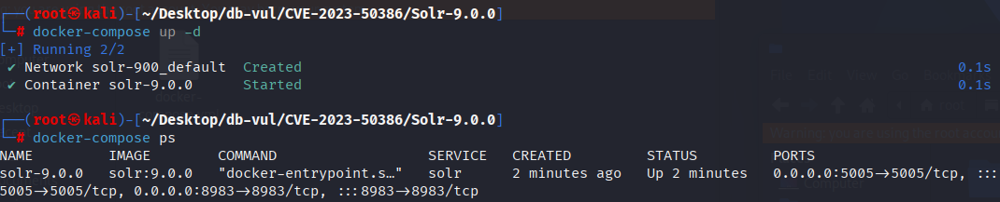
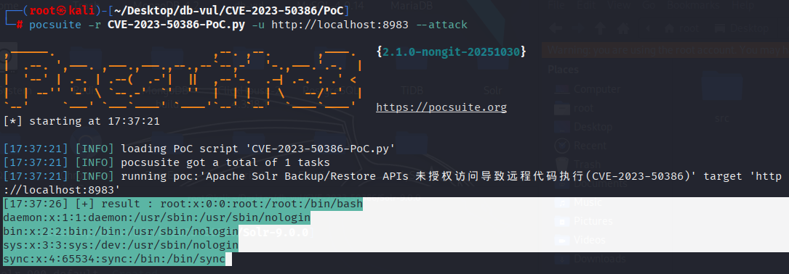

# CVE-2023-50386 CWE-913&434 Solr RCE

## 漏洞背景

**Solr ：**一个高性能、可扩展的开源企业级搜索引擎平台，基于 Apache Lucene 构建。它采用倒排索引技术，能够快速高效地对海量数据进行全文检索，支持多种数据格式（如 JSON、XML 等）的导入和索引。Solr 提供强大的查询功能，包括全文检索、过滤查询、排序、分组等，可灵活满足不同的检索需求。还具备分布式搜索和索引复制功能，可实现高可用性和负载均衡，广泛应用于电商搜索、内容管理、数据分析等众多领域，助力企业提升搜索体验和数据处理能力。

## 漏洞原理

在受影响的版本中，Solr ConfigSets 接受通过 ConfigSets API 上传的 Java jar 和类文件。 备份 Solr 集合时，这些 configSet 文件将在使用 LocalFileSystemRepository（备份的默认值）时保存到磁盘。 如果备份保存到 Solr 在其 ClassPath/ClassLoaders 中使用的目录，则 jar 和类文件将可用于任何 ConfigSet，无论是受信任的还是不受信任的。

## 漏洞定位

在 solr/solr/solrj/src/java/org/apache/solr/common/cloud/ZkMaintenanceUtils.java 文件，

```java

```


## 漏洞修复

添加对文件类型的检查，禁止特定文件类型（如 `.class`、`.java`、`.jar` 等）被上传或下载到 Zookeeper 中。

```diff
diff --git a/solr/solrj-zookeeper/src/java/org/apache/solr/common/cloud/ZkMaintenanceUtils.java b/solr/solrj-zookeeper/src/java/org/apache/solr/common/cloud/ZkMaintenanceUtils.java
index 40da28d255d..4b12cbea817 100644
--- a/solr/solrj-zookeeper/src/java/org/apache/solr/common/cloud/ZkMaintenanceUtils.java
+++ b/solr/solrj-zookeeper/src/java/org/apache/solr/common/cloud/ZkMaintenanceUtils.java
@@ -30,6 +30,7 @@
 import java.util.Comparator;
 import java.util.List;
 import java.util.Locale;
+import java.util.Set;
 import java.util.function.Predicate;
 import java.util.regex.Pattern;
 import org.apache.solr.client.solrj.SolrServerException;
@@ -328,13 +329,20 @@ public static void uploadToZK(
           public FileVisitResult visitFile(Path file, BasicFileAttributes attrs)
               throws IOException {
             String filename = file.getFileName().toString();
-            if (filenameExclusions != null && filenameExclusions.matcher(filename).matches()) {
+            if ((filenameExclusions != null && filenameExclusions.matcher(filename).matches())) {
               log.info(
                   "uploadToZK skipping '{}' due to filenameExclusions '{}'",
                   filename,
                   filenameExclusions);
               return FileVisitResult.CONTINUE;
             }
+            if (isFileForbiddenInConfigSets(filename)) {
+              log.info(
+                  "uploadToZK skipping '{}' due to forbidden file types '{}'",
+                  filename,
+                  USE_FORBIDDEN_FILE_TYPES);
+              return FileVisitResult.CONTINUE;
+            }
             String zkNode = createZkNodeName(zkPath, rootPath, file);
             try {
               // if the path exists (and presumably we're uploading data to it) just set its data
@@ -421,8 +429,12 @@ public static void downloadFromZK(SolrZkClient zkClient, String zkPath, Path fil
       if (children.size() == 0) {
         // If we didn't copy data down, then we also didn't create the file. But we still need a
         // marker on the local disk so create an empty file.
-        if (copyDataDown(zkClient, zkPath, file) == 0) {
-          Files.createFile(file);
+        if (isFileForbiddenInConfigSets(zkPath)) {
+          log.warn("Skipping download of file from ZK, as it is a forbidden type: {}", zkPath);
+        } else {
+          if (copyDataDown(zkClient, zkPath, file) == 0) {
+            Files.createFile(file);
+          }
         }
       } else {
         Files.createDirectories(file); // Make parent dir.
@@ -548,6 +560,32 @@ public static String createZkNodeName(String zkRoot, Path root, Path file) {
     }
     return ret;
   }
+
+  public static final String FORBIDDEN_FILE_TYPES_PROP = "solrConfigSetForbiddenFileTypes";
+  public static final String FORBIDDEN_FILE_TYPES_ENV = "SOLR_CONFIG_SET_FORBIDDEN_FILE_TYPES";
+  public static final Set<String> DEFAULT_FORBIDDEN_FILE_TYPES =
+      Set.of("class", "java", "jar", "tgz", "zip", "tar", "gz");
+  private static volatile Set<String> USE_FORBIDDEN_FILE_TYPES = null;
+
+  public static boolean isFileForbiddenInConfigSets(String filePath) {
+    // Try to set the forbidden file types just once, since it is set by SysProp/EnvVar
+    if (USE_FORBIDDEN_FILE_TYPES == null) {
+      synchronized (DEFAULT_FORBIDDEN_FILE_TYPES) {
+        if (USE_FORBIDDEN_FILE_TYPES == null) {
+          String userForbiddenFileTypes =
+              System.getProperty(
+                  FORBIDDEN_FILE_TYPES_PROP, System.getenv(FORBIDDEN_FILE_TYPES_ENV));
+          if (StringUtils.isEmpty(userForbiddenFileTypes)) {
+            USE_FORBIDDEN_FILE_TYPES = DEFAULT_FORBIDDEN_FILE_TYPES;
+          } else {
+            USE_FORBIDDEN_FILE_TYPES = Set.of(userForbiddenFileTypes.split(","));
+          }
+        }
+      }
+    }
+    int lastDot = filePath.lastIndexOf(".");
+    return lastDot >= 0 && USE_FORBIDDEN_FILE_TYPES.contains(filePath.substring(lastDot + 1));
+  }
 }
```

## 影响范围

- Apache Solr 6.0.0 到 8.11.2
- Apache Solr 9.0.0 之前的 9.4.1

## 环境搭建

启动 Docker 环境，Solr 版本为 9.0.0，同时启用了身份验证 solr:SolrRocks

```txt
ADP:CISA-ADP   Base Score:9.8 CRITICAL   Vector:CVSS:3.1/AV:N/AC:L/PR:N/UI:N/S:U/C:H/I:H/A:H
```

```txt
cpe:2.3:a:apache:solr:9.0.0:*:*:*:*:*:*:*
```



## 漏洞复现

1. 进入 EXP 文件夹，使用命令安装 pocsuite3

   ```bash
   pip install --break-system-packages pocsuite3
   ```

2. 运行 PoC 文件，可以看到成功获取了 `/etc/passwd` 文件的信息

   ```bash
   pocsuite -r CVE-2023-50386-PoC.py -u http://localhost:8983 --attack
   ```

   

## PoC分析


## 参考链接

[NVD - CVE-2023-50386](https://nvd.nist.gov/vuln/detail/CVE-2023-50386)

[[SOLR-16949\] RCE via Backup/Restore APIs - Fix for all file extensions - ASF JIRA](https://issues.apache.org/jira/browse/SOLR-16949)

[SOLR-16480: Add overridable allow-list for ConfigSet file types · apache/solr@28d6b01](https://github.com/apache/solr/commit/28d6b0163316376ef3b5429b3554c5041b47b5be)

[Apache Solr Backup/Restore APIs RCE (CVE-2023-50386)分析及挖掘思路 | l3yx's blog](https://l3yx.github.io/2024/02/10/Apache-Solr-Backup-Restore-APIs-RCE-CVE-2023-50386-分析及挖掘思路/#漏洞修复)

[vvmdx/Apache-Solr-RCE_CVE-2023-50386_POC: Apache Solr Backup/Restore APIs RCE Poc (CVE-2023-50386)](https://github.com/vvmdx/Apache-Solr-RCE_CVE-2023-50386_POC)
