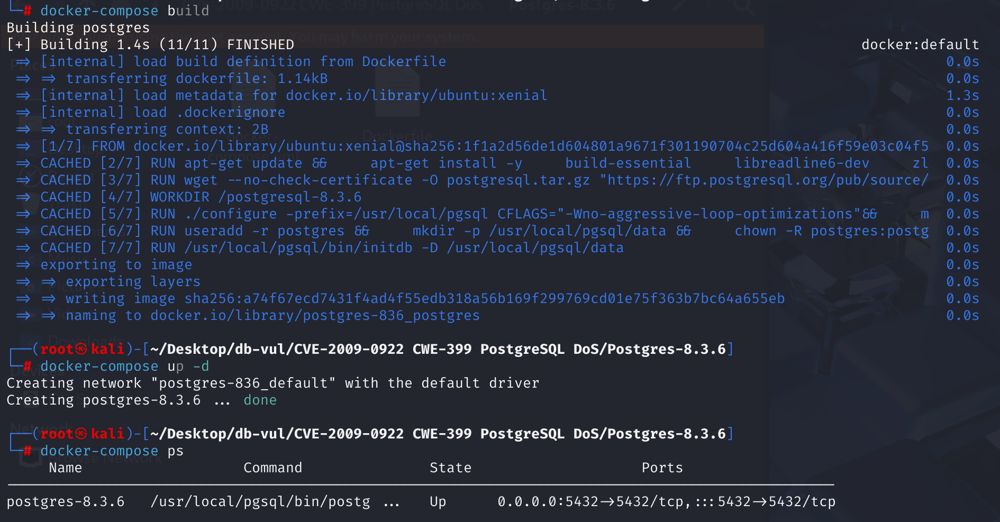
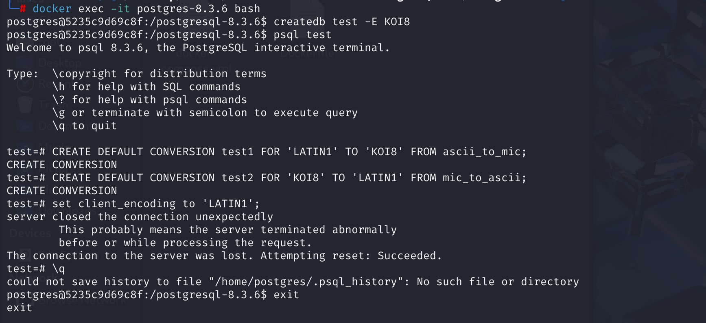
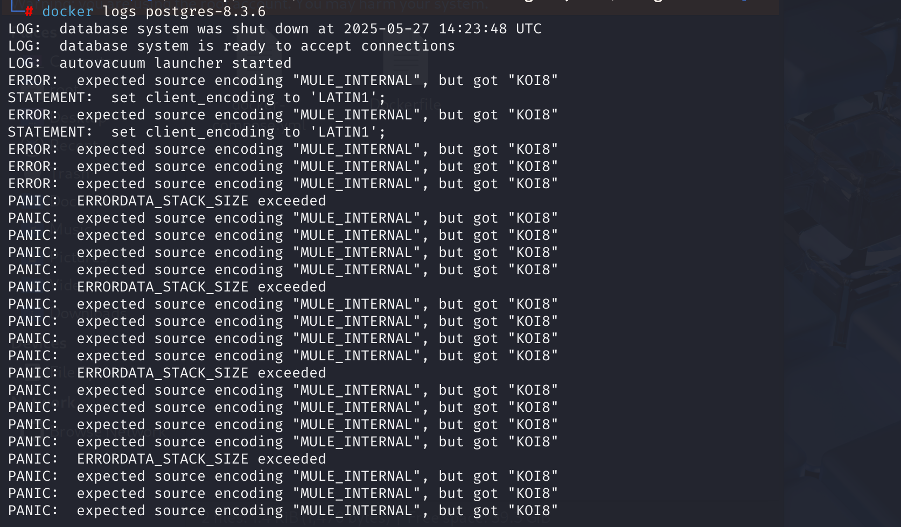
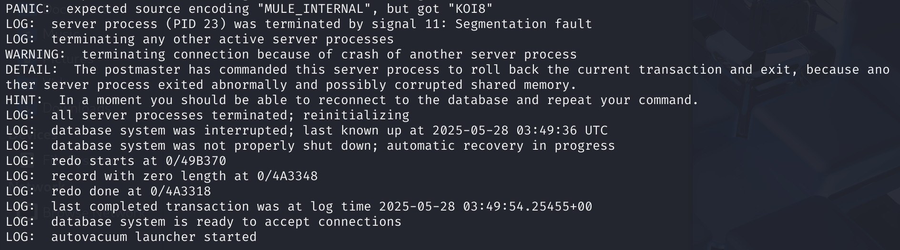

# CVE-2009-0922 CWE-399 PostgreSQL DoS

## 漏洞背景

- **递归错误导致堆栈溢出**：如果在递归过程中，再次发生错误（例如，错误报告也需要进行编码转换），这就会触发新的错误并将其压入堆栈。因为没有有效的限制措施，堆栈可能会超过最大深度，导致系统进入 `PANIC` 状态并崩溃。
- **PANIC 状态：**在 PostgreSQL 中，`PANIC` 状态是一种最严重的错误状态，通常由系统资源耗尽、硬件故障或软件内部错误等不可恢复的情况触发。当进入 `PANIC` 状态时，系统会立即终止当前操作，清理资源，并将错误信息记录到日志中。同时，可能会终止相关进程或整个数据库系统，以防止错误进一步传播或造成更大的损害。
- **LATIN1、KOI8和MULE_INTERNAL：**`LATIN1` 和 `KOI8` 是两种不同的单字节编码，分别用于不同的语言环境。当需要在它们之间进行数据交换时，PostgreSQL 会进行编码转换。而 `MULE_INTERNAL` 作为一种内部编码，PostgreSQL 默认使用 MULE_INTERNAL 编码，可能需要与其他编码（包括 `LATIN1` 和 `KOI8`）进行转换，以便在不同的系统或组件之间传递文本数据。

## 漏洞原理

 PostgreSQL 在处理错误消息时，对客户端编码转换的处理不当。当系统错误消息需要转换为客户端指定的编码时，如果使用错误（不匹配）转换函数，可能导致堆栈溢出，服务器会崩溃。在 PostgreSQL 的错误处理机制中，如果错误处理过程中再次发生错误，系统会尝试递归处理，但如果递归深度超过 `ERRORDATA_STACK_SIZE`，则会触发 PANIC 错误并导致进程中止。

**CWE-399 资源管理错误 --> DoS**

**需要拥有“创建数据库”的权限的用户信息 --> 造成DoS攻击** 

## 漏洞定位

1. 在 src\backend\commands\conversioncmds.c 文件第 38 行`CreateConversionCommand`函数用于创建转换（Conversion）。其处理 `CREATE CONVERSION` SQL 命令，用于定义字符编码之间的转换。其中第 93 行当调用 `ConversionCreate` 函数创建转换时，未对转换函数的兼容性进行检查，即没有验证该转换函数是否能够正确地执行从源编码到目标编码的转换。这使得攻击者可以创建一个不兼容的转换函数，从而在服务器尝试使用该转换函数处理错误消息时，导致递归错误和服务器崩溃。在发生错误时，PostgreSQL 会调用 `errstart` 函数，开始处理错误并记录错误数据，跟踪该函数。

   ```c
   /*
    * CREATE CONVERSION
    */
   void
   CreateConversionCommand(CreateConversionStmt *stmt)
   {
   	Oid			namespaceId;
   	char	   *conversion_name;
   	AclResult	aclresult;
   	int			from_encoding;
   	int			to_encoding;
   	Oid			funcoid;
   	const char *from_encoding_name = stmt->for_encoding_name;
   	const char *to_encoding_name = stmt->to_encoding_name;
   	List	   *func_name = stmt->func_name;
   	static Oid	funcargs[] = {INT4OID, INT4OID, CSTRINGOID, INTERNALOID, INT4OID};
   
   	/* Convert list of names to a name and namespace */
   	namespaceId = QualifiedNameGetCreationNamespace(stmt->conversion_name,
   													&conversion_name);
   
   	/* Check we have creation rights in target namespace */
   	aclresult = pg_namespace_aclcheck(namespaceId, GetUserId(), ACL_CREATE);
   	if (aclresult != ACLCHECK_OK)
   		aclcheck_error(aclresult, ACL_KIND_NAMESPACE,
   					   get_namespace_name(namespaceId));
   
   	/* Check the encoding names */
   	from_encoding = pg_char_to_encoding(from_encoding_name);
   	if (from_encoding < 0)
   		ereport(ERROR,
   				(errcode(ERRCODE_UNDEFINED_OBJECT),
   				 errmsg("source encoding \"%s\" does not exist",
   						from_encoding_name)));
   
   	to_encoding = pg_char_to_encoding(to_encoding_name);
   	if (to_encoding < 0)
   		ereport(ERROR,
   				(errcode(ERRCODE_UNDEFINED_OBJECT),
   				 errmsg("destination encoding \"%s\" does not exist",
   						to_encoding_name)));
   
   	/*
   	 * Check the existence of the conversion function. Function name could be
   	 * a qualified name.
   	 */
   	funcoid = LookupFuncName(func_name, sizeof(funcargs) / sizeof(Oid),
   							 funcargs, false);
   
   	/* Check we have EXECUTE rights for the function */
   	aclresult = pg_proc_aclcheck(funcoid, GetUserId(), ACL_EXECUTE);
   	if (aclresult != ACLCHECK_OK)
   		aclcheck_error(aclresult, ACL_KIND_PROC,
   					   NameListToString(func_name));
   
   	/*
   	 * All seem ok, go ahead (possible failure would be a duplicate conversion
   	 * name)
   	 */
   	ConversionCreate(conversion_name, namespaceId, GetUserId(),
   					 from_encoding, to_encoding, funcoid, stmt->def);
   }
   ```

2. 在 src\backend\utils\error\elog.c 文件，第 166 行`errstart` 函数用于处理错误报告，其初始化错误数据栈并准备错误处理流程。在发生错误时，PostgreSQL 会调用 `errstart` 函数，开始处理错误并记录错误数据，其中第 289 行，这个代码会将当前错误信息记录到 `errordata` 数组中。**如果问题出在转换函数中（PoC中是因为未设置系统默认编码与数据库设置的指定编码之间的转换函数，导致报错），那么在报告错误的过程中，错误信息也需要转换编码，这会再次调用转换函数，就会导致递归错误。**在 `errstart` 中，如果堆栈深度超过 `ERRORDATA_STACK_SIZE`，触发堆栈溢出，并进入 **PANIC** 状态。这个状态会导致数据库进程崩溃，从而断开客户端与数据库的连接。

   ```c
   bool
   errstart(int elevel, const char *filename, int lineno,
   		 const char *funcname)
   {
       // ...
       
       // 289 行
   	/* Initialize data for this error frame */
   	edata = &errordata[errordata_stack_depth];
   	MemSet(edata, 0, sizeof(ErrorData));
       
       // ...
   }
   ```

## 漏洞修复

在 conversioncmds.c 文件中调用 `ConversionCreate` 函数创建转换前，增加了`OidFunctionCall5`函数对转换函数的验证，在调用转换函数之前，系统会通过调用转换函数并传递空字符串来确认它是否能正确处理。

```c
/*
 * Check that the conversion function is suitable for the requested
 * source and target encodings. We do that by calling the function with
 * an empty string; the conversion function should throw an error if it
 * can't perform the requested conversion.
 */
OidFunctionCall5(funcoid,
                 Int32GetDatum(from_encoding),
                 Int32GetDatum(to_encoding),
                 CStringGetDatum(""),
                 CStringGetDatum(result),
                 Int32GetDatum(0));
```

同时在 elog.c 文件中在推送错误数据之前增加了 `push_errordata` 函数来检查堆栈深度。如果堆栈深度超过了 `ERRORDATA_STACK_SIZE`，则会终止并触发 `PANIC` 错误。

```c
static ErrorData *
push_errordata(void)
{
    if (++errordata_stack_depth >= ERRORDATA_STACK_SIZE)
    {
        if (errordata[ERRORDATA_STACK_SIZE - 1].elevel >= PANIC)
        {
            ImmediateInterruptOK = false;
            fflush(stdout);
            fflush(stderr);
            abort();
        }
        errordata_stack_depth = -1; /* make room on stack */
        ereport(PANIC, (errmsg_internal("ERRORDATA_STACK_SIZE exceeded")));
    }
    return &errordata[errordata_stack_depth];
}

```

## 影响版本

低于 8.3.7、8.2.13、8.1.17、8.0.21 和 7.4.25 的 PostgreSQL 

## 环境搭建



## 漏洞复现

1、进入容器命令行

```bash
docker exec -it postgres-8.3.6 bash
```

2、创建一个名为`test`的新数据库，并且指定了其编码为 KOI8。`-E KOI8` 参数确保数据库的编码为 `KOI8`，意味着该数据库中的所有字符数据都将使用 `KOI8` 编码进行存储。

```bash
createdb test -E KOI8
```

3、连接到刚刚创建好的`test`数据库，进入其交互式终端

```bash
psql test
```

4、创建一个名为 “test1” 的默认转换。它的作用是用于从 LATIN1 编码到 KOI8 编码的转换，并且指定了转换函数为 ascii_to_mic。有了这样的转换，可以在不同编码的文本数据之间进行相互转换，使得在不同编码环境下存储和读取的数据能够正确展示和处理。同时，创建一个名为 “test2” 的默认转换，用于从 KOI8 编码到 LATIN1 编码的转换，转换函数指定为 mic_to_ascii，目的也是实现不同编码文本数据的互相转换。

```bash
CREATE DEFAULT CONVERSION test1 FOR 'LATIN1' TO 'KOI8' FROM ascii_to_mic;

CREATE DEFAULT CONVERSION test2 FOR 'KOI8' TO 'LATIN1' FROM mic_to_ascii; 
```

5、设置客户端的编码为 LATIN1。客户端编码决定了应用程序与数据库之间进行数据传输时所使用的字符编码格式，设置合适的客户端编码能让从客户端发送到数据库以及从数据库返回到客户端的数据在字符编码上保持一致，避免出现乱码等情况。可以看到服务器意外关闭连接。

```bash
set client_encoding to 'LATIN1';
```



6、查看容器日志，可以看到多次出现 `ERROR: expected source encoding "MULE_INTERNAL", but got "KOI8"`，这表明在数据库操作过程中，服务器期望的源编码是 `MULE_INTERNAL`，但实际得到的是 `KOI8` 编码。这通常是由于客户端请求的编码与服务器内部的编码不匹配导致的。

同时，日志中反复出现 `PANIC: ERRORDATA_STACK_SIZE exceeded`，说明在错误处理过程中，错误数据栈的深度超过了系统设定的限制（`ERRORDATA_STACK_SIZE`）。这通常是由于无限递归的错误处理导致的。每次错误处理过程中又引发了新的错误，导致堆栈不断增长，最终耗尽了堆栈空间，使数据库服务器进入 PANIC 状态。



之后，日志显示数据库服务器进程因段错误（`Segmentation fault`）被终止（`LOG: server process (PID 23) was terminated by signal 11`）。随后，系统终止了其他活跃的服务器进程并尝试重新初始化数据库系统。这表明整个数据库实例因为之前的错误而崩溃，并需要重新启动才能恢复正常服务。



## PoC分析

```sql
set client_encoding to 'LATIN1';
```

这条命令设置客户端的编码为 LATIN1。此时，客户端将尝试以 LATIN1 编码与数据库交换数据。然而，数据库本身的编码是 KOI8，这就导致了客户端与数据库之间的编码转换需求。客户端编码为 LATIN1，在发送数据时，PostgreSQL 需要将 LATIN1 编码的数据转换为 KOI8 编码，或反之进行处理。

poc 中只创建了 `LATIN1` 和 `KOI8` 之间的转换，但**没有创建 `MULE_INTERNAL` 到 `LATIN1` 或 `KOI8` 的转换函数**。而PostgreSQL 在处理编码转换时，默认会使用 `MULE_INTERNAL` 作为内部编码格式。由于缺少有效的转换设置，**系统会报错。错误处理过程中如果再次尝试进行转换（例如错误信息的编码转换），就会导致递归错误。**

## 参考链接

[PostgreSQL：错误 #4680：如果使用错误（不匹配）的转换函数，服务器会崩溃](https://www.postgresql.org/message-id/200902271040.n1RAeiMG071835@wwwmaster.postgresql.org)

[8.3.7、8.2.13、8.1.17、8.0.21 和 7.4 之前的 PostgreSQL·CVE-2009-0922 漏洞 ·GitHub Advisory Database](https://github.com/advisories/GHSA-fj47-2vxw-632j)

[PostgreSQL: Re: BUG #4680: Server crashed if using wrong (mismatch) conversion functions](https://www.postgresql.org/message-id/49A7D92A.7080808@enterprisedb.com)
