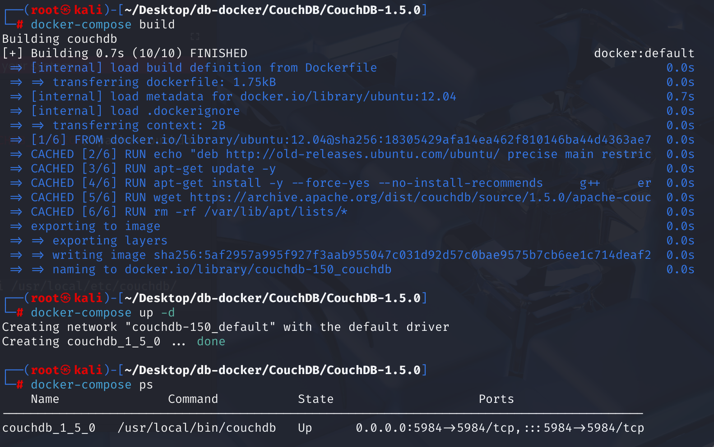
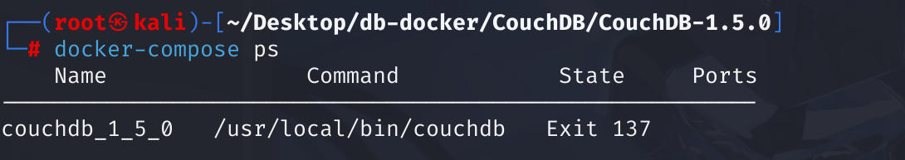

# CVE-2014-2668 CWE-20 CouchDB DoS

## 漏洞背景

- **CouchDB :**由 Apache 软件基金会所主导的一个开源数据库项目，是一个面向文档的 NoSQL 数据库。它使用 JSON 文档存储数据，支持多版本并发控制（MVCC），并且提供了强大的数据同步功能，使得数据可以在多个设备之间轻松同步，适合用于构建分布式应用。CouchDB 还具有灵活的查询功能，用户可以使用 JavaScript 查询语言（JavaScript Query Language）来查询文档，同时它也支持全文搜索和视图（views）来处理和分析数据。
- **/_uuids：**在 Apache CouchDB 中，`/_uuids` 是一个内置的 API 端点，其主要功能是按需生成一个或多个通用唯一标识符 (UUID)。这些 UUID 通常被用作 CouchDB 文档的 `_id` 字段，以确保每个文档都有一个在数据库内（甚至在分布式环境中）唯一的标识。客户端可以通过向该端点发送 GET 请求来获取 UUID，还可以通过 `count` 参数指定需要生成的 UUID 数量。例如，请求 `/_uuids?count=5` 将返回一个包含五个新 UUID 的 JSON 对象。这个功能简化了在应用程序中创建唯一文档 ID 的过程。
- **CWE-20（Improper Input Validation）：**“不正确的输入验证”，当软件接收来自外部（如用户输入、网络数据、文件等）的数据时，没有充分地、正确地验证这些数据是否符合预期的格式、类型、长度、范围或内容，或者未能对潜在的恶意内容进行清理。这种验证缺失或不当可能导致多种安全问题，例如缓冲区溢出、注入攻击（如SQL注入、跨站脚本XSS）、路径遍历、拒绝服务，甚至允许攻击者控制程序流程或访问未授权的资源。

## 漏洞原理

 Apache CouchDB 1.5.0 及更早版本中`/_uuids` 处理程序中的 `count` 查询参数可以接受不合理的巨大数值。当 CouchDB 尝试满足生成极大数量 UUID 的请求时，即使只有一个恶意的 GET 请求，CouchDB 服务器也会变得无响应，并实际上“宕机”或崩溃。

**未对请求参数进行限制（CWE-20）--> 生成大量 UUID 导致资源耗尽 --> 拒绝服务（DoS）攻击**

## 漏洞定位

在 CouchDB 1.5.0 源码中

在 src\couchdb\couch_httpd_misc_handlers.erl 文件，第 107 行，`handle_uuids_req`函数用于处理 `GET /_uuids` 请求。该函数生成指定数量的 UUID，并返回给客户端。但是这里对`count` 参数的值**没有被限制**，导致攻击者可以通过请求大量 UUID，消耗服务器资源，进而造成拒绝服务（DoS）攻击。

```erlang
handle_uuids_req(#httpd{method='GET'}=Req) ->
    Count = list_to_integer(couch_httpd:qs_value(Req, "count", "1")),
    UUIDs = [couch_uuids:new() || _ <- lists:seq(1, Count)],
    Etag = couch_httpd:make_etag(UUIDs),
    couch_httpd:etag_respond(Req, Etag, fun() ->
        CacheBustingHeaders = [
            {"Date", couch_util:rfc1123_date()},
            {"Cache-Control", "no-cache"},
            % Past date, ON PURPOSE!
            {"Expires", "Fri, 01 Jan 1990 00:00:00 GMT"},
            {"Pragma", "no-cache"},
            {"ETag", Etag}
        ],
        send_json(Req, 200, CacheBustingHeaders, {[{<<"uuids">>, UUIDs}]})
    end);
```

## 漏洞修复

在 etc/couchdb/default.ini.tpl.in 文件中添加 `max_count = 1000` 选项（UUID 配置）以允许限制 /_uuids 处理器在单个请求中请求的 UUID 数量。

同时在`handle_uuids_req`函数中增加对请求参数中的 `count` 值的检查，限制生成的 UUID 数量，以防止潜在的资源耗尽攻击。

```erlang
handle_uuids_req(#httpd{method='GET'}=Req) ->
    Max = list_to_integer(couch_config:get("uuids","max_count","1000")),
    Count = list_to_integer(couch_httpd:qs_value(Req, "count", "1")),
    case Count > Max of
        true -> throw({forbidden, <<"count parameter too large">>});
        false -> ok
    end,
    UUIDs = [couch_uuids:new() || _ <- lists:seq(1, Count)],
    Etag = couch_httpd:make_etag(UUIDs),
    couch_httpd:etag_respond(Req, Etag, fun() ->
        CacheBustingHeaders = [
            {"Date", couch_util:rfc1123_date()},
            {"Cache-Control", "no-cache"},
            % Past date, ON PURPOSE!
            {"Expires", "Fri, 01 Jan 1990 00:00:00 GMT"},
            {"Pragma", "no-cache"},
            {"ETag", Etag}
        ],
        send_json(Req, 200, CacheBustingHeaders, {[{<<"uuids">>, UUIDs}]})
    end);
```

## 影响版本

Apache CouchDB 版本 1.3.1、1.4.0 和 1.5.0 及更早版本

## 环境搭建

启动 Docker 环境，CouchDB 版本为 1.5.0



## 漏洞复现

1、使用`curl`命令向 CouchDB的 `/_uuids` 端点发送一个 GET 请求，将 `count` 参数设置为 9 ，并成功获取了 9 个 UUID，说明 CouchDB 1.5.0 实例运行正常，且 `_uuids` 接口可用。

但是在 `count` 参数中指定一个极大的值，等待一段时间后，收到 `curl: (52) Empty reply from server` 错误，这通常表示客户端成功连接到服务器，但服务器未返回任何数据。

```bash
curl http://127.0.0.1:5984/_uuids?count=99999999999999999999999999999999999999999999999999999999999999999999999
```


2、查看 CouchDB 容器状态，发现出现 `Exit 137` 错误，这通常表示容器被系统强制终止，主要原因可能是内存不足（OOM）或收到了 `SIGKILL` 信号。成功实现了 DoS攻击。



## EXP分析

```http
http://<target-ip>:<target-port>/_uuids?count=99999999999999999999999999999999999999999999999999999999999999999999999
```

向目标计算机上运行的 CouchDB 服务（默认端口 5984）的 /_uuids 接口发送一个请求，要求它生成一个很大数量的 UUID，CouchDB 服务器会尝试为这个巨大的请求分配海量的内存和 CPU 资源来生成 UUID。由于资源迅速耗尽，服务器很可能会变得无响应、挂起，甚至完全崩溃，从而导致**拒绝服务 (DoS)**。

## 参考链接

[NVD - CVE-2014-2668](https://nvd.nist.gov/vuln/detail/CVE-2014-2668)

[Apache CouchDB 1.5.0 - 'uuids' Denial of Service - Multiple dos Exploit](https://www.exploit-db.com/exploits/32519)

[2.7. CVE-2014-2668：通过 /_uuids 的 count 参数导致拒绝服务（CPU 和内存消耗） — Apache CouchDB® 3.3 文档 - CouchDB 数据库](https://couchdb-docs.apache.ac.cn/en/stable/cve/2014-2668.html)

[1.13. 1.5.x 分支 — Apache CouchDB® 3.5 文档 --- 1.13. 1.5.x Branch — Apache CouchDB® 3.5 Documentation](https://docs.couchdb.org/en/stable/whatsnew/1.5.html#release-1-5-1)

https://github.com/apache/couchdb/compare/1.5.0...1.5.1#diff-65df74b3875d7ffa71d97f92ff6cac104fe844d8658932cf1af8bccf6078b9ce
