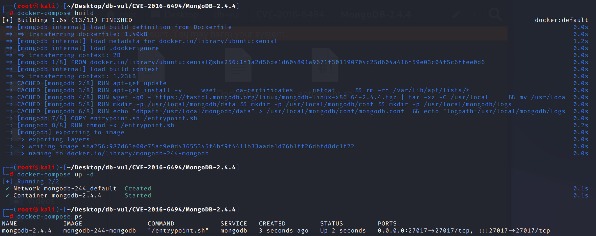
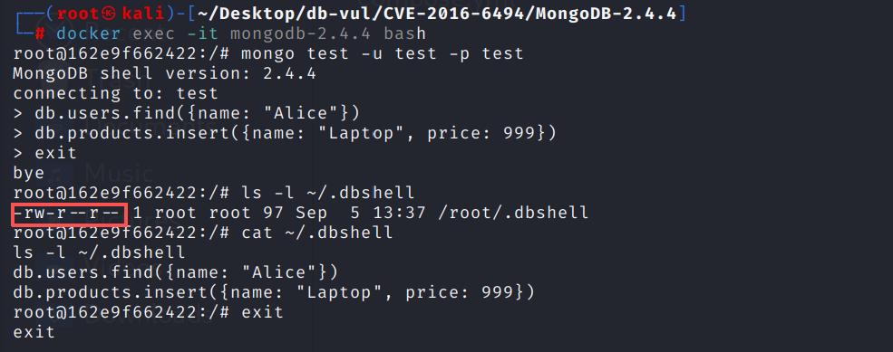

# CVE-2016-6494 CWE-200 MongoDB 信息泄露

## 漏洞背景

- **MongoDB：** 一个高性能的、开源的、无模式的文档型数据库，它是 NoSQL 数据库中最流行的一种。MongoDB 使用类似 JSON 的 BSON 格式来存储数据，这使得数据的存储和查询变得非常灵活。它支持的数据结构非常松散，可以存储比较复杂的数据类型。MongoDB 的特点是它的查询语言非常强大，几乎可以实现类似关系数据库单表查询的绝大部分功能，并且支持索引，使得数据查询更加快速。
- **.dbshell 文件：**MongoDB 客户端（如 `mongo` 或 `mongosh`）会将用户执行的命令历史记录保存在一个名为 `.dbshell` 的文件中。该文件通常位于用户主目录下（Linux/macOS 为 `~/.dbshell`，Windows 为 `%USERPROFILE%\.dbshell`）。此文件用于在不同会话间保留命令历史记录，方便用户使用上下箭头键快速访问之前执行过的命令。
- **CWE-200 （Exposure of Sensitive Information to an Unauthorized Actor）：**“将敏感信息暴露给未经授权的参与者”。系统未对日志、错误消息或 API 响应等出口做充分过滤，导致攻击者无需授权即可获取账号、密钥、路径等内部数据，进而为后续入侵提供跳板。

## 漏洞原理

MongoDB 客户端在创建 `.dbshell` 文件时，未正确设置文件权限，导致该文件默认对所有用户可读。这使得本地用户可以未经授权地读取该文件，从中获取敏感信息，如数据库连接字符串、用户名、密码或执行过的命令等。

## 漏洞定位

分析 MongoDB 2.4.4 源码：

src/mongo/shell/linenoise.cpp 文件，第 2628 行的 `linenoiseHistorySave()` 函数中直接使用 `fopen(filename, "wt")` 创建或覆盖历史文件。`fopen()` 在创建新文件时并不会显式指定文件权限，而是依赖进程当前的 `umask` 与系统默认创建模式共同决定最终权限。在常见 Linux 环境中，如果用户的 `umask` 为 `0022`，新建文件通常会得到 `0644` 权限，表示文件所有者可读写，而同组用户和其他本地用户均可读取。

由于 `.dbshell` 保存的是 MongoDB Shell 的历史命令，文件中可能包含数据库名、集合名、查询条件、连接字符串、管理命令，甚至业务敏感数据。因此，当 `.dbshell` 以 `0644` 或类似的宽松权限创建时，本地低权限用户即可直接读取该历史文件，造成敏感信息泄露。

```c++
/* Save the history in the specified file. On success 0 is returned
 * otherwise -1 is returned. */
int linenoiseHistorySave( const char* filename ) {
    FILE* fp = fopen( filename, "wt" );
    if ( fp == NULL ) {
        return -1;
    }

    for ( int j = 0; j < historyLen; ++j ) {
        if ( history[j][0] != '\0' ) {
            fprintf ( fp, "%s\n", history[j] );
        }
    }
    fclose( fp );
    return 0;
}
```

## 漏洞修复

在 POSIX 环境下，不再直接通过 `fopen()` 创建 `.dbshell` 文件，而是先使用 `open()` 创建文件并显式指定权限为 `0600`，随后再通过 `fdopen()` 将文件描述符转换为标准 I/O 文件流进行写入。

```diff
diff --git a/src/mongo/shell/linenoise.cpp b/src/mongo/shell/linenoise.cpp
index f75028c8845a0..8b70214ac5b44 100644
--- a/src/mongo/shell/linenoise.cpp
+++ b/src/mongo/shell/linenoise.cpp
@@ -2762,7 +2762,17 @@ int linenoiseHistorySetMaxLen(int len) {
 /* Save the history in the specified file. On success 0 is returned
  * otherwise -1 is returned. */
 int linenoiseHistorySave(const char* filename) {
-    FILE* fp = fopen(filename, "wt");
+    FILE* fp;
+#if _POSIX_C_SOURCE >= 1 || _XOPEN_SOURCE || _POSIX_SOURCE
+    int fd = open(filename, O_CREAT, S_IRUSR | S_IWUSR);
+    if (fd == -1) {
+        // report errno somehow?
+        return -1;
+    }
+    fp = fdopen(fd, "wt");
+#else
+    fp = fopen(filename, "wt");
+#endif  // _POSIX_C_SOURCE >= 1 || _XOPEN_SOURCE || _POSIX_SOURCE
     if (fp == NULL) {
         return -1;
     }
@@ -2772,7 +2782,7 @@ int linenoiseHistorySave(const char* filename) {
             fprintf(fp, "%s\n", history[j]);
         }
     }
-    fclose(fp);
+    fclose(fp);  // Also causes fd to be closed.
     return 0;
 }
```

## 影响范围

MongoDB：

-  x to 3.0.14
- 3.2 to 3.2.13
- 3.3 to 3.3.13

## 环境搭建

启动 Docker 环境，MongoDB 版本为 2.4.4，管理员为 admin，密码为 admin，存在一个数据库 test，及具有 readWrite  角色的普通用户 test，密码为 test

```txt
NIST:NVD    Base Score:5.5 MEDIUM    Vector:CVSS:3.0/AV:L/AC:L/PR:L/UI:N/S:U/C:H/I:N/A:N
```

```txt
cpe:2.3:a:mongodb:mongodb:2.4.4:*:*:*:*:*:*:*
```



## 漏洞复现

1. 进入容器命令行

   ```bash
   docker exec -it mongodb-2.4.4 bash 
   ```

2. 以 test 用户身份连接 test 数据库，密码为 test

   ```bash
   mongo test -u test -p test
   ```

3. 随便进行一些操作

   ```bash
   db.users.find({name: "Alice"})
   db.products.insert({name: "Laptop", price: 999})
   ```

4. 退出连接，在用户的主目录下查找 `.dbshell` 文件，可以看到文件的权限为 `-rw-r--r--`（644），即所有用户可读，存在信息泄露风险

   ```bash
   ls -l ~/.dbshell
   ```

5. 查看 `.dbshell` 文件的内容，可以看到文件中包含之前操作的敏感信息，如数据库名称、集合名称或查询语句。

   ```bash
   cat ~/.dbshell
   ```



## PoC分析

## 参考链接

[NVD - CVE-2016-6494](https://nvd.nist.gov/vuln/detail/CVE-2016-6494#range-14544159)

[[SERVER-25335\] 0002 umask yields world-readable .dbshell history file - MongoDB Jira](https://jira.mongodb.org/browse/SERVER-25335)

[SERVER-25335 SERVER-26489 avoid group and other permissions when crea… · mongodb/mongo@0ee5999](https://github.com/mongodb/mongo/commit/0ee59992ef9627809e2ff13c608a023fc6b8c909)

https://github.com/mongodb/mongo/commit/035cf2afc04988b22cb67f4ebfd77e9b344cb6e0#diff-8f48544f766401ba24ce6542ee11450e7223efd6890b9fafc7219286c5d2f477.diff
