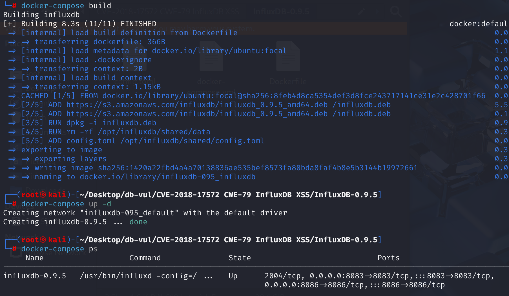
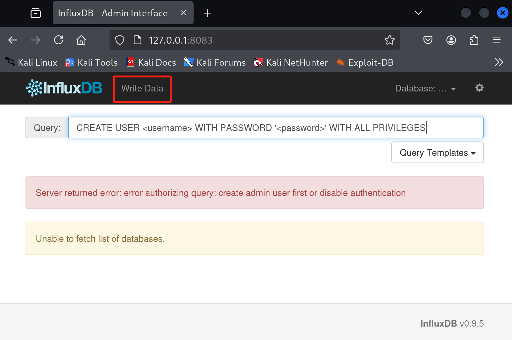
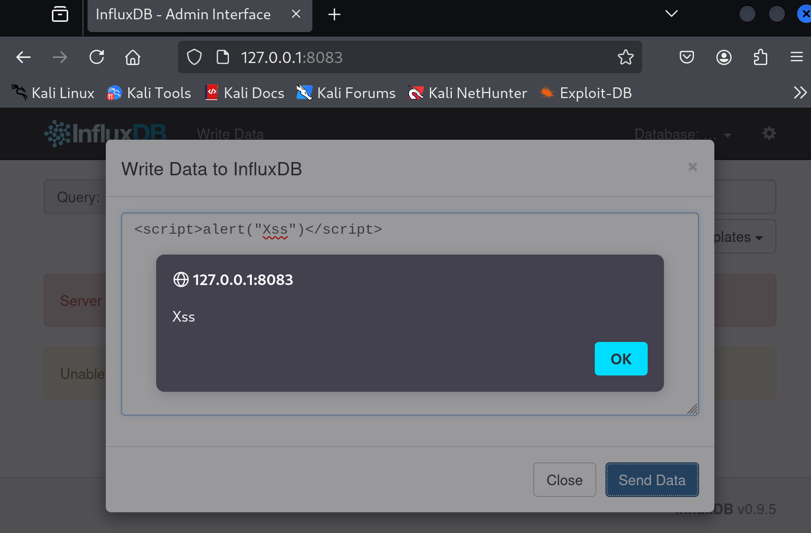

# CVE-2018-17572 CWE-79 InfluxDB XSS

## 漏洞背景

## 漏洞原理

InfluxDB <= 0.9.5 版本通过写入数据模块在管理面板中提供了 Reflected XSS。

## 漏洞定位

1、在 shared\admin\index.html 文件第 167 行，定位到了 Write Data 模块的 html 界面代码，其中提交按钮的`id`为`action-send`。

```html
   <!-- Modal -->
    <div class="modal fade" id="myModal" tabindex="-1" role="dialog" aria-labelledby="myModalLabel">
      <div class="modal-dialog" role="document">
        <div class="modal-content">
          <div class="modal-header">
            <button type="button" class="close" data-dismiss="modal" aria-label="Close"><span aria-hidden="true">&times;</span></button>
            <h4 class="modal-title" id="myModalLabel">Write Data to InfluxDB</h4>
          </div>
          <div class="modal-body">
              <form>
                  <div class="form-group">
                      <textarea class="form-control" id="content-data"></textarea>
                  </div>
              </form>
              <div class="alert alert-danger" role="alert" id="modal-error"></div>
              <div class="alert alert-success" role="alert" id="modal-success"></div>
          </div>
          <div class="modal-footer">
            <button type="button" class="btn btn-default" data-dismiss="modal">Close</button>
            <button type="button" class="btn btn-primary" id="action-send">Send Data</button>
          </div>
        </div>
      </div>
    </div>
```

2、根据 Write Data 模块的提交按钮的`id`定位至 js 代码处理部分，在 **shared\admin\js\admin.js** 文件的第 **432** 行。当用户点击发送按钮（`id="action-send"`）时，会触发一个点击事件处理函数。在这个函数中，通过`$("textarea#content-data").val()`获取用户在文本区域（`id="content-data"`）中输入的数据，并将其保存到变量`data`中。然后，这段代码使用jQuery的`$.post`方法将数据发送到InfluxDB服务器进行写入操作。

根据反弹代码之后又显示的报错信息定位至第 **441** 行，调用了`showModalError`函数处理和显示错误信息

```js
// 当用户点击发送按钮时，获取用户输入的数据并发送到服务器
// load the Write Data modal
$("button#action-send").click(function (e) {
    var data = $("textarea#content-data").val(); // 获取用户输入的数据并保存到变量data中

    var startTime = new Date().getTime();
    var write = $.post(connectionString() + "/write?db=" + currentlySelectedDatabase, data, function() {
    });

    write.fail(function (e) {
        if (e.status == 400) {
            showModalError("Failed to write: " + e.responseText)
        }
        else {
            showModalError("Failed to contact server: " + e.statusText)
        }
    });

    write.done(function (data) {
        var endTime = new Date().getTime();
        var elapsed = endTime - startTime;
        showModalSuccess("Write succeeded. (" + elapsed + "ms)");
    });
});
```

3、第 **91** 行`showModalError` 函数用于在 Write Data 模态框中显示错误信息，调用 `showModalError` 函数时，首先调用 `hideModalSuccess` 隐藏成功提示，然后利用 jQuery 的 `.html()` 方法，将错误信息（message 参数）包装在 `<p>` 标签中后插入到 `div#modal-error` 中，并显示该元素。

```cpp
// show errors within the Write Data modal
var showModalError = function(message) {
    hideModalSuccess();

    $("div#modal-error").html("<p>" + message + "</p>").show();
}
```

由于直接使用 `.html()` 方法插入字符串，若 `message` 中包含恶意的 JavaScript 代码，则可能被浏览器解析和执行，从而引发反射型 XSS 攻击。
 例如，若攻击者传入 `<script>alert("XSS")</script>`，则该脚本会在模态框中执行。

## 影响版本

<= 0.9.5

## 环境搭建

启动docker环境，influxdb的版本为0.9.5



## 漏洞复现

1、访问 8083 端口加入 influxdb 主页



2、选择Write Data模块，输入命令，可以看到成功反弹脚本，并报错`Failed to write: unable to parse '': missing fields`

```javascript
<script>alert("Xss")</script>
```



## POC分析

```javascript
<script>alert("Xss")</script>
```

这个代码属于 **反射型 XSS（Reflected XSS）** 攻击，会弹出带有Xss字段的提示框

## 参考链接

[influxdb-docker/Dockerfile at master · torkelo/influxdb-docker](https://github.com/torkelo/influxdb-docker/blob/master/Dockerfile)

[gist:1cb84f1f2d8ce993fd7b2d1366d35f48](https://gist.github.com/Raghavrao29/1cb84f1f2d8ce993fd7b2d1366d35f48)

[InfluxDB Reflected Cross-site Scripting · CVE-2018-17572 · GitHub Advisory Database](https://github.com/advisories/GHSA-w55x-q3gv-px85)
