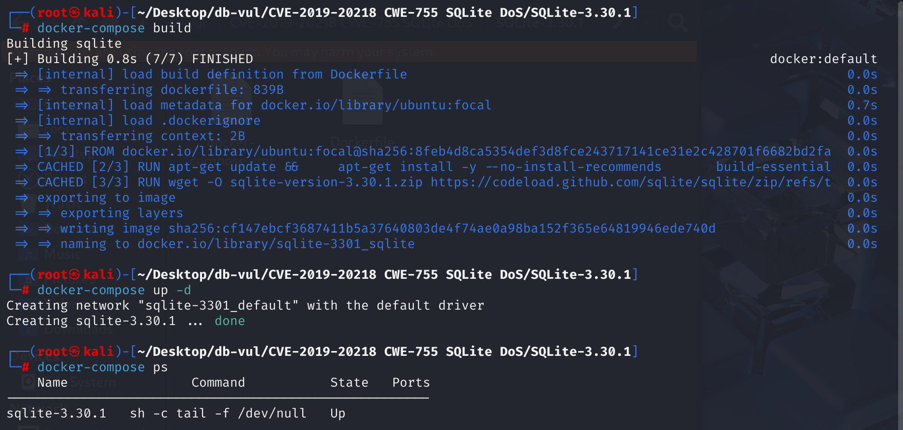
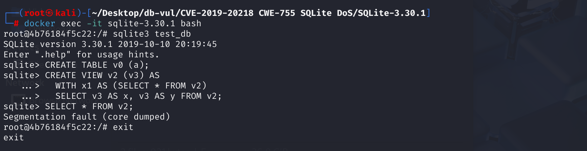

# CVE-2019-20218 CWE-755 SQLite DoS

## 漏洞背景

- **SQLite：** 一个轻量级的、嵌入式的关系型数据库管理系统，它不需要单独的服务器进程，也不需要复杂的配置。SQLite 直接在文件系统上存储数据，具有零配置、易于使用和适合小型应用的特点。它支持标准的 SQL 语句，提供良好的数据安全性，并且因其轻量级特性被广泛应用于桌面和移动应用开发中。
- **公共表表达式（CTE）：**SQL 中用于创建临时结果集的语法结构，它像一个临时表，仅在查询期间存在，但不存储数据。它通过 `WITH` 关键字定义，允许将复杂查询分解为更易管理的部分，提高了复杂查询的可读性和可维护性，特别适用于涉及递归查询或多次引用同一子查询的情况。
- **CWE-755：** “异常情况处理不当”描述的是软件在运行时未能正确捕获、传播或响应错误和异常情形的缺陷——例如没有检查函数调用的返回值、错误时继续执行后续操作、跳过必要的清理等。这样的疏忽可能导致程序进入未定义状态、数据损坏、拒绝服务，甚至被攻击者利用触发更严重的安全漏洞；因此，在每个可能失败的操作后都应及时检测并妥善处理异常，以保证系统稳定和安全。

## 漏洞原理

SQLite 在 3.30.1 版本中，`selectExpander()` 在解析出错后仍继续展开 `WITH` 堆栈，导致空指针解引用并引发崩溃。

**CWE-755：异常情况处理不当 --> DoS**

## 漏洞定位

1. 在 src\select.c 文件，第 4851 行，`selectExpander`函数用于在 SQLite 中处理和扩展 SQL 的 `SELECT` 语句，并处理 CTE 和视图。其中第 4893 行调用`withExpand`函数展开 WITH 子句中的子查询，跟踪该函数。

   ```c
   // select.c 4851行
   static int selectExpander(Walker *pWalker, Select *p){
       // ...
       // 4862行
       // 检查是否发生内存分配失败
       p->selFlags |= SF_Expanded;
     if( db->mallocFailed  ){
       return WRC_Abort;
     }
       // 检查 select 语句是否已经展开
     assert( p->pSrc!=0 );
     if( (selFlags & SF_Expanded)!=0 ){
       return WRC_Prune;
     }
       // 对 SELECT 语句进行编号调整，以区分不同的查询
     if( pWalker->eCode ){
       /* Renumber selId because it has been copied from a view */
       p->selId = ++pParse->nSelect;
     }
     pTabList = p->pSrc;
     pEList = p->pEList;
       // 处理 WITH 子句
     sqlite3WithPush(pParse, p->pWith, 0);
       
     /* Make sure cursor numbers have been assigned to all entries in
     ** the FROM clause of the SELECT statement.
     */
       // 确保 FROM 子句中的所有表项都有游标编号
     sqlite3SrcListAssignCursors(pParse, pTabList);
        /* Look up every table named in the FROM clause of the select.  If
     ** an entry of the FROM clause is a subquery instead of a table or view,
     ** then create a transient table structure to describe the subquery.
     */
       //  遍历 FROM 子句中的每个表项（SrcList_item）
     for(i=0, pFrom=pTabList->a; i<pTabList->nSrc; i++, pFrom++){
       Table *pTab;
         // 处理递归子查询
       assert( pFrom->fg.isRecursive==0 || pFrom->pTab!=0 );
       if( pFrom->fg.isRecursive ) continue;
       assert( pFrom->pTab==0 );
         // 展开 WITH 子句中的子查询（如果有的话） 4893 行
   #ifndef SQLITE_OMIT_CTE
       if( withExpand(pWalker, pFrom) ) return WRC_Abort;
       if( pFrom->pTab ) {} else
   #endif
         // 逐个处理 FROM 子句中的表项，处理普通表、视图、子查询
       if( pFrom->zName==0 ){
   #ifndef SQLITE_OMIT_SUBQUERY
         Select *pSel = pFrom->pSelect;
         /* A sub-query in the FROM clause of a SELECT */
         assert( pSel!=0 );
         assert( pFrom->pTab==0 );
         if( sqlite3WalkSelect(pWalker, pSel) ) return WRC_Abort;
         if( sqlite3ExpandSubquery(pParse, pFrom) ) return WRC_Abort;
   #endif
       }else{
         /* An ordinary table or view name in the FROM clause */
         assert( pFrom->pTab==0 );
         pFrom->pTab = pTab = sqlite3LocateTableItem(pParse, 0, pFrom);
         if( pTab==0 ) return WRC_Abort;
         if( pTab->nTabRef>=0xffff ){
           sqlite3ErrorMsg(pParse, "too many references to \"%s\": max 65535",
              pTab->zName);
           pFrom->pTab = 0;
           return WRC_Abort;
         }
         pTab->nTabRef++;
         if( !IsVirtual(pTab) && cannotBeFunction(pParse, pFrom) ){
           return WRC_Abort;
         }
   #if !defined(SQLITE_OMIT_VIEW) || !defined (SQLITE_OMIT_VIRTUALTABLE)
         if( IsVirtual(pTab) || pTab->pSelect ){
           i16 nCol;
           u8 eCodeOrig = pWalker->eCode;
           if( sqlite3ViewGetColumnNames(pParse, pTab) ) return WRC_Abort;
           assert( pFrom->pSelect==0 );
           if( pTab->pSelect && (db->flags & SQLITE_EnableView)==0 ){
             sqlite3ErrorMsg(pParse, "access to view \"%s\" prohibited",
                 pTab->zName);
           }
           pFrom->pSelect = sqlite3SelectDup(db, pTab->pSelect, 0);
           nCol = pTab->nCol;
           pTab->nCol = -1;
           pWalker->eCode = 1;  /* Turn on Select.selId renumbering */
           sqlite3WalkSelect(pWalker, pFrom->pSelect);
           pWalker->eCode = eCodeOrig;
           pTab->nCol = nCol;
         }
   #endif
       }
   
       /* Locate the index named by the INDEXED BY clause, if any. */
         // 处理 INDEXED BY 子句的部分
       if( sqlite3IndexedByLookup(pParse, pFrom) ){
         return WRC_Abort;
       }
     }
   
     /* Process NATURAL keywords, and ON and USING clauses of joins.
     */
       // 处理 JOIN 子句 4862 行
     if( db->mallocFailed || sqliteProcessJoin(pParse, p) ){
       return WRC_Abort;
     }
       // ...
   }
   ```

2. 在 src\select.c 文件，第 4659 行`withExpand`函数用于处理公共表表达式（Common Table Expressions，CTE）的部分，其中第 4670 行查找当前解析栈中是否有对于名字的CTE，第 4683 行**检查 CTE 是否有非法的递归引用**，如果存在则通过`sqlite3ErrorMsg`函数报告错误，继续跟踪该函数。

   ```c
   // select.c 4659 行
   static int withExpand(
     Walker *pWalker, 
     struct SrcList_item *pFrom
   ){
       Parse *pParse = pWalker->pParse;
     sqlite3 *db = pParse->db;
     struct Cte *pCte;               /* Matched CTE (or NULL if no match) */
     With *pWith;                    /* WITH clause that pCte belongs to */
   
     assert( pFrom->pTab==0 );
   	// 4670 行
     pCte = searchWith(pParse->pWith, pFrom, &pWith);
     if( pCte ){
       Table *pTab;
       ExprList *pEList;
       Select *pSel;
       Select *pLeft;                /* Left-most SELECT statement */
       int bMayRecursive;            /* True if compound joined by UNION [ALL] */
       With *pSavedWith;             /* Initial value of pParse->pWith */
   
       // 4683 行
           /* If pCte->zCteErr is non-NULL at this point, then this is an illegal
       ** recursive reference to CTE pCte. Leave an error in pParse and return
       ** early. If pCte->zCteErr is NULL, then this is not a recursive reference.
       ** In this case, proceed.  */
       if( pCte->zCteErr ){
         sqlite3ErrorMsg(pParse, pCte->zCteErr, pCte->zName);
         return SQLITE_ERROR;
       }
       // ...
   }
   ```

3. 在 src\util.c 文件第 181 行`sqlite3ErrorMsg`函数将解析器的错误状态标记并记录错误信息的入口，其中第 191 行会递增解析错误计数，将 `pParse->nErr` 加 1。

   ```c
   // util.c 181行
   void sqlite3ErrorMsg(Parse *pParse, const char *zFormat, ...){
     char *zMsg;
     va_list ap;
     sqlite3 *db = pParse->db;
     va_start(ap, zFormat);
     zMsg = sqlite3VMPrintf(db, zFormat, ap);
     va_end(ap);
     if( db->suppressErr ){
       sqlite3DbFree(db, zMsg);
     }else{
         // 191行
       pParse->nErr++;
       sqlite3DbFree(db, pParse->zErrMsg);
       pParse->zErrMsg = zMsg;
       pParse->rc = SQLITE_ERROR;
     }
   }
   ```

4. 回到第一步其中第 4862 行，这里只对 `db->mallocFailed`（内存分配失败）做了检查，却没有检查 `pParse->nErr`（解析阶段是否已出错）。随后又直接调用了 `sqlite3WithPush(pParse, p->pWith, 0)`，将 CTE 堆栈入栈，却不管之前是不是有错误。

   之后使用`sqlite3SrcListAssignCursors`函数分配游标，并使用一系列分支和循环对`select`语句进行进一步处理。一旦遇到循环定义的 CTE或者语义错误（表不存在、列不存在等），`pParse->nErr` 会被置为非 0，用于记录在解析和处理 SQL 语句过程中遇到的错误数量，但 `selectExpander()` 并不会因为 `nErr>0` 而立即返回，仍旧执行下去。

   如果在 `selectExpander()` 一开始不检查 `pParse->nErr` 而继续执行，那么在后续的分支和循环里就会对已经“出错”的、未正确初始化或根本不存在的结构体进行操作，最终导致一系列的错误，如空指针解引用、段错误、内存访问越界等。

   ```c
   /* Process NATURAL keywords, and ON and USING clauses of joins.*/
   // 处理 JOIN 子句 4862 行
   if( db->mallocFailed || sqliteProcessJoin(pParse, p) ){
   	return WRC_Abort;
   }
   ```

## 漏洞修复

在 select.c 文件的 4981 行的`if`语句中增加了对 `pParse->nErr`（解析阶段错误计数）的判断：

```c
/* Process NATURAL keywords, and ON and USING clauses of joins.
*/
if( pParse->nErr || db->mallocFailed || sqliteProcessJoin(pParse, p) ){
return WRC_Abort;
}
```

将解析错误和内存分配失败一并视为“必须立即中止”的前置条件，从根本上杜绝了在错误状态下继续展开 CTE 的危险操作。

## 影响版本

SQLite 3.30.1

## 环境搭建

启动 Docker，SQLite版本为 3.30.1



## 漏洞复现

1、进入容器，创建数据库 test_db。

```bash
sqlite3 test_db
```

2、创建一个包含一个名为 `a` 的列的表格`v0`。

```sql
CREATE TABLE v0 (a);
```

3、创建一个含有一个名为 `v3` 的列的视图`v2` ，`AS` 引入视图的定义：

- `WITH x1 AS (SELECT * FROM v2) `：创建一个名为 `x1` 的临时结果集，试图从视图 `v2` 中选择所有列和行。
- `SELECT v3 AS x, v3 AS y FROM v2`：主体查询从视图 `v2` 中读取列 `v3`，并分别将其临时重命名为 `x` 和 `y` ，然后返回这两列。

```sql
CREATE VIEW v2 (v3) AS 
  WITH x1 AS (SELECT * FROM v2) 
  SELECT v3 AS x, v3 AS y FROM v2; 
```

4、对视图`v2`执行查询，返回视图定义中的所有列，可以看到 SQLite 退出。

```sql
SELECT * FROM v2;
```



## PoC分析

```sql
CREATE VIEW v2 (v3) AS 
  WITH x1 AS (SELECT * FROM v2) 
  SELECT v3 AS x, v3 AS y FROM v2; 
  
SELECT * FROM v2;
```

这个 SQL 语句的作用：创建视图 → 定义 CTE → 执行主体查询，并借助列别名进行输出映射。但是再查询中存在自引用的 CTE。即：`WITH x1 AS (SELECT * FROM v2)`，而查询本身又试图从 `v2` 中进行数据选取。此种**自引用关系**导致了在第二次调用 `withExpand()` 时，无法正确处理这一递归引用。

第一次调用`withExpand()`处理`WITH x1 AS (SELECT * FROM v2) `，`searchWith()` 查找当前解析栈中是否有名为 `x1` 的 CTE，找到后，`pCte` 就指向了这个 CTE 定义。初次处理 `x1` 时，`pCte->zCteErr` 是 `NULL`，表示这是一个合法的 CTE 定义，没有循环引用。

在第二次调用`withExpand()`处理`SELECT v3 AS x, v3 AS y FROM v2`，当 `selectExpander()` 再次处理 `FROM v2` 时，会再次进入 `withExpand()`，并试图查找 `v2` 是否是当前栈中的 CTE。在这个过程中，SQLite 再次查找 `x1`，因为 `v2` 是通过 CTE `x1` 定义的。`searchWith()` 会再次查找当前栈中的 CTE，发现 `x1` 已经在栈中，并且此时发生了自引用。

**由于 `x1` 的定义依赖于视图 `v2`，同时视图 `v2` 在查询体中引用了 `x1`，这就形成了一个循环引用：`x1` -> `v2` -> `x1`。**在这里造成了非法的递归调用后会将`pParse->nErr` 置为非 0，表示在解析和处理 SQL 语句过程中遇到的错误，但是 SQLite 并没有处理而继续运行，没有避免继续在错误的上下文中处理查询，而会在查询展开或执行过程中访问无效的内存或数据结构。在执行后续`SELECT * FROM v2;`操作时，SQLite 在错误状态下 **继续展开查询**，导致后续操作中访问无效内存或空指针，最终引发崩溃。

## 参考链接

[selectExpander in select.c in SQLite 3.30.1 proceeds with... · CVE-2019-20218 · GitHub Advisory Database](https://github.com/advisories/GHSA-vrgp-3vgj-937c)

[SQLite: Check-in [315d1f1a50\]](https://sqlite.org/src/info/315d1f1a503e8c18)

[Do not attempt to unwind the WITH stack in the Parse object following… · sqlite/sqlite@a6c1a71](https://github.com/sqlite/sqlite/commit/a6c1a71cde082e09750465d5675699062922e387)
