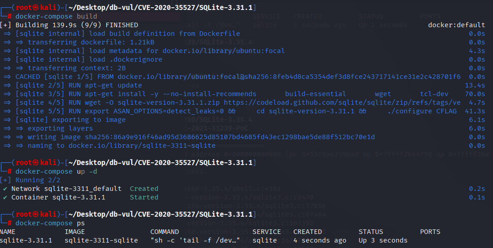
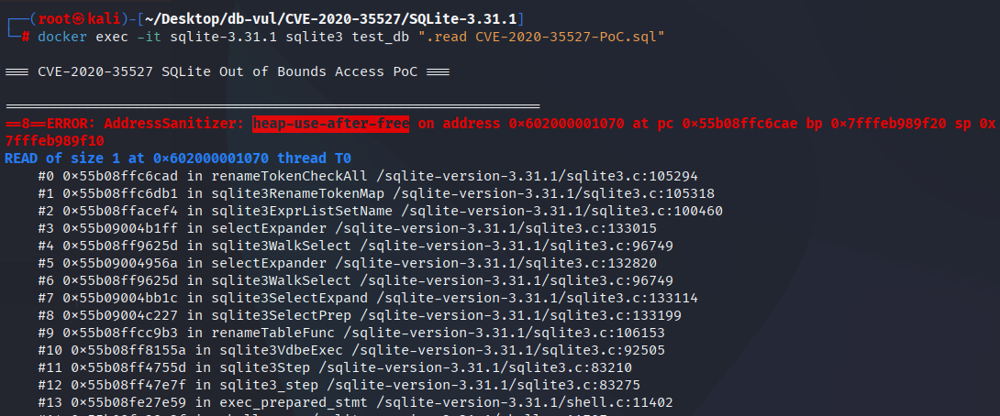

# CVE-2020-35527 CWE-119 SQLite 越界访问

## 漏洞背景

- **SQLite：** 一个轻量级的、嵌入式的关系型数据库管理系统，它不需要单独的服务器进程，也不需要复杂的配置。SQLite 直接在文件系统上存储数据，具有零配置、易于使用和适合小型应用的特点。它支持标准的 SQL 语句，提供良好的数据安全性，并且因其轻量级特性被广泛应用于桌面和移动应用开发中。
- **CWE-119（Improper Restriction of Operations within the Bounds of a Memory Buffer 对内存缓冲区范围内的作的不当限制）**

## 漏洞原理

在对含嵌套 FROM 的视图执行 `ALTER TABLE ... RENAME` 时的改写流程存在生命周期错配。在这个改写过程中，系统一边给“哪里要替换表名”做记录，一边又在展开嵌套 FROM 时重新整理（并释放、改写）那部分解析结果；结果就是前面做的“替换记录”还握着已经被丢弃的内存，后面再回头检查或应用这些记录时就去读了无效内存，触发释放后再使用的内存错误。

## 漏洞定位

在 src/select.c 文件，第 5151 行，当当前 `SELECT` 带有嵌套 FROM（`SF_NestedFrom`）时，对刚刚追加到 `pNew` 的最后一个输出列表元素做**强制改名**：先释放其原有列名 `zEName`，再依据来源重新赋名——若该列来自子查询 `pSub`，直接拷贝 `pSub->pEList->a[j].zEName`；否则把三段式标识 `zSchemaName.zTabName.zColname` 拼成新的 `zEName`；最后把 `eEName` 置为 `ENAME_TAB`，表示该名字与“表/列来源”绑定。

在 `ALTER TABLE ... RENAME` 的重命名路径下，SQLite 会先调用 `sqlite3ExprListSetName()` 把“输出列名 ↔ 语法树节点”的**rename-token 映射**登记起来（供稍后回写原始 SQL 用）。而这里又在**展开阶段**对同一个 `ExprList_item` 的 `zEName` 进行“释放并重建”，导致**生命周期错配**：映射表里仍握着旧节点/旧名字的指针，这里却把它先 `sqlite3DbFree()` 再换成新内存；稍后 `renameTokenCheckAll()` 回扫映射时就会**解引用已释放的指针**，触发 **heap-use-after-free**。

```c
 if( pNew && (p->selFlags & SF_NestedFrom)!=0 ){
      struct ExprList_item *pX = &pNew->a[pNew->nExpr-1];
      sqlite3DbFree(db, pX->zEName);
      if( pSub ){
        pX->zEName = sqlite3DbStrDup(db, pSub->pEList->a[j].zEName);
        testcase( pX->zEName==0 );
      }else{
        pX->zEName = sqlite3MPrintf(db, "%s.%s.%s",
                                   zSchemaName, zTabName, zColname);
        testcase( pX->zEName==0 );
      }
      pX->eEName = ENAME_TAB;
    }
```


## 漏洞修复

解决原本存在的悬空指针问题，尤其是处理嵌套 `FROM` 子句时，防止在 `ALTER TABLE` 等操作时出现使用已经释放内存的漏洞（`heap-use-after-free`）。修复的核心是通过对 `SF_NestedFrom` 标记（标志位，表示当前 SELECT 有嵌套的 `FROM` 子句）的检测，加入了对`IN_RENAME_OBJECT`的检查。如果存在，它会对表达式列表中的元素进行处理，包括释放旧的列名 `zEName`，然后复制新的列名，避免在重命名对象期间处理已经释放的内存。

```diff
Index: src/select.c
==================================================================
--- src/select.c
+++ src/select.c
@@ -5143,11 +5143,11 @@
               pExpr = pRight;
             }
             pNew = sqlite3ExprListAppend(pParse, pNew, pExpr);
             sqlite3TokenInit(&sColname, zColname);
             sqlite3ExprListSetName(pParse, pNew, &sColname, 0);
-            if( pNew && (p->selFlags & SF_NestedFrom)!=0 ){
+            if( pNew && (p->selFlags & SF_NestedFrom)!=0 && !IN_RENAME_OBJECT ){
               struct ExprList_item *pX = &pNew->a[pNew->nExpr-1];
               sqlite3DbFree(db, pX->zEName);
               if( pSub ){
                 pX->zEName = sqlite3DbStrDup(db, pSub->pEList->a[j].zEName);
                 testcase( pX->zEName==0 );
```

## 影响版本

SQLite :

- 3.31.1

## 环境搭建

启动 Docker 环境，SQLite 版本为 3.31.1，其中在编译时开启了 ASAN 内存检测

```txt
NIST:NVD   Base Score:9.8 CRITICAL   Vector:CVSS:3.1/AV:N/AC:L/PR:N/UI:N/S:U/C:H/I:H/A:H
```

```txt
cpe:2.3:a:sqlite:sqlite:3.31.1:*:*:*:*:*:*:*
```



## 漏洞复现

进入容器命令行，执行 PoC 文件，可以看到 SQLite 退出，且 ASan 检测到了一个 UAF（heap-use-after-free）

```bash
docker exec -it sqlite-3.31.1 sqlite3 test_db ".read CVE-2020-35527-PoC.sql"
```



## PoC分析

```sql
CREATE TABLE t1(x);
CREATE VIEW t2 AS SELECT 1 FROM t1, (t1 AS a0, t1);
ALTER TABLE t1 RENAME TO t3;
SELECT sql FROM sqlite_master;
```

`CREATE VIEW t2 AS SELECT 1 FROM t1, (t1 AS a0, t1);` 建视图 `t2`，其 FROM 有一层括号包着的子列表 `(t1 AS a0, t1)`——这会让 SELECT 的语法树带上 `SF_NestedFrom` 标记，后续展开（expand）时需要两层遍历与节点改写。

`ALTER TABLE t1 RENAME TO t3;` 触发 SQLite 的“重命名改写器”：为保持对象一致性，SQLite会重新解析并展开视图 `t2`，同时构建“重命名 token 映射”（`sqlite3ExprListSetName → sqlite3RenameTokenMap`），以便把原始 SQL 文本中的 `t1` 精确替换为 `t3`。问题出在展开阶段的嵌套 FROM 处理：代码会对刚追加的输出项名 `zEName`做“释放并重写”（`sqlite3DbFree` 然后重新分配），而此前这些节点/名字已被登记到重命名映射表；嵌套 FROM 的进一步展开/替换又可能导致旧节点被释放，但映射仍持有旧指针——最终在检查/回写阶段（如 `renameTokenCheckAll`）解引用已释放内存，形成 heap-use-after-free。

`SELECT sql FROM sqlite_master;` 只是为了观察重写后的定义是否正常；在存在漏洞的版本上，这一步前后常直接崩溃，或得到损坏的 SQL 定义。

## 参考链接

[NVD - CVE-2020-35527](https://nvd.nist.gov/vuln/detail/CVE-2020-35527#match-15117919)

[SQLite: Check-in [c431b3fd8f\]](https://www.sqlite.org/src/vinfo/c431b3fd8fd0f6a6?diff=2&proof=523263959)
