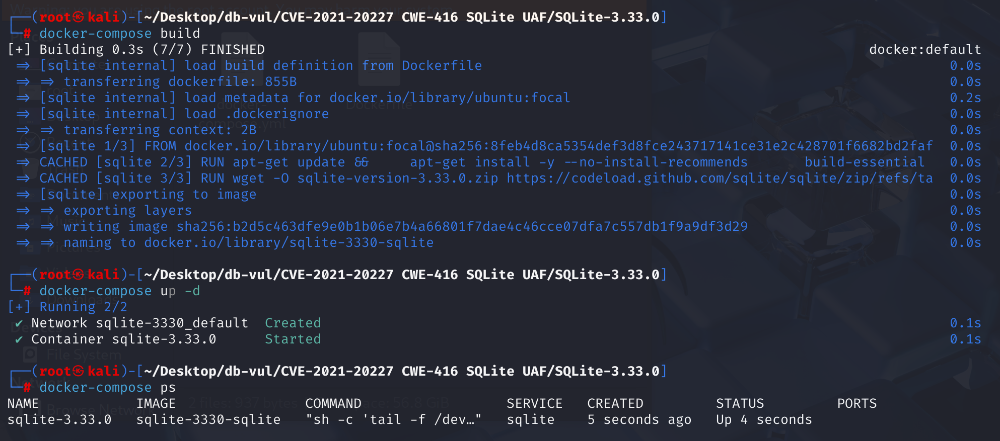
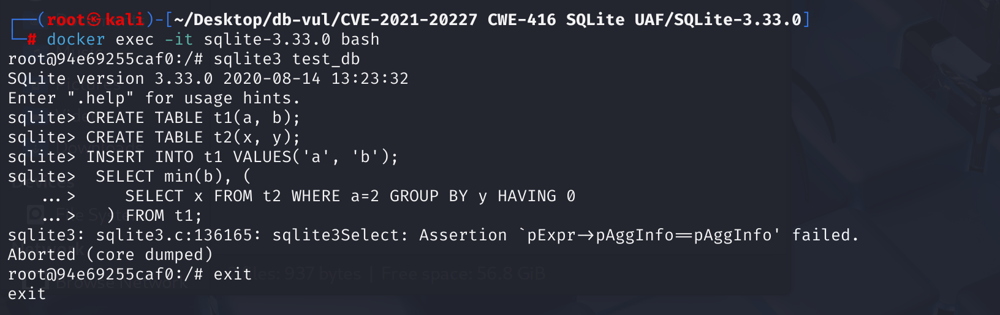

# CVE-2021-20227 CWE-416 SQLite UAF

## 漏洞背景

- **SQLite：** 一个轻量级的、嵌入式的关系型数据库管理系统，它不需要单独的服务器进程，也不需要复杂的配置。SQLite 直接在文件系统上存储数据，具有零配置、易于使用和适合小型应用的特点。它支持标准的 SQL 语句，提供良好的数据安全性，并且因其轻量级特性被广泛应用于桌面和移动应用开发中。
- **CWE-416（Use After Free）：**指在软件中使用已经释放的内存区域的漏洞。当程序动态分配的内存被释放后，若未将指向该内存的指针设置为无效状态（如置为 NULL），后续代码仍可能错误地访问该指针，此时该内存可能已被重新分配给其他用途，导致不可预测的行为，如数据损坏、程序崩溃或代码执行等。这种漏洞通常源于内存管理不当，是严重的安全问题，易被攻击者利用来破坏程序的稳定性和安全性。

## 漏洞原理

在 SQLite 的 SELECT 查询功能 （src/select.c） 中发现一个缺陷。SQLite 在处理一个“注定为空的子查询”（因为它有 `HAVING 0`）时，为了效率，会提前做一些清理或优化。但如果这个子查询还跟外部的主查询（特别是聚合计算）有瓜葛（通过相关 `WHERE` 子句），并且 SQLite 内部的一个特定处理环节（`havingToWhereExprCb` 函数在某些情况下没有正确地“刹车”）也掺和了一下，就可能导致“沟通失误”

核心原因：外部聚合查询与特定优化子查询之间的状态管理缺陷，导致内存释放后使用 (Use-After-Free)。

**having语句恒为0 --> 代表过滤掉所有分组，查询的结果为空 --> 未进行判断，仍执行操作 --> 导致存在悬空指针 --> 后续引用导致CWE-416（Use After Free）**

## 漏洞定位

分析 SQLite 3.33.0 的源码

在 src\select.c 文件的第 5585 行`havingToWhereExprCb`函数用于将 `HAVING` 子句中的某些表达式移动到 `WHERE` 子句中。这种优化可以提高查询性能，因为 `WHERE` 子句在聚合之前过滤数据，而 `HAVING` 子句在聚合之后过滤数据。

在`havingToWhereExprCb`函数中，当处理子查询的 `HAVING` 子句时，**如果该 `HAVING` 子句包含恒假条件（如 `HAVING 0` 或 `... AND 0`）会导致子查询结果为空，但`havingToWhereExprCb` 仍然会对其（或其内部的聚合表达式）执行某些转换操作，因为它缺少对这种“恒假”上下文的有效提前判断和剪枝。**

这种不必要的或不合时宜的转换，结合子查询因“恒假 `HAVING`”而被优化并清理其内部资源的流程，可能导致外部聚合查询持有了指向子查询内部表达式的悬空指针。当外部聚合查询在后续阶段尝试使用这些悬空指针时，便发生了“释放后使用”错误。

这使得攻击者可以构造特殊的`HAVING`子句表达式，导致优化逻辑错误地处理这些表达式。当攻击者构造的查询包含某些特定的`HAVING`子句时，由于子查询因“恒假 `HAVING`”而被优化并清理其内部资源，外部聚合查询会持有没有指向这些已被清理或状态不一致的子查询内部表达式的悬空指针。在后续的查询执行阶段，当外部查询的聚合函数（如 `MIN`, `COUNT`）实际进行计算或结果收集时，它可能会尝试通过这些悬空指针访问已经被释放的内存，从而导致“释放后使用”(Use-After-Free) 错误，典型表现为程序崩溃（如段错误或断言失败，如测试用例中 `pExpr->pAggInfo==pAggInfo` 断言失败）。

```c
static int havingToWhereExprCb(Walker *pWalker, Expr *pExpr){
  Parse *pParse = pWalker->pParse;
  UNUSED_PARAMETER(pParse); // 在这个版本的函数体中，pParse 未被使用
  assert( pWalker->xSelectCallback==0 ); /* Not used with Select callbacks */

  /*
    这里缺少一个初始检查，该检查用于判断 pExpr 是否为常量
  （例如 'HAVING 0' 中的 '0'）或总是为假，并在这种情况下剪枝遍历。
  */
  // 将HAVING子句中的聚合函数转换为对结果集中相应列的引用的核心逻辑
  if( pExpr->op==TK_AGG_COLUMN || pExpr->op==TK_AGG_FUNCTION ){ // 如果表达式是聚合列或聚合函数
    assert( !ExprHasProperty(pExpr, EP_TokenOnly|EP_Reduced) );
    pExpr->op = TK_COLUMN;         // 转换操作码：聚合 -> 列
    pExpr->pAggInfo = 0;           // 清除 AggInfo 指针
    pExpr->iTable = pWalker->u.iCur; // 设置为某个游标号 (具体含义依赖上下文)
    /* pExpr->iColumn 由调用者设置 */
    pExpr->op2 = 0;
    ExprSetProperty(pExpr, EP_Resolved); // 标记表达式为已解析
  }
  return WRC_Continue; // 继续遍历表达式树的其他部分
}
```

## 漏洞修复

在`havingToWhereExprCb`函数中的`if`语句中添加`ExprAlwaysFalse(pExpr)==0`的判断。当 `havingToWhereExprCb` 被调用来处理 `HAVING` 子句中的某个表达式 `pExpr` 时，如果这个 `pExpr` 本身就是一个（非NULL的）常量（例如 `HAVING 0` 中的 `0`），或者通过 `ExprAlwaysFalse` 判断出它（或它所处的逻辑分支）将导致整个条件为假。那么 `havingToWhereExprCb` 内部的核心转换逻辑（将 `TK_AGG_FUNCTION` 修改为 `TK_COLUMN`）就不会被执行。

```c
if( sqlite3ExprIsConstantOrGroupBy(pWalker->pParse, pExpr, pS->pGroupBy) 
 && ExprAlwaysFalse(pExpr)==0
)
```

## 影响版本

3.33.0 <= SQLite < 3.34.1

## 环境搭建

启动 Docker 环境，SQLite 版本为 3.33.0



## 漏洞复现

1、进入容器命令行，新建数据库`test_db`。

```bash
docker exec -it sqlite-3.33.0 bash
sqlite3 test_db
```

2、新建表格`t1`、`t2`，并在`t1`表中插入一些初始值。

```sql
CREATE TABLE t1(a, b);
CREATE TABLE t2(x, y);
INSERT INTO t1 VALUES('a', 'b');
```

4、一个复杂的查询，包含一个主查询和一个子查询：

- 主查询`SELECT min(b), (...) FROM t1;`：从表 `t1` 中选择两列，`min(b)`：计算列 `b` 的最小值，子查询的结果：子查询返回的值作为第二列。
- 子查询`SELECT x FROM t2 WHERE a=2 GROUP BY y HAVING 0`：从表 `t2` 中选择列 `x`，要求列 `a` 的值为 `2`并且按列 `y` 进行分组。`HAVING 0` 表示过滤掉所有分组，因为 `0` 是一个恒假条件。

从表 `t1` 中选择 `min(b)`，因为表 `t1` 中只有一行数据，`b` 的值为 `'b'`，所以 `min(b)` 的结果是 `'b'`。子查询试图从表 `t2` 中选择列 `x`，但条件 `WHERE a=2` 无法匹配任何行（因为表 `t2` 中没有列 `a`）。即使有匹配的行，`HAVING 0` 也会过滤掉所有分组，因此子查询的结果为空。期望的结果应该是`{b {}}`，但是执行后 SQLite 崩溃。

```sql
  SELECT min(b), (
    SELECT x FROM t2 WHERE a=2 GROUP BY y HAVING 0
  ) FROM t1;
```



## PoC分析

在子查询`SELECT x FROM t2 WHERE a=2 GROUP BY y HAVING 0`：从表 `t2` 中选择列 `x`，要求列 `a` 的值为 `2`并且按列 `y` 进行分组。`HAVING 0` 表示过滤掉所有分组，因为 `0` 是一个恒假条件，因此子查询的结果为空。

但是`havingToWhereExprCb` 仍然会对其（或其内部的聚合表达式）执行某些转换操作，外部聚合查询会持有没有指向这些已被清理或状态不一致的子查询内部表达式的悬空指针。在后续的查询执行阶段，当外部查询的聚合函数 `MIN(b)`在实际进行计算或结果收集时，它可能会尝试通过这些悬空指针访问已经被释放的内存，从而导致“释放后使用”(Use-After-Free) 错误，最终导致程序崩溃。

## 参考链接

[NVD - CVE-2021-20227](https://nvd.nist.gov/vuln/detail/CVE-2021-20227#range-15274792)

[SQLite: Check-in [30a4c32365\]](https://sqlite.org/src/info/30a4c323650cc949)
