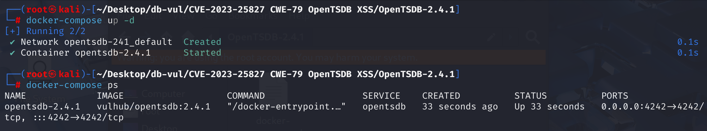
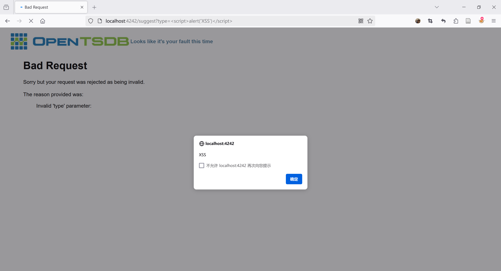

# CVE-2023-25827 CWE-79 OpenTSDB XSS

## 漏洞背景

- 在 OpenTSDB 的日志配置中，`/logs` 接口的 `level` 参数用于指定日志消息的严重性级别


## 漏洞原理

当OpenTSDB的`/logs`接口接收到请求，并处理`level`参数时，如果`level`参数的值非法或导致错误，服务器会生成一个错误消息。但是，在生成错误消息时，服务器没有对`level`参数的值进行充分的转义，恶意的JavaScript代码被直接包含在错误消息中，从而在用户的浏览器中执行任意脚本。此问题的根本原因与[CVE-2018-13003](https://github.com/advisories/GHSA-86vm-8m4p-6263)相同，即建议端点的反映性XSS漏洞。

1. **参数反射**：OpenTSDB的HTTP查询API和日志记录端点会将用户输入的参数值反射回错误消息中。例如，当用户请求中包含非法参数时，服务器会生成一个错误消息，其中包含用户输入的参数值。
2. **参数验证不足**：在将用户输入的参数值包含在错误消息中时，没有对参数值进行充分的验证和转义。这意味着攻击者可以构造特殊的参数值，其中包含恶意JavaScript代码。

## 漏洞定位

1、在 **src/tsd/HttpQuery.java** 文件，第 **349** 行，`internalError`函数用于处理服务器内部错误，生成并发送 500 错误响应。其中的第 **383** 行，`pretty_exc`变量直接被插入到HTML页面中，没有进行任何转义。如果`pretty_exc`中包含用户输入的内容（例如通过某些反射机制或错误信息暴露），攻击者可以构造恶意输入，使`pretty_exc`包含JavaScript代码，从而在用户的浏览器中执行任意脚本

```java
  /**
   * Sends a 500 error page to the client.
   * Handles responses from deprecated API calls as well as newer, versioned
   * API calls
   * @param cause The unexpected exception that caused this error.
   */
public void internalError(final Exception cause) {
    logError("Internal Server Error on " + request().getUri(), cause);

    if (this.api_version > 0) {
      // always default to the latest version of the error formatter since we
      // need to return something
      switch (this.api_version) {
        case 1:
        default:
          sendReply(HttpResponseStatus.INTERNAL_SERVER_ERROR,
              serializer.formatErrorV1(cause));
      }
      return;
    }

    ThrowableProxy tp = new ThrowableProxy(cause);
    tp.calculatePackagingData();
    final String pretty_exc = ThrowableProxyUtil.asString(tp);
    tp = null;
    if (hasQueryStringParam("json")) {
      // 32 = 10 + some extra space as exceptions always have \t's to escape.
      final StringBuilder buf = new StringBuilder(32 + pretty_exc.length());
      buf.append("{\"err\":\"");
      HttpQuery.escapeJson(pretty_exc, buf);
      buf.append("\"}");
      sendReply(HttpResponseStatus.INTERNAL_SERVER_ERROR, buf);
    } else {
      sendReply(HttpResponseStatus.INTERNAL_SERVER_ERROR,
                makePage("Internal Server Error", "Houston, we have a problem",
                         "<blockquote>"
                         + "<h1>Internal Server Error</h1>"
                         + "Oops, sorry but your request failed due to a"
                         + " server error.<br/><br/>"
                         + "Please try again in 30 seconds.<pre>"
                         + pretty_exc
                         + "</pre></blockquote>"));
    }
  }
```

2、在 **src/tsd/HttpQuery.java** 文件，第 **393** 行，`badRequest`函数用于处理客户端发送的无效请求，生成并发送 400 错误响应。其中的第 **430** 行，`exception.getMessage()`直接被插入到HTML页面中，没有进行任何转义。如果`exception.getMessage()`中包含用户输入的内容，攻击者可以构造恶意输入，使其中包含JavaScript代码，从而在用户的浏览器中执行任意脚本。

```java
  /**
   * Sends a 400 error page to the client.
   * Handles responses from deprecated API calls
   * @param explain The string describing why the request is bad.
   */
public void badRequest(final String explain) {
    badRequest(new BadRequestException(explain));
  }

  /**
   * Sends an error message to the client. Handles responses from 
   * deprecated API calls.
   * @param exception The exception that was thrown
   */
  @Override
  public void badRequest(final BadRequestException exception) {
    logWarn("Bad Request on " + request().getUri() + ": " + exception.getMessage());
    if (this.api_version > 0) {
      // always default to the latest version of the error formatter since we
      // need to return something
      switch (this.api_version) {
        case 1:
        default:
          sendReply(exception.getStatus(), serializer.formatErrorV1(exception));
      }
      return;
    }
    if (hasQueryStringParam("json")) {
      final StringBuilder buf = new StringBuilder(10 +
          exception.getDetails().length());
      buf.append("{\"err\":\"");
      HttpQuery.escapeJson(exception.getMessage(), buf);
      buf.append("\"}");
      sendReply(HttpResponseStatus.BAD_REQUEST, buf);
    } else {
      sendReply(HttpResponseStatus.BAD_REQUEST,
                makePage("Bad Request", "Looks like it's your fault this time",
                         "<blockquote>"
                         + "<h1>Bad Request</h1>"
                         + "Sorry but your request was rejected as being"
                         + " invalid.<br/><br/>"
                         + "The reason provided was:<blockquote>"
                         + exception.getMessage()
                         + "</blockquote></blockquote>"));
    }
  }
```

3、在 **src/tsd/LogsRpc.java** 文件的第 **37** 行`execute`方法是处理 `/logs` 请求的主要方法，其中使用了 `Level.toLevel` 方法将 `level` 参数的值转换为 `Level` 对象。其中第 **50** 行，如果转换失败（即 `level` 参数的值不是有效的日志级别），抛出 `BadRequestException`，抛出的 `BadRequestException` 会触发 `badRequest` 方法，并将`level`中的值，即包含的恶意的 JavaScript 代码直接加入到错误信息中。而错误信息`exception.getMessage()` 直接被插入到 HTML 页面中，没有进行 HTML 转义。

```java
public void execute(final TSDB tsdb, final HttpQuery query) 
    throws JsonGenerationException, IOException {
    LogIterator logmsgs = new LogIterator();
    if (query.hasQueryStringParam("json")) {
      ArrayList<String> logs = new ArrayList<String>();
      for (String log : logmsgs) {
        logs.add(log);
      }
      query.sendReply(JSON.serializeToBytes(logs));
    } else if (query.hasQueryStringParam("level")) {
      final Level level = Level.toLevel(query.getQueryStringParam("level"),
                                        null);
      if (level == null) {
        throw new BadRequestException("Invalid level: "
                                      + query.getQueryStringParam("level"));
      }
      final Logger root =
        (Logger) LoggerFactory.getLogger(Logger.ROOT_LOGGER_NAME);
      String logger_name = query.getQueryStringParam("logger");
      if (logger_name == null) {
        logger_name = Logger.ROOT_LOGGER_NAME;
      } else if (root.getLoggerContext().exists(logger_name) == null) {
        throw new BadRequestException("Invalid logger: " + logger_name);
      }
      final Logger logger = (Logger) LoggerFactory.getLogger(logger_name);
      int nloggers = 0;
      if (logger == root) {  // Update all the loggers.
        for (final Logger l : logger.getLoggerContext().getLoggerList()) {
          l.setLevel(level);
          nloggers++;
        }
      } else {
        logger.setLevel(level);
        nloggers++;
      }
      query.sendReply("Set the log level to " + level + " on " + nloggers
                      + " logger" + (nloggers > 1 ? "s" : "") + ".\n");
    } else {
      final StringBuilder buf = new StringBuilder(512);
      for (final String logmsg : logmsgs) {
        buf.append(logmsg).append('\n');
      }
      logmsgs = null;
      query.sendReply(buf);
    }
  }
```


**修复：**

在`internalError`函数和`badRequest`函数中分别对异常信息和错误信息进行 HTML 转义

## 影响版本

OpenTSDB <= 2.4.1

## 环境搭建

启动 docker 环境，OpenTSDB 版本为2.4.1



## 漏洞复现

利用`/logs`的`level`参数，访问如下url，出现弹窗

```http
http://localhost:4242/logs?level=%3Cscript%3Ealert(%27XSS%27)%3C/script%3E
```



## POC分析

```http
http://localhost:4242/logs?level=<script>alert('XSS')</script>
```

这个url是向 OpenTSDB 的 `/logs` 接口发送一个请求，尝试设置日志级别为 `<script>alert('XSS')</script>`，由于`level`参数的值不是有效的日志级别，服务器会返回一个错误响应，指出参数无效。而里面包含的 javascrip 代码将不会被转义，从而在用户的浏览器中执行该代码

## 参考链接

[Black Duck CyRC 发现的新 OpenTSDB 漏洞 |Black Duck 博客 --- New OpenTSDB Vulnerabilities Discovered by Black Duck CyRC | Black Duck Blog](https://www.blackduck.com/blog/opentsdb.html)

[OpenTSDB 中的跨站脚本 ·CVE-2023-25827 漏洞 ·GitHub Advisory Database --- Cross Site Scripting in OpenTSDB · CVE-2023-25827 · GitHub Advisory Database](https://github.com/advisories/GHSA-9chv-3w6c-jq9w)

[Fix for #2269 and #2267 XSS vulnerability. · OpenTSDB/opentsdb@fa88d3e](https://github.com/OpenTSDB/opentsdb/commit/fa88d3e4b5369f9fb73da384fab0b23e246309ba)
